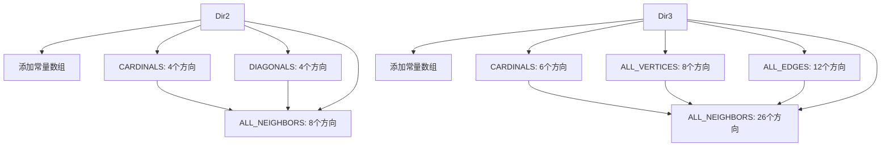

+++
title = "#21561"
date = "2026-02-07T00:00:00"
draft = false
template = "pull_request_page.html"
in_search_index = false

[extra]
current_language = "zh-cn"
available_languages = {"en" = { name = "English", url = "/pull_request/bevy/2026-02/pr-21561-en-20260207" }, "zh-cn" = { name = "中文", url = "/pull_request/bevy/2026-02/pr-21561-zh-cn-20260207" }}
+++

# Title
Feature/glam cross constants

## Basic Information
- **标题（Title）**: Feature/glam cross constants
- **PR链接（PR Link）**: https://github.com/bevyengine/bevy/pull/21561
- **作者（Author）**: pine-free
- **状态（Status）**: MERGED
- **标签（Labels）**: C-Feature, S-Ready-For-Final-Review, A-Math, X-Uncontroversial, D-Straightforward
- **创建时间（Created）**: 2025-10-16T11:53:29Z
- **合并时间（Merged）**: 2026-02-07T00:35:02Z
- **合并者（Merged By）**: alice-i-cecile

## 描述翻译（Description Translation）

**目标（Objective）**

修复 #21333

**解决方案（Solution）**

此PR为Dir2和Dir3引入了多个新常量，提供了在网格上常用方向的便捷简写，例如：
- 所有基本方向（cardinal directions）
- 所有对角线方向（diagonals）
- 所有相邻方向（cardinals + diagonals）

**测试（Testing）**

更改未通过自动化测试进行测试，但我检查了数学计算以确保没有出错。

您可以查看修改的文件，确保常量包含它们应有的方向。

**展示（Showcase）**

例如，如果您有一个网格并希望获取其上所有相邻的单元格，您无需自己定义方向，可以执行以下操作：

```rust
let valid_positions = Dir2::ALL_NEIGHBORS.iter().filter_map(|offset| {
    grid.get(current_position + offset)
}.collect();
```

## 此Pull Request的故事（The Story of This Pull Request）

### 问题与背景（The Problem and Context）

在游戏开发或网格计算中，开发者经常需要处理方向向量。当实现网格遍历、寻路算法或基于相邻关系的游戏机制时，需要访问常见的方向集合，例如四个基本方向（北、东、南、西）、对角线方向，或者所有相邻方向。在Bevy数学库中，虽然已经存在一些基本方向常量（如`Dir2::X`, `Dir2::NORTH_EAST`等），但缺少将这些方向组织成预定义数组的便利方法。

问题#21333明确提出需要为`Dir2`和`Dir3`添加这些方向的常量数组。开发者每次需要这些方向集合时，都必须手动创建数组，这不仅繁琐，而且可能导致代码重复和不一致。例如，要获取2D网格中某个单元格的所有相邻方向，开发者需要编写类似`[Dir2::X, Dir2::NEG_X, Dir2::Y, ...]`的代码，这对于8个方向来说已经相当冗长，而对于3D中的26个相邻方向，手动定义更是不可行。

### 解决方案方法（The Solution Approach）

开发者采取了一种直接且实用的方法：为`Dir2`和`Dir3`结构体添加一系列新的公共常量数组。这些常量将常用的方向组合分组，提供直观且易于访问的接口。实现的关键在于确保所有方向向量都已正确归一化（normalized），并且数组定义清晰、可读。

对于`Dir2`，解决方案包括：
- `CARDINALS`: 四个基本方向（正负X轴和Y轴）
- `DIAGONALS`: 四个对角线方向
- `ALL_NEIGHBORS`: 所有八个相邻方向（基本方向加对角线）

对于`Dir3`，解决方案扩展了这一概念：
- `CARDINALS`: 六个基本方向（正负X轴、Y轴和Z轴）
- `ALL_VERTICES`: 指向立方体八个顶点的方向（每个分量为±1/√3）
- `ALL_EDGES`: 指向立方体十二条边中点的方向（两个分量为±1/√2，第三个分量为0）
- `ALL_NEIGHBORS`: 所有二十六个相邻方向（基本方向 + 边中点 + 顶点）

这种方法的一个关键工程决策是保持了与现有API的一致性。新的常量直接构建在已有的方向常量（如`Dir2::X`）或通过向量构造（如`Vec2::new(-FRAC_1_SQRT_2, -FRAC_1_SQRT_2)`）之上，确保了归一化的正确性。

### 实现细节（The Implementation）

实现主要集中在`crates/bevy_math/src/direction.rs`文件中的一个文件。以下是关键修改的详细说明：

对于`Dir2`，在现有常量之后添加了三个新数组：

```rust
/// The cardinal directions.
pub const CARDINALS: [Self; 4] = [Self::X, Self::NEG_X, Self::Y, Self::NEG_Y];

/// The diagonals between the cardinal directions.
pub const DIAGONALS: [Self; 4] = [
    Self::NORTH_EAST,
    Self::NORTH_WEST,
    Self::SOUTH_EAST,
    Self::SOUTH_WEST,
];

/// All neighbors of a tile on a square grid in a 3x3 neighborhood. A combination of [`Self::CARDINALS`] and [`Self::DIAGONALS`]
pub const ALL_NEIGHBORS: [Self; 8] = [
    Self::X,
    Self::NEG_X,
    Self::Y,
    Self::NEG_Y,
    Self::NORTH_EAST,
    Self::NORTH_WEST,
    Self::SOUTH_EAST,
    Self::SOUTH_WEST,
];
```

这些定义利用了已经存在的方向常量，保证了代码的简洁性和可维护性。

对于`Dir3`，实现更为复杂，因为需要定义3D空间中的多个方向集合。首先，添加了一个私有常量用于归一化因子：

```rust
const FRAC_1_SQRT_3: f32 = 0.577350269189625764509148780501957456_f32;
```

这个值是1/√3的高精度近似，用于确保指向立方体顶点的方向向量具有单位长度。开发者添加了一个注释来解释其用途，并提到使用`allow`来确保精度与`FRAC_1_SQRT_2`一致。

然后定义了四个新数组：

```rust
/// The cardinal directions.
pub const CARDINALS: [Self; 6] = [
    Self::X,
    Self::NEG_X,
    Self::Y,
    Self::NEG_Y,
    Self::Z,
    Self::NEG_Z,
];

/// The directions pointing towards the vertices of a cube centered at the origin.
pub const ALL_VERTICES: [Self; 8] = [...];

/// The directions towards centers of each edge of a cube
pub const ALL_EDGES: [Self; 12] = [...];

/// All neighbors of a tile on a cube grid a 3x3x3 neighborhood. A combination of [`Self::CARDINALS`], [`Self::ALL_EDGES`] and [`Self::ALL_VERTICES`]
pub const ALL_NEIGHBORS: [Self; 26] = [...];
```

`ALL_NEIGHBORS`数组通过显式列出所有26个方向来定义，这虽然使代码较长，但确保了清晰度和编译时确定。这种方法的优点是无需运行时计算，所有方向在编译时即可使用。

### 技术见解（Technical Insights）

此PR展示了几个有价值的软件工程实践：

1. **API设计的一致性（API Design Consistency）**：新常量遵循了现有API的命名和结构约定。使用大写蛇形命名法（UPPER_SNAKE_CASE）用于常量，并通过文档注释清晰地描述了每个常量的用途。

2. **编译时计算与性能（Compile-time Computation and Performance）**：所有方向数组都是`const`，这意味着它们在编译时被计算和初始化，不会产生运行时开销。对于像方向向量这样不变的数据，这是理想的选择。

3. **数学正确性（Mathematical Correctness）**：开发者仔细处理了归一化问题。对于对角线方向，使用`FRAC_1_SQRT_2`（1/√2）来确保2D对角线向量的长度为1。对于3D顶点方向，使用`FRAC_1_SQRT_3`（1/√3）以达到同样的目的。这体现了对向量数学的深入理解。

4. **代码可读性与维护性（Code Readability and Maintainability）**：尽管`ALL_NEIGHBORS`的3D定义较长，但通过结构化的排列和注释，代码仍然易于理解。开发者还提供了清晰的文档字符串，解释了每个数组的组成。

5. **实用主义与用户友好（Pragmatism and User-Friendliness）**：此PR专注于解决实际开发中的痛点。通过提供这些常量，开发者现在可以更轻松地编写网格逻辑，而无需重复定义方向数组或担心归一化错误。

### 影响（The Impact）

这个PR的影响是直接且积极的：

1. **提高了开发效率（Increased Developer Productivity）**：使用`Dir2::ALL_NEIGHBORS`或`Dir3::ALL_NEIGHBORS`等常量，开发者可以节省时间并减少样板代码。这对于快速原型设计和实现游戏逻辑特别有用。

2. **减少了错误（Reduced Errors）**：手动定义方向数组时，开发者可能会遗漏某个方向或犯归一化错误。通过使用预定义的常量，这些风险被最小化。

3. **增强了代码清晰度（Improved Code Clarity）**：使用命名常量（如`CARDINALS`）比使用原始数组字面量更具表达力，使代码的意图更清晰。

4. **无性能损失（No Performance Penalty）**：由于所有内容都在编译时计算，因此运行时性能与手动定义数组相同。

5. **为未来扩展奠定基础（Foundation for Future Extensions）**：这个添加为Bevy的数学库增加了更多功能，使其更适合网格和空间计算。它还可能激发其他类似实用常量的添加。

总之，此PR是一个简单但有效的增强，它解决了开发者的具体需求，同时保持了代码库的质量和一致性。

## 可视化表示（Visual Representation）

以下Mermaid图展示了修改的组件关系：



## 关键文件更改（Key Files Changed）

- `crates/bevy_math/src/direction.rs` (+154/-0)

此文件是唯一被修改的文件。更改完全在`Dir2`和`Dir3`的实现块内，添加了新的常量数组。

**修改详情：**

1. **Dir2部分**：在现有常量之后添加了三个新常量数组。
   
   ```rust
   // 在 Dir2 实现中，添加以下代码：
   /// The cardinal directions.
   pub const CARDINALS: [Self; 4] = [Self::X, Self::NEG_X, Self::Y, Self::NEG_Y];
   
   /// The diagonals between the cardinal directions.
   pub const DIAGONALS: [Self; 4] = [
       Self::NORTH_EAST,
       Self::NORTH_WEST,
       Self::SOUTH_EAST,
       Self::SOUTH_WEST,
   ];
   
   /// All neighbors of a tile on a square grid in a 3x3 neighborhood. A combination of [`Self::CARDINALS`] and [`Self::DIAGONALS`]
   pub const ALL_NEIGHBORS: [Self; 8] = [
       Self::X,
       Self::NEG_X,
       Self::Y,
       Self::NEG_Y,
       Self::NORTH_EAST,
       Self::NORTH_WEST,
       Self::SOUTH_EAST,
       Self::SOUTH_WEST,
   ];
   ```

2. **Dir3部分**：添加了更多常量数组，包括一个私有常量`FRAC_1_SQRT_3`。

   ```rust
   // 在 Dir3 实现中，添加以下代码：
   /// The cardinal directions.
   pub const CARDINALS: [Self; 6] = [
       Self::X,
       Self::NEG_X,
       Self::Y,
       Self::NEG_Y,
       Self::Z,
       Self::NEG_Z,
   ];
   
   // 私有常量，用于归一化
   const FRAC_1_SQRT_3: f32 = 0.577350269189625764509148780501957456_f32;
   
   /// The directions pointing towards the vertices of a cube centered at the origin.
   pub const ALL_VERTICES: [Self; 8] = [ ... ];
   
   /// The directions towards centers of each edge of a cube
   pub const ALL_EDGES: [Self; 12] = [ ... ];
   
   /// All neighbors of a tile on a cube grid a 3x3x3 neighborhood. A combination of [`Self::CARDINALS`], [`Self::ALL_EDGES`] and [`Self::ALL_VERTICES`]
   pub const ALL_NEIGHBORS: [Self; 26] = [ ... ];
   ```

   由于`ALL_VERTICES`、`ALL_EDGES`和`ALL_NEIGHBORS`的定义较长，这里未完整列出，但它们在代码diff中完整呈现。

这些更改直接对应PR的目标：为常见方向提供便捷的常量数组，从而简化网格和空间计算。

## 进一步阅读（Further Reading）

1. **Bevy数学库文档（Bevy Math Documentation）**：了解Bevy中其他数学类型和功能。
   - [Bevy Math Module](https://docs.rs/bevy_math/latest/bevy_math/)

2. **向量归一化（Vector Normalization）**：理解为什么方向向量需要归一化及其在游戏开发中的重要性。
   - [Vector Normalization on Wikipedia](https://en.wikipedia.org/wiki/Unit_vector)

3. **网格邻域（Grid Neighborhoods）**：关于2D和3D网格中邻域概念的更多信息，包括冯·诺依曼邻域（von Neumann neighborhood，基本方向）和摩尔邻域（Moore neighborhood，所有相邻方向）。
   - [Moore Neighborhood on Wikipedia](https://en.wikipedia.org/wiki/Moore_neighborhood)
   - [Von Neumann Neighborhood on Wikipedia](https://en.wikipedia.org/wiki/Von_Neumann_neighborhood)

4. **Rust常量（Rust Constants）**：深入了解Rust中`const`的工作原理以及编译时计算。
   - [Rust Const and Static](https://doc.rust-lang.org/book/ch03-01-variables-and-mutability.html#constants)

# Full Code Diff

```diff
diff --git a/crates/bevy_math/src/direction.rs b/crates/bevy_math/src/direction.rs
index 03cb9f969f1e6..cc34a7ca7b3c2 100644
--- a/crates/bevy_math/src/direction.rs
+++ b/crates/bevy_math/src/direction.rs
@@ -107,6 +107,8 @@ impl Dir2 {
     pub const NEG_Y: Self = Self(Vec2::NEG_Y);
     /// The directional axes.
     pub const AXES: [Self; 2] = [Self::X, Self::Y];
+    /// The cardinal directions.
+    pub const CARDINALS: [Self; 4] = [Self::X, Self::NEG_X, Self::Y, Self::NEG_Y];
 
     /// The "north" direction, equivalent to [`Dir2::Y`].
     pub const NORTH: Self = Self(Vec2::Y);
@@ -125,6 +127,25 @@ impl Dir2 {
     /// The "south-west" direction, between [`Dir2::SOUTH`] and [`Dir2::WEST`].
     pub const SOUTH_WEST: Self = Self(Vec2::new(-FRAC_1_SQRT_2, -FRAC_1_SQRT_2));
 
+    /// The diagonals between the cardinal directions.
+    pub const DIAGONALS: [Self; 4] = [
+        Self::NORTH_EAST,
+        Self::NORTH_WEST,
+        Self::SOUTH_EAST,
+        Self::SOUTH_WEST,
+    ];
+    /// All neighbors of a tile on a square grid in a 3x3 neighborhood. A combination of [`Self::CARDINALS`] and [`Self::DIAGONALS`]
+    pub const ALL_NEIGHBORS: [Self; 8] = [
+        Self::X,
+        Self::NEG_X,
+        Self::Y,
+        Self::NEG_Y,
+        Self::NORTH_EAST,
+        Self::NORTH_WEST,
+        Self::SOUTH_EAST,
+        Self::SOUTH_WEST,
+    ];
+
     /// Create a direction from a finite, nonzero [`Vec2`], normalizing it.
     ///
     /// Returns [`Err(InvalidDirectionError)`](InvalidDirectionError) if the length
@@ -395,6 +416,139 @@ impl Dir3 {
     pub const NEG_Z: Self = Self(Vec3::NEG_Z);
     /// The directional axes.
     pub const AXES: [Self; 3] = [Self::X, Self::Y, Self::Z];
+    /// The cardinal directions.
+    pub const CARDINALS: [Self; 6] = [
+        Self::X,
+        Self::NEG_X,
+        Self::Y,
+        Self::NEG_Y,
+        Self::Z,
+        Self::NEG_Z,
+    ];
+
+    // Adding this allow here to make sure that the precision in FRAC_1_SQRT_2
+    // and here is the same
+    /// Approximation of 1/sqrt(3) needed for the diagonals in 3D space
+    const FRAC_1_SQRT_3: f32 = 0.577350269189625764509148780501957456_f32;
+    /// The directions pointing towards the vertices of a cube centered at the origin.
+    pub const ALL_VERTICES: [Self; 8] = [
+        Self(Vec3::new(
+            Self::FRAC_1_SQRT_3,
+            Self::FRAC_1_SQRT_3,
+            Self::FRAC_1_SQRT_3,
+        )),
+        Self(Vec3::new(
+            -Self::FRAC_1_SQRT_3,
+            Self::FRAC_1_SQRT_3,
+            Self::FRAC_1_SQRT_3,
+        )),
+        Self(Vec3::new(
+            Self::FRAC_1_SQRT_3,
+            -Self::FRAC_1_SQRT_3,
+            Self::FRAC_1_SQRT_3,
+        )),
+        Self(Vec3::new(
+            -Self::FRAC_1_SQRT_3,
+            -Self::FRAC_1_SQRT_3,
+            Self::FRAC_1_SQRT_3,
+        )),
+        Self(Vec3::new(
+            Self::FRAC_1_SQRT_3,
+            Self::FRAC_1_SQRT_3,
+            -Self::FRAC_1_SQRT_3,
+        )),
+        Self(Vec3::new(
+            -Self::FRAC_1_SQRT_3,
+            Self::FRAC_1_SQRT_3,
+            -Self::FRAC_1_SQRT_3,
+        )),
+        Self(Vec3::new(
+            Self::FRAC_1_SQRT_3,
+            -Self::FRAC_1_SQRT_3,
+            -Self::FRAC_1_SQRT_3,
+        )),
+        Self(Vec3::new(
+            -Self::FRAC_1_SQRT_3,
+            -Self::FRAC_1_SQRT_3,
+            -Self::FRAC_1_SQRT_3,
+        )),
+    ];
+    /// The directions towards centers of each edge of a cube
+    pub const ALL_EDGES: [Self; 12] = [
+        Self(Vec3::new(FRAC_1_SQRT_2, FRAC_1_SQRT_2, 0.)),
+        Self(Vec3::new(-FRAC_1_SQRT_2, FRAC_1_SQRT_2, 0.)),
+        Self(Vec3::new(FRAC_1_SQRT_2, -FRAC_1_SQRT_2, 0.)),
+        Self(Vec3::new(-FRAC_1_SQRT_2, -FRAC_1_SQRT_2, 0.)),
+        Self(Vec3::new(FRAC_1_SQRT_2, 0., FRAC_1_SQRT_2)),
+        Self(Vec3::new(-FRAC_1_SQRT_2, 0., FRAC_1_SQRT_2)),
+        Self(Vec3::new(FRAC_1_SQRT_2, 0., -FRAC_1_SQRT_2)),
+        Self(Vec3::new(-FRAC_1_SQRT_2, 0., -FRAC_1_SQRT_2)),
+        Self(Vec3::new(0., FRAC_1_SQRT_2, FRAC_1_SQRT_2)),
+        Self(Vec3::new(0., -FRAC_1_SQRT_2, FRAC_1_SQRT_2)),
+        Self(Vec3::new(0., FRAC_1_SQRT_2, -FRAC_1_SQRT_2)),
+        Self(Vec3::new(0., -FRAC_1_SQRT_2, -FRAC_1_SQRT_2)),
+    ];
+    /// All neighbors of a tile on a cube grid a 3x3x3 neighborhood. A combination of [`Self::CARDINALS`], [`Self::ALL_EDGES`] and [`Self::ALL_VERTICES`]
+    pub const ALL_NEIGHBORS: [Self; 26] = [
+        Self::X,
+        Self::NEG_X,
+        Self::Y,
+        Self::NEG_Y,
+        Self::Z,
+        Self::NEG_Z,
+        Self(Vec3::new(FRAC_1_SQRT_2, FRAC_1_SQRT_2, 0.)),
+        Self(Vec3::new(-FRAC_1_SQRT_2, FRAC_1_SQRT_2, 0.)),
+        Self(Vec3::new(FRAC_1_SQRT_2, -FRAC_1_SQRT_2, 0.)),
+        Self(Vec3::new(-FRAC_1_SQRT_2, -FRAC_1_SQRT_2, 0.)),
+        Self(Vec3::new(FRAC_1_SQRT_2, 0., FRAC_1_SQRT_2)),
+        Self(Vec3::new(-FRAC_1_SQRT_2, 0., FRAC_1_SQRT_2)),
+        Self(Vec3::new(FRAC_1_SQRT_2, 0., -FRAC_1_SQRT_2)),
+        Self(Vec3::new(-FRAC_1_SQRT_2, 0., -FRAC_1_SQRT_2)),
+        Self(Vec3::new(0., FRAC_1_SQRT_2, FRAC_1_SQRT_2)),
+        Self(Vec3::new(0., -FRAC_1_SQRT_2, FRAC_1_SQRT_2)),
+        Self(Vec3::new(0., FRAC_1_SQRT_2, -FRAC_1_SQRT_2)),
+        Self(Vec3::new(0., -FRAC_1_SQRT_2, -FRAC_1_SQRT_2)),
+        Self(Vec3::new(
+            Self::FRAC_1_SQRT_3,
+            Self::FRAC_1_SQRT_3,
+            Self::FRAC_1_SQRT_3,
+        )),
+        Self(Vec3::new(
+            -Self::FRAC_1_SQRT_3,
+            Self::FRAC_1_SQRT_3,
+            Self::FRAC_1_SQRT_3,
+        )),
+        Self(Vec3::new(
+            Self::FRAC_1_SQRT_3,
+            -Self::FRAC_1_SQRT_3,
+            Self::FRAC_1_SQRT_3,
+        )),
+        Self(Vec3::new(
+            -Self::FRAC_1_SQRT_3,
+            -Self::FRAC_1_SQRT_3,
+            Self::FRAC_1_SQRT_3,
+        )),
+        Self(Vec3::new(
+            Self::FRAC_1_SQRT_3,
+            Self::FRAC_1_SQRT_3,
+            -Self::FRAC_1_SQRT_3,
+        )),
+        Self(Vec3::new(
+            -Self::FRAC_1_SQRT_3,
+            Self::FRAC_1_SQRT_3,
+            -Self::FRAC_1_SQRT_3,
+        )),
+        Self(Vec3::new(
+            Self::FRAC_1_SQRT_3,
+            -Self::FRAC_1_SQRT_3,
+            -Self::FRAC_1_SQRT_3,
+        )),
+        Self(Vec3::new(
+            -Self::FRAC_1_SQRT_3,
+            -Self::FRAC_1_SQRT_3,
+            -Self::FRAC_1_SQRT_3,
+        )),
+    ];
 
     /// Create a direction from a finite, nonzero [`Vec3`], normalizing it.
     ///
```