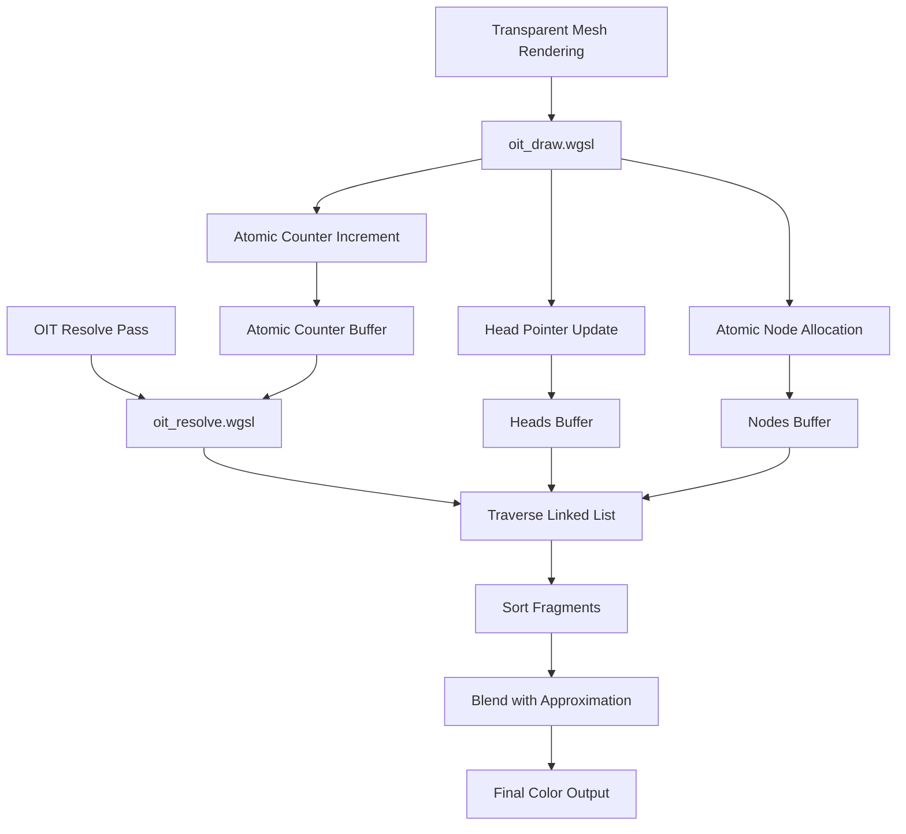

+++
title = "#21831 Implement per-pixel linked list for OIT"
date = "2026-02-05T00:00:00"
draft = false
template = "pull_request_page.html"
in_search_index = true

[taxonomies]
list_display = ["show"]

[extra]
current_language = "en"
available_languages = {"en" = { name = "English", url = "/pull_request/bevy/2026-02/pr-21831-en-20260205" }, "zh-cn" = { name = "中文", url = "/pull_request/bevy/2026-02/pr-21831-zh-cn-20260205" }}
labels = ["A-Rendering", "C-Performance", "C-Refinement", "D-Shaders"]
+++

# Title

## Basic Information
- **Title**: Implement per-pixel linked list for OIT
- **PR Link**: https://github.com/bevyengine/bevy/pull/21831
- **Author**: beicause
- **Status**: MERGED
- **Labels**: A-Rendering, C-Performance, C-Refinement, D-Shaders, S-Ready-For-Review
- **Created**: 2025-11-14T02:22:56Z
- **Merged**: 2026-02-05T21:40:10Z
- **Merged By**: alice-i-cecile

## Description Translation

# Objective

The current OIT stores viewport-sized fragments per layer. It uses much more memory than it can be.

## Solution

Implements per-pixel linked list for OIT, which saves memory and can handle more layers. The implementation references https://github.com/KhronosGroup/Vulkan-Samples/tree/main/samples/api/oit_linked_lists

## Testing

Tested with the `order_independent_transparency` example. I also added a new scene in it.

<details>


</details>

## The Story of This Pull Request

### The Problem and Context
The existing Order Independent Transparency (OIT) implementation in Bevy used a fixed-size layer approach. For each pixel on screen, it allocated storage for N fragments (where N was `OrderIndependentTransparencySettings::layer_count`). This approach had significant memory inefficiency because it allocated memory for every possible fragment in every pixel, regardless of whether that pixel actually contained that many transparent fragments.

The memory usage scaled with screen resolution multiplied by layer count, which could become prohibitive for high-resolution displays. For example, at 4K resolution (3840x2160) with 8 layers, the system needed to allocate storage for 66 million fragments, even if most pixels had only 0-2 transparent fragments.

### The Solution Approach
This PR implements a per-pixel linked list approach, which is a more memory-efficient data structure for OIT. Instead of pre-allocating fixed slots per pixel, it maintains:

1. A global pool of fragment nodes (`nodes` buffer)
2. A per-pixel head pointer array (`heads` buffer)
3. An atomic counter for node allocation (`atomic_counter` buffer)

This approach only allocates memory for actual fragments that exist in the scene, significantly reducing memory usage for typical scenes where transparent objects are sparse. The implementation references the Khronos Vulkan Samples' linked list OIT implementation, adapting it for Bevy's architecture and WebGPU compatibility.

### The Implementation
The core change replaces the previous `BufferVec<UVec2>` for layers and `BufferVec<i32>` for layer IDs with three new buffers:

1. `nodes`: Stores `OitFragmentNode` structs containing color (RGB9E5 encoded), depth+alpha (packed 24-bit depth + 8-bit alpha), and a `next` pointer
2. `heads`: Array of head pointers, one per screen pixel
3. `atomic_counter`: Single atomic counter for allocating new nodes

```rust
// File: crates/bevy_core_pipeline/src/oit/mod.rs
// Before:
pub struct OitBuffers {
    pub layers: BufferVec<UVec2>,
    pub layer_ids: BufferVec<i32>,
    pub settings: DynamicUniformBuffer<OrderIndependentTransparencySettings>,
}

// After:
pub struct OitBuffers {
    pub settings: DynamicUniformBuffer<OrderIndependentTransparencySettings>,
    pub nodes_capacity: UniformBuffer<u32>,
    pub nodes: UninitBufferVec<OitFragmentNode>,
    pub heads: UninitBufferVec<u32>,
    pub atomic_counter: UninitBufferVec<u32>,
}
```

The fragment insertion in the shader changed from writing to a fixed array index to atomically allocating a node and updating the linked list:

```wgsl
// File: crates/bevy_core_pipeline/src/oit/oit_draw.wgsl
// Before (simplified):
let layer_index = screen_index + layer_id * buffer_size;
let rgb9e5_color = bevy_pbr::rgb9e5::vec3_to_rgb9e5_(color.rgb);
let depth_alpha = pack_24bit_depth_8bit_alpha(position.z, color.a);
oit_layers[layer_index] = vec2(rgb9e5_color, depth_alpha);

// After:
var new_node_index = atomicAdd(&oit_atomic_counter, 1u);
var node: OitFragmentNode;
node.next = atomicExchange(&oit_heads[screen_index], new_node_index + 1u) - 1u;
node.color = bevy_pbr::rgb9e5::vec3_to_rgb9e5_(color.rgb);
node.depth_alpha = pack_24bit_depth_8bit_alpha(position.z, color.a);
oit_nodes[new_node_index] = node;
```

The resolve pass also changed significantly. Instead of processing a fixed-size array, it now traverses the linked list, sorts fragments by depth, and handles cases where there are more fragments than the sort buffer can hold:

```wgsl
// File: crates/bevy_core_pipeline/src/oit/resolve/oit_resolve.wgsl
// Key algorithm:
var current_node = head;
var sorted_frag_count = 0u;
while current_node != LINKED_LIST_END_SENTINEL {
    let fragment_node = nodes[current_node];
    current_node = fragment_node.next;
    
    if sorted_frag_count < SORTED_FRAGMENT_MAX_COUNT {
        // Insert into sorted array
    } else if fragment_list[0].depth_alpha > fragment_node.depth_alpha {
        // Blend nearest and insert
    } else {
        // Blend early (approximation)
    }
}
```

### Technical Insights
Several important technical details in this implementation:

1. **Memory Layout Optimization**: The depth and alpha are packed into a single 32-bit value with depth in the higher bits. This allows depth comparisons to work directly on the packed value without unpacking, since `depth(a) < depth(b) <=> packed(a) < packed(b)`.

2. **Sentinel Values**: The implementation uses `u32::MAX` (0xFFFFFFFF) as the end-of-list sentinel, but stores `head + 1` in the heads buffer to avoid writing `u32::MAX` from the CPU. WGPU guarantees buffers are zero-initialized, so `0` becomes the sentinel after subtracting 1.

3. **Approximate Sorting**: When there are more fragments than `sorted_fragment_max_count`, the system uses an approximation algorithm that either blends fragments early (if they're behind all sorted fragments) or blends the nearest sorted fragment and inserts the new one.

4. **Thread Safety**: Atomic operations ensure thread-safe insertion into the linked list from multiple fragments writing to the same pixel concurrently.

5. **Buffer Management**: The system dynamically resizes buffers based on camera requirements and completely releases them when no cameras use OIT, preventing memory waste.

### The Impact
This PR provides significant improvements:

1. **Memory Efficiency**: Memory usage now scales with actual fragment count rather than worst-case scenario. For scenes with sparse transparency, this can reduce OIT memory usage by 90% or more.

2. **Flexibility**: The linked list can handle more fragments per pixel than the previous fixed-layer approach, limited only by total buffer capacity.

3. **Performance**: While atomic operations add some overhead, the reduced memory bandwidth and ability to handle more complex transparency scenarios efficiently often results in better overall performance.

4. **Integration**: The changes maintain backward compatibility with existing OIT settings while providing more control via `sorted_fragment_max_count` and `fragments_per_pixel_average`.

The implementation also fixes synchronization issues by ensuring the transparent pass only runs when the OIT resolve pipeline is ready, preventing corrupted linked lists from concurrent buffer modifications.

## Visual Representation



## Key Files Changed

### `crates/bevy_core_pipeline/src/oit/mod.rs` (+129/-118)
**What changed**: Complete restructuring of OIT buffer management from fixed layers to linked list.
**Why changed**: To implement per-pixel linked list OIT for better memory efficiency.

```rust
// Key change: New buffer structure
pub struct OitBuffers {
    pub settings: DynamicUniformBuffer<OrderIndependentTransparencySettings>,
    pub nodes_capacity: UniformBuffer<u32>,
    pub nodes: UninitBufferVec<OitFragmentNode>,
    pub heads: UninitBufferVec<u32>,
    pub atomic_counter: UninitBufferVec<u32>,
}
```

### `crates/bevy_core_pipeline/src/oit/resolve/oit_resolve.wgsl` (+95/-63)
**What changed**: Complete rewrite of the resolve shader to traverse linked lists instead of fixed arrays.
**Why changed**: To process the new linked list data structure and implement the fragment sorting algorithm.

```wgsl
// Key algorithm: Linked list traversal and sorting
while current_node != LINKED_LIST_END_SENTINEL {
    let fragment_node = nodes[current_node];
    current_node = fragment_node.next;
    // ... sorting and blending logic
}
```

### `examples/3d/order_independent_transparency.rs` (+110/-4)
**What changed**: Added new test scenes including quads and auto-instancing test.
**Why changed**: To demonstrate and test the new OIT implementation with more complex scenarios.

```rust
// New test scene: Multiple overlapping transparent quads
fn spawn_quads(
    commands: &mut Commands,
    meshes: &mut Assets<Mesh>,
    materials: &mut Assets<StandardMaterial>,
) {
    // Spawn multiple overlapping transparent quads with different colors and alphas
}
```

### `crates/bevy_core_pipeline/src/oit/resolve/mod.rs` (+45/-21)
**What changed**: Updated pipeline creation and bind groups to support the new buffer layout.
**Why changed**: To accommodate the three new storage buffers (nodes, heads, atomic_counter) instead of two.

```rust
// Updated required storage buffers count
pub const OIT_REQUIRED_STORAGE_BUFFERS: u32 = 3;
```

### `crates/bevy_pbr/src/render/mesh_view_bindings.rs` (+33/-21)
**What changed**: Updated bind group layout and preparation to include the new OIT buffers.
**Why changed**: To bind the nodes, heads, and atomic_counter buffers to the shader.

```rust
// Updated bind group entries for OIT
if has_oit {
    entries = entries.extend_with_indices((
        (27, oit_settings_binding),
        (28, oit_nodes_capacity),
        (29, oit_nodes),
        (30, oit_heads),
        (31, oit_atomic_counter),
    ));
}
```

## Further Reading

1. **Khronos Vulkan Samples - OIT Linked Lists**: The reference implementation this PR is based on: https://github.com/KhronosGroup/Vulkan-Samples/tree/main/samples/api/oit_linked_lists

2. **Order Independent Transparency Techniques**: Survey paper comparing different OIT methods including linked lists, depth peeling, and stochastic transparency.

3. **WebGPU Atomic Operations**: Documentation on atomic operations in WebGPU/WGSL, which are crucial for thread-safe linked list construction.

4. **RGB9E5 Encoding**: The color encoding format used for compact color storage in the fragment nodes.

5. **Bevy Rendering Architecture**: Understanding Bevy's ECS-based render graph and how OIT integrates with the main transparent pass.