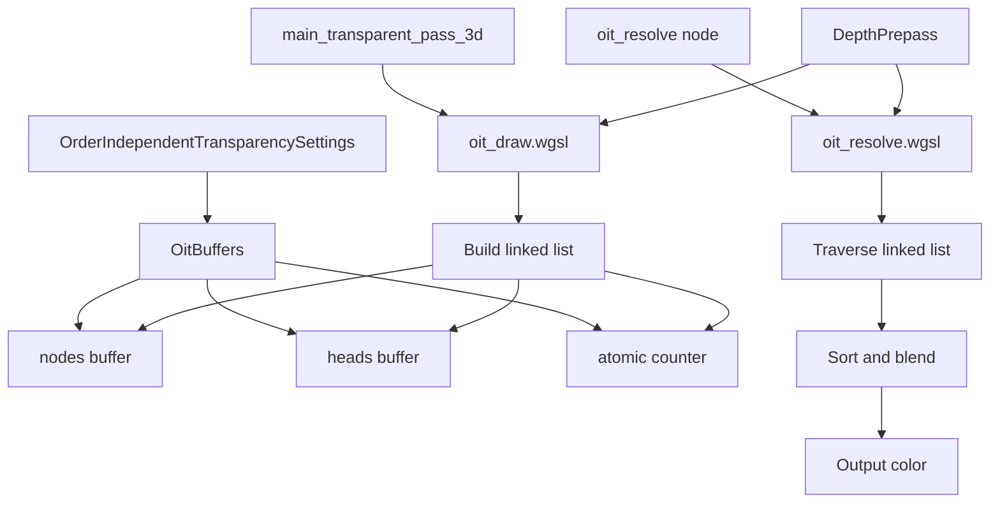

+++
title = "#21831 Implement per-pixel linked list for OIT"
date = "2026-02-05T00:00:00"
draft = false
template = "pull_request_page.html"
in_search_index = false

[extra]
current_language = "zh-cn"
available_languages = {"en" = { name = "English", url = "/pull_request/bevy/2026-02/pr-21831-en-20260205" }, "zh-cn" = { name = "中文", url = "/pull_request/bevy/2026-02/pr-21831-zh-cn-20260205" }}
labels = ["A-Rendering", "C-Performance", "D-Shaders", "C-Refinement"]
+++

# Title

## Basic Information
- **Title**: Implement per-pixel linked list for OIT
- **PR Link**: https://github.com/bevyengine/bevy/pull/21831
- **Author**: beicause
- **Status**: MERGED
- **Labels**: A-Rendering, C-Performance, S-Ready-For-Final-Review, D-Shaders, C-Refinement
- **Created**: 2025-11-14T02:22:56Z
- **Merged**: 2026-02-05T21:40:10Z
- **Merged By**: alice-i-cecile

## Description Translation
# 目标

目前的OIT为每个层存储视口大小的片段。它使用的内存比实际需要的多得多。

## 解决方案

实现了每像素链表用于OIT，这节省了内存并能处理更多层。实现参考了 https://github.com/KhronosGroup/Vulkan-Samples/tree/main/samples/api/oit_linked_lists

## 测试

使用 `order_independent_transparency` 示例进行了测试。我还在其中添加了一个新场景。

<details>


</details>

## The Story of This Pull Request

### 问题和背景
在实时渲染中，顺序无关透明度（Order Independent Transparency, OIT）是一种能够正确渲染半透明对象的技术，无论这些对象在场景中的绘制顺序如何。Bevy引擎原有的OIT实现采用了一种分层方法：它分配一个视口大小的缓冲区，为每个像素存储固定数量的层（fragment）。每个层包含颜色和深度信息。这种方法有一个明显的缺点：内存使用与层数乘以屏幕像素数成正比。即使一个像素实际上只有很少的半透明片段，系统也必须为每个像素分配完整的层数。这不仅浪费内存，还限制了可处理的半透明片段数量，因为层数设置是固定的，超过该数量的片段将被丢弃。

开发者面临的核心问题是内存效率低下和可扩展性限制。原实现在处理复杂半透明场景时，要么需要设置很高的层数（导致内存浪费），要么会因层数不足而丢失片段。因此，需要一个更高效的数据结构来存储每个像素的半透明片段。

### 解决方案方法
开发者选择了**每像素链表（per-pixel linked list）** 作为新的OIT实现方案。这种方案的基本思想是：为每个像素维护一个链表，链表节点存储在全局的节点缓冲区中。每个节点包含当前片段的颜色、深度和指向下一个节点的索引。此外，还有一个头指针缓冲区，存储每个像素链表的第一个节点索引。这种方案的内存使用与实际的半透明片段数量成正比，而不是屏幕像素数乘以固定层数。它能更灵活地处理动态数量的片段，并且内存利用率更高。

该实现参考了Khronos Group的Vulkan示例中的OIT链表实现。这种方案在图形学界是已知的，但将其集成到Bevy的渲染管线中需要进行一系列的架构调整。

### 实现细节
新的实现涉及多个组件的修改。首先，数据结构从固定大小的分层缓冲区转变为动态的链表缓冲区。在Rust代码中，`OitBuffers`结构体被重构：

```rust
// Before: Fixed-size per-layer buffers
pub struct OitBuffers {
    pub layers: BufferVec<UVec2>,
    pub layer_ids: BufferVec<i32>,
    pub settings: DynamicUniformBuffer<OrderIndependentTransparencySettings>,
}

// After: Linked list buffers
pub struct OitBuffers {
    pub settings: DynamicUniformBuffer<OrderIndependentTransparencySettings>,
    pub nodes_capacity: UniformBuffer<u32>,
    pub nodes: UninitBufferVec<OitFragmentNode>,
    pub heads: UninitBufferVec<u32>,
    pub atomic_counter: UninitBufferVec<u32>,
}
```

`OitFragmentNode`是一个新的结构体，在WGSL和Rust中都有定义，包含颜色（压缩为rgb9e5格式）、深度和alpha（打包为32位）以及下一个节点的索引。

在渲染过程中，透明通道（`main_transparent_pass_3d`）现在会检查OIT是否启用，并确保OIT解析管道（`OitResolvePipelineId`）已准备就绪，以防止在没有重置链表的情况下写入缓冲区，导致链表损坏（如循环引用）。

在着色器方面，`oit_draw.wgsl`中的`oit_draw`函数被重写，不再使用原子操作向固定层数组添加片段，而是使用原子操作分配新的节点，并更新头指针：

```wgsl
// Before: Write to fixed layer array
var layer_id = atomicAdd(&oit_layer_ids[screen_index], 1);
if layer_id >= oit_settings.layers_count {
    atomicStore(&oit_layer_ids[screen_index], oit_settings.layers_count);
    return;
}
let layer_index = screen_index + layer_id * buffer_size;
oit_layers[layer_index] = vec2(rgb9e5_color, depth_alpha);

// After: Linked list insertion
var new_node_index = atomicAdd(&oit_atomic_counter, 1u);
if new_node_index >= oit_nodes_capacity {
    return;
}
var node: OitFragmentNode;
node.next = atomicExchange(&oit_heads[screen_index], new_node_index + 1u) - 1u;
node.color = bevy_pbr::rgb9e5::vec3_to_rgb9e5_(color.rgb);
node.depth_alpha = pack_24bit_depth_8bit_alpha(position.z, color.a);
oit_nodes[new_node_index] = node;
```

注意，头指针缓冲区使用从1开始的索引，0作为结束哨兵（sentinel），这样可以避免从CPU写入`u32::MAX`，因为wgpu保证缓冲区初始化为零。

在解析通道（`oit_resolve.wgsl`）中，算法也进行了重写。原实现使用固定大小的数组进行冒泡排序，新实现则遍历链表，使用一个固定大小的排序数组（大小由`sorted_fragment_max_count`控制）来存储最前面的几个片段。如果链表中的片段数超过排序数组容量，则会进行近似混合：将最近（深度最小）的片段混合到最终颜色中，然后将其从排序数组中移除，为更远的片段腾出空间。这种方法在片段数超过排序容量时提供了合理的近似，同时保持了性能。

```wgsl
// New resolve algorithm: build sorted array from linked list
var fragment_list: array<OitFragment, SORTED_FRAGMENT_MAX_COUNT>;
var sorted_frag_count = 0u;
while current_node != LINKED_LIST_END_SENTINEL {
    let fragment_node = nodes[current_node];
    current_node = fragment_node.next;
    // ... depth test and insertion sort into fragment_list ...
}
```

此外，为了支持深度预通道（depth prepass），着色器增加了条件编译。当启用深度预通道时，解析着色器可以直接跳过被不透明物体遮挡的片段，而无需采样深度纹理。这通过添加`DEPTH_PREPASS` shader定义和相应的条件代码实现。

### 技术洞察
这个PR展示了几个重要的技术决策：

1. **原子操作和链表构建**：在GPU上构建每像素链表需要原子操作来分配节点和更新头指针。这依赖于GPU的原子操作支持。Bevy的渲染设备需要支持存储缓冲区的原子操作（`WgpuFeatures::STORAGE_BUFFER_ATOMIC`）。原子计数器用于分配新节点，而头指针的交换（`atomicExchange`）确保了链表的正确构建。

2. **内存管理**：链表节点的缓冲区大小不再与屏幕分辨率和固定层数绑定，而是基于预期的平均每像素片段数（`fragments_per_pixel_average`）动态计算。这允许开发者根据场景复杂度调整内存分配，而不是为最坏情况分配内存。当没有摄像机启用OIT时，缓冲区大小会被缩减到最小（1），以释放内存。

3. **深度和alpha的打包**：深度和alpha被打包到一个32位整数中，但打包方式发生了改变。原代码将深度放在低24位，alpha放在高8位。新代码将深度放在高24位，alpha放在低8位。这样做的原因是：由于深度值在整数表示中占高位，比较打包后的整数值就相当于比较深度值（忽略alpha），这可以在排序时简化比较操作。

4. **与深度预通道的集成**：深度预通道（Depth Prepass）是一种常用的优化技术，它先渲染不透明物体的深度，然后在透明通道中利用这些深度信息进行早期深度测试。OIT的新实现与深度预通道协同工作：如果启用了深度预通道，那么在绘制半透明片段时就可以提前拒绝被遮挡的片段（在`oit_draw.wgsl`中），并且在解析时也不需要采样深度纹理。

5. **管道和绑定组的调整**：由于数据结构的变化，渲染管道的绑定组布局也需要调整。现在需要绑定节点缓冲区、头指针缓冲区和原子计数器缓冲区。此外，根据是否启用深度预通道，解析管道的布局也会不同（可能不需要深度纹理绑定）。

### 影响
这些改变带来了几个具体的改进：

1. **内存效率提升**：内存使用现在与实际的半透明片段数量更接近，而不是固定的屏幕像素乘以层数。对于典型场景，这可以显著减少内存占用，尤其是当半透明对象只覆盖屏幕一部分时。

2. **可扩展性增强**：链表结构理论上可以处理任意数量的片段，只受节点缓冲区大小的限制。节点缓冲区的大小可以基于预期片段数设置，而不是固定的层数。这意味着更复杂的半透明场景可以被正确渲染，而不会因为层数不足而丢失片段。

3. **性能考虑**：链表构建需要原子操作，这可能在某些硬件上带来性能开销。但是，由于避免了固定大小数组的冗余存储和排序，整体性能可能得到提升，特别是在片段分布不均匀的场景中。新的解析算法使用插入排序和近似混合，对于超过排序容量的片段进行了优化处理。

4. **代码维护性**：新的实现更加模块化，与深度预通道的集成也更清晰。然而，由于增加了链表管理的复杂性，代码的理解和调试难度也可能增加。

这个PR为Bevy的OIT实现带来了现代图形技术，使其能够更好地处理复杂的半透明效果，同时为未来的优化（如更好的排序算法、尾混合等）奠定了基础。

## Visual Representation



## Key Files Changed

1. **`crates/bevy_core_pipeline/src/oit/mod.rs` (+129/-118)**
   - 这是OIT模块的主要文件，进行了大规模重构。
   - 主要变化：将原来的固定层缓冲区（`layers`和`layer_ids`）替换为链表缓冲区（`nodes`、`heads`、`atomic_counter`）。
   - 引入了新的结构体`OitFragmentNode`。
   - 修改了`OrderIndependentTransparencySettings`，将`layer_count`替换为`sorted_fragment_max_count`和`fragments_per_pixel_average`。
   - 更新了缓冲区准备逻辑，根据摄像机设置动态计算缓冲区大小。
   - 移除了原来的`configure_depth_texture_usages`系统，改为更简单的`configure_camera_depth_usages`。

2. **`crates/bevy_core_pipeline/src/oit/resolve/oit_resolve.wgsl` (+95/-63)**
   - 这是OIT解析的着色器文件，完全重写。
   - 新实现了链表遍历、排序和混合算法。
   - 支持深度预通道条件编译。
   - 使用固定大小的排序数组，对超出容量的片段进行近似混合。

3. **`examples/3d/order_independent_transparency.rs` (+110/-4)**
   - 更新了OIT示例，添加了新的测试场景。
   - 新增了四边形场景和自动实例化测试场景。
   - 展示了如何与深度预通道（`DepthPrepass`）一起使用。

4. **`crates/bevy_core_pipeline/src/oit/resolve/mod.rs` (+45/-21)**
   - OIT解析模块的Rust代码。
   - 更新了管道特化逻辑，包含深度预通道支持。
   - 修改了绑定组准备，以包含新的缓冲区。

5. **`crates/bevy_pbr/src/render/mesh_view_bindings.rs` (+33/-21)**
   - 更新了网格视图绑定，以反映新的OIT缓冲区布局。
   - 绑定索引从27-29调整为27-31，增加了节点容量、节点、头指针和原子计数器的绑定。

## Further Reading

1. **Vulkan Samples: Order Independent Transparency with Linked Lists** - 这是本PR参考的实现，提供了详细的解释和代码：https://github.com/KhronosGroup/Vulkan-Samples/tree/main/samples/api/oit_linked_lists

2. **GPU Pro 2: Order-Independent Transparency Using Per-Pixel Linked Lists** - 一篇经典论文，详细介绍了每像素链表技术。

3. **Bevy文档：Order Independent Transparency** - Bevy官方文档中关于OIT的部分，可以帮助理解如何在实际项目中使用此功能。

4. **WGSL原子操作** - WebGPU Shading Language中原子操作的规范，对于理解链表构建至关重要：https://www.w3.org/TR/WGSL/#atomic-operations

5. **Bevy深度预通道** - 了解深度预通道如何工作，以及如何与OIT配合：https://bevyengine.org/learn/advanced-topics/depth-prepass/