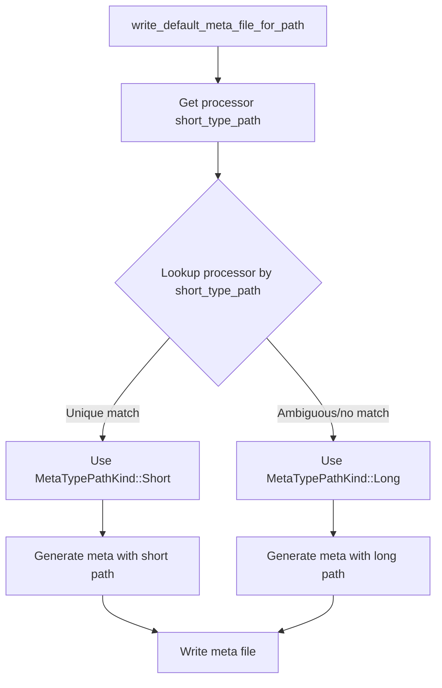

+++
title = "#22208 Make `write_default_meta_file_for_path` write the short type path instead of the long type path"
date = "2026-02-22T00:00:00"
draft = false
template = "pull_request_page.html"
in_search_index = true

[taxonomies]
list_display = ["show"]

[extra]
current_language = "en"
available_languages = {"en" = { name = "English", url = "/pull_request/bevy/2026-02/pr-22208-en-20260222" }, "zh-cn" = { name = "中文", url = "/pull_request/bevy/2026-02/pr-22208-zh-cn-20260222" }}
labels = ["A-Assets", "D-Straightforward", "C-Refinement"]
+++

# Title: Make `write_default_meta_file_for_path` write the short type path instead of the long type path

## Basic Information
- **Title**: Make `write_default_meta_file_for_path` write the short type path instead of the long type path.
- **PR Link**: https://github.com/bevyengine/bevy/pull/22208
- **Author**: andriyDev
- **Status**: MERGED
- **Labels**: A-Assets, S-Ready-For-Final-Review, D-Straightforward, C-Refinement
- **Created**: 2025-12-20T08:24:02Z
- **Merged**: 2026-02-22T19:33:00Z
- **Merged By**: alice-i-cecile

## Description Translation
The PR description is already in English, so it will be included as-is:

# Objective

- Context: In #17216, we stopped automatically generating meta files for assets, but provided explicit functions for generating meta files.
- In #21339, we allowed asset processors to be specified by their short type path in meta files.
- However, the meta file generating functions still produced fully-qualified type paths for processors. So even though we supported much more readable processor meta files, we didn't take advantage of that when generating meta files.
- Fulfilling my obligations to cart: https://github.com/bevyengine/bevy/pull/21339#discussion_r2621397150

## Solution

- Make `ErasedProcessor` have a method for returning its `short_type_path`, and make its `default_meta` method take an enum to choose between using the short or long type path.
- When generating the default meta, first lookup the processor using its short type name. If it's ambiguous, use the long type path.
- Add tests to show the short/long selection. As part of this, I forced all meta files to be serialized with `\n` as the new line character.
- Bonus: add more tests for `write_default_meta_file_for_path` and `write_default_loader_meta_file_for_path` which were omitted in #17216 due to missing appropriate testing utilities (specifically a memory asset writer).

## Testing

- Added tests!

## The Story of This Pull Request

This PR addresses an inconsistency in Bevy's asset system. The core issue is that while Bevy already supported using short type paths for asset processors in meta files (implemented in PR #21339), the functions that generate default meta files were still using fully-qualified type paths. This meant developers couldn't benefit from cleaner, more readable meta files when using automated meta generation.

The implementation approach is straightforward but requires careful consideration of edge cases. The developer needed to add a `short_type_path` method to the `ErasedProcessor` trait and modify the `default_meta` method to accept a parameter specifying which type path to use. This introduces a new enum `MetaTypePathKind` with two variants: `Short` and `Long`.

The key technical challenge is handling ambiguity. When multiple processors share the same short type name, the system must fall back to using the fully-qualified path to avoid confusion. The implementation handles this by first attempting to look up the processor using its short type name. If this lookup succeeds (meaning there's exactly one processor with that short name), it uses the short path; otherwise, it falls back to the long path.

This change affects the asset processing workflow at a specific point: when `write_default_meta_file_for_path` is called. The method now intelligently decides which type path format to use based on whether the short name is ambiguous in the current processor registry.

The tests demonstrate both cases: one where the short type path is unique and used, and another where an ambiguous short type path forces the use of the fully-qualified path. The test infrastructure also needed updates to ensure consistent serialization with `\n` as the newline character.

## Visual Representation



## Key Files Changed

### 1. `crates/bevy_asset/src/processor/mod.rs`
This file contains the main `AssetProcessor` implementation. The changes enable intelligent selection between short and long type paths when generating default meta files.

```rust
// Key change in write_default_meta_file_for_path:
let short_type_path = processor.short_type_path();
// Try to get the processor using the short type - if it fails, that must mean that the
// short type path is insufficient, so we'll have to fall back to the long path.
let processor_path_kind = if self.get_processor(short_type_path).is_ok() {
    MetaTypePathKind::Short
} else {
    MetaTypePathKind::Long
};

let meta = processor.default_meta(processor_path_kind);
```

### 2. `crates/bevy_asset/src/processor/process.rs`
This file defines the `ErasedProcessor` trait and its implementation. The changes add support for short type paths and make the `default_meta` method configurable.

```rust
// Added enum:
pub enum MetaTypePathKind {
    Short,
    Long,
}

// Added method to trait:
fn short_type_path(&self) -> &'static str;

// Modified default_meta implementation:
fn default_meta(&self, processor_path_kind: MetaTypePathKind) -> Box<dyn AssetMetaDyn> {
    let type_path = match processor_path_kind {
        MetaTypePathKind::Short => P::short_type_path(),
        MetaTypePathKind::Long => P::type_path(),
    };
    Box::new(AssetMeta::<(), P>::new(AssetAction::Process {
        processor: type_path.to_string(),
        settings: P::Settings::default(),
    }))
}
```

### 3. `crates/bevy_asset/src/processor/tests.rs`
This file contains tests that verify the new behavior. The tests demonstrate both the normal case (using short paths) and the ambiguous case (falling back to long paths).

```rust
// Test renamed and updated to check for short type path:
#[test]
fn writes_short_default_meta_for_processor() {
    // ... test setup ...
    // Expected output now uses short type path:
    // processor: "LoadTransformAndSave<CoolTextLoader, RootAssetTransformer<AddText, CoolText>, CoolTextSaver>",
}

// New test for ambiguous case:
#[test]
fn writes_long_default_meta_for_ambiguous_processor() {
    // Creates two processors with same short type path
    // Verifies that long type path is used in generated meta
}
```

## Further Reading
- [PR #17216](https://github.com/bevyengine/bevy/pull/17216) - Stopped automatic meta file generation and provided explicit functions
- [PR #21339](https://github.com/bevyengine/bevy/pull/21339) - Allowed asset processors to be specified by short type paths
- [Bevy Assets Documentation](https://docs.rs/bevy_asset/latest/bevy_asset/) - Official documentation for Bevy's asset system

# Full Code Diff
*(The full diff was provided in the original request and is preserved below exactly as provided)*

diff --git a/crates/bevy_asset/src/processor/mod.rs b/crates/bevy_asset/src/processor/mod.rs
index d5476f0e736b1..b8df9be2211d1 100644
--- a/crates/bevy_asset/src/processor/mod.rs
+++ b/crates/bevy_asset/src/processor/mod.rs
@@ -444,7 +444,16 @@ impl AssetProcessor {
                 .await;
         };
 
-        let meta = processor.default_meta();
+        let short_type_path = processor.short_type_path();
+        // Try to get the processor using the short type - if it fails, that must mean that the
+        // short type path is insufficient, so we'll have to fall back to the long path.
+        let processor_path_kind = if self.get_processor(short_type_path).is_ok() {
+            MetaTypePathKind::Short
+        } else {
+            MetaTypePathKind::Long
+        };
+
+        let meta = processor.default_meta(processor_path_kind);
         let serialized_meta = meta.serialize();
 
         let source = self.get_source(path.source())?;
@@ -1066,7 +1075,10 @@ impl AssetProcessor {
                     .get_full_extension()
                     .and_then(|ext| self.get_default_processor(&ext))
                 {
-                    let meta = processor.default_meta();
+                    // Note: It doesn't matter whether we use the Long or Short kind, since we're
+                    // returning the processor here anyway, and we're only using this meta to pass
+                    // along the processor settings.
+                    let meta = processor.default_meta(MetaTypePathKind::Long);
                     (meta, Some(processor))
                 } else {
                     match server.get_path_asset_loader(asset_path.clone()).await {
diff --git a/crates/bevy_asset/src/processor/process.rs b/crates/bevy_asset/src/processor/process.rs
index 44f50155b3c0e..151b330f356aa 100644
--- a/crates/bevy_asset/src/processor/process.rs
+++ b/crates/bevy_asset/src/processor/process.rs
@@ -225,8 +225,18 @@ pub trait ErasedProcessor: Send + Sync {
     fn deserialize_meta(&self, meta: &[u8]) -> Result<Box<dyn AssetMetaDyn>, DeserializeMetaError>;
     /// Returns the type-path of the original [`Process`].
     fn type_path(&self) -> &'static str;
+    /// Returns the short type path of this processor.
+    fn short_type_path(&self) -> &'static str;
     /// Returns the default type-erased [`AssetMeta`] for the underlying [`Process`] impl.
-    fn default_meta(&self) -> Box<dyn AssetMetaDyn>;
+    fn default_meta(&self, processor_path_kind: MetaTypePathKind) -> Box<dyn AssetMetaDyn>;
+}
+
+/// Specifies which kind of path to use to specify a type.
+pub enum MetaTypePathKind {
+    /// Use the short type path.
+    Short,
+    /// Use the fully-qualified type path.
+    Long,
 }
 
 impl<P: Process> ErasedProcessor for P {
@@ -257,9 +267,17 @@ impl<P: Process> ErasedProcessor for P {
         P::type_path()
     }
 
-    fn default_meta(&self) -> Box<dyn AssetMetaDyn> {
+    fn short_type_path(&self) -> &'static str {
+        P::short_type_path()
+    }
+
+    fn default_meta(&self, processor_path_kind: MetaTypePathKind) -> Box<dyn AssetMetaDyn> {
+        let type_path = match processor_path_kind {
+            MetaTypePathKind::Short => P::short_type_path(),
+            MetaTypePathKind::Long => P::type_path(),
+        };
         Box::new(AssetMeta::<(), P>::new(AssetAction::Process {
-            processor: P::type_path().to_string(),
+            processor: type_path.to_string(),
             settings: P::Settings::default(),
         }))
     }
diff --git a/crates/bevy_asset/src/processor/tests.rs b/crates/bevy_asset/src/processor/tests.rs
index b0f59209b83a8..e48e4683b09bd 100644
--- a/crates/bevy_asset/src/processor/tests.rs
+++ b/crates/bevy_asset/src/processor/tests.rs
@@ -1694,7 +1694,7 @@ fn only_reprocesses_wrong_hash_on_startup() {
 }
 
 #[test]
-fn writes_default_meta_for_processor() {
+fn writes_short_default_meta_for_processor() {
     let AppWithProcessor {
         mut app,
         default_source_dirs: ProcessingDirs { source, .. },
@@ -1719,6 +1719,76 @@ fn writes_default_meta_for_processor() {
     let processor = app.world().resource::<AssetProcessor>().clone();
     bevy_tasks::block_on(processor.write_default_meta_file_for_path(ASSET_PATH)).unwrap();
 
+    assert_eq!(
+        read_meta_as_string(&source, Path::new(ASSET_PATH)),
+        r#"(
+    meta_format_version: "1.0",
+    asset: Process(
+        processor: "LoadTransformAndSave<CoolTextLoader, RootAssetTransformer<AddText, CoolText>, CoolTextSaver>",
+        settings: (
+            loader_settings: (),
+            transformer_settings: (),
+            saver_settings: (),
+        ),
+    ),
+)"#
+    );
+}
+
+mod ambiguous {
+    use super::{CoolText, MutateAsset, TypePath};
+
+    /// This is ambiguous with [`super::AddText`] for short-type paths.
+    #[derive(TypePath)]
+    pub(crate) struct AddText;
+
+    // Add a dummy MutateAsset impl so we can use it as a processor.
+    impl MutateAsset<CoolText> for AddText {
+        fn mutate(&self, _: &mut CoolText) {}
+    }
+}
+
+#[test]
+fn writes_long_default_meta_for_ambiguous_processor() {
+    let AppWithProcessor {
+        mut app,
+        default_source_dirs: ProcessingDirs { source, .. },
+        ..
+    } = create_app_with_asset_processor(&[]);
+
+    type CoolTextProcessor1 = LoadTransformAndSave<
+        CoolTextLoader,
+        RootAssetTransformer<AddText, CoolText>,
+        CoolTextSaver,
+    >;
+    type CoolTextProcessor2 = LoadTransformAndSave<
+        CoolTextLoader,
+        RootAssetTransformer<ambiguous::AddText, CoolText>,
+        CoolTextSaver,
+    >;
+    // Verify that these two processors actually have the same short_type_path.
+    assert_eq!(
+        CoolTextProcessor1::short_type_path(),
+        CoolTextProcessor2::short_type_path()
+    );
+
+    app.register_asset_processor(CoolTextProcessor1::new(
+        RootAssetTransformer::new(AddText("blah".to_string())),
+        CoolTextSaver,
+    ))
+    .set_default_asset_processor::<CoolTextProcessor1>("cool.ron")
+    // Add another processor with the same short type path to make the short type name ambiguous.
+    .register_asset_processor(CoolTextProcessor2::new(
+        RootAssetTransformer::new(ambiguous::AddText),
+        CoolTextSaver,
+    ));
+
+    const ASSET_PATH: &str = "abc.cool.ron";
+    source.insert_asset_text(Path::new(ASSET_PATH), &serialize_as_cool_text("blah"));
+
+    let processor = app.world().resource::<AssetProcessor>().clone();
+    bevy_tasks::block_on(processor.write_default_meta_file_for_path(ASSET_PATH)).unwrap();
+
     assert_eq!(
         read_meta_as_string(&source, Path::new(ASSET_PATH)),
         r#"(
