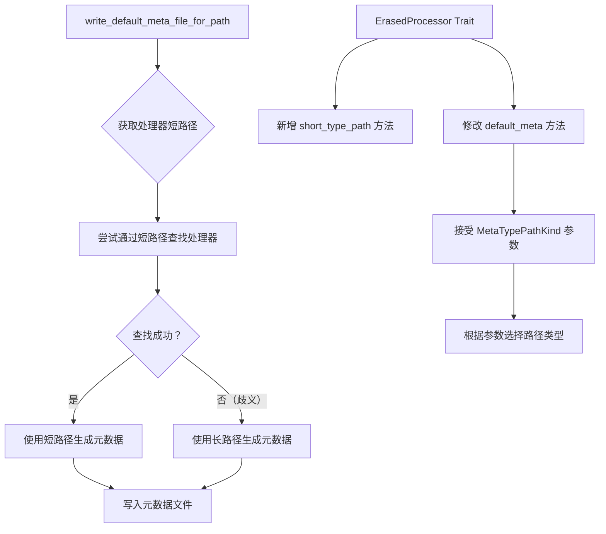

+++
title = "#22208 Make `write_default_meta_file_for_path` write the short type path instead of the long type path."
date = "2026-02-22T00:00:00"
draft = false
template = "pull_request_page.html"
in_search_index = false

[extra]
current_language = "zh-cn"
available_languages = {"en" = { name = "English", url = "/pull_request/bevy/2026-02/pr-22208-en-20260222" }, "zh-cn" = { name = "中文", url = "/pull_request/bevy/2026-02/pr-22208-zh-cn-20260222" }}
labels = ["A-Assets", "D-Straightforward", "C-Refinement"]
+++

# Title

## Basic Information
- **Title**: Make `write_default_meta_file_for_path` write the short type path instead of the long type path.
- **PR Link**: https://github.com/bevyengine/bevy/pull/22208
- **Author**: andriyDev
- **Status**: MERGED
- **Labels**: A-Assets, S-Ready-For-Final-Review, D-Straightforward, C-Refinement
- **Created**: 2025-12-20T08:24:02Z
- **Merged**: 2026-02-22T19:33:00Z
- **Merged By**: alice-i-cecile

## Description Translation

### 目标 (Objective)

- 上下文 (Context): 在 #17216 中，我们停止自动为资源 (assets) 生成元数据 (meta) 文件，但提供了显式函数来生成元数据文件。
- 在 #21339 中，我们允许在元数据文件中使用处理器 (processor) 的短类型路径 (short type path) 来指定资源处理器。
- 然而，生成元数据文件的函数仍然为处理器生成完全限定类型路径 (fully-qualified type paths)。因此，即使我们支持了更易读的处理器元数据文件，但在生成元数据文件时并没有利用这一点。
- 履行我对 cart 的义务：https://github.com/bevyengine/bevy/pull/21339#discussion_r2621397150

### 解决方案 (Solution)

- 让 `ErasedProcessor` 拥有一个返回其 `short_type_path` 的方法，并让其 `default_meta` 方法接受一个枚举来选择使用短类型路径还是长类型路径。
- 生成默认元数据时，首先使用短类型名称查找处理器。如果存在歧义，则使用长类型路径。
- 添加测试以展示短/长路径选择。作为此工作的一部分，我强制所有元数据文件使用 `\n` 作为换行符进行序列化。
- 额外收获：为 `write_default_meta_file_for_path` 和 `write_default_loader_meta_file_for_path` 添加更多测试，这些测试在 #17216 中因缺少适当的测试工具（特别是内存资源写入器 memory asset writer）而被省略。

### 测试 (Testing)

- 已添加测试！

## The Story of This Pull Request

这个 PR 解决了一个在资源处理元数据生成中存在的代码一致性问题。在早期的变更中，Bevy 的资源系统已经支持在元数据文件中使用处理器的短类型路径，但生成这些元数据的函数仍然使用完全限定的长路径。这导致生成的元数据文件可读性较差，与系统已支持的特性不一致。

问题的核心在于 `write_default_meta_file_for_path` 函数在生成默认元数据时，总是使用处理器的长类型路径。虽然 #21339 的改动允许解析元数据时使用短路径，但生成端并未同步更新。这种不一致性意味着开发者在查看自动生成的元数据文件时，会遇到冗长且难以阅读的类型路径。

开发者采取了一个务实且向后兼容的解决方案：在生成元数据时，优先尝试使用短类型路径，仅在短路径存在歧义时回退到长路径。这种智能回退机制确保了即使存在多个同名但不同模块的处理器，系统仍然能生成可用的元数据。

实现的关键在于扩展 `ErasedProcessor` trait，为其添加 `short_type_path` 方法和一个可选的路径类型参数。新的 `default_meta` 方法现在接受一个 `MetaTypePathKind` 枚举，指定应该使用短路径还是长路径：

```rust
pub enum MetaTypePathKind {
    /// Use the short type path.
    Short,
    /// Use the fully-qualified type path.
    Long,
}

fn default_meta(&self, processor_path_kind: MetaTypePathKind) -> Box<dyn AssetMetaDyn>;
```

在 `AssetProcessor::write_default_meta_file_for_path` 中，系统首先获取处理器的短路径，然后尝试通过短路径查找处理器。如果查找成功（表示短路径是唯一的），就使用短路径生成元数据；否则回退到长路径：

```rust
let short_type_path = processor.short_type_path();
let processor_path_kind = if self.get_processor(short_type_path).is_ok() {
    MetaTypePathKind::Short
} else {
    MetaTypePathKind::Long
};

let meta = processor.default_meta(processor_path_kind);
```

这种实现方式优雅地处理了潜在的类型冲突，同时最大程度地提高了生成元数据的可读性。从技术角度看，这是一个典型的适配层扩展：不改变现有的核心处理逻辑，只是在元数据表示层进行优化。

值得注意的是，在另一个函数 `get_default_processor_for_asset_path` 中，开发者明确选择了始终使用长路径，因为该函数的主要目的是返回处理器本身，而不是生成用于存储的元数据。这体现了对 API 不同使用场景的细致考量。

测试用例的设计也很有启发性。除了验证基本功能外，开发者还特意创建了一个场景，其中两个不同的处理器具有相同的短类型路径，以测试系统的回退机制：

```rust
// 两个处理器具有相同的 short_type_path
assert_eq!(
    CoolTextProcessor1::short_type_path(),
    CoolTextProcessor2::short_type_path()
);
```

这个测试确保了当短路径存在歧义时，系统确实会回退到使用长路径，避免了可能的运行时错误。

从工程实践的角度看，这个 PR 展示了几个重要的模式：
1. **特性完成的闭环**：当系统添加了新特性（短路径支持），应该确保所有相关组件都利用该特性
2. **渐进式改进**：通过智能回退机制，在不破坏现有功能的前提下改进用户体验
3. **测试驱动设计**：通过明确的测试用例验证边界条件和冲突场景

这次改动虽然不大，但提升了资源系统的一致性和开发者体验。生成的元数据文件现在更加简洁易读，特别是在处理复杂的泛型处理器类型时，差异尤为明显。

## Visual Representation



## Key Files Changed

### `crates/bevy_asset/src/processor/mod.rs` (+14/-2)

**变更说明**：修改了 `write_default_meta_file_for_path` 方法，使其在生成元数据时优先使用处理器的短类型路径，仅在短路径存在歧义时使用长路径。

**关键代码片段**：
```rust
// 修改后的逻辑：
let short_type_path = processor.short_type_path();
// 尝试使用短类型获取处理器 - 如果失败，说明短类型路径不充分，必须回退到长路径
let processor_path_kind = if self.get_processor(short_type_path).is_ok() {
    MetaTypePathKind::Short
} else {
    MetaTypePathKind::Long
};

let meta = processor.default_meta(processor_path_kind);
```

**相关影响**：这个变更是 PR 的核心，实现了智能路径选择逻辑。

### `crates/bevy_asset/src/processor/process.rs` (+21/-3)

**变更说明**：扩展了 `ErasedProcessor` trait，添加了 `short_type_path` 方法和 `MetaTypePathKind` 枚举，并修改了 `default_meta` 方法的签名以接受路径类型参数。

**关键代码片段**：
```rust
// 新增的枚举
pub enum MetaTypePathKind {
    /// Use the short type path.
    Short,
    /// Use the fully-qualified type path.
    Long,
}

// trait 的修改
pub trait ErasedProcessor: Send + Sync {
    // ... 原有方法 ...
    fn short_type_path(&self) -> &'static str;
    fn default_meta(&self, processor_path_kind: MetaTypePathKind) -> Box<dyn AssetMetaDyn>;
}

// 具体实现
fn default_meta(&self, processor_path_kind: MetaTypePathKind) -> Box<dyn AssetMetaDyn> {
    let type_path = match processor_path_kind {
        MetaTypePathKind::Short => P::short_type_path(),
        MetaTypePathKind::Long => P::type_path(),
    };
    Box::new(AssetMeta::<(), P>::new(AssetAction::Process {
        processor: type_path.to_string(),
        settings: P::Settings::default(),
    }))
}
```

**相关影响**：这些变更提供了必要的抽象，使调用方能够控制元数据中使用的路径类型。

### `crates/bevy_asset/src/processor/tests.rs` (+71/-1)

**变更说明**：更新了现有测试以反映新的行为，并添加了新的测试用例来验证当短路径存在歧义时系统会回退到长路径。

**关键代码片段**：
```rust
// 测试重命名和更新
#[test]
fn writes_short_default_meta_for_processor() {
    // ... 测试逻辑，期望使用短路径 ...
}

// 新增的测试模块和测试
mod ambiguous {
    // 创建与现有处理器短路径冲突的类型
    #[derive(TypePath)]
    pub(crate) struct AddText;
    // ... 实现 ...
}

#[test]
fn writes_long_default_meta_for_ambiguous_processor() {
    // 验证两个处理器具有相同的短路径
    assert_eq!(
        CoolTextProcessor1::short_type_path(),
        CoolTextProcessor2::short_type_path()
    );
    // 测试期望使用长路径
}
```

**相关影响**：测试用例确保了功能正确性和边界条件处理，特别是歧义场景下的回退行为。

## Further Reading

- **Bevy 资源系统文档**：了解 Bevy 资源处理的基本概念和元数据文件格式
- **Rust 的类型路径系统**：理解 `TypePath` trait 以及短路径与长路径的区别
- **PR #21339**：了解短类型路径在元数据中的最初支持实现
- **PR #17216**：了解自动元数据文件生成被移除的背景和手动生成函数的引入
- **测试驱动开发 (TDD)**：学习如何通过测试来驱动 API 设计和验证边界条件