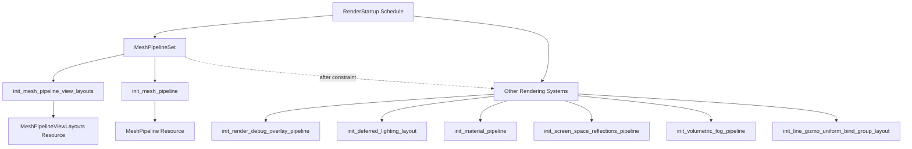

+++
title = "#22443 Convert `MeshPipelineViewLayouts` , `MeshPipeline` and `RenderDebugOverlayPipeline` to `RenderStartup` system"
date = "2026-02-24T00:00:00"
draft = false
template = "pull_request_page.html"
in_search_index = true

[taxonomies]
list_display = ["show"]

[extra]
current_language = "en"
available_languages = {"en" = { name = "English", url = "/pull_request/bevy/2026-02/pr-22443-en-20260224" }, "zh-cn" = { name = "中文", url = "/pull_request/bevy/2026-02/pr-22443-zh-cn-20260224" }}
labels = ["A-Rendering", "C-Code-Quality"]
+++

# Title

## Basic Information
- **Title**: Convert `MeshPipelineViewLayouts` , `MeshPipeline` and `RenderDebugOverlayPipeline` to `RenderStartup` system
- **PR Link**: https://github.com/bevyengine/bevy/pull/22443
- **Author**: Zeophlite
- **Status**: MERGED
- **Labels**: A-Rendering, C-Code-Quality, S-Ready-For-Final-Review
- **Created**: 2026-01-09T00:39:27Z
- **Merged**: 2026-02-24T19:01:25Z
- **Merged By**: alice-i-cecile

## Description Translation
# Objective

- Convert `MeshPipelineViewLayouts` , `MeshPipeline` and `RenderDebugOverlayPipeline` to `RenderStartup` system

## Solution

- Do the thing

## Testing

- Ran `animated_mesh` example

## The Story of This Pull Request

This PR addresses a code quality improvement in Bevy's rendering system by converting several critical resources from `FromWorld` initialization to explicit `RenderStartup` systems. The core issue was that these resources were being initialized implicitly through `init_resource()`, which uses the `FromWorld` trait. This approach can lead to initialization order issues and makes dependencies less explicit.

The developer needed to ensure proper initialization order for rendering resources that depend on other systems. Resources like `MeshPipelineViewLayouts` and `MeshPipeline` serve as foundational building blocks for many other rendering components, so their initialization must complete before dependent systems can run. The previous implementation used `FromWorld`, which initializes resources when they're first accessed, potentially causing race conditions or initialization-order bugs in complex rendering setups.

The solution converts three key resources to explicit initialization systems:
1. `MeshPipelineViewLayouts` - Generates all possible view layout combinations for mesh rendering
2. `MeshPipeline` - The main mesh rendering pipeline configuration
3. `RenderDebugOverlayPipeline` - The debug overlay rendering pipeline

The implementation introduces a new `MeshPipelineSet` system set to coordinate initialization order. This set contains the systems that initialize `MeshPipelineViewLayouts` and `MeshPipeline`, establishing them as foundational dependencies. Other rendering systems that depend on these resources are then explicitly scheduled to run after `MeshPipelineSet` using `.after(MeshPipelineSet)` constraints.

A key technical insight is that by moving from `FromWorld` to explicit systems, we gain better control over initialization order and make dependencies more transparent. The `FromWorld` approach can lead to hidden initialization dependencies where resources are initialized on-demand, potentially causing issues in multi-threaded contexts. Explicit systems allow the scheduler to understand and enforce proper ordering.

The changes required converting `FromWorld` implementations into regular systems that take resources as parameters and insert the initialized resource into the world. For example, the `init_mesh_pipeline` function now explicitly depends on `RenderDevice`, `RenderAdapter`, `MeshPipelineViewLayouts`, and `AssetServer`, making all its dependencies clear from the function signature.

This refactoring improves code maintainability by making initialization sequences explicit rather than implicit. It also helps prevent subtle bugs that can occur when resources are initialized in different orders in different contexts. The change is particularly valuable for the rendering system, where initialization order directly affects GPU resource creation and shader compilation.

## Visual Representation



## Key Files Changed

### `crates/bevy_pbr/src/render/mesh.rs` (+40/-34)
This file defines the new `MeshPipelineSet` system set and converts `MeshPipeline` from `FromWorld` to a `RenderStartup` system.

**Key Changes:**
```rust
// Before: FromWorld implementation
impl FromWorld for MeshPipeline {
    fn from_world(world: &mut World) -> Self {
        let shader = load_embedded_asset!(world, "mesh.wgsl");
        let mut system_state: SystemState<(
            Res<RenderDevice>,
            Res<RenderAdapter>,
            Res<MeshPipelineViewLayouts>,
        )> = SystemState::new(world);
        let (render_device, render_adapter, view_layouts) = system_state.get_mut(world);
        
        // ... rest of initialization
    }
}

// After: RenderStartup system
fn init_mesh_pipeline(
    mut commands: Commands,
    render_device: Res<RenderDevice>,
    render_adapter: Res<RenderAdapter>,
    view_layouts: Res<MeshPipelineViewLayouts>,
    asset_server: Res<AssetServer>,
) {
    let shader = load_embedded_asset!(asset_server.as_ref(), "mesh.wgsl");
    
    // ... rest of initialization
    commands.insert_resource(res);
}
```

**Why this matters:** This change makes the dependencies explicit and allows proper ordering with other rendering systems through the `MeshPipelineSet`.

### `crates/bevy_pbr/src/render/mesh_view_bindings.rs` (+43/-43)
This file converts `MeshPipelineViewLayouts` from `FromWorld` to a `RenderStartup` system.

**Key Changes:**
```rust
// Before: FromWorld implementation
impl FromWorld for MeshPipelineViewLayouts {
    fn from_world(world: &mut World) -> Self {
        let render_device = world.resource::<RenderDevice>();
        let render_adapter = world.resource::<RenderAdapter>();
        // ... layout generation
    }
}

// After: RenderStartup system
pub fn init_mesh_pipeline_view_layouts(
    mut commands: Commands,
    render_device: Res<RenderDevice>,
    render_adapter: Res<RenderAdapter>,
) {
    // ... layout generation
    commands.insert_resource(res);
}
```

**Why this matters:** `MeshPipelineViewLayouts` generates all possible view layout combinations upfront, which is computationally expensive. Making this initialization explicit ensures it completes before any rendering systems try to use these layouts.

### `crates/bevy_dev_tools/src/render_debug.rs` (+52/-46)
This file converts `RenderDebugOverlayPipeline` from `FromWorld` to a `RenderStartup` system and adds proper ordering constraints.

**Key Changes:**
```rust
// Before: init_resource in finish()
render_app
    .init_resource::<RenderDebugOverlayPipeline>()

// After: RenderStartup system with ordering
render_app.add_systems(
    RenderStartup,
    init_render_debug_overlay_pipeline.after(MeshPipelineSet),
);

// System implementation
fn init_render_debug_overlay_pipeline(
    mut commands: Commands,
    render_device: Res<RenderDevice>,
    mesh_view_layouts: Res<MeshPipelineViewLayouts>,
    asset_server: Res<AssetServer>,
    fullscreen_shader: Res<FullscreenShader>,
) {
    // ... initialization
    commands.insert_resource(res);
}
```

**Why this matters:** The debug overlay pipeline depends on `MeshPipelineViewLayouts`, so it must be initialized after the mesh pipeline systems complete.

### Other Modified Files:
- `crates/bevy_pbr/src/deferred/mod.rs` (+9/-9): Adds `.after(MeshPipelineSet)` to `init_deferred_lighting_layout`
- `crates/bevy_pbr/src/material.rs` (+9/-9): Adds `.after(MeshPipelineSet)` to `init_material_pipeline`
- `crates/bevy_pbr/src/ssr/mod.rs` (+6/-3): Adds `.after(MeshPipelineSet)` to `init_screen_space_reflections_pipeline`
- `crates/bevy_pbr/src/volumetric_fog/mod.rs` (+9/-9): Adds `.after(MeshPipelineSet)` to `init_volumetric_fog_pipeline`
- `crates/bevy_gizmos_render/src/lib.rs` (+3/-3): Adds `.after(MeshPipelineSet)` to `init_line_gizmo_uniform_bind_group_layout`

**Why these matter:** All these systems depend on mesh pipeline resources, so they need explicit ordering constraints to ensure proper initialization sequence.

## Further Reading

1. **Bevy Render Schedules**: Understanding Bevy's render schedule system, particularly the `RenderStartup` schedule for one-time initialization tasks
2. **System Ordering in ECS**: How to use system sets and ordering constraints (`before`, `after`) in entity component systems
3. **GPU Resource Management**: The importance of proper initialization order for GPU resources like pipelines, layouts, and buffers
4. **FromWorld vs Systems**: Trade-offs between implicit resource initialization with `FromWorld` and explicit initialization with systems