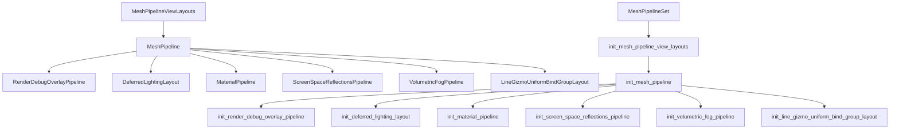

+++
title = "#22443 Convert `MeshPipelineViewLayouts`, `MeshPipeline` and `RenderDebugOverlayPipeline` to `RenderStartup` system"
date = "2026-02-24T00:00:00"
draft = false
template = "pull_request_page.html"
in_search_index = false

[extra]
current_language = "zh-cn"
available_languages = {"en" = { name = "English", url = "/pull_request/bevy/2026-02/pr-22443-en-20260224" }, "zh-cn" = { name = "中文", url = "/pull_request/bevy/2026-02/pr-22443-zh-cn-20260224" }}
+++

# Title
Convert `MeshPipelineViewLayouts`, `MeshPipeline` and `RenderDebugOverlayPipeline` to `RenderStartup` system

## Basic Information
- **标题**: Convert `MeshPipelineViewLayouts`, `MeshPipeline` and `RenderDebugOverlayPipeline` to `RenderStartup` system
- **PR链接**: https://github.com/bevyengine/bevy/pull/22443
- **作者**: Zeophlite
- **状态**: 已合并
- **标签**: A-Rendering, C-Code-Quality, S-Ready-For-Final-Review
- **创建时间**: 2026-01-09T00:39:27Z
- **合并时间**: 2026-02-24T19:01:25Z
- **合并者**: alice-i-cecile

## 描述翻译
该PR的目标是将 `MeshPipelineViewLayouts`、`MeshPipeline` 和 `RenderDebugOverlayPipeline` 从使用 `FromWorld` trait 初始化的方式改为使用 `RenderStartup` 系统。

### 解决方案
- 执行转换操作

### 测试
- 运行了 `animated_mesh` 示例

## 这个Pull Request的故事

这个PR涉及Bevy渲染引擎中多个关键资源初始化方式的系统化重构。以前，这些资源使用`FromWorld` trait进行初始化，这种方式在依赖复杂或需要明确执行顺序的场景下存在局限性。

### 问题和背景
在Bevy的渲染架构中，`MeshPipelineViewLayouts`、`MeshPipeline`和`RenderDebugOverlayPipeline`是三个核心的渲染资源。它们之前的初始化方式是通过实现`FromWorld` trait，这意味着它们的创建逻辑被隐藏在`from_world`方法中。这种模式有几个缺点：
1. 难以进行系统间依赖管理
2. 初始化顺序不明确
3. 测试和维护更困难
4. 不符合Bevy逐渐转向显式系统调度的架构趋势

具体来说，`MeshPipelineViewLayouts`需要生成所有可能的视图布局组合，`MeshPipeline`依赖于渲染设备和适配器信息，`RenderDebugOverlayPipeline`又依赖于前两者。这种依赖关系需要通过明确的系统顺序来保证。

### 解决方案
开发者采取了直接而有效的方法：将每个资源的`FromWorld`实现转换为独立的`RenderStartup`系统函数，并引入新的系统集`MeshPipelineSet`来管理初始化顺序。

技术实现上，这个转换涉及以下关键步骤：
1. 移除`FromWorld` trait实现
2. 创建对应的系统函数，接收必要的资源作为参数
3. 在`RenderStartup`调度中添加这些系统
4. 建立明确的依赖顺序

### 实现细节
核心的变化是在`mesh.rs`中引入了`MeshPipelineSet`系统集：

```rust
#[derive(Debug, Hash, PartialEq, Eq, Clone, SystemSet)]
pub struct MeshPipelineSet;
```

然后，在插件构建时注册初始化系统：

```rust
render_app.add_systems(
    RenderStartup,
    (init_mesh_pipeline_view_layouts, init_mesh_pipeline)
        .chain()
        .in_set(MeshPipelineSet),
);
```

最重要的转换是从`FromWorld`到系统函数的改写。以`MeshPipelineViewLayouts`为例：

**之前（FromWorld方式）**:
```rust
impl FromWorld for MeshPipelineViewLayouts {
    fn from_world(world: &mut World) -> Self {
        let render_device = world.resource::<RenderDevice>();
        let render_adapter = world.resource::<RenderAdapter>();
        // ... 复杂的初始化逻辑
    }
}
```

**之后（系统函数方式）**:
```rust
pub fn init_mesh_pipeline_view_layouts(
    mut commands: Commands,
    render_device: Res<RenderDevice>,
    render_adapter: Res<RenderAdapter>,
) {
    // ... 同样的初始化逻辑，但现在显式声明了依赖
    let res = MeshPipelineViewLayouts(Arc::new(array::from_fn(|i| {
        // 布局生成逻辑
    })));
    commands.insert_resource(res);
}
```

类似的转换也应用于`MeshPipeline`和`RenderDebugOverlayPipeline`。这种转换使得依赖关系变得明确：系统函数签名清楚地表明了它需要哪些资源。

### 技术洞察
这个重构体现了几个重要的软件工程原则：

1. **显式优于隐式**：系统函数的参数明确声明了依赖，相比`FromWorld`中隐式地从World提取资源，这种方式更易于理解和维护。

2. **依赖注入模式**：通过系统参数传递依赖，使得代码更容易测试和模块化。

3. **顺序控制的重要性**：引入`MeshPipelineSet`确保了关键资源按正确顺序初始化。其他依赖于mesh pipeline的系统现在可以明确指定`after(MeshPipelineSet)`。

4. **架构一致性**：这个改变符合Bevy整体向显式系统调度发展的架构方向，提高了代码库的一致性。

### 影响
这次重构带来的主要改进包括：

1. **更好的可维护性**：初始化逻辑现在位于显式的系统函数中，而不是隐藏在trait实现里。

2. **明确的依赖关系**：系统签名清楚地表明了资源依赖，IDE和工具可以提供更好的支持。

3. **可测试性提升**：系统函数比`FromWorld`实现更容易进行单元测试。

4. **性能优化潜力**：明确的初始化顺序为未来的并行化优化提供了基础。

5. **架构对齐**：使代码更符合Bevy的现代架构模式，为后续的渲染管线改进铺平道路。

从工程角度看，这是一个典型的"技术债务偿还"操作：虽然功能上不增加新特性，但显著提升了代码质量，降低了长期维护成本。

## 可视化表示



## 主要文件更改

### 1. `crates/bevy_pbr/src/render/mesh.rs` (+40/-34)
**更改概述**：引入`MeshPipelineSet`系统集，将`MeshPipeline`从`FromWorld`转换为系统函数。

**关键代码片段**:
```rust
// 新增系统集定义
#[derive(Debug, Hash, PartialEq, Eq, Clone, SystemSet)]
pub struct MeshPipelineSet;

// FromWorld实现被替换为系统函数
fn init_mesh_pipeline(
    mut commands: Commands,
    render_device: Res<RenderDevice>,
    render_adapter: Res<RenderAdapter>,
    view_layouts: Res<MeshPipelineViewLayouts>,
    asset_server: Res<AssetServer>,
) {
    let shader = load_embedded_asset!(asset_server.as_ref(), "mesh.wgsl");
    
    let clustered_forward_buffer_binding_type =
        render_device.get_supported_read_only_binding_type(CLUSTERED_FORWARD_STORAGE_BUFFER_COUNT);
    
    let res = MeshPipeline {
        view_layouts: view_layouts.clone(),
        clustered_forward_buffer_binding_type,
        mesh_layouts: MeshLayouts::new(&render_device, &render_adapter),
        shader,
        // ... 其他字段初始化
    };
    commands.insert_resource(res);
}
```

### 2. `crates/bevy_pbr/src/render/mesh_view_bindings.rs` (+43/-43)
**更改概述**：将`MeshPipelineViewLayouts`从`FromWorld`转换为系统函数。

**关键代码片段**:
```rust
pub fn init_mesh_pipeline_view_layouts(
    mut commands: Commands,
    render_device: Res<RenderDevice>,
    render_adapter: Res<RenderAdapter>,
) {
    let clustered_forward_buffer_binding_type =
        render_device.get_supported_read_only_binding_type(CLUSTERED_FORWARD_STORAGE_BUFFER_COUNT);
    
    let res = MeshPipelineViewLayouts(Arc::new(array::from_fn(|i| {
        let key = MeshPipelineViewLayoutKey::from_bits_truncate(i as u32);
        let entries = layout_entries(
            clustered_forward_buffer_binding_type,
            visibility_ranges_buffer_binding_type,
            key,
            &render_device,
            &render_adapter,
        );
        // ... 布局创建逻辑
    })));
    commands.insert_resource(res);
}
```

### 3. `crates/bevy_dev_tools/src/render_debug.rs` (+52/-46)
**更改概述**：将`RenderDebugOverlayPipeline`从`FromWorld`转换为系统函数，并依赖于`MeshPipelineSet`。

**关键代码片段**:
```rust
fn init_render_debug_overlay_pipeline(
    mut commands: Commands,
    render_device: Res<RenderDevice>,
    mesh_view_layouts: Res<MeshPipelineViewLayouts>,
    asset_server: Res<AssetServer>,
    fullscreen_shader: Res<FullscreenShader>,
) {
    let fullscreen_vertex_shader = fullscreen_shader.to_vertex_state();
    let sampler = render_device.create_sampler(&SamplerDescriptor::default());
    
    let res = RenderDebugOverlayPipeline {
        shader: asset_server.load("embedded://bevy_dev_tools/debug_overlay.wgsl"),
        mesh_view_layouts: mesh_view_layouts.clone(),
        // ... 其他字段初始化
    };
    commands.insert_resource(res);
}
```

### 4. `crates/bevy_pbr/src/deferred/mod.rs` (+9/-9)
**更改概述**：更新延迟光照布局初始化，使其在`MeshPipelineSet`之后运行。

**关键代码片段**:
```rust
render_app.add_systems(
    RenderStartup,
    init_deferred_lighting_layout.after(MeshPipelineSet),
)
```

### 5. `crates/bevy_pbr/src/ssr/mod.rs` (+6/-3)
**更改概述**：更新屏幕空间反射管道初始化，使其在`MeshPipelineSet`之后运行。

**关键代码片段**:
```rust
render_app.add_systems(
    RenderStartup,
    init_screen_space_reflections_pipeline.after(MeshPipelineSet),
)
```

## 进一步阅读

1. **Bevy ECS系统调度**：了解Bevy的实体组件系统和系统调度机制
   - 官方文档：https://docs.rs/bevy/latest/bevy/ecs/schedule/index.html

2. **RenderStartup调度阶段**：理解渲染管线的初始化阶段
   - Bevy渲染架构文档

3. **FromWorld到系统的迁移模式**：这种重构模式在大型代码库现代化中的常见应用
   - 相关讨论和RFC：Bevy GitHub issues和RFC仓库

4. **系统依赖和顺序管理**：深入学习系统间的依赖关系和执行顺序控制
   - Bevy系统集和排序机制

5. **资源初始化最佳实践**：在ECS架构中管理复杂资源初始化的模式
   - 游戏引擎架构相关书籍和文章