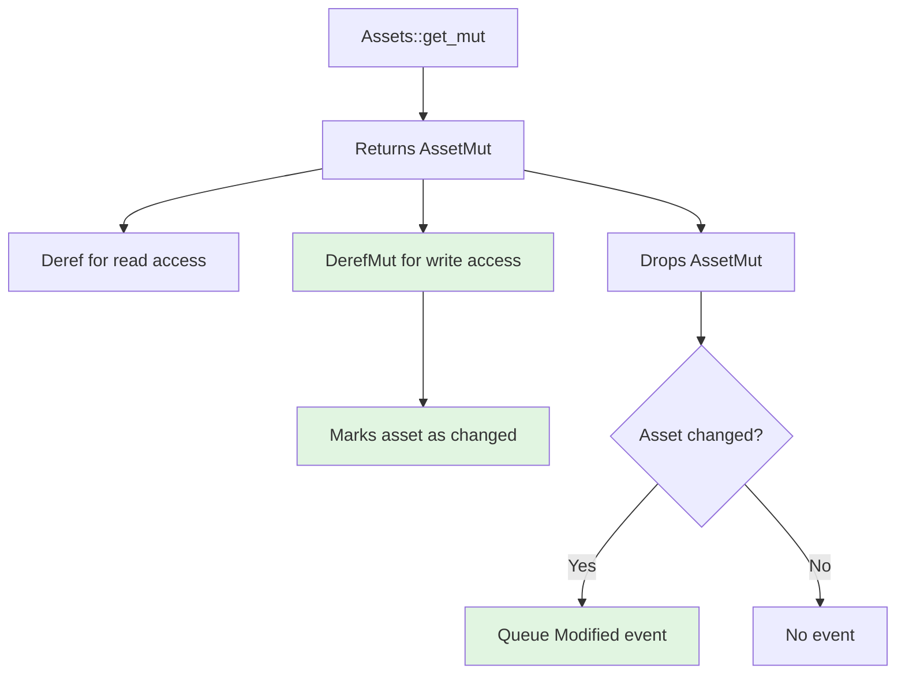

+++
title = "#22460 Add tools to avoid unnecessary `AssetEvent::Modified` events that lead to rendering performance costs (#16751)"
date = "2026-02-10T00:00:00"
draft = false
template = "pull_request_page.html"
in_search_index = true

[taxonomies]
list_display = ["show"]

[extra]
current_language = "en"
available_languages = {"en" = { name = "English", url = "/pull_request/bevy/2026-02/pr-22460-en-20260210" }, "zh-cn" = { name = "中文", url = "/pull_request/bevy/2026-02/pr-22460-zh-cn-20260210" }}
labels = ["C-Feature", "A-Assets", "C-Performance", "M-Migration-Guide", "D-Modest"]
+++

# Title

## Basic Information
- **Title**: Add tools to avoid unnecessary `AssetEvent::Modified` events that lead to rendering performance costs (#16751)
- **PR Link**: https://github.com/bevyengine/bevy/pull/22460
- **Author**: MatrixDev
- **Status**: MERGED
- **Labels**: C-Feature, A-Assets, C-Performance, S-Ready-For-Final-Review, M-Migration-Guide, D-Modest
- **Created**: 2026-01-09T17:39:56Z
- **Merged**: 2026-02-10T19:08:38Z
- **Merged By**: alice-i-cecile

## Description Translation

# Objective

- Fixes #16751

## Solution

- `Assets::get_mut` now returns a wrapper `AssetMut` type instead of `&mut impl Asset`.
- `AssetMut` implements `Deref` and `DerefMut`.
- `DerefMut` marks assets as changed.
- when dropped `AssetMut` will add `AssetEvent::Modified` event to a queue only in case asset was marked as changed.

## Testing

- Did you test these changes? If so, how?
  - No unit tests were added, change is pretty straightforward.
  - Test project: https://github.com/MatrixDev/bevy-feature-16751-test.
    - With change: ~100 fps.
    - Without change: ~15 fps.
- Are there any parts that need more testing?
  - I don't really see how this can break anything or add a measurable overhead.
  - `AssetEvent::Modified` will now be sent after the asset was modified instead of before. It should not affect anything but still worth noting.
- How can other people (reviewers) test your changes? Is there anything specific they need to know?
  - Have a big amount of entities that constantly update their materials.
  - Properties of those materials should be animated in a stepped maned (like changing color every 0.1 seconds).
  - Update material only if value has actually changed:
```rust
if material.base_color != new_color {
    material.base_color = new_color;
}
```
- If relevant, what platforms did you test these changes on, and are there any important ones you can't test?
  - tested on macos (Mackbook M1)
  - not a platform-specific issue

PS: This is my first PR, so please don't judge.

## The Story of This Pull Request

This PR addresses a performance problem in Bevy's asset system where unnecessary `AssetEvent::Modified` events were being generated even when assets weren't actually modified. This issue (#16751) manifested as significant rendering performance degradation in applications that frequently checked assets for updates.

The root cause was straightforward: the `Assets::get_mut` method would immediately queue a `Modified` event whenever called, regardless of whether the returned mutable reference was actually used to modify the asset. This design worked correctly for ensuring changes were detected, but was inefficient for common patterns where developers check if an asset needs updating before modifying it.

For example, consider a common pattern in game development:
```rust
// This pattern was problematic before the PR
let mut material = materials.get_mut(material_handle).unwrap();
if material.base_color != new_color {
    material.base_color = new_color;
}
```

Even when `material.base_color == new_color` and no actual modification occurred, the original implementation would still trigger a `Modified` event. In rendering pipelines, these events often trigger expensive operations like material extraction and GPU resource updates, leading to the performance issues reported in the original issue.

The solution implements a change detection mechanism similar to Bevy's ECS `Mut<T>` wrapper. The key insight is to defer the `Modified` event emission until we know whether the asset was actually mutated. This is achieved through a new `AssetMut` wrapper type that tracks whether dereferencing operations modify the underlying asset.

The implementation has three main components:

1. **`AssetMut` wrapper type**: This replaces the direct `&mut A` return type from `Assets::get_mut`. It contains both a reference to the asset and a change notification guard.

2. **Change tracking through `DerefMut`**: The `AssetMut` type implements `Deref` for read-only access and `DerefMut` for mutable access. Crucially, `DerefMut::deref_mut` marks the asset as changed when called.

3. **Conditional event emission on drop**: The change notification guard (`AssetMutChangeNotifier`) tracks whether the asset was marked as changed. When the `AssetMut` is dropped, it only emits a `Modified` event if the asset was actually modified.

This approach provides several benefits:
- **Performance improvement**: Eliminates unnecessary rendering work when assets are checked but not modified
- **Backwards compatibility**: The `Deref`/`DerefMut` implementation means most existing code continues to work with minimal changes
- **Explicit control**: Developers can use `into_inner_untracked()` or `bypass_change_detection()` for advanced use cases

One important technical detail is the timing of event emission. Previously, `Modified` events were queued immediately when `get_mut` was called. Now, events are queued when the `AssetMut` is dropped, which happens after any modifications. This change in timing shouldn't affect most systems but is worth noting for edge cases.

The implementation required updates throughout the codebase because `Assets::get_mut` now returns `Option<AssetMut<'_, A>>` instead of `Option<&mut A>`. Most updates were straightforward - adding `mut` to pattern bindings to accommodate the `DerefMut` implementation:

```rust
// Before:
let material = materials.get_mut(material_handle).unwrap();

// After:
let mut material = materials.get_mut(material_handle).unwrap();
```

This change enables more efficient asset update patterns. Developers can now write code that checks if an asset needs updating without paying the performance penalty of unnecessary re-extraction:

```rust
// Now efficient with the PR changes
let mut material = materials.get_mut(material_handle).unwrap();
if material.base_color != new_color {
    // Only triggers Modified event if this line executes
    material.base_color = new_color;
}
```

The performance impact is significant. The author's test project showed frame rates improving from ~15 FPS to ~100 FPS in a scenario with many entities checking and conditionally updating materials. This demonstrates how small, targeted changes to core systems can have substantial performance benefits.

## Visual Representation



## Key Files Changed

### `crates/bevy_asset/src/assets.rs` (+142/-7)
This is the core implementation file where the `AssetMut` type and related change detection logic are added.

**Key changes:**
1. Modified `get_mut` to return `AssetMut<'_, A>` instead of `Option<&mut A>`
2. Added `AssetMut` struct with `Deref` and `DerefMut` implementations
3. Added `AssetMutChangeNotifier` to track changes and conditionally emit events

**Code snippets:**
```rust
// Before:
pub fn get_mut(&mut self, id: impl Into<AssetId<A>>) -> Option<&mut A> {
    let id: AssetId<A> = id.into();
    let result = match id {
        AssetId::Index { index, .. } => self.dense_storage.get_mut(index),
        AssetId::Uuid { uuid } => self.hash_map.get_mut(&uuid),
    };
    if result.is_some() {
        self.queued_events.push(AssetEvent::Modified { id });
    }
    result
}

// After:
pub fn get_mut(&mut self, id: impl Into<AssetId<A>>) -> Option<AssetMut<'_, A>> {
    let id: AssetId<A> = id.into();
    let result = match id {
        AssetId::Index { index, .. } => self.dense_storage.get_mut(index),
        AssetId::Uuid { uuid } => self.hash_map.get_mut(&uuid),
    };
    Some(AssetMut {
        asset: result?,
        guard: AssetMutChangeNotifier {
            changed: false,
            asset_id: id,
            queued_events: &mut self.queued_events,
        },
    })
}
```

```rust
// New AssetMut type implementation:
impl<'a, A: Asset> DerefMut for AssetMut<'a, A> {
    fn deref_mut(&mut self) -> &mut Self::Target {
        self.guard.changed = true;  // Mark as changed when mutable access occurs
        self.asset
    }
}

// Change notifier that conditionally emits events on drop:
impl<'a, A: Asset> Drop for AssetMutChangeNotifier<'a, A> {
    fn drop(&mut self) {
        if self.changed {
            self.queued_events
                .push(AssetEvent::Modified { id: self.asset_id });
        }
    }
}
```

### `release-content/migration-guides/asset-mut-change-detection.md` (+34/-0)
A new migration guide explaining the change and how to update code to take advantage of the new behavior.

**Content:**
```markdown
`Assets::get_mut` will now return `AssetMut<A: Asset>` instead of `&mut Asset`.
Similar to `Mut`/`ResMut`, new implementation will trigger `AssetEvent::Modified`
event only when the asset is actually mutated.

In some cases (like materials), triggering `AssetEvent::Modified` event might lead to
measurable performance costs. To avoid this, it is now possible to check if the `Asset`
will change before mutating it:
```

### `crates/bevy_text/src/font_atlas.rs` (+7/-6)
Updated to work with the new `AssetMut` API, demonstrating the pattern for handling multiple mutable asset references.

**Code snippet:**
```rust
// Before:
let atlas_layout = atlas_layouts.get_mut(&self.texture_atlas);
let atlas_texture = textures.get_mut(&self.texture);

// After:
let mut atlas_layout = atlas_layouts.get_mut(&self.texture_atlas);
let mut atlas_texture = textures.get_mut(&self.texture);
```

### `examples/3d/solari.rs` (+5/-5)
A representative example showing the minimal code changes required throughout the codebase.

**Code snippet:**
```rust
// Before:
let material = materials.get_mut(material_handle).unwrap();

// After:
let mut material = materials.get_mut(material_handle).unwrap();
```

### `examples/large_scenes/mipmap_generator/src/lib.rs` (+3/-3)
Shows how to handle cases where you need to pass the inner asset reference to functions.

**Code snippet:**
```rust
// Before:
if check_image_compatible(image).is_ok()

// After:
if check_image_compatible(&image).is_ok()
```

## Further Reading

1. **Bevy Change Detection**: The pattern used here is similar to Bevy's ECS change detection with `Mut<T>` and `ResMut<T>` types. Understanding how Bevy handles change detection in general will help contextualize this change.

2. **Rust's Deref and DerefMut traits**: This implementation relies heavily on Rust's `Deref` and `DerefMut` traits for ergonomic access to wrapped types. The Rust documentation on these traits provides important background.

3. **RAII (Resource Acquisition Is Initialization) Pattern**: The use of `Drop` implementation to conditionally emit events is an example of the RAII pattern, common in Rust for managing resources and side effects.

4. **Performance Optimization in Game Engines**: This PR demonstrates a common optimization pattern in game engines - avoiding unnecessary work by carefully tracking what actually changed rather than assuming everything accessed might have changed.