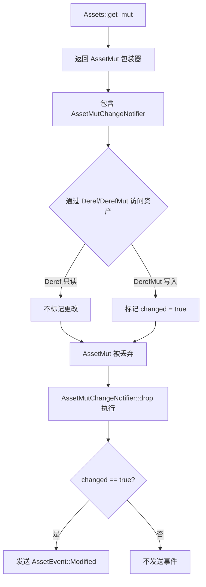

+++
title = "#22460 Add tools to avoid unnecessary `AssetEvent::Modified` events that lead to rendering performance costs (#16751)"
date = "2026-02-10T00:00:00"
draft = false
template = "pull_request_page.html"
in_search_index = false

[extra]
current_language = "zh-cn"
available_languages = {"en" = { name = "English", url = "/pull_request/bevy/2026-02/pr-22460-en-20260210" }, "zh-cn" = { name = "中文", url = "/pull_request/bevy/2026-02/pr-22460-zh-cn-20260210" }}
labels = ["C-Feature", "A-Assets", "C-Performance", "M-Migration-Guide", "D-Modest"]
+++

# Title

## Basic Information
- **Title**: Add tools to avoid unnecessary `AssetEvent::Modified` events that lead to rendering performance costs (#16751)
- **PR Link**: https://github.com/bevyengine/bevy/pull/22460
- **Author**: MatrixDev
- **Status**: MERGED
- **Labels**: C-Feature, A-Assets, C-Performance, S-Ready-For-Final-Review, M-Migration-Guide, D-Modest
- **Created**: 2026-01-09T17:39:56Z
- **Merged**: 2026-02-10T19:08:38Z
- **Merged By**: alice-i-cecile

## Description Translation
**目标**

- 修复 #16751

**解决方案**

- `Assets::get_mut` 现在返回一个包装器类型 `AssetMut`，而不是 `&mut impl Asset`。
- `AssetMut` 实现了 `Deref` 和 `DerefMut`。
- `DerefMut` 将资产标记为已更改。
- 当 `AssetMut` 被丢弃时，仅当资产被标记为已更改时，才会将 `AssetEvent::Modified` 事件添加到队列中。

**测试**

- 你测试过这些更改吗？如果是，如何测试的？
  - 没有添加单元测试，更改非常直接。
  - 测试项目：https://github.com/MatrixDev/bevy-feature-16751-test。
    - 使用更改：约 100 fps。
    - 未使用更改：约 15 fps。
- 是否有任何部分需要更多测试？
  - 我不认为这会破坏任何功能或增加明显的开销。
  - `AssetEvent::Modified` 现在将在资产被修改之后发送，而不是之前。这应该不会影响任何功能，但仍然值得注意。
- 其他人（审阅者）如何测试你的更改？他们需要了解什么具体事项吗？
  - 拥有大量实体，这些实体不断更新其材质。
  - 这些材质的属性应以阶梯方式（例如每 0.1 秒更改一次颜色）进行动画处理。
  - 仅在值实际更改时更新材质：
```rust
if material.base_color != new_color {
    material.base_color = new_color;
}
```
- 如果相关，你在哪些平台上测试了这些更改，是否有无法测试的重要平台？
  - 在 macOS (Macbook M1) 上测试过
  - 不是平台特定的问题

PS：这是我的第一个 PR，请不要评判得太严格。

## The Story of This Pull Request

### 问题与背景
在 Bevy 中，资产系统是引擎的核心部分，它管理着纹理、材质、网格等资源。当资产被修改时，系统需要触发 `AssetEvent::Modified` 事件，以便下游系统（如渲染器）能够知道需要更新其内部状态。问题在于，在 PR #22460 被合并之前，`Assets::get_mut` 方法的设计存在一个关键的性能缺陷：**无论资产是否真的被修改，调用该方法都会立即触发 `AssetEvent::Modified` 事件。**

考虑一个常见场景：一个系统需要检查材质的颜色是否已经改变，只有在实际发生变化时才更新它。开发者可能会这样写代码：
```rust
let mut material = materials.get_mut(handle).unwrap();
if material.base_color != new_color {
    material.base_color = new_color;
}
```
在旧实现中，即使 `if` 条件为 `false` 且 `base_color` 未被修改，`get_mut` 的调用本身也会触发一个 `Modified` 事件。这个不必要的事件会导致一系列昂贵的操作：
1. 材质提取系统被唤醒并重新处理该材质。
2. GPU 资源可能被重新分配或更新。
3. 对于大量实体和频繁检查的情况，这会引发严重的性能问题。

问题 #16751 指出了这一点，特别是在材质属性以阶梯方式（step-wise）动画化时，性能影响非常显著。作者的测试项目显示，在没有修复的情况下帧率降至约 15 FPS，而修复后达到约 100 FPS，这证实了性能开销是真实且巨大的。

### 解决方案思路
为了解决这个问题，PR 引入了一个核心思路：**将“获取可变引用”与“标记为已修改”这两个操作解耦**。资产的修改检测应该更加精确，只有当开发者实际通过可变引用写入资产时才触发事件。

这借鉴了 Bevy ECS 系统中 `ResMut` 和 `Mut` 包装器的模式，它们也使用了类似的变化检测机制。解决方案是创建一个新的包装器类型 `AssetMut`，它封装了对资产的可变引用，并负责跟踪该引用是否被用于实际的写操作。

### 具体实现
实现的核心是在 `crates/bevy_asset/src/assets.rs` 文件中。主要改动包括：

1. **修改 `Assets::get_mut` 的签名和实现**：
   ```rust
   // 之前：
   pub fn get_mut(&mut self, id: impl Into<AssetId<A>>) -> Option<&mut A>
   
   // 之后：
   pub fn get_mut(&mut self, id: impl Into<AssetId<A>>) -> Option<AssetMut<'_, A>>
   ```
   方法不再直接返回 `&mut A`，而是返回一个 `AssetMut<'_, A>` 结构体。

2. **引入 `AssetMut` 包装器**：
   ```rust
   pub struct AssetMut<'a, A: Asset> {
       asset: &'a mut A,
       guard: AssetMutChangeNotifier<'a, A>,
   }
   ```
   `AssetMut` 包含了对资产的实际引用（`asset`）和一个负责变化检测的“守卫”（`guard`）。

3. **通过 `Deref` 和 `DerefMut` 实现透明访问**：
   `AssetMut` 实现了 `Deref` 和 `DerefMut` trait。这是整个设计的巧妙之处：
   - `Deref`（不可变解引用）允许只读访问资产，而**不会**将其标记为已更改。
   - `DerefMut`（可变解引用）在调用时，会通过守卫将资产标记为已更改。
   ```rust
   impl<'a, A: Asset> DerefMut for AssetMut<'a, A> {
       fn deref_mut(&mut self) -> &mut Self::Target {
           self.guard.changed = true; // 关键行：标记为已更改
           self.asset
       }
   }
   ```

4. **引入 `AssetMutChangeNotifier` 守卫**：
   这个结构体负责跟踪更改状态，并在被丢弃时决定是否发送事件。
   ```rust
   struct AssetMutChangeNotifier<'a, A: Asset> {
       changed: bool, // 跟踪是否发生了更改
       asset_id: AssetId<A>,
       queued_events: &'a mut Vec<AssetEvent<A>>,
   }
   
   impl<'a, A: Asset> Drop for AssetMutChangeNotifier<'a, A> {
       fn drop(&mut self) {
           if self.changed {
               self.queued_events
                   .push(AssetEvent::Modified { id: self.asset_id });
           }
       }
   }
   ```
   守卫的 `Drop` 实现确保了事件发送的延迟性：事件仅在 `AssetMut` 生命周期结束且资产被标记为已更改时被推入队列。这也解决了 PR 描述中提到的一个细微变化：`Modified` 事件现在在资产修改后发送，而不是之前，但这在逻辑上更合理，不太可能引发问题。

5. **提供显式控制方法**：
   `AssetMut` 还提供了几个方法，让开发者可以更精细地控制行为：
   - `into_inner()`: 将资产标记为已更改并返回可变引用。
   - `into_inner_untracked()`: 返回可变引用但不标记为已更改。
   - `bypass_change_detection()`: 一个风险较高的“逃生舱口”，允许直接访问内部引用而不触发任何更改检测，用于需要避免无限递归等特殊情况。

### 技术洞察与影响
这个实现展示了几个有价值的技术模式：

1. **利用 Rust 的所有权系统进行资源跟踪**：通过将跟踪状态（`changed: bool`）放在一个具有 `Drop` 实现的结构体中，确保了状态管理与生命周期绑定，避免了资源泄漏或忘记发送事件的情况。

2. **非侵入式 API 设计**：对于现有代码，主要的迁移成本是将 `let mut material = materials.get_mut(...)` 中的变量声明改为 `mut`。对于只读检查后可能不写的情况，代码可以保持原样并获得性能收益。这种设计平衡了兼容性和优化收益。

3. **性能影响**：对于“检查后可能不修改”的模式，优化效果最明显。如果代码总是会修改资产，那么性能开销与之前类似（仍需标记和发送事件）。但许多实际场景（如条件更新、动画插值）都从这一优化中受益。

4. **对下游系统的影响**：该 PR 修改了 Bevy 代码库中大量调用 `get_mut` 的示例和内部代码，展示了变化的广泛性。更新主要是添加 `mut` 关键字或使用新的 `into_inner()` 方法。例如，在反射系统中：
   ```rust
   // 之前：
   asset.map(|asset| asset as &mut dyn Reflect)
   // 之后：
   asset.map(|asset| asset.into_inner() as &mut dyn Reflect)
   ```

### 总结
PR #22460 通过引入 `AssetMut` 包装器，巧妙地解决了资产系统中不必要的修改事件导致的性能瓶颈。它将变化检测的粒度从“获取可变引用时”细化到“实际写入时”，这对于频繁条件更新资产的场景（如 UI、动画）带来了显著的性能提升。这是一个典型的“零成本抽象”案例：在不需要时避免了开销，同时在需要时保留了完整功能。实现利用了 Rust 的类型系统和所有权模型，提供了安全且高效的解决方案。

## Visual Representation



## Key Files Changed

### 1. `crates/bevy_asset/src/assets.rs` (+142/-7)
这是实现变化检测逻辑的核心文件。主要更改包括：
- 引入了 `AssetMut` 和 `AssetMutChangeNotifier` 两个新结构体。
- 修改了 `get_mut` 和 `get_or_insert_mut` 方法的返回类型。
- 添加了相应的 `Deref`、`DerefMut` 和 `Drop` 实现。
- 新增了单元测试 `assets_mut_change_detection` 来验证行为。

**关键代码片段：**
```rust
// 新的 get_mut 实现
pub fn get_mut(&mut self, id: impl Into<AssetId<A>>) -> Option<AssetMut<'_, A>> {
    let id: AssetId<A> = id.into();
    let result = match id {
        AssetId::Index { index, .. } => self.dense_storage.get_mut(index),
        AssetId::Uuid { uuid } => self.hash_map.get_mut(&uuid),
    };
    Some(AssetMut {
        asset: result?,
        guard: AssetMutChangeNotifier {
            changed: false,
            asset_id: id,
            queued_events: &mut self.queued_events,
        },
    })
}

// DerefMut 实现 - 触发更改标记的关键
impl<'a, A: Asset> DerefMut for AssetMut<'a, A> {
    fn deref_mut(&mut self) -> &mut Self::Target {
        self.guard.changed = true;
        self.asset
    }
}
```

### 2. `release-content/migration-guides/asset-mut-change-detection.md` (+34/-0)
这是一个新增的迁移指南，解释了 API 变更以及如何利用新特性优化代码。

**关键内容：**
```markdown
`Assets::get_mut` will now return `AssetMut<A: Asset>` instead of `&mut Asset`.
Similar to `Mut`/`ResMut`, new implementation will trigger `AssetEvent::Modified`
event only when the asset is actually mutated.

In some cases (like materials), triggering `AssetEvent::Modified` event might lead to
measurable performance costs. To avoid this, it is now possible to check if the `Asset`
will change before mutating it:
```
指南提供了示例代码，展示了如何通过条件检查来避免不必要的修改事件。

### 3. `crates/bevy_text/src/font_atlas.rs` (+7/-6)
这个文件展示了如何适配新的 API。主要变化是将链式调用拆开，以便正确处理 `AssetMut`。

**代码片段：**
```rust
// 之前（假设的，实际是链式调用）：
let atlas_layout = atlas_layouts.get_mut(...)?;
let atlas_texture = textures.get_mut(...)?;
builder.add_texture(atlas_layout, texture, atlas_texture)

// 之后：
let mut atlas_layout = atlas_layouts.get_mut(...)?;
let mut atlas_texture = textures.get_mut(...)?;
builder.add_texture(&mut atlas_layout, texture, &mut atlas_texture)
```
注意 `&mut atlas_layout` 和 `&mut atlas_texture` 的传递，这是因为 `get_mut` 现在返回的是 `AssetMut`，而方法需要 `&mut` 引用。

### 4. `examples/3d/solari.rs` (+5/-5) 和 `examples/large_scenes/mipmap_generator/src/lib.rs` (+3/-3)
这些是众多被更新的示例文件中的两个，代表了整个代码库中需要的适配性更改。更改模式非常一致：在变量声明中添加 `mut` 关键字。

**典型模式：**
```rust
// 之前：
let material = materials.get_mut(material_handle).unwrap();

// 之后：
let mut material = materials.get_mut(material_handle).unwrap();
// 或者，如果后续没有可变访问：
let material = materials.get_mut(material_handle).unwrap();
```
这种广泛的更新表明，虽然 API 发生了变化，但迁移成本相对较低，主要是在编译器的帮助下添加 `mut` 关键字。

## Further Reading

1. **Bevy ECS Change Detection**: 了解 `ResMut` 和 `Mut` 包装器如何实现类似的变化检测机制，可以帮助深入理解本 PR 的设计模式。
   - [Bevy Cheatbook - Change Detection](https://bevy-cheatbook.github.io/programming/change-detection.html)

2. **Rust Deref and DerefMut Traits**: 理解这些 trait 如何工作，是理解 `AssetMut` 透明访问机制的关键。
   - [Rust Book - The Deref Trait](https://doc.rust-lang.org/book/ch15-02-deref.html)

3. **零成本抽象（Zero-Cost Abstractions）**: 本 PR 是一个很好的案例，展示了如何在 Rust 中通过类型系统提供高级抽象，而不带来运行时开销。
   - [Rust Blog - What are zero-cost abstractions?](https://blog.rust-lang.org/2015/05/11/traits.html)

4. **Resource Management with Drop Guards**: `AssetMutChangeNotifier` 是一个典型的“守卫”（Guard）模式，利用 `Drop` trait 进行资源清理。这是一种常见的 RAII（Resource Acquisition Is Initialization）模式。
   - [Rust RAII](https://doc.rust-lang.org/rust-by-example/scope/raii.html)