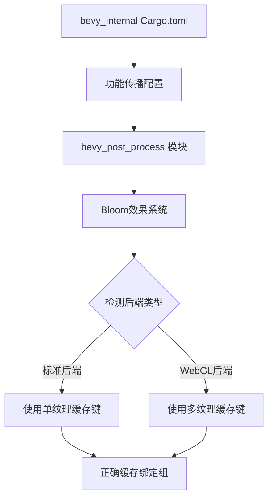

+++
title = "#22542 Fix feature gating in `bevy_post_process`"
date = "2026-02-17T00:00:00"
draft = false
template = "pull_request_page.html"
in_search_index = false

[extra]
current_language = "zh-cn"
available_languages = {"en" = { name = "English", url = "/pull_request/bevy/2026-02/pr-22542-en-20260217" }, "zh-cn" = { name = "中文", url = "/pull_request/bevy/2026-02/pr-22542-zh-cn-20260217" }}
labels = ["C-Bug", "A-Rendering", "D-Straightforward"]
+++

# Fix feature gating in `bevy_post_process`

## Basic Information
- **Title**: Fix feature gating in `bevy_post_process`
- **PR Link**: https://github.com/bevyengine/bevy/pull/22542
- **Author**: beicause
- **Status**: MERGED
- **Labels**: C-Bug, A-Rendering, S-Ready-For-Final-Review, D-Straightforward
- **Created**: 2026-01-16T08:06:03Z
- **Merged**: 2026-02-17T17:23:27Z
- **Merged By**: alice-i-cecile

## Description Translation
`bevy_post_process`中的功能从未被启用。~实际上，带有mipmaps的Bloom纹理在WebGL2上正常工作~

## The Story of This Pull Request

这个PR解决了一个功能配置（feature gating）问题。Bevy引擎的`bevy_post_process`模块提供了后期处理效果，但在某些配置下，它的功能并未正确启用。具体来说，当使用特定后端（特别是WebGL）时，引擎未能正确识别和启用相关功能，导致功能失效或行为异常。

问题的核心在于Cargo.toml中的功能传播和条件编译逻辑。`bevy_post_process`模块需要根据不同的渲染后端（WebGL、WebGPU等）启用不同的功能，但这些功能依赖关系在父模块的配置中没有正确声明。

首先，在`bevy_internal/Cargo.toml`中，作者添加了对`bevy_post_process`功能的依赖传播。这确保了当主程序启用某个功能时，这个功能也会传递到`bevy_post_process`模块：

```toml
# 添加了三个功能传播：
trace = [
  # ... 现有配置 ...
  "bevy_post_process?/trace",  # 新增
]

webgl = [
  # ... 现有配置 ...
  "bevy_post_process?/webgl",  # 新增
]

webgpu = [
  # ... 现有配置 ...
  "bevy_post_process?/webgpu",  # 新增
]
```

第二个问题出现在Bloom效果的具体实现中。`BloomBindGroups`结构体用于缓存Bloom效果的GPU绑定组。在不同后端上，缓存键的类型需要不同：

- 对于大多数后端（非WebGL，或不是wasm32架构，或启用了WebGPU），缓存键是简单的`(TextureId, BufferId)`元组
- 对于WebGL后端（wasm32架构且未启用WebGPU），需要支持多个纹理ID，因此缓存键是`(Vec<TextureId>, BufferId)`

原始代码没有正确处理这种差异。作者通过添加条件编译来解决这个问题：

```rust
// 修改前：只支持单一纹理ID
#[derive(Component)]
pub struct BloomBindGroups {
    cache_key: (TextureId, BufferId),  // 问题：不适用于WebGL
    // ... 其他字段
}

// 修改后：根据后端条件选择缓存键类型
#[derive(Component)]
pub struct BloomBindGroups {
    #[cfg(any(
        not(feature = "webgl"),
        not(target_arch = "wasm32"),
        feature = "webgpu"
    ))]
    cache_key: (TextureId, BufferId),  // 标准后端
    
    #[cfg(all(feature = "webgl", target_arch = "wasm32", not(feature = "webgpu")))]
    cache_key: (Vec<TextureId>, BufferId),  // WebGL后端
    
    // ... 其他字段保持不变
}
```

在`prepare_bloom_bind_groups`函数中，相应的缓存键创建逻辑也被更新。现在代码会根据当前配置创建正确的缓存键类型：

```rust
// 修改前：硬编码的单纹理ID
let cache_key = (
    bloom_texture.texture.texture.id(),
    uniforms.buffer().unwrap().id(),
);

// 修改后：条件编译创建不同类型的缓存键
#[cfg(any(
    not(feature = "webgl"),
    not(target_arch = "wasm32"),
    feature = "webgpu"
))]
let cache_key = (
    bloom_texture.texture.texture.id(),
    uniforms.buffer().unwrap().id(),
);

#[cfg(all(feature = "webgl", target_arch = "wasm32", not(feature = "webgpu")))]
let cache_key = (
    bloom_texture
        .texture
        .iter()  // WebGL需要遍历多个纹理
        .map(|tex| tex.texture.id())
        .collect(),  // 收集为Vec<TextureId>
    uniforms.buffer().unwrap().id(),
);
```

这个解决方案体现了Rust条件编译的强大功能。通过`#[cfg(...)]`属性，代码可以根据编译时的条件选择不同的实现路径。这种模式在跨平台图形渲染代码中很常见，因为不同图形API（OpenGL/WebGL/Vulkan/Metal）有不同的特性和限制。

从技术角度看，这个PR解决了两个层次的问题：
1. **构建系统层面**：确保功能标志正确传播到依赖模块
2. **运行时层面**：为不同后端提供适当的数据结构和算法

值得注意的是，WebGL后端需要处理多个单独的纹理而不是单个带有mipmaps的纹理，这是因为WebGL 2.0对纹理mipmap处理的一些限制。这种架构差异需要在缓存系统中反映出来。

这个修复虽然看起来是小改动，但对保证跨平台渲染一致性很重要。没有这些修改，`bevy_post_process`模块在某些配置下可能完全无法工作，或者性能低下（因为无法正确缓存绑定组）。

## Visual Representation



## Key Files Changed

### 1. `crates/bevy_internal/Cargo.toml`
这个文件修改了功能标志的传播配置，确保`bevy_post_process`模块的功能正确启用。

**关键修改：**
```toml
# 修改后（添加了bevy_post_process的依赖）：
trace = [
  "bevy_pbr?/trace",
  "bevy_render?/trace",
  "bevy_winit?/trace",
  "bevy_post_process?/trace",  # 新增
]

webgl = [
  "bevy_gizmos_render?/webgl",
  "bevy_sprite_render?/webgl",
  "bevy_dev_tools?/webgl",
  "bevy_post_process?/webgl",  # 新增
  "bevy_feathers?/webgl",
]

webgpu = [
  "bevy_gizmos_render?/webgpu",
  "bevy_sprite_render?/webgpu",
  "bevy_dev_tools?/webgpu",
  "bevy_post_process?/webgpu",  # 新增
  "bevy_feathers?/webgpu",
]
```

### 2. `crates/bevy_post_process/src/bloom/mod.rs`
这个文件修改了Bloom绑定组的缓存系统，支持不同后端的缓存键类型。

**关键修改：**
```rust
// 修改前：
pub struct BloomBindGroups {
    cache_key: (TextureId, BufferId),
    // ...
}

// 修改后：
pub struct BloomBindGroups {
    #[cfg(any(
        not(feature = "webgl"),
        not(target_arch = "wasm32"),
        feature = "webgpu"
    ))]
    cache_key: (TextureId, BufferId),
    #[cfg(all(feature = "webgl", target_arch = "wasm32", not(feature = "webgpu")))]
    cache_key: (Vec<TextureId>, BufferId),
    // ...
}

// 缓存键创建逻辑也相应修改
```

## Further Reading

1. [Rust条件编译文档](https://doc.rust-lang.org/reference/conditional-compilation.html) - 理解`#[cfg]`属性的使用
2. [Bevy引擎的渲染架构](https://bevyengine.org/learn/book/getting-started/architecture/) - 了解Bevy的ECS和渲染系统
3. [WebGL 2.0纹理限制](https://developer.mozilla.org/en-US/docs/Web/API/WebGL2RenderingContext/texImage2D) - 理解为什么WebGL需要不同的纹理处理方式
4. [Cargo功能标志指南](https://doc.rust-lang.org/cargo/reference/features.html) - 学习如何正确配置Cargo.toml中的功能依赖