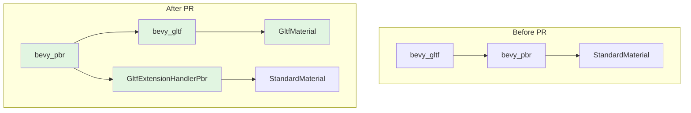

+++
title = "#22569 Invert `bevy_gltf` dependency with `bevy_pbr`"
date = "2026-02-06T00:00:00"
draft = false
template = "pull_request_page.html"
in_search_index = true

[taxonomies]
list_display = ["show"]

[extra]
current_language = "en"
available_languages = {"en" = { name = "English", url = "/pull_request/bevy/2026-02/pr-22569-en-20260206" }, "zh-cn" = { name = "中文", url = "/pull_request/bevy/2026-02/pr-22569-zh-cn-20260206" }}
labels = ["A-Rendering", "D-Modest"]
+++

# Title
## Basic Information
- **Title**: Invert `bevy_gltf` dependency with `bevy_pbr`
- **PR Link**: https://github.com/bevyengine/bevy/pull/22569
- **Author**: Zeophlite
- **Status**: MERGED
- **Labels**: A-Rendering, S-Ready-For-Final-Review, D-Modest
- **Created**: 2026-01-17T16:59:59Z
- **Merged**: 2026-02-06T20:11:17Z
- **Merged By**: alice-i-cecile

## Description Translation

# Objective

- `bevy_gltf` depends on `bevy_pbr` , with a tight coupling between the scene definition and the rendering of the scene.  This prevents artistic rendering of GLTFs.

## Solution

- `bevy_gltf` loads as a `GltfMaterial` , and `PbrPlugin` inserts an extension to translator to `StandardMaterial`
- Based on feedback from https://github.com/Zeophlite/bevy/pull/6 

## Testing

- `cargo run --example animated_mesh`

## The Story of This Pull Request

This PR addresses a fundamental architectural issue in Bevy's rendering pipeline: the tight coupling between glTF scene loading and PBR (Physically Based Rendering). Previously, `bevy_gltf` directly depended on `bevy_pbr`, which meant that loading a glTF file would always produce entities with `StandardMaterial` components. This coupling prevented alternative rendering approaches, such as using 2D materials, custom shaders, or non-PBR 3D rendering for glTF assets.

The core problem was that `bevy_gltf`'s loader was hardcoded to create `StandardMaterial` assets. This design choice limited flexibility because any glTF file loaded into Bevy would be forced through the PBR rendering pipeline, regardless of the user's needs. For example, developers wanting to render glTF models in 2D or with stylized materials had to work around this limitation.

The solution introduces a new abstraction layer: `GltfMaterial`. Instead of creating `StandardMaterial` assets directly, `bevy_gltf` now loads glTF material data into `GltfMaterial` assets, which serve as an intermediate representation. This decouples the scene definition (the glTF data) from the rendering implementation (PBR or otherwise).

The `PbrPlugin` can then register a `GltfExtensionHandler` that converts `GltfMaterial` to `StandardMaterial` at load time and attaches the necessary `MeshMaterial3d<StandardMaterial>` components to entities. This inversion of dependency means `bevy_gltf` no longer depends on `bevy_pbr` - instead, `bevy_pbr` depends on `bevy_gltf` and extends its functionality.

From an implementation perspective, this required several coordinated changes:

1. **New `GltfMaterial` asset type**: A struct in `bevy_gltf` that mirrors all the material properties from glTF files
2. **Updated loader logic**: The glTF loader now produces `GltfMaterial` assets instead of `StandardMaterial` assets
3. **Extension handler system**: `bevy_pbr` registers an extension that converts materials and adds rendering components
4. **Feature flag adjustments**: PBR-related feature flags are moved to `bevy_gltf` since they affect material loading
5. **Dependency inversion**: The Cargo.toml files are updated to reflect the new dependency direction

The `GltfMaterial` struct contains all the same fields as `StandardMaterial`, allowing for a straightforward conversion. When the PBR plugin is enabled with `gltf_render_enabled: true` (the default), it registers `GltfExtensionHandlerPbr` which performs this conversion during asset loading and adds the `MeshMaterial3d<StandardMaterial>` component to mesh entities.

This architectural change has several benefits. It allows `bevy_gltf` to function without any rendering stack, enabling use cases like asset processing tools or servers that need to parse glTF files without rendering them. It also makes the codebase more modular and follows the principle of separation of concerns - scene loading is separate from scene rendering.

The migration path for existing users is straightforward. By default, everything works as before because `PbrPlugin` enables the conversion extension. Users who want to disable PBR rendering for glTF files can set `gltf_render_enabled: false` on the `PbrPlugin`. Extension authors need to update their `GltfExtensionHandler` implementations to account for the new `material_label` parameter and the change from `StandardMaterial` to `GltfMaterial`.

## Visual Representation



## Key Files Changed

### `crates/bevy_gltf/src/material.rs` (+266/-0)
This new file defines the `GltfMaterial` struct, which serves as an intermediate representation for glTF material data. It contains all the properties needed for PBR rendering but doesn't depend on `bevy_pbr`.

```rust
// File: crates/bevy_gltf/src/material.rs
#[derive(Asset, Debug, Clone, TypePath)]
pub struct GltfMaterial {
    /// The color of the surface of the material before lighting.
    pub base_color: Color,
    /// The UV channel to use for the [`GltfMaterial::base_color_texture`].
    pub base_color_channel: UvChannel,
    /// The texture component of the material's color before lighting.
    pub base_color_texture: Option<Handle<Image>>,
    // ... (all other PBR material properties)
}
```

### `crates/bevy_pbr/src/lib.rs` (+108/-0)
The PbrPlugin now registers a `GltfExtensionHandlerPbr` that converts `GltfMaterial` to `StandardMaterial` and adds the necessary rendering components to entities.

```rust
// File: crates/bevy_pbr/src/lib.rs
impl Plugin for PbrPlugin {
    fn build(&self, app: &mut App) {
        // ... other setup code
        
        if self.gltf_render_enabled {
            app.world_mut()
                .resource_mut::<GltfExtensionHandlers>()
                .0
                .write_blocking()
                .push(Box::new(GltfExtensionHandlerPbr));
        }
        
        // ... rest of plugin setup
    }
}

#[derive(Default, Clone)]
struct GltfExtensionHandlerPbr;

impl GltfExtensionHandler for GltfExtensionHandlerPbr {
    fn on_material(
        &mut self,
        load_context: &mut LoadContext<'_>,
        _gltf_material: &gltf::Material,
        _material: Handle<GltfMaterial>,
        material_asset: &GltfMaterial,
        material_label: &str,
    ) {
        let std_label = format!("{:?}#std", material_label);
        let _t = load_context.labeled_asset_scope::<_, ()>(std_label, |_load_context| {
            Ok(standard_material_from_gltf_material(material_asset))
        });
    }
    
    fn on_spawn_mesh_and_material(
        &mut self,
        load_context: &mut LoadContext<'_>,
        _primitive: &gltf::Primitive,
        _mesh: &gltf::Mesh,
        _material: &gltf::Material,
        entity: &mut EntityWorldMut,
        material_label: &str,
    ) {
        let std_label = format!("{:?}#std", material_label);
        let handle = load_context.get_label_handle::<StandardMaterial>(std_label);
        entity.insert(MeshMaterial3d(handle));
    }
}
```

### `crates/bevy_gltf/src/loader/mod.rs` (+35/-32)
The loader now creates `GltfMaterial` assets instead of `StandardMaterial` assets and passes the material label to extension handlers.

```rust
// File: crates/bevy_gltf/src/loader/mod.rs
// Before:
// let (label, material) = load_material(...);
// load_context.add_labeled_asset(label, material);

// After:
let (label, gltf_material) = load_material(...);
let handle = load_context.add_labeled_asset(label.clone(), gltf_material.clone());

// Pass to extensions
for extension in extensions.iter_mut() {
    extension.on_material(
        load_context,
        &material,
        handle.clone(),
        &gltf_material,
        &label.clone(),
    );
}
```

### `crates/bevy_mesh/src/mesh.rs`
The `UvChannel` enum was moved from `bevy_pbr` to `bevy_mesh` since it's now used by `GltfMaterial` in `bevy_gltf`.

```rust
// File: crates/bevy_mesh/src/mesh.rs
/// An enum to define which UV attribute to use for a texture.
#[derive(Reflect, Default, Debug, Clone, PartialEq, Eq)]
#[reflect(Default, Debug, Clone, PartialEq)]
pub enum UvChannel {
    #[default]
    Uv0,
    Uv1,
}
```

### `examples/gltf/gltf_extension_mesh_2d.rs` (+21/-14)
This example demonstrates how to use the new architecture to render glTF meshes in 2D instead of with PBR. It shows how to disable PBR rendering and register a custom extension handler.

```rust
// File: examples/gltf/gltf_extension_mesh_2d.rs
// Disable PBR rendering for glTF
.set(PbrPlugin {
    gltf_render_enabled: false,
    ..Default::default()
})

// Custom extension handler converts 3D meshes to 2D
impl GltfExtensionHandler for GltfExtensionHandlerToMesh2d {
    fn on_spawn_mesh_and_material(
        &mut self,
        load_context: &mut LoadContext<'_>,
        _primitive: &gltf::Primitive,
        _mesh: &gltf::Mesh,
        _material: &gltf::Material,
        entity: &mut EntityWorldMut,
        _material_label: &str,
    ) {
        if let Some(mesh3d) = entity.get::<Mesh3d>() {
            // Convert to 2D mesh with custom material
            entity
                .remove::<Mesh3d>()
                .insert((Mesh2d(mesh_handle), MeshMaterial2d(material_handle.clone())));
        }
    }
}
```

### `release-content/migration-guides/gltf_pbr.md` (+22/-0)
This new migration guide explains the changes and how to update code.

## Further Reading

1. **glTF Specification**: https://github.com/KhronosGroup/glTF/tree/main/specification/2.0
2. **Bevy Asset System**: https://bevyengine.org/learn/book/assets/
3. **Extension Systems in Bevy**: https://bevyengine.org/learn/book/plugins/
4. **Physically Based Rendering Theory**: https://pbr-book.org/
5. **Dependency Inversion Principle**: https://en.wikipedia.org/wiki/Dependency_inversion_principle