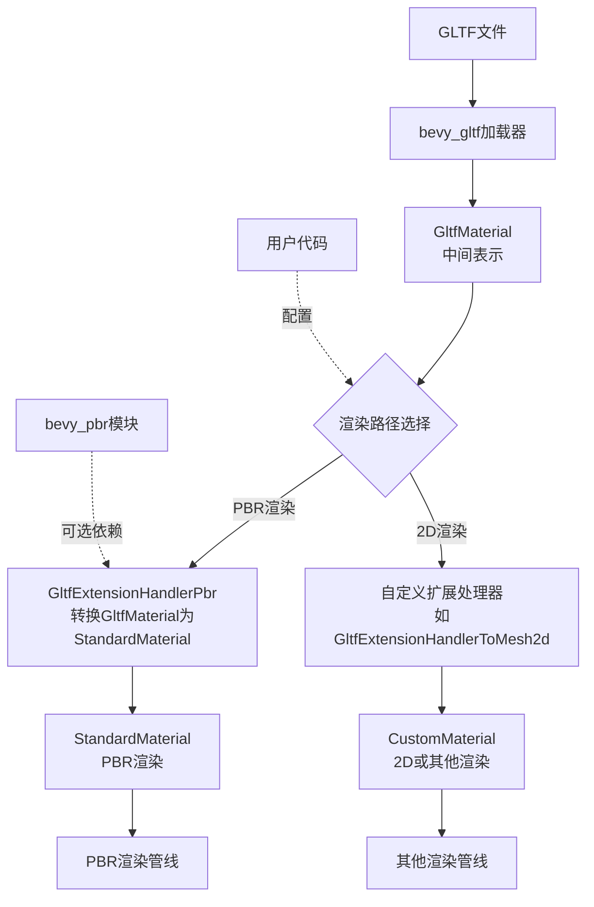

+++
title = "#22569 Invert `bevy_gltf` dependency with `bevy_pbr`"
date = "2026-02-06T00:00:00"
draft = false
template = "pull_request_page.html"
in_search_index = false

[extra]
current_language = "zh-cn"
available_languages = {"en" = { name = "English", url = "/pull_request/bevy/2026-02/pr-22569-en-20260206" }, "zh-cn" = { name = "中文", url = "/pull_request/bevy/2026-02/pr-22569-zh-cn-20260206" }}
labels = ["A-Rendering", "D-Modest"]
+++

# Title

## Basic Information
- **Title**: Invert `bevy_gltf` dependency with `bevy_pbr`
- **PR Link**: https://github.com/bevyengine/bevy/pull/22569
- **Author**: Zeophlite
- **Status**: MERGED
- **Labels**: A-Rendering, S-Ready-For-Final-Review, D-Modest
- **Created**: 2026-01-17T16:59:59Z
- **Merged**: 2026-02-06T20:11:17Z
- **Merged By**: alice-i-cecile

## Description Translation
目标：
- `bevy_gltf` 依赖 `bevy_pbr`，场景定义与场景渲染之间存在紧密耦合。这妨碍了GLTF的艺术渲染。

解决方案：
- `bevy_gltf` 加载为 `GltfMaterial`，而 `PbrPlugin` 插入一个扩展来转换为 `StandardMaterial`
- 基于 https://github.com/Zeophlite/bevy/pull/6 的反馈

测试：
- `cargo run --example animated_mesh`

## The Story of This Pull Request

这个PR的核心问题是`bevy_gltf`和`bevy_pbr`之间的紧耦合。在原始架构中，`bevy_gltf`直接依赖于`bevy_pbr`，这意味着加载GLTF文件总是产生PBR（基于物理的渲染）材质。这种设计限制了灵活性：如果你想用不同的渲染系统（如2D渲染或自定义着色器）来处理GLTF模型，就必须绕过或修改现有的PBR集成。

### 问题与上下文

`bevy_gltf`模块负责加载GLTF文件并将其转换为Bevy的资产格式。在修改前，它直接创建`StandardMaterial`实例（来自`bevy_pbr`）。这种依赖关系导致了几个问题：

1. **架构耦合**：`bevy_gltf`无法在没有PBR渲染系统的情况下使用
2. **功能限制**：用户不能轻松地使用替代渲染系统处理GLTF文件
3. **代码复用性差**：GLTF加载逻辑与特定渲染实现绑定

### 解决方案方法

PR作者采用了一种依赖反转的方法。关键思路是：
1. 创建`GltfMaterial`作为中间表示，包含所有GLTF材质数据但不绑定到特定渲染器
2. 将`UvChannel`枚举从`bevy_pbr`移动到`bevy_mesh`，使其成为共享类型
3. 通过扩展机制让`PbrPlugin`将`GltfMaterial`转换为`StandardMaterial`
4. 允许用户选择性地禁用PBR渲染

这种方法的优点是保持了向后兼容性：默认情况下，PBR渲染仍然工作，但用户现在可以选择使用不同的渲染路径。

### 实现细节

实现分为几个关键部分：

**1. 创建`GltfMaterial`结构体**
新的`GltfMaterial`结构体在`crates/bevy_gltf/src/material.rs`中定义，它镜像了`StandardMaterial`的字段但不包含渲染特定逻辑。这是一个纯粹的数据容器：

```rust
#[derive(Asset, Debug, Clone, TypePath)]
pub struct GltfMaterial {
    pub base_color: Color,
    pub base_color_channel: UvChannel,
    pub base_color_texture: Option<Handle<Image>>,
    // ... 其他字段
}
```

**2. 修改GLTF加载器**
加载器现在创建`GltfMaterial`实例而不是`StandardMaterial`。`load_material`函数的签名从返回`StandardMaterial`改为返回`GltfMaterial`：

```rust
fn load_material(
    material: &Material,
    textures: &[Handle<Image>],
    is_scale_inverted: bool,
    asset_path: AssetPath<'_>,
) -> (String, GltfMaterial) {  // 以前是StandardMaterial
    // 加载逻辑
}
```

**3. 添加PBR扩展处理程序**
在`bevy_pbr`中添加了`GltfExtensionHandlerPbr`，它在`on_material`方法中将`GltfMaterial`转换为`StandardMaterial`：

```rust
fn standard_material_from_gltf_material(material: &GltfMaterial) -> StandardMaterial {
    StandardMaterial {
        base_color: material.base_color,
        base_color_channel: material.base_color_channel.clone(),
        // ... 字段映射
        ..Default::default()
    }
}
```

**4. 更新扩展处理器接口**
`GltfExtensionHandler` trait现在接收更多参数，允许扩展访问`GltfMaterial`和材质标签：

```rust
fn on_material(
    &mut self,
    load_context: &mut LoadContext<'_>,
    gltf_material: &gltf::Material,
    material: Handle<GltfMaterial>,
    material_asset: &GltfMaterial,  // 新增
    material_label: &str,           // 新增
) { /* ... */ }
```

**5. 依赖关系反转**
在`Cargo.toml`文件中，`bevy_gltf`不再直接依赖`bevy_pbr`。相反，`bevy_pbr`现在可选地依赖`bevy_gltf`：

```toml
# bevy_gltf/Cargo.toml
# 移除了对bevy_pbr的直接依赖

# bevy_pbr/Cargo.toml
bevy_gltf = { path = "../bevy_gltf", version = "0.19.0-dev" }
```

### 技术洞察

**依赖管理策略**：这种模式展示了如何在游戏引擎中管理模块间依赖。通过引入中间表示和扩展系统，PR成功地解耦了数据加载和渲染逻辑。

**扩展系统的力量**：Bevy的扩展处理器系统在这里发挥了关键作用。它允许插件在加载过程中注入自定义逻辑，而不需要修改核心加载代码。

**条件编译支持**：PR维护了对各种PBR扩展功能（如各向异性、透射等）的条件编译支持。这些功能现在通过`bevy_gltf`的feature flag控制。

**向后兼容性**：通过默认启用`gltf_render_enabled`，现有代码无需修改即可继续工作。这是API演化的重要考虑。

### 影响

**架构改进**：解耦使得`bevy_gltf`可以独立于渲染系统使用，为2D渲染、自定义着色器和其他非PBR用例打开了可能性。

**示例更新**：提供的`gltf_extension_mesh_2d.rs`示例展示了如何禁用PBR渲染并将GLTF模型转换为2D渲染路径。

**迁移路径**：虽然大多数用户不会受到影响，但扩展作者需要更新他们的`GltfExtensionHandler`实现以适应新的方法签名。

**性能考虑**：引入额外的中间表示可能增加轻微的内存开销，但保持了零成本抽象的哲学：当PBR渲染被禁用时，不会创建不必要的`StandardMaterial`实例。

## Visual Representation



## Key Files Changed

### 1. `crates/bevy_gltf/src/material.rs` (+266/-0)
**说明**：新增文件，定义了`GltfMaterial`结构体，作为GLTF材质的中间表示。

**关键代码**：
```rust
#[derive(Asset, Debug, Clone, TypePath)]
pub struct GltfMaterial {
    pub base_color: Color,
    pub base_color_channel: UvChannel,
    pub base_color_texture: Option<Handle<Image>>,
    pub emissive: LinearRgba,
    // ... 所有StandardMaterial字段的对应版本
}
```

**与PR目的的关系**：这是解耦的核心，提供了不依赖`bevy_pbr`的材质数据容器。

### 2. `crates/bevy_pbr/src/lib.rs` (+108/-0)
**说明**：添加了`GltfExtensionHandlerPbr`扩展处理器，负责将`GltfMaterial`转换为`StandardMaterial`。

**关键代码**：
```rust
impl GltfExtensionHandler for GltfExtensionHandlerPbr {
    fn on_material(
        &mut self,
        load_context: &mut LoadContext<'_>,
        _gltf_material: &gltf::Material,
        _material: Handle<GltfMaterial>,
        material_asset: &GltfMaterial,
        material_label: &str,
    ) {
        let std_label = format!("{:?}#std", material_label);
        let _t = load_context.labeled_asset_scope::<_, ()>(std_label, |_load_context| {
            Ok(standard_material_from_gltf_material(material_asset))
        });
    }
}
```

**与PR目的的关系**：实现了向后兼容，允许PBR渲染系统继续工作。

### 3. `crates/bevy_gltf/src/loader/mod.rs` (+35/-32)
**说明**：修改GLTF加载器以使用`GltfMaterial`而不是`StandardMaterial`。

**关键代码变化**：
```rust
// 之前：
let (label, material) = load_material(...);
// material: StandardMaterial

// 之后：
let (label, gltf_material) = load_material(...);
// gltf_material: GltfMaterial
```

**与PR目的的关系**：更新加载逻辑以生成中间表示而非最终渲染材质。

### 4. `examples/gltf/gltf_extension_mesh_2d.rs` (+21/-14)
**说明**：更新示例以展示如何禁用PBR渲染并使用自定义2D渲染。

**关键代码**：
```rust
.set(PbrPlugin {
    gltf_render_enabled: false,  // 禁用PBR渲染
    ..Default::default()
})
```

**与PR目的的关系**：展示了新架构的实际应用，证明了GLTF可以用于非PBR渲染。

### 5. `crates/bevy_mesh/src/mesh.rs` (+19/-0)
**说明**：将`UvChannel`枚举从`bevy_pbr`移动到`bevy_mesh`。

**关键代码**：
```rust
#[derive(Reflect, Default, Debug, Clone, PartialEq, Eq)]
#[reflect(Default, Debug, Clone, PartialEq)]
pub enum UvChannel {
    #[default]
    Uv0,
    Uv1,
}
```

**与PR目的的关系**：使`UvChannel`成为共享类型，可被`GltfMaterial`和`StandardMaterial`共同使用。

## Further Reading

1. **Bevy插件系统文档**：了解Bevy如何通过插件和扩展处理器实现模块化架构
2. **GLTF 2.0规范**：理解GLTF材质和扩展的工作方式
3. **依赖反转原则**：深入理解这种架构模式的设计哲学
4. **Bevy的材质系统**：学习如何创建自定义材质和渲染器
5. **Rust的feature flags**：了解如何在Rust项目中管理可选依赖和条件编译

这些资源将帮助你更好地理解此PR中使用的技术和设计模式，并为在Bevy中实现自定义渲染系统提供基础。