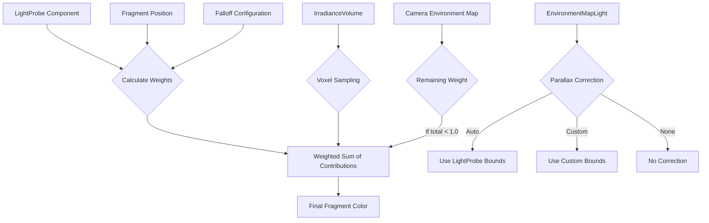

+++
title = "#22610 Implement gradual falloff and blending for light probes."
date = "2026-02-04T00:00:00"
draft = false
template = "pull_request_page.html"
in_search_index = false

[extra]
current_language = "zh-cn"
available_languages = {"en" = { name = "English", url = "/pull_request/bevy/2026-02/pr-22610-en-20260204" }, "zh-cn" = { name = "中文", url = "/pull_request/bevy/2026-02/pr-22610-zh-cn-20260204" }}
labels = ["A-Rendering", "D-Modest", "C-Refinement"]
+++

# Title

## Basic Information
- **Title**: Implement gradual falloff and blending for light probes.
- **PR Link**: https://github.com/bevyengine/bevy/pull/22610
- **Author**: pcwalton
- **Status**: MERGED
- **Labels**: A-Rendering, S-Ready-For-Final-Review, D-Modest, C-Refinement
- **Created**: 2026-01-20T21:40:34Z
- **Merged**: 2026-02-04T00:51:13Z
- **Merged By**: alice-i-cecile

## Description Translation
目前，如果一个片段（fragment）与多个反射探针（reflection probes）和/或辐照度体积（irradiance volumes）重叠，Bevy会任意选择其中一个来提供漫反射和/或镜面反射光。这很不美观。标准的方法是使用加权和来累加辐射度和辐照度。在大多数引擎中，光照探针具有艺术家可控的*衰减*（falloff）范围，这导致每个探针的权重从探针中心开始逐渐减小。

这个PR为光照探针同时实现了衰减和混合功能。反射探针和辐照度体积使用加权和进行混合。对于反射探针，如果权重总和小于1.0，并且相机上存在环境贴图（environment map），那么环境贴图将获得必要的剩余权重以使总权重达到1.0。这对于对应于建筑物内部的反射探针非常有用，可以在离开建筑物时实现室内建筑与外部环境贴图之间的平滑过渡。

衰减被指定为每个光照探针*内部*的一部分，该部分应用逐渐衰减，而不是指定一个光照探针*外部*的距离，在该距离上影响逐渐减弱。（有关更多细节，请参阅`LightProbe`中的文档注释。）我选择这种方式的原因是，否则辐照度体积的体素（voxel）内容在衰减范围内将是未定义的。在衰减区域内（即向外延伸边缘体素）将体素内容限制到3D体素立方体的边缘很可能是错误的，并且将体素区域扩展到包含衰减范围加上内部范围会使性能关键的PBR着色器中的计算变得复杂。

添加了一个新的示例`light_probe_blending`。此示例展示了一个反射球在两个房间之间移动，每个房间都有一个带有衰减范围的反射探针，因此球体在两个探针之间平滑混合。用户可以平移和缩放相机。


## The Story of This Pull Request

### 问题和背景

这个PR要解决一个Bevy渲染系统中长期存在的视觉问题：当一个片段位于多个光照探针（包括反射探针和辐照度体积）的覆盖范围内时，渲染器会随意选择一个探针来提供间接光照。这种"随机选择"的策略会产生明显的视觉瑕疵，尤其是在物体在不同光照区域之间移动时。

在现实世界的游戏和图形应用中，标准做法是在多个重叠的光照探针之间进行平滑混合。例如，当角色从室内走到室外时，室内的反射探针应该逐渐淡出，而室外的环境光照应该逐渐淡入。如果不支持混合，就会出现生硬的切换，破坏沉浸感。

技术上的约束包括：
1. 性能考虑：光照探针查询是PBR着色器的关键路径，任何改动都需要保持高性能
2. 向后兼容性：现有的光照探针系统需要继续工作
3. 数据一致性：对于辐照度体积，需要在体素数据的边界处正确处理衰减

### 解决方案方法

开发者的方法是在两个层面实现光照探针的混合：衰减（falloff）和加权混合（weighted blending）。

**衰减设计**：开发者选择了一个不同于传统方法的衰减模型。传统上，光照探针会在其边界外定义一个衰减距离，影响在边界外逐渐减弱。但开发者发现这种方法对于辐照度体积有问题，因为体素数据在衰减区域内变得未定义。相反，他们将衰减定义在光照探针边界*内部*的一个区域。具体来说，在光照探针空间中，衰减区域是从边界向内的一个百分比范围。这样，体素数据的边界始终清晰定义，同时仍然允许平滑过渡。

**混合策略**：对于重叠的光照探针，渲染器现在会计算每个探针对当前片段的权重（基于衰减和距离），然后使用加权和来混合它们的贡献。如果反射探针的总权重小于1.0，并且相机有环境贴图，那么环境贴图会补充剩余的权重。这使得室内场景可以平滑过渡到室外环境贴图。

**视差校正（Parallax Correction）边界分离**：为了实现衰减混合，开发者将视差校正的边界与光照探针的物理边界分离。这使得光照探针的影响范围（包括衰减区域）可以比视差校正的模拟反射区域更大，这对于混合多个探针至关重要。

### 实现细节

**光照探针组件增强**：
```rust
// Before:
pub struct LightProbe;

// After:
pub struct LightProbe {
    pub falloff: Vec3,
}
```

`falloff`字段定义了衰减区域，表示为光照探针总范围的分数。例如，`Vec3::splat(0.25)`表示每个轴上有一个25%的衰减区域。

**视差校正系统重构**：
```rust
// Before:
pub struct NoParallaxCorrection;

// After:
pub enum ParallaxCorrection {
    None,
    #[default]
    Auto,
    Custom(Vec3),
}
```

现在开发者可以完全禁用视差校正、使用自动边界（与光照探针边界匹配）或指定自定义边界。这使得光照探针的衰减区域可以超出视差校正的模拟反射区域。

**着色器重构**：
最关键的改变在着色器层面。原来的`query_light_probe`函数被重构为一个迭代器模式：

```wgsl
// Before: 单一查询，返回第一个匹配的光照探针
fn query_light_probe(...) -> LightProbeQueryResult {
    // 找到第一个包含片段的光照探针
}

// After: 迭代器模式，可以遍历所有匹配的光照探针
struct LightProbeIterator {
    current_offset: u32,
    end_offset: u32,
    world_position: vec3<f32>,
    is_irradiance_volume: bool,
}

fn light_probe_iterator_new(...) -> LightProbeIterator
fn light_probe_iterator_next(iterator: ptr<function, LightProbeIterator>) -> LightProbeQueryResult
```

在`environment_map.wgsl`和`irradiance_volume.wgsl`中，现在使用迭代器来收集所有相关光照探针的贡献：

```wgsl
// 环境贴图着色器中的新混合逻辑
var total_weight = 0.0;
radiances.irradiance = vec3(0.0);
radiances.radiance = vec3(0.0);

while (true) {
    var query_result = light_probe_iterator_next(&iterator);
    // ... 计算每个探针的贡献，累加到总辐射度中
    total_weight += query_result.weight;
}

if (total_weight != 0.0) {
    radiances.irradiance /= total_weight;
    radiances.radiance /= total_weight;
}
```

**权重计算**：
在光照探针空间中，权重基于片段位置和衰减区域计算：
```wgsl
let axis_weights = saturate((1.0 - 2.0 * abs(probe_space_pos)) / (2.0 * falloff));
let weight = min(min(axis_weights.x, axis_weights.y), axis_weights.z);
```

这个公式产生了一个线性衰减：在衰减区域内边缘权重为1.0，在边界处权重为0.0。

**数据流增强**：
光照探针数据现在需要传递更多信息到着色器：
```wgsl
struct LightProbe {
    light_from_world_transposed: mat3x4<f32>,
    falloff: vec3<f32>,           // 新增
    parallax_correction_bounds: vec3<f32>,  // 新增
    cubemap_index: i32,
    intensity: f32,
    flags: u32,
}
```

### 技术洞察

1. **性能优化**：尽管现在需要遍历多个光照探针，但实现仍然高效，因为：
   - 光照探针已经按集群（clustered）组织，只有影响当前片段的探针才会被考虑
   - 权重计算使用简单的线性插值，计算成本低
   - 大多数情况下，一个片段只会被少数几个光照探针影响

2. **设计模式**：着色器中的迭代器模式是一个聪明的抽象。它统一了有集群支持和无集群支持的情况，使主逻辑代码保持不变。这种模式可以在Bevy的其他渲染功能中重用。

3. **向后兼容性**：
   - 新的`falloff`字段默认为`Vec3::ZERO`，这意味着没有衰减，与之前行为一致
   - `ParallaxCorrection::Auto`被自动添加到没有指定视差校正组件的反射探针上
   - 现有的例子（`pccm`和`reflection_probes`）被更新以使用新的API

4. **体素数据考虑**：衰减区域在内部的设计选择避免了辐照度体积体素数据的边界问题。如果衰减区域在外部，那么体素数据在衰减区域内将是未定义的，需要复杂的插值或填充策略。

### 影响

这些改变显著提升了Bevy光照探针系统的视觉质量和实用性：

1. **视觉改善**：现在可以在光照区域之间实现平滑过渡，消除了生硬的视觉切换
2. **新用例支持**：可以实现室内到室外的平滑过渡、大型场景中多个光照区域的混合等
3. **艺术家控制**：通过`falloff`参数，艺术家可以精确控制每个光照探针的衰减特性
4. **性能保持**：在增加功能的同时保持了高性能，这对于实时渲染至关重要
5. **API改进**：新的`ParallaxCorrection`枚举提供了比简单的`NoParallaxCorrection`组件更灵活的控制

技术上学到的经验包括：
- 在性能敏感路径上实现新功能时，需要仔细考虑数据流和计算复杂度
- 抽象设计（如迭代器模式）可以在不同实现细节上提供统一的接口
- 向后兼容性对于框架的长期健康至关重要

这个PR展示了如何在一个成熟的渲染系统中添加复杂功能，同时保持性能、兼容性和代码质量。

## Visual Representation



## Key Files Changed

### 1. `examples/3d/light_probe_blending.rs` (+693/-0)
这个新示例展示了光照探针混合的实际应用。它创建了两个房间，每个房间有自己的反射探针，一个反射球在两个房间之间移动，平滑地混合两个探针的贡献。

**关键特性**：
- 展示了如何配置衰减（falloff）参数
- 演示了自定义视差校正边界的用法
- 提供了轨道相机和自由相机的切换
- 包含UI控件来切换不同选项

**代码片段**：
```rust
// 创建带有衰减的光照探针
commands.spawn((
    LightProbe {
        falloff: Vec3::splat(LIGHT_PROBE_FALLOFF),
    },
    EnvironmentMapLight {
        diffuse_map: asset_server.load(get_web_asset_url("diffuse_room1.ktx2")),
        specular_map: asset_server.load(get_web_asset_url("specular_room1.ktx2")),
        intensity: LIGHT_PROBE_INTENSITY,
        ..default()
    },
    Transform::from_scale(vec3(1.0, -1.0, 1.0) * LIGHT_PROBE_SIDE_LENGTH)
        .with_rotation(Quat::from_rotation_x(PI)),
    ParallaxCorrection::Custom(Vec3::splat(LIGHT_PROBE_PARALLAX_CORRECTION_SIDE_LENGTH)),
));
```

### 2. `crates/bevy_pbr/src/light_probe/light_probe.wgsl` (+150/-61)
这是最关键的着色器修改文件，实现了光照探针迭代器和权重计算。

**关键修改**：
- 引入了`LightProbeIterator`结构体和相关函数
- 将单次查询改为迭代器模式
- 实现了基于衰减的权重计算

**代码片段**：
```wgsl
// 权重计算逻辑
let falloff = max(light_probe.falloff, vec3(0.0001));
let axis_weights = saturate((1.0 - 2.0 * abs(probe_space_pos)) / (2.0 * falloff));
let weight = min(min(axis_weights.x, axis_weights.y), axis_weights.z);
```

### 3. `crates/bevy_pbr/src/light_probe/environment_map.wgsl` (+89/-56)
环境贴图着色器现在使用迭代器收集所有反射探针的贡献并进行混合。

**关键修改**：
- 重构了`compute_radiances`函数以支持多个探针
- 实现了加权平均混合
- 添加了环境贴图作为后备的剩余权重支持

**代码片段**：
```wgsl
// 新的混合循环
while (true) {
    var query_result = light_probe_iterator_next(&iterator);
    if (query_result.texture_index < 0) {
        break;
    }
    
    // 累加辐射度和权重
    radiances.radiance += textureSampleLevel(...) * query_result.intensity * query_result.weight;
    total_weight += query_result.weight;
}

// 归一化
if (total_weight != 0.0) {
    radiances.irradiance /= total_weight;
    radiances.radiance /= total_weight;
}
```

### 4. `crates/bevy_light/src/probe.rs` (+109/-11)
这个文件包含了光照探针组件的核心定义和视差校正系统的重构。

**关键修改**：
- 为`LightProbe`组件添加了`falloff`字段
- 将`NoParallaxCorrection`替换为更灵活的`ParallaxCorrection`枚举
- 添加了自动添加视差校正组件的系统

**代码片段**：
```rust
// 新的ParallaxCorrection枚举
pub enum ParallaxCorrection {
    None,
    #[default]
    Auto,
    Custom(Vec3),
}

// 自动添加组件的系统
pub fn automatically_add_parallax_correction_components(
    mut commands: Commands,
    query: Query<Entity, (With<EnvironmentMapLight>, With<LightProbe>, Without<ParallaxCorrection>)>,
) {
    for entity in &query {
        commands.entity(entity).insert(ParallaxCorrection::default());
    }
}
```

### 5. `crates/bevy_pbr/src/light_probe/irradiance_volume.wgsl` (+54/-37)
辐照度体积着色器现在也支持多个探针的混合。

**关键修改**：
- 使用相同的迭代器模式遍历辐照度体积
- 实现加权平均的辐照度混合

**代码片段**：
```wgsl
// 辐照度混合循环
while (true) {
    var query_result = light_probe_iterator_next(&iterator);
    if (query_result.texture_index < 0) {
        break;
    }
    
    // 计算并累加辐照度贡献
    total_irradiance += (rgb_x * NN.x + rgb_y * NN.y + rgb_z * NN.z) * query_result.intensity * query_result.weight;
    total_weight += query_result.weight;
}

// 归一化
if (total_weight != 0.0) {
    total_irradiance /= total_weight;
}
```

## Further Reading

1. **Bevy光照系统文档**: https://bevyengine.org/learn/book/3d-rendering/lighting/
2. **基于图像的照明（Image Based Lighting, IBL）**: 这是反射探针背后的核心技术
3. **分和近似（Split Sum Approximation）**: 用于高效计算镜面反射IBL的技术
4. **视差校正立方体贴图（Parallax Corrected Cubemaps）**: 用于处理室内反射的技术
5. **辐照度体积（Irradiance Volumes）**: 动态场景中漫反射间接光照的高效表示
6. **WGSL着色语言**: 这是Bevy使用的WebGPU着色语言
7. **延迟渲染（Deferred Rendering）中的光照探针**: 了解光照探针在现代渲染管线中的角色

对于想深入了解光照探针混合实现的开发者，建议：
1. 研究`light_probe_blending`示例，了解完整的配置和工作流程
2. 阅读更新后的光照探针文档注释，理解衰减参数的设计原理
3. 分析着色器代码，理解迭代器模式和权重计算的具体实现