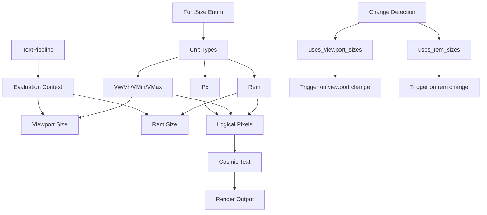

+++
title = "#22614 Minimal responsive `FontSize` support"
date = "2026-02-02T00:00:00"
draft = false
template = "pull_request_page.html"
in_search_index = true

[taxonomies]
list_display = ["show"]

[extra]
current_language = "en"
available_languages = {"en" = { name = "English", url = "/pull_request/bevy/2026-02/pr-22614-en-20260202" }, "zh-cn" = { name = "中文", url = "/pull_request/bevy/2026-02/pr-22614-zh-cn-20260202" }}
labels = ["C-Feature", "A-UI", "A-Text", "M-Release-Note", "D-Modest", "M-Deliberate-Rendering-Change"]
+++

# Title

## Basic Information
- **Title**: Minimal responsive `FontSize` support
- **PR Link**: https://github.com/bevyengine/bevy/pull/22614
- **Author**: ickshonpe
- **Status**: MERGED
- **Labels**: C-Feature, A-UI, S-Ready-For-Review, A-Text, M-Release-Note, D-Modest, M-Deliberate-Rendering-Change
- **Created**: 2026-01-20T23:39:11Z
- **Merged**: 2026-02-02T23:26:53Z
- **Merged By**: alice-i-cecile

## Description Translation
The PR description is in English, so we include it exactly as-is without translation.

# The Story of This Pull Request

This PR addresses a practical need in Bevy's text rendering system: the ability to specify font sizes using responsive units like viewport percentages and rem units, rather than just static pixel values. The core problem was that text rendering was limited to pixel-based sizes, which made it difficult to create UIs that adapt properly to different screen sizes and user preferences.

## The Problem and Context

Before this PR, Bevy's `TextFont` component had a simple `font_size: f32` field that only accepted pixel values. This worked fine for basic use cases, but didn't support the responsive sizing patterns common in modern UI development. Developers couldn't create text that scales with the window size or use relative units that adapt to user preferences.

The technical constraints were significant. The text rendering system uses Cosmic Text internally, and any changes needed to be minimal to avoid breaking existing code. The implementation also had to handle both UI text (rendered through `bevy_ui`) and 2D text (rendered through `Text2d`), which have different viewport resolution contexts.

## The Solution Approach

The developer chose to implement a new `FontSize` enum that supports multiple unit types while maintaining backward compatibility. The approach was deliberately minimal - instead of reusing Bevy's existing `Val` type (used for other UI measurements), they created a dedicated `FontSize` type to avoid pulling in unnecessary dependencies and to ensure clear semantic meaning for font sizing specifically.

The solution needed to handle three main technical challenges:
1. Evaluating different unit types to actual pixel sizes at render time
2. Detecting when text needs to be re-rendered due to viewport or rem size changes
3. Providing sensible defaults for cases where viewport size isn't clearly defined

## The Implementation

The core of the implementation is the new `FontSize` enum in `crates/bevy_text/src/text.rs`:

```rust
pub enum FontSize {
    /// Font Size in logical pixels.
    Px(f32),
    /// Font size as a percentage of the viewport width.
    Vw(f32),
    /// Font size as a percentage of the viewport height.
    Vh(f32),
    /// Font size as a percentage of the smaller of the viewport width and height.
    VMin(f32),
    /// Font size as a percentage of the larger of the viewport width and height.
    VMax(f32),
    /// Font Size relative to the value of the `RemSize` resource.
    Rem(f32),
}
```

This replaces the `f32` in `TextFont`, and the enum provides an `eval()` method that converts any variant to logical pixels given a viewport size and rem base size. The implementation carefully handles edge cases like zero or negative font sizes, maintaining existing warning behavior.

The `TextPipeline` in `crates/bevy_text/src/pipeline.rs` was updated to track which text blocks use viewport or rem units. Two new boolean fields were added to `ComputedTextBlock`:
- `uses_viewport_sizes`: true if any text section uses viewport-based units (Vw, Vh, VMin, VMax)
- `uses_rem_sizes`: true if any text section uses rem units

These fields enable efficient change detection. The `needs_rerender()` method was updated to accept two parameters:

```rust
pub fn needs_rerender(
    &self,
    is_viewport_size_changed: bool,
    is_rem_size_changed: bool,
) -> bool {
    self.needs_rerender
        || (is_viewport_size_changed && self.uses_viewport_sizes)
        || (is_rem_size_changed && self.uses_rem_sizes)
}
```

This ensures text only re-renders when necessary - if the viewport size changes but the text block doesn't use viewport units, no re-render is triggered.

For `Text2d`, there's an interesting design decision: viewport units are resolved using the primary window's size (or a default of 1000x1000 if no primary window exists). This is a pragmatic compromise because a single `Text2d` entity can be rendered to multiple viewports via `RenderLayers`, making it unclear which viewport size should be authoritative.

## Technical Insights

The implementation shows several thoughtful engineering decisions:

1. **Minimal API surface**: The change is mostly transparent to users. Existing code using `f32` for font size automatically converts to `FontSize::Px(f32)` via the `From<f32>` implementation.

2. **Efficient change detection**: By tracking which text blocks actually use responsive units, the system avoids unnecessary work when viewport or rem sizes change.

3. **Separation of concerns**: The `FontSize` enum handles unit conversion independently of the text rendering logic, making the code more maintainable.

4. **Backward compatibility**: The `RemSize` resource defaults to 20.0, matching the previous default font size, so existing code continues to work as expected.

The PR also reveals current limitations in Bevy's text system. As noted by the author, "rem" units aren't true CSS rem units because there's no font style inheritance yet - they're just multiplied by a global `RemSize` resource value. Similarly, "em" units can't be implemented without inheritance support.

## The Impact

The changes enable responsive text sizing with minimal performance overhead. Developers can now create text that scales with window size using viewport units, or create consistent sizing relationships using rem units. The implementation affects 81 example files, demonstrating the widespread utility of this feature.

One notable aspect is how the changes propagate through the codebase. The `TextPipeline` now requires viewport and rem size parameters, which means any system using it (like `Text2d` and UI text systems) must provide these values. This creates a clear contract between text consumers and the text rendering system.

The PR also includes migration guides and release notes, showing good documentation practices. The author acknowledges that most example migrations were automated with regular expressions, which is a pragmatic approach given the scale of changes.

## Visual Representation



## Key Files Changed

### `crates/bevy_text/src/text.rs` (+129/-6)
**What changed**: Added the `FontSize` enum and `RemSize` resource, updated `TextFont` to use `FontSize` instead of `f32`.

**Key code**:
```rust
// Before:
pub struct TextFont {
    pub font: FontSource,
    pub font_size: f32,
    // ...
}

// After:
pub struct TextFont {
    pub font: FontSource,
    pub font_size: FontSize,
    // ...
}

pub enum FontSize {
    Px(f32),
    Vw(f32),
    Vh(f32),
    VMin(f32),
    VMax(f32),
    Rem(f32),
}

impl FontSize {
    pub fn eval(
        self,
        logical_viewport_size: Vec2,
        rem_size: f32,
    ) -> f32 {
        match self {
            FontSize::Px(s) => s,
            FontSize::Vw(s) => logical_viewport_size.x * s / 100.,
            FontSize::Vh(s) => logical_viewport_size.y * s / 100.,
            FontSize::VMin(s) => logical_viewport_size.min_element() * s / 100.,
            FontSize::VMax(s) => logical_viewport_size.max_element() * s / 100.,
            FontSize::Rem(s) => rem_size * s,
        }
    }
}
```

### `crates/bevy_text/src/pipeline.rs` (+34/-5)
**What changed**: Updated `TextPipeline` methods to accept viewport and rem size parameters, added tracking of which text blocks use responsive units.

**Key code**:
```rust
// Before:
pub fn update_buffer(
    &mut self,
    scale_factor: f32,
    computed: &mut ComputedTextBlock,
    font_system: &mut CosmicFontSystem,
    hinting: FontHinting,
) -> Result<(), TextError> {

// After:
pub fn update_buffer(
    &mut self,
    scale_factor: f32,
    computed: &mut ComputedTextBlock,
    font_system: &mut CosmicFontSystem,
    hinting: FontHinting,
    logical_viewport_size: Vec2,
    base_rem_size: f32,
) -> Result<(), TextError> {

// Inside update_buffer:
for (span_index, (entity, depth, span, text_font, _color, line_height)) in text_spans.enumerate() {
    match text_font.font_size {
        crate::FontSize::Vw(_)
        | crate::FontSize::Vh(_)
        | crate::FontSize::VMin(_)
        | crate::FontSize::VMax(_) => computed.uses_viewport_sizes = true,
        crate::FontSize::Rem(_) => computed.uses_rem_sizes = true,
        _ => (),
    };
    
    let font_size = text_font.font_size.eval(logical_viewport_size, base_rem_size);
    // ...
}
```

### `crates/bevy_sprite/src/text2d.rs`
**What changed**: Updated `Text2d` rendering to pass viewport size from primary window and handle responsive font size change detection.

**Key code**:
```rust
// Get viewport size from primary window
let logical_viewport_size = primary_window
    .map(|window| window.resolution.size())
    .unwrap_or(Vec2::splat(1000.));

// Update change detection
let text_changed = scale_factor != text_layout_info.scale_factor
    || block.is_changed()
    || hinting.is_changed()
    || computed.needs_rerender(viewport_size_changed, rem_size.is_changed())
    || (!reprocess_queue.is_empty() && reprocess_queue.remove(&entity));
```

### `examples/ui/text/font_weights.rs` (+14/-102)
**What changed**: Example updated to use new `FontSize` type and simplified with iterator-based spawning.

**Key code**:
```rust
// Before: Individual text entries for each weight
// After: Using SpawnIter with iterator
Children::spawn(SpawnIter(
    [100, 134, 200, 300, 400, 500, 600, 700, 800, 900, 950]
        .into_iter()
        .map(move |weight| (
            Text(format!("Weight {weight}")),
            TextFont {
                font: font.clone(),
                font_size: FontSize::Px(32.0),
                weight: FontWeight(weight),
                ..default()
            },
        ))
))
```

### `examples/ui/text/text.rs`
**What changed**: Modified to demonstrate responsive font sizing with `Vh` units.

**Key code**:
```rust
// Before:
TextFont {
    font: asset_server.load("fonts/FiraSans-Bold.ttf").into(),
    font_size: 67.0,
    ..default()
},

// After:
TextFont {
    font: asset_server.load("fonts/FiraSans-Bold.ttf").into(),
    // The size of the text will be 20% of the viewport height.
    font_size: FontSize::Vh(20.0),
    ..default()
},
```

## Further Reading

- [CSS Viewport Units](https://developer.mozilla.org/en-US/docs/Web/CSS/length#viewport-percentage_lengths) - The web standard that inspired Vw/Vh/VMin/VMax units
- [CSS Relative Units](https://developer.mozilla.org/en-US/docs/Learn/CSS/Building_blocks/Values_and_units#relative_length_units) - Background on rem, em, and other relative units
- [Cosmic Text Documentation](https://docs.rs/cosmic-text/latest/cosmic_text/) - The text layout engine used by Bevy
- [Bevy UI System](https://bevyengine.org/learn/quick-start/ui/) - Bevy's UI framework that uses this text system