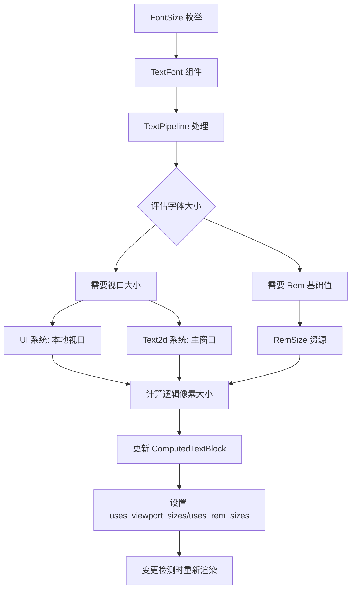

+++
title = "#22614 Minimal responsive `FontSize` support"
date = "2026-02-02T00:00:00"
draft = false
template = "pull_request_page.html"
in_search_index = false

[extra]
current_language = "zh-cn"
available_languages = {"en" = { name = "English", url = "/pull_request/bevy/2026-02/pr-22614-en-20260202" }, "zh-cn" = { name = "中文", url = "/pull_request/bevy/2026-02/pr-22614-zh-cn-20260202" }}
+++

# Minimal responsive `FontSize` support

## 基本信息
- **标题**: Minimal responsive `FontSize` support
- **PR链接**: https://github.com/bevyengine/bevy/pull/22614
- **作者**: ickshonpe
- **状态**: 已合并
- **标签**: C-Feature, A-UI, S-Ready-For-Final-Review, A-Text, M-Release-Note, D-Modest, M-Deliberate-Rendering-Change
- **创建时间**: 2026-01-20T23:39:11Z
- **合并时间**: 2026-02-02T23:26:53Z
- **合并者**: alice-i-cecile

## 描述翻译

为 `bevy_text` 添加支持 rem 和视口单位（viewport units）的响应式字体大小，同时最小化对 API 和系统的更改。

### 解决方案

引入新的 `FontSize` 枚举：

```rust
pub enum FontSize {
    /// 逻辑像素中的字体大小。
    Px(f32),
    /// 字体大小为视口宽度的百分比。
    Vw(f32),
    /// 字体大小为视口高度的百分比。
    Vh(f32),
    /// 字体大小为视口宽度和高度中较小者的百分比。
    VMin(f32),
    /// 字体大小为视口宽度和高度中较大者的百分比。
    VMax(f32),
    /// 相对于 `RemSize` 资源值的字体大小。
    Rem(f32),
}
```

这取代了 `TextFont` 中 `font_size` 字段的 `f32` 值。

视口变体的工作方式与其对应的 `Val` 变体相同。

`Rem` 值会乘以 `RemSize` 资源的值（该资源对 `f32` 进行了 newtype 包装）。

`FontSize` 提供了一个 `eval` 方法，该方法接受逻辑视口大小和 rem 基础大小，并返回一个 `f32` 逻辑字体大小。解析后的逻辑字体大小随后被写入 `TextPipeline::update_buffer` 传递给 Cosmic Text 的 `Attributes` 中。

任何使用 `bevy_text` 的文本实现现在在调用 `TextPipeline::update_buffer` 或 `create_measure` 时必须提供视口和 rem 基础值。

`Text2d` 使用主窗口的大小来解析视口值（如果未找到主窗口，则使用 `Vec2::splat(1000)`）。这是一个有意的折衷方案，单个 `Text2d` 可以使用 `RenderLayers` 渲染到多个视口，因此很难确定应该选择哪个视口大小的规则。

### 变更检测

`ComputedTextBlock` 有两个新字段：`uses_viewport_sizes` 和 `uses_rem_sizes`，如果在块中的任何文本部分使用了视口或 rem 字体大小，`TextPipeline::update_buffer` 会将其设置为 true。

`ComputedTextBlock::needs_rerender` 方法已被修改为接受两个布尔参数：
```rust
    pub fn needs_rerender(
        &self,
        is_viewport_size_changed: bool,
        is_rem_size_changed: bool,
    ) -> bool {
        self.needs_rerender
            || (is_viewport_size_changed && self.uses_viewport_sizes)
            || (is_rem_size_changed && self.uses_rem_sizes)
    }
 ```
这确保了如果文本部分之一使用了视口字体大小且本地视口大小发生了变化，或者如果文本部分之一使用了 rem 字体大小且 rem 大小发生了变化，文本也会被调度重新更新。

#### 限制

由于我们尚未有任何字体样式继承，存在一些限制：

* "rem" 单位不是真正的 rem 单位，仅基于资源的值。
* "em" 单位基于继承的字体大小解析，因此没有继承支持无法实现。

#### 注意事项

* 此 PR 相当小且技术性不强。审查者无需特别熟悉 `bevy_text`。大部分更改是针对示例的。

* 我们可以考虑使用 `Val` 而不是 `FontSize`，这样我们就可以使用 `Val` 的构造函数函数，这会更友好，但某些变体可能在 UI 和 Text2d 上下文中没有合理的解释。此外，我们还需要让 `Val` 对 `bevy_text` 可访问。

### 测试

对文本系统的更改相对简单且易于理解。我已经对 `text` 示例进行了小的更改，在右下角的 "hello bevy" 文本中使用 `Vh` 字体大小。如果更改窗口大小，应该会看到文本大小响应变化。文本在更新前会闪烁，这是因为一些无关的资源/图像更改导致字体纹理在更改字体大小的文本更新后的那一帧才准备就绪。

大多数示例迁移是使用正则表达式自动完成的，这些更改中可能存在错误。不可能彻底检查每个示例，但现在发布周期还早，我认为如果出现几个错误我们也不必太担心。

## 这个 PR 的故事

这个 PR 解决了 Bevy 文本系统中一个长期存在的限制：字体大小只能以逻辑像素指定，缺乏对响应式设计的支持。在需要文本适应不同屏幕尺寸或用户偏好的现代 UI 中，这是一个明显的缺失功能。

### 问题和背景

Bevy 的文本系统最初设计时只支持像素单位的字体大小。这在简单场景下工作良好，但当开发者需要创建响应式界面时，他们不得不手动计算字体大小，或者使用复杂的系统来根据窗口大小调整文本。随着 Bevy 在游戏和应用程序 UI 中的使用增长，这种限制变得愈发明显。

主要的挑战是在不破坏现有 API 的情况下添加新功能。`TextFont` 组件被广泛使用，直接修改其 `font_size` 字段的类型会影响大量现有代码。同时，系统需要高效地处理新的响应式单位，并在依赖值变化时正确更新文本布局。

### 解决方案方法

开发者选择了一种最小侵入性的方法：创建新的 `FontSize` 枚举来包装各种单位类型，而不是修改现有字段的基本类型。这种方法有几个关键优势：

1. **向后兼容**：现有的 `f32` 值可以通过 `FontSize::Px()` 轻松转换
2. **类型安全**：编译器可以确保正确处理不同的单位类型
3. **最小化 API 变更**：现有的 `TextFont` 结构保持不变，只是字段类型变化

实现的关键洞察是：所有响应式单位最终都需要在某个点转换为逻辑像素。`FontSize` 枚举的 `eval()` 方法在文本处理管道中集中处理这个转换，将复杂性封装在单一位置。

### 实现细节

核心变化集中在几个关键文件：

**`FontSize` 枚举的定义**（位于 `crates/bevy_text/src/text.rs`）：
```rust
pub enum FontSize {
    Px(f32),
    Vw(f32),
    Vh(f32),
    VMin(f32),
    VMax(f32),
    Rem(f32),
}
```

每个变体都包含一个 `f32` 值，但含义不同。`eval()` 方法根据视口大小和 rem 基础大小计算最终像素值：

```rust
pub fn eval(
    self,
    logical_viewport_size: Vec2,
    rem_size: f32,
) -> f32 {
    match self {
        FontSize::Px(s) => s,
        FontSize::Vw(s) => logical_viewport_size.x * s / 100.,
        FontSize::Vh(s) => logical_viewport_size.y * s / 100.,
        FontSize::VMin(s) => logical_viewport_size.min_element() * s / 100.,
        FontSize::VMax(s) => logical_viewport_size.max_element() * s / 100.,
        FontSize::Rem(s) => rem_size * s,
    }
}
```

**变更检测优化**是另一个重要方面。由于响应式字体大小依赖于可能频繁变化的值（如视口大小），系统需要智能地决定何时重新计算文本布局。`ComputedTextBlock` 的新字段 `uses_viewport_sizes` 和 `uses_rem_sizes` 跟踪文本块是否使用了这些依赖值：

```rust
pub(crate) uses_viewport_sizes: bool,
pub(crate) uses_rem_sizes: bool,
```

当这些标记为 true 且相应的依赖值发生变化时，文本会被标记为需要重新渲染。

**`TextPipeline` 的修改**展示了如何集成新功能。`update_buffer` 方法现在接收额外的参数并在处理文本段时检查字体大小类型：

```rust
match text_font.font_size {
    crate::FontSize::Vw(_)
    | crate::FontSize::Vh(_)
    | crate::FontSize::VMin(_)
    | crate::FontSize::VMax(_) => computed.uses_viewport_sizes = true,
    crate::FontSize::Rem(_) => computed.uses_rem_sizes = true,
    _ => (),
};
```

### 技术考量

**性能影响**：这个实现增加了每个文本段的条件检查，但开销很小。更重要的是，通过精确的变更检测，只有在真正需要时才重新计算文本布局，这补偿了额外检查的成本。

**架构决策**：`Text2d` 处理视口单位的方式是一个有意的折衷。由于 2D 文本可能渲染到多个视口（通过 `RenderLayers`），选择哪个视口大小并不明确。实现选择了主窗口大小作为合理默认，同时承认这并非完美解决方案。

**资源设计**：`RemSize` 资源被设计为简单的 `f32` 包装器，这为未来可能的扩展留下了空间（比如支持不同上下文的不同 rem 值）。

**与现有系统集成**：修改影响多个系统，包括 UI 文本测量和 Text2d 布局。每个系统都需要传递适当的视口大小和 rem 值。这种设计保持了关注点分离，每个系统处理自己的上下文。

### 影响

这个 PR 为 Bevy 带来了重要的响应式设计能力。开发者现在可以：
- 创建随窗口大小自动调整的文本
- 使用相对单位（如 rem）实现一致的比例
- 构建在各种屏幕尺寸上都能良好显示的 UI

从工程角度看，这个实现展示了如何通过最小化、向后兼容的更改来演进成熟代码库。类型驱动的设计（使用枚举）确保了类型安全，而集中化的评估逻辑保持了代码的可维护性。

## 可视化表示



## 关键文件变更

### `crates/bevy_text/src/text.rs` (+129/-6)
**变更描述**：添加了 `FontSize` 枚举和 `RemSize` 资源，更新了 `TextFont` 结构和 `ComputedTextBlock`。

**关键代码片段**：
```rust
// 之前：
pub struct TextFont {
    pub font: FontSource,
    pub font_size: f32,  // 仅支持像素
    // ...
}

// 之后：
pub struct TextFont {
    pub font: FontSource,
    pub font_size: FontSize,  // 支持多种单位
    // ...
}

// 新增 FontSize 枚举
pub enum FontSize {
    Px(f32),
    Vw(f32),
    Vh(f32),
    VMin(f32),
    VMax(f32),
    Rem(f32),
}

// 新增 RemSize 资源
#[derive(Resource, Copy, Clone, Debug, PartialEq, Deref, DerefMut)]
pub struct RemSize(pub f32);
```

### `crates/bevy_text/src/pipeline.rs` (+34/-5)
**变更描述**：更新 `TextPipeline` 以处理新的字体大小类型，添加变更检测标记。

**关键代码片段**：
```rust
// 之前：
pub fn update_buffer(
    &mut self,
    // ... 参数
) -> Result<(), TextError> {
    // 直接使用 font_size 作为 f32
    let attrs = get_attrs(span_index, text_font, line_height, family, scale_factor);
}

// 之后：
pub fn update_buffer(
    &mut self,
    // 新增参数：
    logical_viewport_size: Vec2,
    base_rem_size: f32,
    // ... 其他参数
) -> Result<(), TextError> {
    // 检查使用的单位类型
    match text_font.font_size {
        crate::FontSize::Vw(_) | crate::FontSize::Vh(_) | 
        crate::FontSize::VMin(_) | crate::FontSize::VMax(_) => 
            computed.uses_viewport_sizes = true,
        crate::FontSize::Rem(_) => computed.uses_rem_sizes = true,
        _ => (),
    };
    
    // 评估为像素值
    let font_size = text_font.font_size.eval(logical_viewport_size, base_rem_size);
    let attrs = get_attrs(span_index, text_font, font_size, line_height, family, scale_factor);
}
```

### `examples/ui/text/text.rs` (+1/-1)
**变更描述**：示例展示了如何使用新的响应式字体大小。

**关键代码片段**：
```rust
// 之前：
TextFont {
    font: asset_server.load("fonts/FiraSans-Bold.ttf").into(),
    font_size: 67.0,  // 固定像素值
    ..default()
}

// 之后：
TextFont {
    font: asset_server.load("fonts/FiraSans-Bold.ttf").into(),
    font_size: FontSize::Vh(20.0),  // 视口高度的 20%
    ..default()
}
```

### `crates/bevy_sprite/src/text2d.rs` (+23/-1)
**变更描述**：更新 Text2d 系统以支持响应式字体大小。

**关键代码片段**：
```rust
// 在 update_text2d_layout 系统中：
let logical_viewport_size = primary_window
    .map(|window| window.resolution.size())
    .unwrap_or(Vec2::splat(1000.));

let viewport_size_changed = *last_logical_viewport_size == logical_viewport_size;

// 更新文本时需要检查视口和 rem 大小变化
|| computed.needs_rerender(viewport_size_changed, rem_size.is_changed())

// 传递给 TextPipeline
text_pipeline.update_buffer(
    // ... 参数
    logical_viewport_size,
    rem_size.0,
)
```

### `crates/bevy_ui/src/widget/text.rs` (+3/-2)
**变更描述**：更新 UI 文本测量系统以支持响应式字体大小。

**关键代码片段**：
```rust
// 在 measure_text_system 中：
|| computed.needs_rerender(computed_target.is_changed(), rem_size.is_changed())

// 传递给 TextPipeline
text_pipeline.create_measure(
    // ... 参数
    computed_target.logical_size(),
    rem_size.0,
)
```

## 延伸阅读

1. **CSS 响应式单位**：了解视口单位（vw, vh, vmin, vmax）和相对单位（em, rem）的概念
   - MDN: https://developer.mozilla.org/en-US/docs/Web/CSS/length

2. **Bevy 文本系统架构**：深入了解 Bevy 的文本渲染管道
   - Bevy 文档：https://docs.rs/bevy_text

3. **变更检测模式**：学习 ECS 中高效的变更检测策略
   - Bevy ECS 指南：https://bevyengine.org/learn/quick-start/ecs/

4. **类型驱动的 API 设计**：如何使用类型系统创建安全、可扩展的 API
   - Rust 设计模式：https://rust-unofficial.github.io/patterns/

5. **响应式 UI 设计原则**：构建适应不同屏幕尺寸的用户界面
   - 响应式设计基础：https://developer.mozilla.org/en-US/docs/Learn/CSS/CSS_layout/Responsive_Design