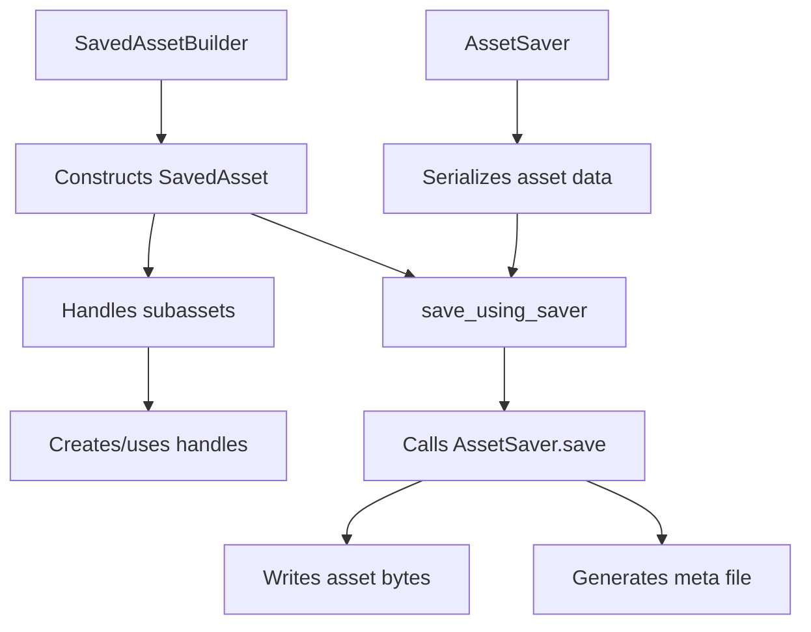

+++
title = "#22622 Implement minimal asset saving"
date = "2026-02-04T00:00:00"
draft = false
template = "pull_request_page.html"
in_search_index = true

[taxonomies]
list_display = ["show"]

[extra]
current_language = "en"
available_languages = {"en" = { name = "English", url = "/pull_request/bevy/2026-02/pr-22622-en-20260204" }, "zh-cn" = { name = "中文", url = "/pull_request/bevy/2026-02/pr-22622-zh-cn-20260204" }}
labels = ["C-Feature", "A-Assets", "M-Release-Note", "D-Modest"]
+++

# Title

## Basic Information
- **Title**: Implement minimal asset saving
- **PR Link**: https://github.com/bevyengine/bevy/pull/22622
- **Author**: andriyDev
- **Status**: MERGED
- **Labels**: C-Feature, A-Assets, S-Ready-For-Final-Review, M-Release-Note, D-Modest
- **Created**: 2026-01-21T09:22:49Z
- **Merged**: 2026-02-04T00:51:13Z
- **Merged By**: alice-i-cecile

## Description Translation
# Objective

- A step towards #11216.

## Solution

- Allow users to build `SavedAsset` instances by building up their labeled assets. This can either take an existing handle + asset ref, or will create a handle for your asset ref.
- Provide a function to correctly call the `AssetSaver`, and write out the correct meta file.

### Some things I am leaving to future PRs

- Making it easier to access subassets in an `AssetSaver`.
- Making a nicer API for asset saving (e.g., registering asset savers and looking up the appropriate saver for type ID + extension).

### Weird implementation details

- I needed to create my own Cow-like type (which I named `Moo`), since I needed to store just a ref or owned hashmap. I wrote a lengthy comment explaining why it's needed (TL;DR variance is complicated, Cow doesn't work). Note: it's possible we could just use CowArc instead, but we never need to clone the map so this seems like overkill. Also having a nice place to explain the variance problems is useful here.
- For the builder, I needed to add an extra lifetime to `add_labeled_asset_with_*<'b: 'a>`, since otherwise, the `CowArc` gets coerced to `'static` which means the lifetime of the subasset needs to be `'static`, which practically makes this unusable. By adding a second lifetime dedicated to the `CowArc`, 

## Testing

- Created a new example: this allows you to make a small "scene" of boxes, and save and load it to your heart's content!
- Added a couple simple tests.

## The Story of This Pull Request

The `AssetSaver` trait has existed in Bevy since version 0.12, but it was designed primarily for use with asset processing rather than runtime asset saving. This created a gap in the API where users couldn't easily save assets at runtime, despite having a trait that seemed designed for that purpose. PR #22622 addresses this limitation by implementing minimal asset saving capabilities, providing the foundational building blocks for runtime asset serialization.

The core problem was that while `AssetSaver` could transform assets during processing, there was no straightforward way to construct a `SavedAsset` instance for arbitrary runtime assets and invoke the saver with proper metadata generation. The solution introduces two key components: a `SavedAssetBuilder` for constructing asset hierarchies and a `save_using_saver` function that handles the complete save workflow.

The implementation required careful consideration of Rust's lifetime and variance rules. The developer encountered issues with the standard `Cow` type due to variance complications with associated types, leading to the creation of a custom `Moo` (Maybe-Owned-Object) type that can hold either owned or borrowed data without the variance constraints of `Cow`. Additionally, extra lifetimes were added to builder methods to prevent unwanted lifetime coercion that would have made the API impractical to use.

The changes are backward-compatible for existing `AssetSaver` implementations, though they require adding an extra lifetime parameter to the `SavedAsset` type used in the `save` method. This is documented in a migration guide to help users update their code.

From an architectural perspective, this PR establishes a clear separation between asset construction and asset saving. The `SavedAssetBuilder` handles the construction of asset hierarchies with proper handle management, while `save_using_saver` encapsulates the entire save process including writing asset data and generating metadata. This modular approach allows future improvements to either component without breaking the overall workflow.

The impact is significant: developers can now save complex asset hierarchies at runtime, enabling features like scene serialization, level editors, and runtime content creation tools. The example demonstrates saving and loading a simple scene of colored boxes, providing a practical reference implementation.

## Visual Representation



## Key Files Changed

### `crates/bevy_asset/src/saver.rs` (+580/-46)

This file contains the core implementation changes. The `SavedAsset` struct now has two lifetimes instead of one, and new APIs were added for building and saving assets.

Key additions:
- `SavedAssetBuilder` for constructing asset hierarchies
- `save_using_saver` function for the complete save workflow
- `Moo` type as a simplified alternative to `Cow`
- `ErasedSavedAsset` for type-erased asset handling

```rust
// Before: Single lifetime
pub struct SavedAsset<'a, A: Asset> {
    value: &'a A,
    labeled_assets: &'a HashMap<CowArc<'static, str>, LabeledAsset>,
}

// After: Two lifetimes
pub struct SavedAsset<'a, 'b, A: Asset> {
    value: &'a A,
    labeled_assets: Moo<'b, HashMap<CowArc<'a, str>, LabeledSavedAsset<'a>>>,
}
```

```rust
// New builder API
pub struct SavedAssetBuilder<'a> {
    labeled_assets: HashMap<CowArc<'a, str>, LabeledSavedAsset<'a>>,
    asset_path: AssetPath<'static>,
    asset_server: AssetServer,
}

impl<'a> SavedAssetBuilder<'a> {
    pub fn add_labeled_asset_with_new_handle<'b: 'a, A: Asset>(
        &mut self,
        label: impl Into<CowArc<'b, str>>,
        asset: SavedAsset<'a, 'a, A>,
    ) -> Handle<A> {
        // Implementation creates handle and registers subasset
    }
    
    pub fn build<'b, A: Asset>(self, asset: &'b A) -> SavedAsset<'b, 'b, A> {
        // Constructs final SavedAsset
    }
}
```

```rust
// New save function
pub async fn save_using_saver<S: AssetSaver>(
    asset_server: AssetServer,
    saver: &S,
    path: &AssetPath<'_>,
    asset: SavedAsset<'_, '_, S::Asset>,
    settings: &S::Settings,
) -> Result<(), SaveAssetError> {
    // Handles writer acquisition, saving, metadata generation
}
```

### `examples/asset/asset_saving.rs` (+372/-0)

This new example demonstrates the complete workflow for saving and loading assets. It creates a simple scene with colored boxes that can be manipulated, saved with F5, and loaded with F6.

```rust
// Simplified example structure
fn perform_save(boxes: Query<(&Sprite, &Transform), With<Box>>, asset_server: Res<AssetServer>) {
    // Extract box data
    let boxes = boxes.iter().map(|(sprite, transform)| OneBox {
        position: transform.translation.xy(),
        color: sprite.color,
    }).collect::<Vec<_>>();
    
    // Build SavedAsset
    let mut builder = SavedAssetBuilder::new(asset_server.clone(), ASSET_PATH.into());
    let mut many_boxes = ManyBoxes { boxes: vec![] };
    for (index, one_box) in boxes.iter().enumerate() {
        many_boxes.boxes.push(builder.add_labeled_asset_with_new_handle(
            index.to_string(),
            SavedAsset::from_asset(one_box),
        ));
    }
    
    let saved_asset = builder.build(&many_boxes);
    
    // Save using saver
    save_using_saver(asset_server.clone(), &ManyBoxesSaver, &ASSET_PATH.into(), saved_asset, &())
        .await
        .unwrap();
}
```

### `release-content/release-notes/asset_saving.md` (+61/-0)

This file documents the new feature for the release notes, explaining the two-step process for saving assets and providing code examples.

### `crates/bevy_asset/src/processor/tests.rs` (+7/-42)

The tests were updated to accommodate the new `SavedAsset` lifetime changes. A test-only `CoolTextSaver` was moved to the `saver::tests` module to avoid code duplication.

### `release-content/migration-guides/asset_saver_changes.md` (+47/-0)

This migration guide explains the change from single-lifetime to dual-lifetime `SavedAsset` in `AssetSaver` implementations, showing before and after code examples.

## Further Reading

- [Rustonomicon: Subtyping and Variance](https://doc.rust-lang.org/nomicon/subtyping.html) - For understanding the variance issues that led to the `Moo` type
- [Bevy Assets Documentation](https://bevyengine.org/learn/books/bevy-assets/) - For comprehensive understanding of Bevy's asset system
- [Issue #11216](https://github.com/bevyengine/bevy/issues/11216) - The original issue tracking asset saving improvements
- [Cow documentation](https://doc.rust-lang.org/std/borrow/enum.Cow.html) - To understand the standard Clone-on-Write type that inspired `Moo`