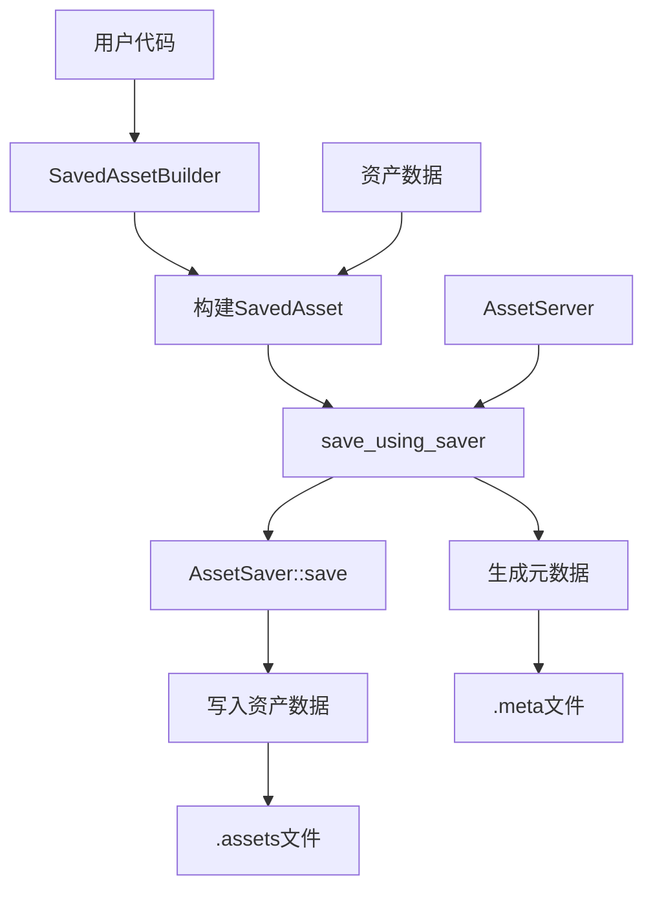

+++
title = "#22622 Implement minimal asset saving"
date = "2026-02-04T00:00:00"
draft = false
template = "pull_request_page.html"
in_search_index = false

[extra]
current_language = "zh-cn"
available_languages = {"en" = { name = "English", url = "/pull_request/bevy/2026-02/pr-22622-en-20260204" }, "zh-cn" = { name = "中文", url = "/pull_request/bevy/2026-02/pr-22622-zh-cn-20260204" }}
+++

# 标题
## 基本信息
- **标题**: Implement minimal asset saving
- **PR链接**: https://github.com/bevyengine/bevy/pull/22622  
- **作者**: andriyDev
- **状态**: 已合并
- **标签**: C-Feature, A-Assets, S-Ready-For-Final-Review, M-Release-Note, D-Modest
- **创建时间**: 2026-01-21T09:22:49Z
- **合并时间**: 2026-02-04T00:51:13Z
- **合并者**: alice-i-cecile

## 描述翻译

### 目标
- 朝着 #11216 的目标迈进一步。

### 解决方案
- 允许用户通过构建带标签的资产来构建 `SavedAsset` 实例。这可以通过现有的句柄+资产引用，或者为你的资产引用创建一个句柄。
- 提供一个函数来正确调用 `AssetSaver`，并写出正确的元文件。

### 一些我将留给未来PR的事情
- 使在 `AssetSaver` 中访问子资产更容易。
- 为资产保存提供更好的API（例如，注册资产保存器并根据类型ID+扩展名查找合适的保存器）。

### 奇怪的实现细节
- 我需要创建自己的类似于Cow的类型（我称之为 `Moo`），因为我需要存储一个引用或拥有的哈希表。我写了一个详细的注释来解释为什么需要它（TL;DR：方差很复杂，Cow不适用）。注意：有可能我们直接使用CowArc，但我们从不克隆映射，所以这似乎有点过度设计。而且在这里有一个地方来解释方差问题是有用的。
- 对于构建器，我需要在 `add_labeled_asset_with_*<'b: 'a>` 中添加一个额外的生命周期，否则，`CowArc` 会被强制转换为 `'static`，这意味着子资产的生命周期必须是 `'static`，这实际上使这个功能无法使用。通过添加第二个专门用于 `CowArc` 的生命周期，我们解决了这个问题。

### 测试
- 创建了一个新示例：这个示例允许你制作一个由方块组成的小"场景"，并随心所欲地保存和加载它！
- 添加了几个简单的测试。

## 这个PR的故事

这个PR的核心目标是填补Bevy资产系统中的一个关键空白：在运行时保存资产。尽管Bevy从0.12版本就有了`AssetSaver` trait，但它主要设计用于资产处理流水线，而不是供用户直接调用来保存资产。这种情况给需要持久化游戏状态、创建关卡编辑器或实现类似功能的开发者带来了困难。

### 问题与背景
在Bevy的资产系统中，资产（Assets）代表游戏资源如纹理、模型和声音。系统通过`AssetServer`加载资产，并通过`Assets<T>`资源管理它们。然而，保存修改过的或运行时生成的资产一直缺乏直接的API支持。这个问题在issue #11216中被跟踪，而本PR是实现完整资产保存功能的第一步。

开发者面临的具体技术挑战包括：
1. 需要一种方法来封装资产及其带标签的子资产（labeled subassets）以便保存
2. 需要处理资产句柄的生命周期和引用关系
3. 需要生成正确的元数据文件以支持后续加载
4. 需要提供易于使用的API，让开发者能够集成资产保存功能到他们的应用中

### 解决方案方法
PR作者采取了最小可行方案（MVP）的方法，专注于实现核心功能，同时将更高级的特性留给未来的PR。主要技术决策包括：

1. **扩展而不是重写**：在现有`AssetSaver` trait的基础上进行扩展，而不是创建全新的API
2. **构建器模式**：引入`SavedAssetBuilder`来帮助用户逐步构建复杂的资产结构
3. **生命周期管理**：通过增加第二个生命周期参数来解决`CowArc`的类型系统限制
4. **自定义包装类型**：创建`Moo`类型作为`Cow`的替代品，以解决Rust的方差（variance）问题

### 实现细节

#### 1. SavedAsset的重构
`SavedAsset`结构现在有了两个生命周期参数：`'a`用于资产值本身的引用，`'b`用于存储子资产映射的`Moo`类型。这种设计允许更灵活地处理不同生命周期的资产数据。

```rust
pub struct SavedAsset<'a, 'b, A: Asset> {
    value: &'a A,
    labeled_assets: Moo<'b, HashMap<CowArc<'a, str>, LabeledSavedAsset<'a>>>,
}
```

#### 2. Moo类型的引入
作者创建了`Moo`（Maybe Owned Object）类型来解决Rust类型系统中的方差问题。标准库的`Cow`类型使用了`ToOwned` trait的关联类型，这使得它成为不变（invariant）类型，在某些情况下会导致生命周期问题。

```rust
enum Moo<'a, T> {
    Owned(T),
    Borrowed(&'a T),
}
```

`Moo`提供了`Cow`的简化版本，只支持引用或拥有值，而不需要克隆能力，这正好符合保存操作中只需要读取数据的场景。

#### 3. SavedAssetBuilder的实现
构建器模式使得创建复杂资产结构变得简单。用户可以通过两种方式添加子资产：
- `add_labeled_asset_with_new_handle`: 为新建的子资产创建句柄
- `add_labeled_asset_with_existing_handle`: 使用已存在的句柄

```rust
let mut builder = SavedAssetBuilder::new(asset_server.clone(), ASSET_PATH.into());
let handle = builder.add_labeled_asset_with_new_handle(
    "label",
    SavedAsset::from_asset(&subasset),
);
```

#### 4. save_using_saver函数
这是核心的保存函数，它封装了保存逻辑：
- 获取资产写入器（AssetWriter）
- 调用`AssetSaver::save`方法写入资产数据
- 生成并写入元数据文件
- 处理错误和异步操作

```rust
pub async fn save_using_saver<S: AssetSaver>(
    asset_server: AssetServer,
    saver: &S,
    path: &AssetPath<'_>,
    asset: SavedAsset<'_, '_, S::Asset>,
    settings: &S::Settings,
) -> Result<(), SaveAssetError>
```

### 技术洞察

#### 生命周期复杂性
这个PR最复杂的部分是处理Rust的生命周期系统。`SavedAsset`需要两个生命周期参数的原因在于：
1. 资产值本身的生命周期（`'a`）
2. 存储子资产映射的容器的生命周期（`'b`）

如果只使用一个生命周期，在某些情况下`CowArc`会被强制转换为`'static`，这意味着子资产必须拥有静态生命周期，这在实践中是不可行的。

#### 方差问题
Rust的类型方差（variance）规则在这个PR中起到了关键作用。作者在注释中详细解释了为什么不能使用标准库的`Cow`：
- `Cow<T>`通过`ToOwned` trait的关联类型`Owned`实现
- 关联类型总是使类型成为不变（invariant）的
- 不变类型不能像协变（covariant）类型那样缩短生命周期

`Moo`通过避免使用关联类型，绕开了这个限制，使得类型可以适当地协变。

#### 错误处理统一化
PR中将`AssetSaver::Error`类型约束改为`Into<BevyError>`，这使得错误处理更加一致，可以更好地与Bevy的生态系统集成。

### 影响
这个PR为Bevy带来了以下具体改进：

1. **功能性改进**：开发者现在可以在运行时保存资产，这是实现游戏编辑器、关卡设计工具等应用的基础
2. **API完善**：提供了`SavedAssetBuilder`和`save_using_saver`等易于使用的API
3. **向后兼容**：通过迁移指南帮助现有用户更新他们的`AssetSaver`实现
4. **测试覆盖**：添加了完整的示例和单元测试，确保功能的可靠性

技术上的收获包括：
- 展示了如何在复杂的生命周期约束下设计灵活的API
- 提供了处理Rust类型方差的实际示例
- 演示了如何在异步上下文中安全地处理资产引用

## 视觉表示



## 关键文件更改

### 1. `crates/bevy_asset/src/saver.rs` (+580/-46)
这是最主要的修改文件，实现了资产保存的核心逻辑。

**主要变化：**
- 扩展`SavedAsset`为两个生命周期参数
- 新增`SavedAssetBuilder`用于构建复杂资产结构
- 新增`save_using_saver`函数作为保存入口点
- 引入`Moo`类型替代`Cow`解决方差问题
- 添加完整的测试套件

**代码示例：**
```rust
// 新的SavedAsset结构
pub struct SavedAsset<'a, 'b, A: Asset> {
    value: &'a A,
    labeled_assets: Moo<'b, HashMap<CowArc<'a, str>, LabeledSavedAsset<'a>>>,
}

// 保存函数
pub async fn save_using_saver<S: AssetSaver>(
    asset_server: AssetServer,
    saver: &S,
    path: &AssetPath<'_>,
    asset: SavedAsset<'_, '_, S::Asset>,
    settings: &S::Settings,
) -> Result<(), SaveAssetError> {
    // 实现细节...
}
```

### 2. `examples/asset/asset_saving.rs` (+372/-0)
全新的示例文件，展示如何使用资产保存功能。

**主要变化：**
- 创建完整的交互式示例：可以生成、拖动、修改颜色的方块
- 实现`OneBox`和`ManyBoxes`自定义资产类型
- 实现对应的`AssetLoader`和`AssetSaver`
- 展示保存和加载的完整流程

**代码示例：**
```rust
// 保存场景的函数
fn perform_save(boxes: Query<(&Sprite, &Transform), With<Box>>, asset_server: Res<AssetServer>) {
    IoTaskPool::get().spawn(async move {
        save_using_saver(
            asset_server.clone(),
            &ManyBoxesSaver,
            &ASSET_PATH.into(),
            saved_asset,
            &(),
        ).await.unwrap();
    });
}
```

### 3. `release-content/release-notes/asset_saving.md` (+61/-0)
发布说明文档，介绍新功能的使用方法。

**主要变化：**
- 解释如何构建`SavedAsset`
- 展示如何使用`SavedAssetBuilder`
- 说明如何调用`save_using_saver`

### 4. `crates/bevy_asset/src/processor/tests.rs` (+7/-42)
测试文件的调整。

**主要变化：**
- 将`CoolTextSaver`移动到`saver.rs`的测试模块
- 更新测试以适应新的`SavedAsset`生命周期

### 5. `release-content/migration-guides/asset_saver_changes.md` (+47/-0)
迁移指南，帮助用户升级。

**主要变化：**
- 说明`SavedAsset`从单生命周期变为双生命周期的变化
- 提供代码示例展示如何更新现有的`AssetSaver`实现

## 进一步阅读

1. **Rust类型系统**：
   - [Rustonomicon中的子类型和方差章节](https://doc.rust-lang.org/nomicon/subtyping.html)
   - [理解Rust的生命周期](https://doc.rust-lang.org/book/ch10-03-lifetime-syntax.html)

2. **Bevy资产系统**：
   - [Bevy官方文档中的资产章节](https://bevyengine.org/learn/quick-start/resources/)
   - [Bevy资产API文档](https://docs.rs/bevy_asset/latest/bevy_asset/)

3. **相关设计模式**：
   - [构建器模式](https://rust-unofficial.github.io/patterns/patterns/creational/builder.html)
   - [类型状态模式](https://rust-unofficial.github.io/patterns/patterns/behavioural/type-state.html)

4. **异步编程**：
   - [Rust异步编程指南](https://rust-lang.github.io/async-book/)
   - [Bevy的任务系统](https://docs.rs/bevy_tasks/latest/bevy_tasks/)

这个PR展示了如何在复杂的类型系统中设计实用的API，同时保持向后兼容性。它为Bevy生态系统的进一步发展奠定了重要基础。