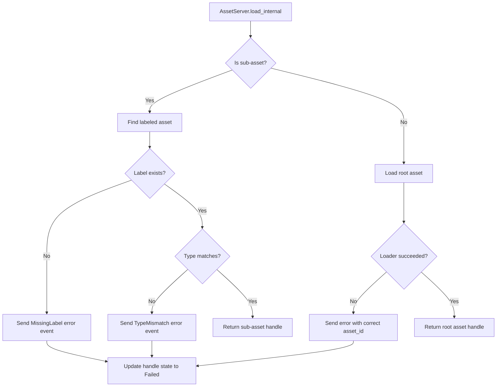

+++
title = "#22628 Fix failed sub-asset loads getting stuck in `LoadState::Loading`"
date = "2026-02-02T00:00:00"
draft = false
template = "pull_request_page.html"
in_search_index = true

[taxonomies]
list_display = ["show"]

[extra]
current_language = "en"
available_languages = {"en" = { name = "English", url = "/pull_request/bevy/2026-02/pr-22628-en-20260202" }, "zh-cn" = { name = "中文", url = "/pull_request/bevy/2026-02/pr-22628-zh-cn-20260202" }}
labels = ["C-Bug", "A-Assets"]
+++

# Title
Fix failed sub-asset loads getting stuck in `LoadState::Loading`

## Basic Information
- **Title**: Fix failed sub-asset loads getting stuck in `LoadState::Loading`
- **PR Link**: https://github.com/bevyengine/bevy/pull/22628
- **Author**: greeble-dev
- **Status**: MERGED
- **Labels**: C-Bug, A-Assets, S-Ready-For-Final-Review
- **Created**: 2026-01-21T17:16:05Z
- **Merged**: 2026-02-02T23:26:53Z
- **Merged By**: alice-i-cecile

## Description Translation
Objective

Fix #22607. Also add a test that reproduces the issues.

If it makes things clearer, I can split this into an "add a test" PR and a separate "fix the bug" PR.

Solution

There are three additions to `AssetServer::load_internal` that each fix a separate case. In source code order:

### Case 1

```rust
// Sub-asset exists, but is not of type `WrongAssetType`.
asset_server.load::<WrongAssetType>("asset#subasset");
```

Previously this would silently fail - the asset would successfully load, but the handle can't actually resolve to that asset so it's stuck in limbo.

Fixed by adding a type check, then sending a `AssetLoadError::RequestedHandleTypeMismatch` event and returning it as an error.

Note that this doesn't prevent someone loading the asset with the correct type - the error is only associated with the `<WrongAssetType>` handle.

### Case 2

```rust
// Sub-asset doesn't exist.
asset_server.load::<AssetType>("asset#non_existent_subasset");
```

Previously this was detected and would return a `AssetLoadError::MissingLabel` error from `load_internal`, but the load status for the handle wasn't set.

Fixed by sending an `InternalAssetEvent::Failed`.

### Case 3
```rust
// Asset loader returns an error.
asset_server.load::<AssetType>("malformed_asset#subasset");
```

Previously this was detected, but the event was sent with the root asset's id (`base_asset_id`) so it wasn't associated with the sub-asset's handle.

Fixed by using the sub-asset's id.

### Notes

Some of the events are only sent if `asset_id` is set. This might seem odd, but I think it's correct - `asset_id` can only be unset when using `load_untyped` with a sub-asset path, in which case there's no handle to associate with the error, and so there's no handle to pass to `get_load_status`.

## Testing

```sh
cargo test -p bevy_asset
cargo test -p bevy_asset --features "multi_threaded"
```

## The Story of This Pull Request

The issue (#22607) reported a bug where sub-assets could get stuck in a perpetual `LoadState::Loading` state when certain types of failures occurred. This created problems for developers who needed to know when asset loading had definitively failed so they could handle errors appropriately or retry the operation. The bug was particularly problematic because it affected three distinct failure scenarios, each requiring a different fix.

At its core, the problem was in the `AssetServer::load_internal` method, which handles the loading of both root assets and sub-assets (assets referenced by labels like `"asset#subasset"`). When loading failed, the method wasn't properly notifying the asset system about the failure for sub-assets, leaving their handles stuck in a loading state.

The developer identified three specific failure cases:

1. **Type mismatch for existing sub-assets**: When a developer requested a sub-asset with the wrong type (e.g., loading a `Texture` handle for an asset that was actually a `Mesh`), the system would successfully load the parent asset but then fail to connect the handle to the actual asset data. The handle would remain in `LoadState::Loading` indefinitely because no failure event was sent.

2. **Missing sub-asset labels**: When a developer requested a sub-asset that didn't exist (e.g., `"asset#nonexistent"`), the system detected the missing label and returned an error, but it didn't send the appropriate `InternalAssetEvent::Failed` event. Without this event, the asset handle's load state never updated from `Loading` to `Failed`.

3. **Loader errors for sub-assets**: When the asset loader failed to parse or process the root asset (which contains the sub-asset), the system was sending the failure event with the wrong asset ID. It used the root asset's ID (`base_asset_id`) instead of the sub-asset's ID, so the sub-asset handle never received the failure notification.

The solution implemented checks for each case in the `load_internal` method. For the type mismatch case, the code now verifies that the requested asset type matches the actual type of the labeled asset before returning a handle. If there's a mismatch, it sends a `RequestedHandleTypeMismatch` error event. For the missing label case, the code now sends a `Failed` event before returning the error. For loader errors, the code now uses the correct asset ID when sending the failure event.

An important design consideration was that these failure events are only sent when `asset_id` is set. This is correct because `asset_id` represents the specific handle being loaded. When using `load_untyped` with a sub-asset path, there's no typed handle to track, so there's no need to send failure events that would update a handle's load state.

The implementation also includes comprehensive tests that verify each failure case now correctly transitions the asset handle to a `Failed` state. These tests use a helper function `test_load_state` that loads assets and checks their final load state against expected values. The tests cover normal successful loads, various failure modes, and edge cases to ensure the fixes work correctly.

From an architectural perspective, this fix maintains the existing event-driven design of Bevy's asset system. Assets communicate their state through events, and handles listen for these events to update their internal state. The bug occurred because certain failure paths weren't emitting the expected events for sub-assets, breaking the communication chain between asset loading and handle state management.

## Visual Representation



## Key Files Changed

### `crates/bevy_asset/src/server/mod.rs` (+38/-8)

This file contains the main fix in the `AssetServer::load_internal` method. The changes add proper error handling for three sub-asset loading failure cases.

**Key changes:**

1. **Type mismatch check for labeled assets**:
```rust
// Before: No type checking for labeled assets
Some(labeled_asset) => Some(labeled_asset.handle.clone()),

// After: Added type verification with error handling
Some(labeled_asset) => {
    // If we know the requested type then check it
    // matches the labeled asset.
    if let Some(asset_id) = asset_id
        && asset_id.type_id != labeled_asset.handle.type_id()
    {
        let error = AssetLoadError::RequestedHandleTypeMismatch {
            path: path.clone(),
            requested: asset_id.type_id,
            actual_asset_name: labeled_asset.asset.value.asset_type_name(),
            loader_name: loader.type_path(),
        };
        self.send_asset_event(InternalAssetEvent::Failed {
            index: asset_id,
            error: error.clone(),
            path: path.into_owned(),
        });
        return Err(error);
    }
    Some(labeled_asset.handle.clone())
}
```

2. **Missing label error event**:
```rust
// Before: Just returned error without sending event
return Err(AssetLoadError::MissingLabel {
    base_path,
    label: label.to_string(),
    all_labels,
});

// After: Send failure event before returning error
let error = AssetLoadError::MissingLabel {
    base_path,
    label: label.to_string(),
    all_labels,
};
if let Some(asset_id) = asset_id {
    self.send_asset_event(InternalAssetEvent::Failed {
        index: asset_id,
        error: error.clone(),
        path: path.into_owned(),
    });
}
return Err(error);
```

3. **Correct asset ID for loader errors**:
```rust
// Before: Used base_asset_id for all failures
self.send_asset_event(InternalAssetEvent::Failed {
    index: base_asset_id,  // Wrong for sub-assets
    error: err.clone(),
    path: path.into_owned(),
});

// After: Use the specific asset_id for the handle being loaded
if let Some(asset_id) = asset_id {
    self.send_asset_event(InternalAssetEvent::Failed {
        index: asset_id,  // Correct for sub-assets
        error: err.clone(),
        path: path.into_owned(),
    });
}
```

### `crates/bevy_asset/src/lib.rs` (+166/-1)

This file contains the comprehensive test suite that validates the fix works for all identified failure cases.

**Key additions:**

1. **Test infrastructure**:
   - Added `TestLoadState` enum for simplified load state comparison
   - Added `TestAssetLoadError` enum for simplified error comparison
   - Added `test_load_state` helper function that sets up an app, loads an asset, and verifies the final load state

2. **Comprehensive test cases**:
```rust
#[test]
fn load_failure() {
    // Tests various failure scenarios including:
    test_load_state::<CoolText>("root asset exists", "test.cool.ron", TestLoadState::Loaded);
    test_load_state::<SubText>("sub-asset exists", "test.cool.ron#subasset", TestLoadState::Loaded);
    test_load_state::<CoolText>("root asset does not exist", "does_not_exist.cool.ron", TestLoadState::Failed(TestAssetLoadError::AssetReaderErrorNotFound));
    test_load_state::<SubText>("sub-asset does not exist", "test.cool.ron#does_not_exist", TestLoadState::Failed(TestAssetLoadError::MissingLabel));
    test_load_state::<CoolText>("sub-asset is not requested type", "test.cool.ron#subasset", TestLoadState::Failed(TestAssetLoadError::RequestedHandleTypeMismatch { requested: TypeId::of::<CoolText>(), actual_asset_name: "bevy_asset::tests::SubText" }));
    test_load_state::<CoolText>("malformed root asset", "malformed.cool.ron", TestLoadState::Failed(TestAssetLoadError::AssetLoaderError));
    test_load_state::<CoolText>("sub-asset of malformed root asset", "malformed.cool.ron#subasset", TestLoadState::Failed(TestAssetLoadError::AssetLoaderError));
    test_load_state::<LoaderlessAsset>("root asset has no loader", "loaderless", TestLoadState::Failed(TestAssetLoadError::MissingAssetLoader));
}
```

## Further Reading

1. [Bevy Asset System Documentation](https://docs.rs/bevy_asset/latest/bevy_asset/) - Official documentation for Bevy's asset system
2. [Asset Loading in Bevy](https://bevy-cheatbook.github.io/features/assets.html) - Comprehensive guide to asset loading patterns
3. [Handling Errors in Async Systems](https://doc.rust-lang.org/book/ch09-00-error-handling.html) - Rust error handling patterns relevant to async asset loading
4. [Type IDs and Reflection in Rust](https://doc.rust-lang.org/std/any/index.html) - Understanding TypeId and type comparison used in the fix