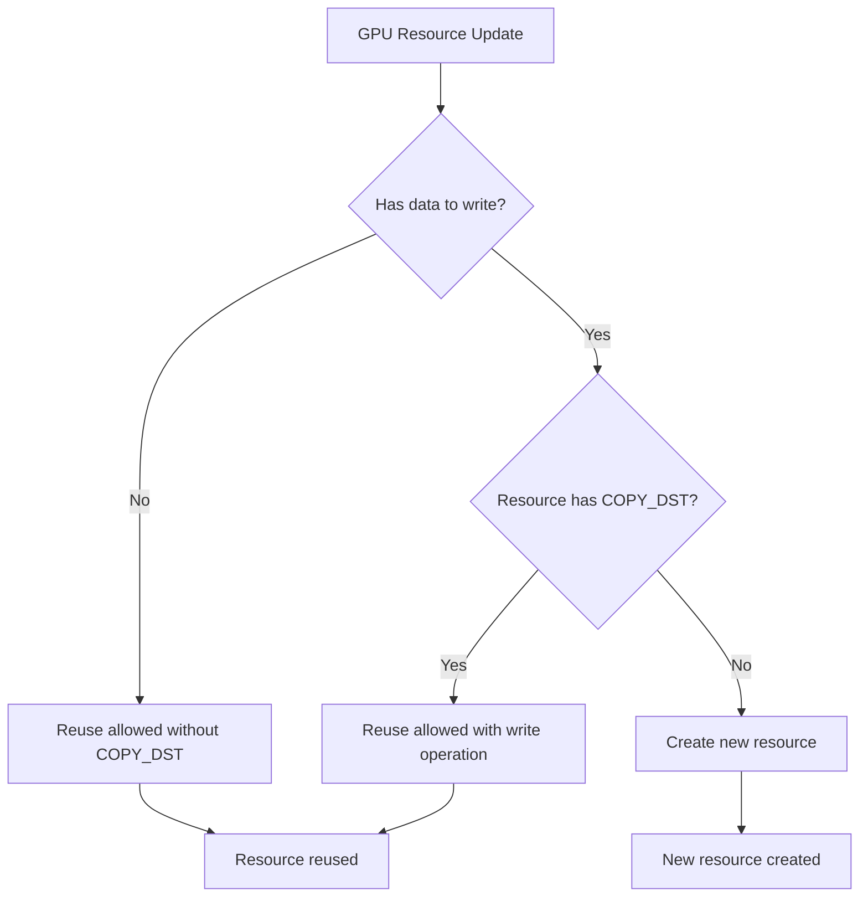

+++
title = "#22632 Don't require image/buffer to have COPY_DST to reuse if no data"
date = "2026-02-15T00:00:00"
draft = false
template = "pull_request_page.html"
in_search_index = true

[taxonomies]
list_display = ["show"]

[extra]
current_language = "en"
available_languages = {"en" = { name = "English", url = "/pull_request/bevy/2026-02/pr-22632-en-20260215" }, "zh-cn" = { name = "中文", url = "/pull_request/bevy/2026-02/pr-22632-zh-cn-20260215" }}
labels = ["A-Rendering", "C-Usability", "D-Straightforward"]
+++

# Title

## Basic Information
- **Title**: Don't require image/buffer to have COPY_DST to reuse if no data
- **PR Link**: https://github.com/bevyengine/bevy/pull/22632
- **Author**: beicause
- **Status**: MERGED
- **Labels**: A-Rendering, C-Usability, D-Straightforward, S-Needs-Review
- **Created**: 2026-01-21T19:56:10Z
- **Merged**: 2026-02-15T14:31:43Z
- **Merged By**: mockersf

## Description Translation

# Objective

If image/buffer don't have data, we won't call `write_texture`/`write_buffer` so we can reuse them even if they don't have `COPY_DST` usage.

## Solution

` (!had_data || usage contains COPY_DST)`

## Testing

Manually tested.

## The Story of This Pull Request

This PR addresses a specific optimization opportunity in Bevy's rendering system where GPU resource reuse was unnecessarily restricted. The problem emerged from how Bevy handles GPU resources like textures and buffers when they're updated or reused between frames.

In Bevy's rendering architecture, when a texture or buffer needs to be updated on the GPU, the system checks whether it can reuse an existing GPU resource. This check includes verifying that the resource has the `COPY_DST` usage flag, which is required for writing data to the resource via commands like `write_texture` or `write_buffer`. This requirement makes logical sense when there's actual data to copy - without `COPY_DST`, the write operation would fail.

However, the implementation had a subtle oversight: it required `COPY_DST` even when there was *no data to write*. Consider a scenario where a texture or buffer is being updated, but the update doesn't include any actual data payload (perhaps because it's being cleared or initialized with default values). In such cases, the system wouldn't call `write_texture` or `write_buffer` at all, so the `COPY_DST` requirement was unnecessary.

The fix is straightforward but important for resource optimization. By modifying the condition from:
```rust
&& usage.contains(COPY_DST)
```
to:
```rust
&& (!had_data || usage.contains(COPY_DST))
```

the system now allows resource reuse when either:
1. There's no data to write (so `COPY_DST` isn't needed), OR
2. There is data to write AND the resource has `COPY_DST`

This change improves resource utilization by allowing more textures and buffers to be reused across frames. In scenarios where resources are frequently updated without data payloads (common in certain rendering techniques or when resources are used in multiple contexts), this can reduce GPU memory allocations and improve performance.

The implementation change is minimal but demonstrates careful attention to the actual usage patterns of GPU resources. It reflects an understanding that WebGPU and similar APIs enforce strict validation of resource usage flags, and we should only require those flags when they're genuinely needed for the operations we perform.

From an architectural perspective, this change maintains the safety guarantees of the system while expanding its flexibility. Resources without `COPY_DST` that don't need data writes can now participate in the reuse optimization, which is particularly valuable for resources that serve as render targets or that are populated via compute shaders rather than CPU data uploads.

## Visual Representation



## Key Files Changed

### `crates/bevy_render/src/storage.rs` (+5/-4)

This file handles GPU buffer storage. The change modifies the condition for reusing a GPU buffer when it's being updated.

**Key change:**
```rust
// Before:
&& source_asset
    .buffer_description
    .usage
    .contains(BufferUsages::COPY_DST)

// After:
&& (!had_data
    || source_asset
        .buffer_description
        .usage
        .contains(BufferUsages::COPY_DST))
```

The logic now checks whether there's data to write (`had_data`) before requiring the `COPY_DST` usage flag. If there's no data, the buffer can be reused regardless of whether it has `COPY_DST`.

### `crates/bevy_render/src/texture/gpu_image.rs` (+5/-4)

This file manages GPU image (texture) resources. The change applies the same logic to texture reuse.

**Key change:**
```rust
// Before:
&& prev
    .texture_descriptor
    .usage
    .contains(TextureUsages::COPY_DST)

// After:
&& (!had_data
    || prev
        .texture_descriptor
        .usage
        .contains(TextureUsages::COPY_DST))
```

The texture reuse logic now follows the same pattern as buffers: require `COPY_DST` only when there's actual texture data to upload.

## Further Reading

1. **WebGPU Specification - Buffer Usages**: Understanding the different buffer usage flags including `COPY_DST`, `COPY_SRC`, `STORAGE`, etc.
2. **Bevy Render Asset System**: Documentation on how Bevy manages GPU resources and the `RenderAsset` trait
3. **GPU Resource Reuse Patterns**: Common techniques for efficient GPU memory management in game engines
4. **WebGPU Validation Rules**: How graphics APIs validate resource usage to prevent errors