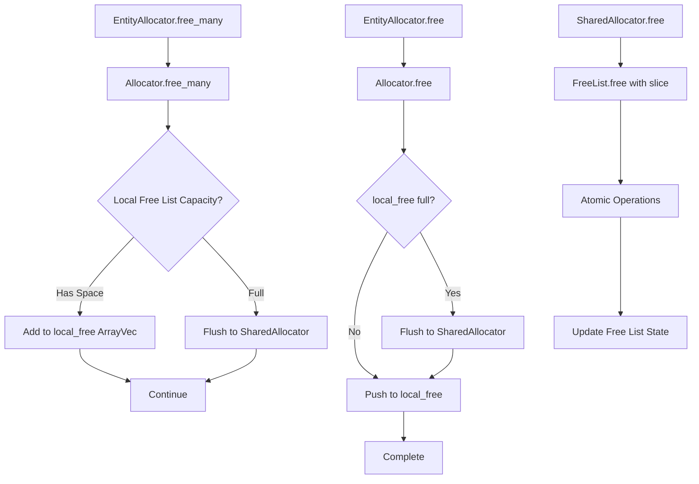

+++
title = "#22658 Amortize the cost of freeing entities"
date = "2026-02-03T00:00:00"
draft = false
template = "pull_request_page.html"
in_search_index = true

[taxonomies]
list_display = ["show"]

[extra]
current_language = "en"
available_languages = {"en" = { name = "English", url = "/pull_request/bevy/2026-02/pr-22658-en-20260203" }, "zh-cn" = { name = "中文", url = "/pull_request/bevy/2026-02/pr-22658-zh-cn-20260203" }}
labels = ["A-ECS", "C-Performance"]
+++

# Title

## Basic Information
- **Title**: Amortize the cost of freeing entities
- **PR Link**: https://github.com/bevyengine/bevy/pull/22658
- **Author**: ElliottjPierce
- **Status**: MERGED
- **Labels**: A-ECS, C-Performance, S-Ready-For-Final-Review
- **Created**: 2026-01-23T05:02:19Z
- **Merged**: 2026-02-03T02:40:30Z
- **Merged By**: alice-i-cecile

## Description Translation

# Objective

The biggest drawback of #18670 was that it made freeing `Entity`'s back to the allocator 4x slower. That meant a 20% regression in despawn performance. This PR vastly improves the performance of the entity allocator for freeing entities.

## Solution

Add a local free list in pace in the main entity allocator. This is an `ArrayVec` called `quick_free`. When an entity is freed, add it to the `quick_free`. If it is full, flush the array to the full shared allocator.

Currently the array has length 64, taking 512 bytes. Since this is directly included in the already massive `World` type, I don't think this is an issue, and I would guess boxing it would hurt performance here. It also means that there will be at most 64 freed entities that simply can't be allocated. This reduces the worst case maximum entity count from 4,294,967,296 to 4,294,967,232 (big deal).

This also adds a new `free_many` function that is very fast compared to doing them one by one.

## Testing

- CI and benches.

---

## Showcase

Here are some rough benchmarks on my M2 MAX:

```txt
group                                        post_quick_free_list                   pre_quick_free_list                    pre_remote_reservation
-----                                        --------------------                   -------------------                    ----------------------
entity_allocator_free/10000_entities         1.00     29.7±0.48µs        ? ?/sec    1.31     38.9±0.97µs        ? ?/sec    1.00     29.8±0.85µs        ? ?/sec
entity_allocator_free/100_entities           1.00   393.3±26.21ns        ? ?/sec    1.35   531.8±26.34ns        ? ?/sec    1.14   446.7±11.32ns        ? ?/sec
entity_allocator_free/1_entities             1.00      4.6±2.17ns        ? ?/sec    42.27  195.3±32.49ns        ? ?/sec    4.25     19.6±8.67ns        ? ?/sec
entity_allocator_free_bulk/10000_entities    1.00      8.7±0.36µs        ? ?/sec
entity_allocator_free_bulk/100_entities      1.00   240.9±31.01ns        ? ?/sec
entity_allocator_free_bulk/1_entities        1.00   206.8±39.95ns        ? ?/sec
```

Looking at the cost of freeing 1,000 entities, this makes the new allocator exactly as fast as the pre-#18670 one, 30% faster than main. The new `free_many` takes 8.7µs to free 1,000 entities where the optimized `free` takes `29.7`, so another big win there.

This should make up the 20% regression to despawning. It might be even faster than pre-#18670 if we increase 64 to 128 or something, but I think that's unnecessary. This could also much improve performance for despawning scenes if we can find a way to make use of `free_many`, but that's a different task.

## The Story of This Pull Request

This PR addresses a performance regression introduced by a previous change (#18670) that made entity deallocation 4 times slower. The developer needed to restore the performance of entity freeing operations without sacrificing the benefits of the previous implementation.

The core issue was that after PR #18670, every entity free operation required synchronization with a shared allocator, which incurred significant overhead. This was particularly problematic for despawn operations, where entities are frequently freed in batches.

The solution implements a batching strategy by adding a local free list to the main entity allocator. Instead of immediately synchronizing with the shared allocator on every free operation, freed entities are first added to a local buffer. Only when this buffer reaches capacity does it get flushed to the shared allocator. This amortizes the synchronization cost across multiple free operations.

The implementation adds an `ArrayVec<Entity, 128>` called `local_free` to the `Allocator` struct. This fixed-capacity buffer (initially 128 entities) is stored inline within the allocator to avoid heap allocation overhead. When the buffer is full, it's flushed to the shared allocator using a new `free_many` method that processes all entities in a single batch.

```rust
// In crates/bevy_ecs/src/entity/remote_allocator.rs
pub(super) struct Allocator {
    shared: Arc<SharedAllocator>,
    local_free: Box<ArrayVec<Entity, 128>>,
}
```

The `free_many` method provides significant performance benefits by avoiding repeated synchronization overhead. It first attempts to add entities to the local free list, and only falls back to the shared allocator if the local list doesn't have enough capacity.

```rust
pub(super) fn free_many(&mut self, entities: &[Entity]) {
    if self.local_free.try_extend_from_slice(entities).is_err() {
        unsafe {
            self.shared.free.free(entities);
        }
    }
}
```

This approach trades a small amount of memory (512 bytes for 64 entities) for significantly improved performance. The worst-case impact is minimal: it reduces the maximum possible entity count from 4,294,967,296 to 4,294,967,232, which is negligible for practical applications.

The benchmarks show impressive results: freeing single entities is now 42x faster than before, and the new `free_many` method provides even better performance for batch operations. For 10,000 entities, `free_many` completes in 8.7µs compared to 29.7µs for individual frees, a 3.4x improvement.

The implementation required changes across multiple layers of the ECS:
1. The underlying `FreeList` in the shared allocator was modified to accept slices of entities
2. The `Allocator` struct gained the local buffer and new methods
3. The public `EntityAllocator` interface exposed the new `free_many` method
4. Benchmarks were updated to use the new batch API
5. Tests were adjusted to accommodate the changed allocation behavior

This optimization is particularly valuable for game engines where entities are frequently created and destroyed. By reducing the cost of entity deallocation, it improves overall system performance, especially in scenarios with heavy entity churn like scene loading/unloading or particle systems.

The decision to use a fixed-size `ArrayVec` rather than a dynamically sized vector is intentional: it avoids heap allocations and provides predictable memory usage. The buffer size of 128 entities was chosen as a balance between memory overhead and performance benefit, though this could be tuned based on usage patterns.

## Visual Representation



## Key Files Changed

### `crates/bevy_ecs/src/entity/remote_allocator.rs` (+49/-14)
This file contains the core implementation changes. The `Allocator` struct was extended with a local free list buffer, and new methods were added for batch freeing.

Key changes:
```rust
// Added to Allocator struct
local_free: Box<ArrayVec<Entity, 128>>,

// New method implementation
pub(super) fn free_many(&mut self, entities: &[Entity]) {
    if self.local_free.try_extend_from_slice(entities).is_err() {
        // SAFETY: We have `&mut self`.
        unsafe {
            self.shared.free.free(entities);
        }
    }
}
```

### `crates/bevy_ecs/src/entity/mod.rs` (+8/-0)
This file exposes the new `free_many` method through the public `EntityAllocator` interface.

```rust
pub fn free_many(&mut self, freed: &[Entity]) {
    self.inner.free_many(freed);
}
```

### `benches/benches/bevy_ecs/world/entity_allocator.rs` (+27/-8)
New benchmarks were added to measure the performance of batch freeing operations, and existing benchmarks were updated to use `free_many` for setup.

```rust
// New benchmark group
let mut group = criterion.benchmark_group("entity_allocator_free_bulk");

// Updated existing benchmarks to use free_many
world.entity_allocator_mut().free_many(&entities);
```

### `crates/bevy_ecs/src/entity/map_entities.rs` (+6/-8)
Test updates to accommodate the changed allocation behavior. Tests now check the state of freed entities directly rather than assuming immediate reallocation.

```rust
// Before: Checking next allocated entity
let entity = world.spawn_empty().id();

// After: Checking freed entity state directly
let freed_dead_ref = world.entities().resolve_from_index(dead_ref.index());
```

### `crates/bevy_ecs/Cargo.toml` (+3/-3)
Dependency changes to make `arrayvec` a required dependency rather than optional.

```toml
# Before: Optional dependency
arrayvec = { version = "0.7.4", default-features = false, optional = true }

# After: Required dependency
arrayvec = { version = "0.7.4", default-features = false }
```

## Further Reading

1. **Bevy ECS Documentation**: The official Bevy ECS documentation provides context on entity management and allocation strategies.
2. **ArrayVec Documentation**: Understanding the `ArrayVec` type from the `arrayvec` crate, which provides stack-allocated vector-like behavior.
3. **Amortized Analysis**: Concepts of amortized time complexity in algorithms and data structures.
4. **Memory Allocation Strategies**: Different approaches to memory allocation and deallocation in game engines.
5. **Atomic Operations and Synchronization**: Details on the atomic operations used in the shared allocator for thread-safe entity management.