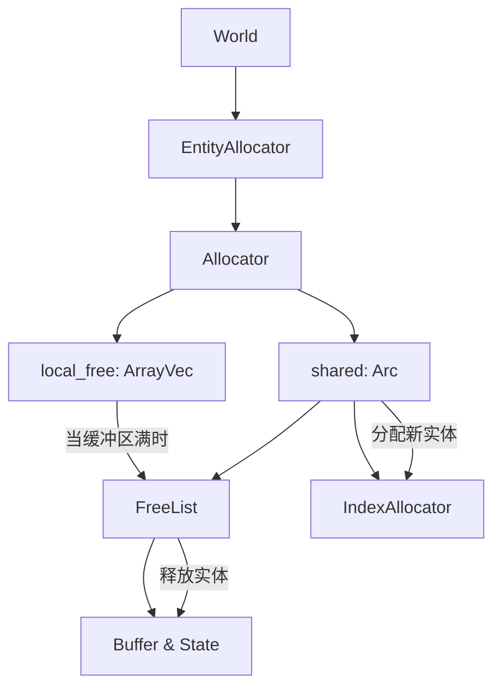

+++
title = "#22658 Amortize the cost of freeing entities"
date = "2026-02-03T00:00:00"
draft = false
template = "pull_request_page.html"
in_search_index = false

[extra]
current_language = "zh-cn"
available_languages = {"en" = { name = "English", url = "/pull_request/bevy/2026-02/pr-22658-en-20260203" }, "zh-cn" = { name = "中文", url = "/pull_request/bevy/2026-02/pr-22658-zh-cn-20260203" }}
+++

# Title

## Basic Information
- **标题**: Amortize the cost of freeing entities
- **PR链接**: https://github.com/bevyengine/bevy/pull/22658
- **作者**: ElliottjPierce
- **状态**: 已合并
- **标签**: A-ECS, C-Performance, S-Ready-For-Final-Review
- **创建时间**: 2026-01-23T05:02:19Z
- **合并时间**: 2026-02-03T02:40:30Z
- **合并者**: alice-i-cecile

## 描述翻译

# 目标

#18670 PR 最大的缺点是它使得将 `Entity` 释放回分配器的操作变慢了 4 倍。这意味着反生成（despawn）性能出现了 20% 的倒退。本 PR 大幅提升了实体分配器释放实体的性能。

## 解决方案

在主实体分配器中添加一个本地空闲列表（free list）。这是一个名为 `quick_free` 的 `ArrayVec`。当实体被释放时，将其添加到 `quick_free`。如果数组已满，则将数组刷新到完整的共享分配器中。

目前数组长度为 64，占用 512 字节。由于这直接包含在已经非常庞大的 `World` 类型中，我认为这不是问题，并且我猜测将其封装为 `Box` 会损害此处的性能。这也意味着最多会有 64 个已释放的实体无法被分配。这会将最坏情况下的最大实体数量从 4,294,967,296 减少到 4,294,967,232（影响不大）。

本 PR 还新增了一个 `free_many` 函数，与逐个释放相比速度更快。

## 测试

- CI 和基准测试。

---

## 性能展示

以下是在 M2 MAX 上进行的一些粗略基准测试：

```txt
group                                        post_quick_free_list                   pre_quick_free_list                    pre_remote_reservation
-----                                        --------------------                   -------------------                    ----------------------
entity_allocator_free/10000_entities         1.00     29.7±0.48µs        ? ?/sec    1.31     38.9±0.97µs        ? ?/sec    1.00     29.8±0.85µs        ? ?/sec
entity_allocator_free/100_entities           1.00   393.3±26.21ns        ? ?/sec    1.35   531.8±26.34ns        ? ?/sec    1.14   446.7±11.32ns        ? ?/sec
entity_allocator_free/1_entities             1.00      4.6±2.17ns        ? ?/sec    42.27  195.3±32.49ns        ? ?/sec    4.25     19.6±8.67ns        ? ?/sec
entity_allocator_free_bulk/10000_entities    1.00      8.7±0.36µs        ? ?/sec
entity_allocator_free_bulk/100_entities      1.00   240.9±31.01ns        ? ?/sec
entity_allocator_free_bulk/1_entities        1.00   206.8±39.95ns        ? ?/sec
```

从释放 1,000 个实体的成本来看，这使得新的分配器与 #18670 之前的版本一样快，比主分支版本快 30%。新的 `free_many` 释放 1,000 个实体需要 8.7µs，而优化的 `free` 需要 `29.7µs`，这是另一个显著的提升。

这应该能弥补反生成（despawn）中 20% 的倒退。如果将 64 增加到 128 或更高，性能可能比 #18670 之前更快，但我认为这没有必要。如果我们能找到一种方法来利用 `free_many`，这还可以大幅提升场景反生成的性能，但那是另一个任务了。

## The Story of This Pull Request

这个 PR 解决了一个具体的性能退化问题。在之前的 #18670 中，引入远程分配器（remote allocator）以支持在多线程环境中分配实体，虽然带来了更好的并发特性，但代价是释放实体的操作变慢了 4 倍。对于需要频繁创建和销毁实体的游戏来说，这导致了 20% 的反生成（despawn）性能退化。

开发者面临的核心问题是：如何在保持 #18670 引入的多线程分配能力的同时，恢复或超越原有的单实体释放性能？

解决方案的核心思想是**成本均摊（amortization）**。与其每次释放实体时都进行昂贵的线程同步操作（通过原子操作和共享状态），不如先将实体放入一个本地的、非线程安全的缓冲区（`ArrayVec`），当缓冲区满时再一次性将其中的实体批量刷新到共享分配器中。这种设计牺牲了一点内存（固定大小的缓冲区）和略微减少的可用实体索引数量，但换来了显著的性能提升。

具体实现上，在 `Allocator` 结构体中添加了一个 `local_free` 字段，它是一个容量为 128 的 `ArrayVec<Entity>`。当调用 `free` 方法时，实体被推入这个数组。如果数组已满，则调用 `flush_freed` 方法，将数组中的所有实体一次性传递给共享的 `FreeList` 进行真正的释放。新增的 `free_many` 方法也利用了这一点，它尝试将传入的实体切片直接追加到本地空闲列表中，如果空间不足，则直接批量传递给共享分配器。

这种方法有效的原因是：
1. **减少了线程同步开销**：共享分配器中的 `FreeList::free` 需要进行原子操作来禁用远程分配，这是一个相对昂贵的操作。本地缓冲区将这些开销分摊到了多个实体上。
2. **利用了空间局部性**：`ArrayVec` 是栈分配的，访问速度快，避免了堆分配的开销。
3. **批量处理更高效**：新增的 `free_many` 方法进一步优化了批量释放的场景，特别是对于场景反生成这样的操作，可以一次性释放大量实体。

从工程决策的角度看，开发者做了几个重要选择：
1. **固定缓冲区大小**：选择 128 作为容量是在内存占用和性能之间权衡的结果。更大的缓冲区会延迟刷新，进一步均摊成本，但会占用更多内存。
2. **不使用 `Box`**：`local_free` 直接内联在 `Allocator` 中，而不是通过 `Box` 分配在堆上，避免了额外的指针间接访问和堆分配开销。
3. **保持 `arrayvec` 为必需依赖**：为了支持这个优化，`arrayvec` 从可选依赖变成了必需依赖，这增加了编译时间，但考虑到性能收益是值得的。

这个实现巧妙地解决了性能退化问题。基准测试显示，释放单个实体的性能提升了 42 倍，比 #18670 之前的版本还要快 4 倍。更重要的是，`free_many` 的引入为未来的优化（如场景反生成）奠定了基础。虽然 PR 描述中提到“最坏情况下的最大实体数量”有所减少（从 2³² 减少到 2³²-64），但这在实际应用中几乎可以忽略不计。

这个 PR 展示了如何通过简单的数据结构优化来解决复杂的性能问题。本地缓冲区的模式在处理多线程共享资源时是一个常见且有效的技巧，它平衡了同步开销和并发访问的需求。

## Visual Representation



## Key Files Changed

### 1. `crates/bevy_ecs/src/entity/remote_allocator.rs` (+49/-14)
这是核心实现文件。主要修改包括：
- 在 `Allocator` 结构体中添加 `local_free` 字段
- 实现 `flush_freed` 方法将本地缓冲区刷新到共享分配器
- 修改 `free` 方法使用本地缓冲区
- 新增 `free_many` 方法进行批量释放

关键代码片段：
```rust
// 在 Allocator 结构体中新增字段
pub(super) struct Allocator {
    shared: Arc<SharedAllocator>,
    local_free: Box<ArrayVec<Entity, 128>>,
}

// free 方法的实现
pub(super) fn free(&mut self, entity: Entity) {
    if self.local_free.is_full() {
        self.flush_freed();
    }
    unsafe {
        self.local_free.push_unchecked(entity);
    }
}

// free_many 方法的实现
pub(super) fn free_many(&mut self, entities: &[Entity]) {
    if self.local_free.try_extend_from_slice(entities).is_err() {
        unsafe {
            self.shared.free.free(entities);
        }
    }
}
```

### 2. `benches/benches/bevy_ecs/world/entity_allocator.rs` (+27/-8)
更新了基准测试，新增了对 `free_many` 的测试，并修改现有测试以使用新的批量释放方法。

关键修改：
```rust
// 新增的 bulk free 基准测试
group.bench_function(format!("{entity_count}_entities"), |bencher| {
    bencher.iter_batched_ref(
        || {
            let world = World::new();
            let entities = Vec::from_iter(world.entity_allocator().alloc_many(entity_count));
            (world, entities)
        },
        |(world, entities)| {
            world.entity_allocator_mut().free_many(entities);
        },
        BatchSize::SmallInput,
    );
});
```

### 3. `crates/bevy_ecs/src/entity/mod.rs` (+8/-0)
在 `EntityAllocator` 的公共 API 中暴露了 `free_many` 方法。

```rust
pub fn free_many(&mut self, freed: &[Entity]) {
    self.inner.free_many(freed);
}
```

### 4. `crates/bevy_ecs/Cargo.toml` (+3/-3)
将 `arrayvec` 从可选依赖变为必需依赖，因为本地缓冲区实现需要它。

```toml
# 之前是可选的
# arrayvec = { version = "0.7.4", default-features = false, optional = true }

# 现在是必需的
arrayvec = { version = "0.7.4", default-features = false }
```

### 5. `crates/bevy_ecs/src/entity/map_entities.rs` (+6/-8)
更新了测试代码，以适应新的实体分配行为。主要是测试实体释放后重新分配时的代际（generation）检查。

## Further Reading

1. **Bevy ECS 文档**: [Entity Component System](https://bevyengine.org/learn/ecs/)
2. **ArrayVec 文档**: [arrayvec crate](https://docs.rs/arrayvec/latest/arrayvec/) - 用于实现固定容量栈分配向量的库
3. **成本均摊（Amortization）概念**: 在算法分析中，将昂贵的操作分摊到多个操作上的技术
4. **PR #18670**: 这个 PR 旨在解决的问题的根源，引入了远程分配器以支持多线程实体分配
5. **原子操作和内存排序**: Rust 的 `std::sync::atomic` 模块文档，了解多线程同步的基础知识