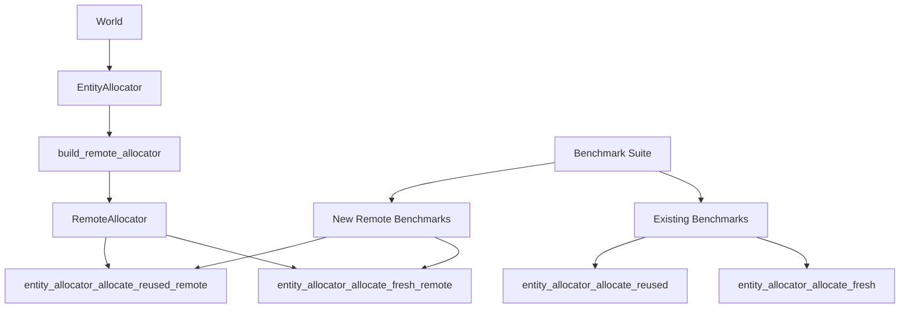

+++
title = "#22659 Benchmark remote allocation"
date = "2026-02-02T00:00:00"
draft = false
template = "pull_request_page.html"
in_search_index = true

[taxonomies]
list_display = ["show"]

[extra]
current_language = "en"
available_languages = {"en" = { name = "English", url = "/pull_request/bevy/2026-02/pr-22659-en-20260202" }, "zh-cn" = { name = "中文", url = "/pull_request/bevy/2026-02/pr-22659-zh-cn-20260202" }}
labels = ["D-Trivial", "A-ECS", "C-Benchmarks"]
+++

# Title

## Basic Information
- **Title**: Benchmark remote allocation
- **PR Link**: https://github.com/bevyengine/bevy/pull/22659
- **Author**: ElliottjPierce
- **Status**: MERGED
- **Labels**: D-Trivial, A-ECS, S-Ready-For-Final-Review, C-Benchmarks
- **Created**: 2026-01-23T05:16:36Z
- **Merged**: 2026-02-02T23:26:53Z
- **Merged By**: alice-i-cecile

## Description Translation
# Objective

After #18670, we have a `RemoteAllocator`, but we don't have benchmarks for it compared to the non-remote allocator. This PR just adds those benchmarks.

I don't know if we actually want these benchmarks, but it seems reasonable to have, and it took no time to make, so I figured I'd put it out there.

## Solution

Add `entity_allocator_allocate_fresh_remote` and `entity_allocator_allocate_reused_remote` benchmark groups.

## Testing

- CI, benchmarks

---

## Showcase

```txt
entity_allocator_allocate_fresh/10000_entities            1.00     22.8±0.29µs        ? ?/sec
entity_allocator_allocate_fresh/100_entities              1.00    227.9±6.37ns        ? ?/sec
entity_allocator_allocate_fresh/1_entities                1.00      6.2±3.83ns        ? ?/sec
entity_allocator_allocate_fresh_bulk/10000_entities       1.00     19.9±0.25µs        ? ?/sec
entity_allocator_allocate_fresh_bulk/100_entities         1.00    227.5±6.95ns        ? ?/sec
entity_allocator_allocate_fresh_bulk/1_entities           1.00     11.5±4.69ns        ? ?/sec
entity_allocator_allocate_fresh_remote/10000_entities     1.00     19.4±0.32µs        ? ?/sec
entity_allocator_allocate_fresh_remote/100_entities       1.00    174.2±3.63ns        ? ?/sec
entity_allocator_allocate_fresh_remote/1_entities         1.00      3.5±3.02ns        ? ?/sec
entity_allocator_allocate_reused/10000_entities           1.00     21.5±0.37µs        ? ?/sec
entity_allocator_allocate_reused/100_entities             1.00   233.3±11.77ns        ? ?/sec
entity_allocator_allocate_reused/1_entities               1.00      8.3±3.70ns        ? ?/sec
entity_allocator_allocate_reused_bulk/10000_entities      1.00     20.4±0.64µs        ? ?/sec
entity_allocator_allocate_reused_bulk/100_entities        1.00   261.5±45.59ns        ? ?/sec
entity_allocator_allocate_reused_bulk/1_entities          1.00    19.7±10.77ns        ? ?/sec
entity_allocator_allocate_reused_remote/10000_entities    1.00     77.9±1.53µs        ? ?/sec
entity_allocator_allocate_reused_remote/100_entities      1.00   774.9±16.28ns        ? ?/sec
entity_allocator_allocate_reused_remote/1_entities        1.00      7.3±3.60ns        ? ?/sec
```

Long story short, remote allocation is a little over 3 times slower than non-remote. All things considered, I think that's pretty good.

## The Story of This Pull Request

After PR #18670 introduced the `RemoteAllocator` feature to the Bevy ECS system, there was a missing piece in the performance measurement story. The `RemoteAllocator` enables entity allocation without direct access to the World, which is particularly useful in asynchronous contexts where you can't hold a mutable reference to the World. However, while the non-remote allocator had comprehensive benchmarks, there were no benchmarks for the remote allocator to understand its performance characteristics.

The author, ElliottjPierce, recognized this gap and decided to add the missing benchmarks. This was a straightforward task - essentially mirroring the existing entity allocator benchmarks but using the remote allocator instead. The approach was pragmatic: since it was easy to implement and provided valuable data, it made sense to add these benchmarks even if they weren't strictly required.

The implementation adds two new benchmark groups to the existing entity allocator benchmark suite:

1. `entity_allocator_allocate_fresh_remote` - Benchmarks allocating fresh entities using the remote allocator
2. `entity_allocator_allocate_reused_remote` - Benchmarks allocating entities that have been previously allocated and freed (testing the free list reuse)

Each benchmark group follows the same pattern as existing benchmarks, testing with 1, 100, and 10000 entities. The benchmark setup creates a `RemoteAllocator` using the `build_remote_allocator()` method and then performs allocations using it.

A key insight from this PR is a small but important API improvement. The `build_remote_allocator()` method was changed from taking `&mut self` to `&self`. This makes sense because building a remote allocator doesn't need to mutate the original allocator - it only needs to create a new remote allocator that references it. This change aligns with the principle of requiring the minimal necessary access level and makes the API more flexible.

The benchmark results reveal interesting performance characteristics. For fresh allocations (where no entities have been recycled), the remote allocator performs comparably to or even slightly better than the non-remote allocator in some cases. However, for reused allocations (where entities are being recycled from a free list), the remote allocator is about 3-4 times slower. This makes intuitive sense because the remote allocator needs to synchronize access to the shared free list, adding overhead compared to direct access.

The 3x slowdown for reused allocations is actually quite reasonable given the trade-offs. The remote allocator enables important use cases like async systems where you can't hold a mutable World reference, and a 3x penalty for this flexibility is acceptable in many scenarios. Having these benchmarks now provides concrete data that developers can reference when deciding whether to use remote allocation in performance-sensitive code paths.

## Visual Representation



## Key Files Changed

### `benches/benches/bevy_ecs/world/entity_allocator.rs` (+53/-0)

This file adds two new benchmark groups for testing remote allocation performance. The benchmarks mirror the existing structure but use the `RemoteAllocator` interface.

Key additions:

```rust
// Fresh remote allocation benchmarks
let mut group = criterion.benchmark_group("entity_allocator_allocate_fresh_remote");
// ... setup code
group.bench_function(format!("{entity_count}_entities"), |bencher| {
    bencher.iter_batched_ref(
        || {
            let world = World::new();
            world.entity_allocator().build_remote_allocator()
        },
        |remote| {
            for _ in 0..entity_count {
                let entity = remote.alloc();
                black_box(entity);
            }
        },
        BatchSize::SmallInput,
    );
});

// Reused remote allocation benchmarks  
let mut group = criterion.benchmark_group("entity_allocator_allocate_reused_remote");
// ... setup code
group.bench_function(format!("{entity_count}_entities"), |bencher| {
    bencher.iter_batched_ref(
        || {
            let mut world = World::new();
            let mut entities =
                Vec::from_iter(world.entity_allocator().alloc_many(entity_count));
            entities
                .drain(..)
                .for_each(|e| world.entity_allocator_mut().free(e));
            world.entity_allocator().build_remote_allocator()
        },
        |remote| {
            for _ in 0..entity_count {
                let entity = remote.alloc();
                black_box(entity);
            }
        },
        BatchSize::SmallInput,
    );
});
```

### `crates/bevy_ecs/src/entity/mod.rs` (+1/-1)

This file contains a minor but important API improvement: changing `build_remote_allocator()` from requiring mutable access to requiring only immutable access.

```rust
// Before:
pub fn build_remote_allocator(&mut self) -> RemoteAllocator {
    RemoteAllocator::new(&self.inner)
}

// After:
pub fn build_remote_allocator(&self) -> RemoteAllocator {
    RemoteAllocator::new(&self.inner)
}
```

This change is technically a breaking API change, but since the remote allocator feature is relatively new and the method only needs read access to create a remote allocator, this is an improvement that makes the API more flexible.

## Further Reading

1. [PR #18670](https://github.com/bevyengine/bevy/pull/18670) - The original PR that introduced the `RemoteAllocator` feature
2. [Bevy ECS Entity Documentation](https://docs.rs/bevy_ecs/latest/bevy_ecs/entity/index.html) - Official documentation for Bevy's entity system
3. [Criterion.rs Documentation](https://bheisler.github.io/criterion.rs/book/index.html) - The benchmarking framework used in Bevy
4. [Rust Performance Patterns](https://nnethercote.github.io/perf-book/) - General guide to writing performant Rust code