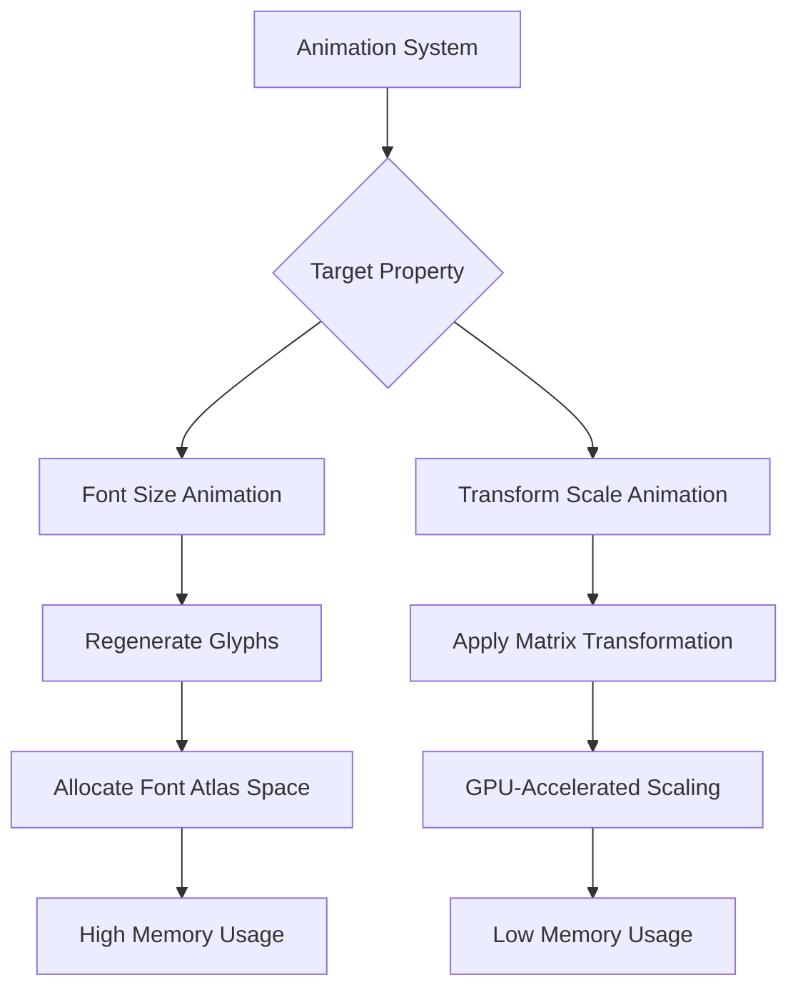

+++
title = "#22667 `animated_ui`: Animate `UiTransform::scale`, not `TextFont::font_size`"
date = "2026-02-04T00:00:00"
draft = false
template = "pull_request_page.html"
in_search_index = true

[taxonomies]
list_display = ["show"]

[extra]
current_language = "en"
available_languages = {"en" = { name = "English", url = "/pull_request/bevy/2026-02/pr-22667-en-20260204" }, "zh-cn" = { name = "中文", url = "/pull_request/bevy/2026-02/pr-22667-zh-cn-20260204" }}
labels = ["C-Bug", "C-Examples", "A-UI", "A-Animation", "D-Straightforward"]
+++

# Title
`animated_ui`: Animate `UiTransform::scale`, not `TextFont::font_size`

## Basic Information
- **Title**: `animated_ui`: Animate `UiTransform::scale`, not `TextFont::font_size`
- **PR Link**: https://github.com/bevyengine/bevy/pull/22667
- **Author**: ickshonpe
- **Status**: MERGED
- **Labels**: C-Bug, C-Examples, A-UI, S-Ready-For-Final-Review, A-Animation, D-Straightforward
- **Created**: 2026-01-23T11:18:19Z
- **Merged**: 2026-02-04T00:51:13Z
- **Merged By**: alice-i-cecile

## Description Translation
The original description is in English, so it is included exactly as-is:

# Objective

The animated_ui example interpolates the font size of the animated text entity, which rapidly generates gigabytes of font atlases.

Also, on main the text isn't even visible (and it still generates infinity font atlases). 

Fixes #22626, #22647

## Solution

Spawn the text with its font size set to the maximum value from the old animation curve. Then scale the text by interpolating the `UiTransform::scale` field, instead of the font size.

## Testing

```cargo run --example animated_ui```

The text should be visible and the memory usage should be stable.

## The Story of This Pull Request

This PR addresses a significant performance issue in Bevy's `animated_ui` example. The problem stemmed from animating font size directly, which caused excessive memory usage due to continuous regeneration of font atlases. The issue was severe enough to cause gigabytes of memory allocation and made the example practically unusable.

The root cause was that each time the font size changed during animation, the text rendering system had to regenerate glyphs at the new size and allocate space for them in font atlases. Since the example animated font size between 24px and 80px multiple times per second, this created a continuous stream of new glyph allocations, quickly exhausting available memory.

The developer approached this problem by changing what property was being animated. Instead of animating `TextFont::font_size`, which triggers expensive glyph regeneration, the solution animates `UiTransform::scale`, which applies a scaling transformation to already-rasterized text. This approach is fundamentally more efficient because scaling via transformation matrices is a GPU operation that doesn't require re-rasterizing text or allocating new font atlas space.

The implementation involved several key changes. First, the animation curve was modified to target `UiTransform::scale` instead of the custom `TextFontSizeProperty`. The curve values were changed from font sizes (24.0, 80.0, etc.) to scale factors (0.3, 1.0, etc.), and these values were converted to `Vec2::splat()` to scale uniformly in both dimensions.

Second, the text entity was spawned with a fixed font size of 80.0 (the maximum value from the original animation curve) instead of 24.0. This ensures the text starts at the largest size it would reach during animation, and the scaling transformation makes it smaller when needed.

Third, the custom `TextFontSizeProperty` implementation and its associated `AnimatableProperty` trait implementation were completely removed since they were no longer needed. This cleanup simplifies the codebase by removing specialized animation logic that was causing performance problems.

Fourth, the child entity creation was refactored from `entity.insert(children![...])` to `entity.with_child(...)`, which is a more modern and idiomatic way to add children in Bevy.

From an architectural perspective, this change demonstrates an important principle in graphics programming: when possible, use transformations rather than regenerating assets. The performance difference is dramatic - from gigabytes of memory allocation to stable, minimal memory usage.

The fix also resolved a secondary issue where the text wasn't visible on main. This was because the text started at 24px font size but was being scaled down further by the initial animation state, making it too small to see. By starting at 80px and scaling down to 30% (24px equivalent), the text remains visible throughout the animation cycle.

This PR serves as a good example of how to optimize UI animations in Bevy. The key takeaway is that animating transform properties (position, rotation, scale) is almost always more efficient than animating properties that require asset regeneration or complex recomputation.

## Visual Representation



## Key Files Changed

### `examples/animation/animated_ui.rs` (+11/-40)

This is the only file changed in the PR. The modifications completely overhaul how text scaling is animated in the example.

**Key Changes:**

1. **Animation target changed from font size to scale:**
```rust
// Before: Animating font size
TextFontSizeProperty,

// After: Animating UiTransform::scale
animated_field!(UiTransform::scale),
```

2. **Animation curve values updated:**
```rust
// Before: Font size values
.zip([24.0, 80.0, 24.0, 80.0, 24.0, 80.0, 24.0]),

// After: Scale values (0.3 = 24px/80px)
.zip([0.3, 1.0, 0.3, 1.0, 0.3, 1.0, 0.3].map(Vec2::splat)),
```

3. **Text entity spawned with maximum font size:**
```rust
// Before: Starting at 24px
font_size: FontSize::Px(24.0),

// After: Starting at 80px (maximum from old curve)
font_size: FontSize::Px(80.),
```

4. **Removed custom `TextFontSizeProperty` implementation:**
The entire `TextFontSizeProperty` struct and its `AnimatableProperty` implementation (40 lines) were removed since they're no longer needed.

5. **Updated child entity creation syntax:**
```rust
// Before: Using children! macro
entity.insert(children![...]);

// After: Using with_child method
entity.with_child(...);
```

These changes work together to fix the performance issue: the text is created at its maximum size (80px), then scaled down via `UiTransform::scale` to achieve the visual effect of changing size, without triggering expensive font atlas regeneration.

## Further Reading

1. **Bevy UI Documentation**: https://bevyengine.org/learn/quick-start/ui/
2. **Bevy Animation System**: https://bevyengine.org/learn/quick-start/animation/
3. **Font Atlas Management in Bevy**: The `bevy_text` crate documentation explains how font atlases work
4. **GPU Transformations**: Understanding how matrix transformations work on the GPU helps explain why scaling is more efficient than regenerating assets
5. **Related Issues**: #22626 and #22647 provide additional context about the specific problems this PR solves