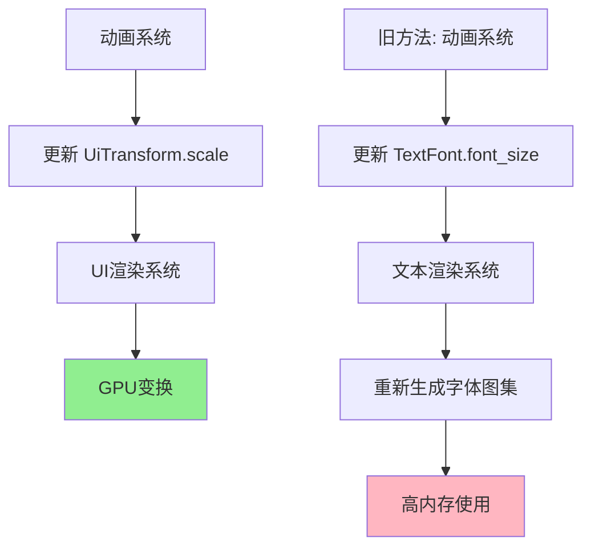

+++
title = "#22667 animated_ui`: 动画化 `UiTransform::scale`，而不是 `TextFont::font_size"
date = "2026-02-04T00:00:00"
draft = false
template = "pull_request_page.html"
in_search_index = false

[extra]
current_language = "zh-cn"
available_languages = {"en" = { name = "English", url = "/pull_request/bevy/2026-02/pr-22667-en-20260204" }, "zh-cn" = { name = "中文", url = "/pull_request/bevy/2026-02/pr-22667-zh-cn-20260204" }}
+++

# 标题

## 基本信息
- **标题**: `animated_ui`: 动画化 `UiTransform::scale`，而不是 `TextFont::font_size`
- **PR链接**: https://github.com/bevyengine/bevy/pull/22667
- **作者**: ickshonpe
- **状态**: 已合并
- **标签**: C-Bug, C-Examples, A-UI, S-Ready-For-Final-Review, A-Animation, D-Straightforward
- **创建时间**: 2026-01-23T11:18:19Z
- **合并时间**: 2026-02-04T00:51:13Z
- **合并者**: alice-i-cecile

## 描述翻译

# 目标

`animated_ui` 示例对动画文本实体的字体大小进行插值，这会导致快速生成数GB的字体图集。

此外，在主分支上，文本甚至不可见（并且仍然生成无限的字体图集）。

修复 #22626, #22647

## 解决方案

将文本的字体大小设置为旧动画曲线中的最大值来生成文本。然后通过对 `UiTransform::scale` 字段进行插值来缩放文本，而不是对字体大小进行插值。

## 测试

```cargo run --example animated_ui```

文本应该可见，内存使用应该稳定。

## 这个PR的故事

这个PR从一个看似简单的性能问题开始：`animated_ui` 示例在运行时消耗了过多内存。问题的根源在于动画系统如何与Bevy的UI文本渲染交互。

问题的本质是技术性的。原始的示例创建了一个自定义的 `TextFontSizeProperty` 来实现对 `TextFont` 组件中 `font_size` 字段的动画。当动画系统每秒多次更新字体大小时，Bevy的文本渲染系统需要为每个新的大小重新生成字体图集。字体图集是包含所有渲染字符纹理的图像，每次字体大小变化都需要重建整个图集，这在动画循环中产生了巨大的内存和性能开销。

更糟糕的是，在主分支上还有一个额外的bug：文本完全不可见，但系统仍在生成这些图集，导致资源浪费而没有视觉反馈。这个问题被两个issue追踪：#22626 和 #22647。

开发者采取了一个巧妙的解决方案。不是直接动画化字体大小，而是改为动画化 `UiTransform` 组件的 `scale` 属性。这个方法的优势在于：
1. 缩放是一个变换操作，不涉及字体重建
2. 它使用现有的 `UiTransform` 系统，该系统已经优化用于处理UI元素的变换
3. 它避免了昂贵的字体图集重新生成

实现分为几个关键部分。首先，开发者更新了动画曲线创建逻辑，从动画化 `TextFontSizeProperty` 改为动画化 `UiTransform::scale`。使用了 `animated_field!` 宏来安全地引用 `scale` 字段：

```rust
// 之前：TextFontSizeProperty
// 之后：animated_field!(UiTransform::scale)
animation_clip.add_curve_to_target(
    animation_target_id,
    AnimatableCurve::new(
        animated_field!(UiTransform::scale),  // 关键改变
        // ... 关键帧数据
    )
);
```

关键帧值也从字体大小（如24.0, 80.0）改为缩放因子（如0.3, 1.0），使用 `Vec2::splat` 创建二维向量：

```rust
// 之前：[24.0, 80.0, 24.0, 80.0, 24.0, 80.0, 24.0]
// 之后：[0.3, 1.0, 0.3, 1.0, 0.3, 1.0, 0.3].map(Vec2::splat)
```

其次，在设置文本实体时，字体大小现在固定为旧动画中的最大值（80.0），而缩放动画由 `UiTransform` 处理：

```rust
// 字体大小固定为最大值
font_size: FontSize::Px(80.),

// 缩放现在通过 UiTransform 处理
// (隐式地通过动画系统设置)
```

第三，删除了自定义的 `TextFontSizeProperty` 实现，因为不再需要它。这个实现原本负责从 `TextFont` 组件获取和设置字体大小值，现在这个功能完全由动画系统通过 `UiTransform::scale` 字段处理。

技术细节方面，`animated_field!` 宏是Bevy动画系统的一部分，它允许类型安全地动画化特定组件的字段。这种方法比自定义 `AnimatableProperty` 实现更简洁，因为它直接利用现有的组件结构，而不需要手动编写getter/setter逻辑。

从架构角度看，这个变化遵循了更好的关注点分离原则：`TextFont` 组件处理文本的视觉属性（如字体、大小、颜色），而 `UiTransform` 处理空间属性（位置、旋转、缩放）。通过动画化 `scale` 而不是 `font_size`，保持了这种分离，同时实现了相同的视觉效果。

性能影响是显著的。原始方法在动画期间每秒可能生成多个字体图集，每个图集可能占用大量内存（取决于字符集大小）。新方法几乎零开销，因为缩放变换是GPU加速的，不需要CPU端的字体重建。

这个修复还解决了文本不可见的问题，因为当字体大小为0时（在某些插值点可能发生），文本可能不渲染。通过固定字体大小并使用缩放，确保了文本始终具有可渲染的大小。

一个值得注意的微妙之处是，开发者还更新了创建子实体的方式，从 `insert(children![...])` 改为 `with_child(...)`。这虽然不直接影响功能，但使代码更符合Bevy最新的API约定。

总的来说，这个PR展示了几个重要的软件工程原则：
1. 理解系统间的交互（动画系统与文本渲染系统）
2. 选择正确的抽象级别进行操作（变换 vs. 字体属性）
3. 利用现有基础设施而不是创建临时解决方案
4. 在修复主要问题时进行小的代码质量改进

最终结果是：内存使用稳定，文本可见，示例按预期工作，代码更简洁，并且与Bevy的架构模式保持一致。

## 可视化表示



## 关键文件更改

### `examples/animation/animated_ui.rs` (+11/-40)

1. **主要更改**：动画目标从自定义的 `TextFontSizeProperty` 改为 `UiTransform::scale`
2. **次要更改**：更新了创建动画和实体树的代码风格

关键代码修改：

```rust
// 之前：创建自定义字体大小属性
impl AnimatableProperty for TextFontSizeProperty {
    // 大量自定义getter/setter逻辑
    // ...
}

// 之后：使用 animated_field! 宏直接引用 UiTransform::scale
animation_clip.add_curve_to_target(
    animation_target_id,
    AnimatableCurve::new(
        animated_field!(UiTransform::scale),  // 更简洁的类型安全方法
        // ...
    )
);
```

```rust
// 之前：字体大小在动画中变化
font_size: FontSize::Px(24.0),

// 之后：字体大小固定，缩放通过 UiTransform 处理
font_size: FontSize::Px(80.),  // 固定为最大值
```

```rust
// 之前：关键帧值为字体大小
.zip([24.0, 80.0, 24.0, 80.0, 24.0, 80.0, 24.0])

// 之后：关键帧值为缩放值
.zip([0.3, 1.0, 0.3, 1.0, 0.3, 1.0, 0.3].map(Vec2::splat))
```

```rust
// 之前：使用 insert(children![...]) 添加子实体
entity.insert(children![
    // ...
]);

// 之后：使用 with_child 添加子实体
entity.with_child((
    // ...
));
```

这些更改共同实现了：
1. 消除字体图集重复生成的内存问题
2. 修复文本不可见的视觉问题
3. 简化代码，移除自定义属性实现
4. 使用更现代的API模式

## 扩展阅读

1. **Bevy动画系统文档**：了解如何使用 `animated_field!` 宏和 `AnimatableProperty` trait
2. **Bevy UI系统**：理解 `UiTransform` 组件和UI渲染管线
3. **字体渲染基础知识**：了解字体图集、字形缓存和文本渲染性能考虑
4. **计算机图形学中的变换**：理解2D/3D变换（平移、旋转、缩放）及其在GPU上的高效实现
5. **资源管理模式**：了解如何避免在实时应用程序中重复创建资源