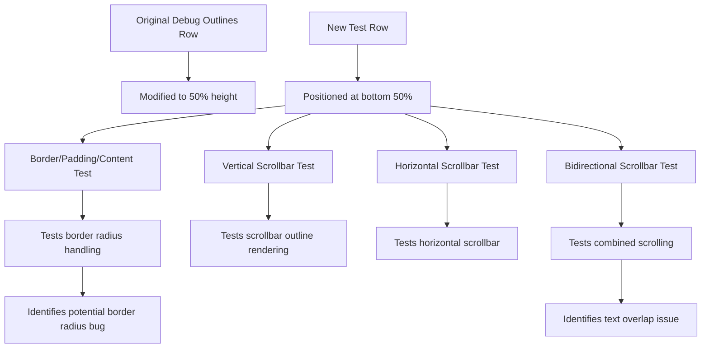

+++
title = "#22673 Adds tests for new `UiDebugOverlay` features into `testbed_ui`"
date = "2026-02-02T00:00:00"
draft = false
template = "pull_request_page.html"
in_search_index = true

[taxonomies]
list_display = ["show"]

[extra]
current_language = "en"
available_languages = {"en" = { name = "English", url = "/pull_request/bevy/2026-02/pr-22673-en-20260202" }, "zh-cn" = { name = "中文", url = "/pull_request/bevy/2026-02/pr-22673-zh-cn-20260202" }}
labels = ["A-UI", "C-Testing", "D-Straightforward", "M-Deliberate-Rendering-Change"]
+++

# Title
Adds tests for new `UiDebugOverlay` features into `testbed_ui`

## Basic Information
- **Title**: Adds tests for new `UiDebugOverlay` features into `testbed_ui`
- **PR Link**: https://github.com/bevyengine/bevy/pull/22673
- **Author**: kfc35
- **Status**: MERGED
- **Labels**: A-UI, S-Ready-For-Final-Review, C-Testing, D-Straightforward, M-Deliberate-Rendering-Change
- **Created**: 2026-01-23T21:28:52Z
- **Merged**: 2026-02-02T23:30:23Z
- **Merged By**: alice-i-cecile

## Description Translation
# Objective

- Add some recently expanded UI Debug functionality to the testbed #21931 

## Solution

To `testbed/ui.rs`, Adds a second row of entities demonstrating:

1. border, padding, content box outlines with a rounded border radius
2. vertical scrollbar outline
3. horizontal scrollbar outline
4. bidirectional scrollbar outline

The scrollbars were taken from `scroll.rs` and I tried to strip them down to the barest code that shows them as outlines (so scrolling doesn't work with them)

## Testing

`cargo run --example testbed_ui --features="bevy_ui_debug" -- debugoutlines` does the trick

## Showcase

If this screenshot / these new test cases expose(s) any bugs that are not intended behavior (i.e. why is the bottom left padding box's corner also rounded when only the bottom right border radius was specified? Or why do the bidirectional scrollbars overlap the text?), please make an issue / let me know so that I can make an issue

<details>
  <summary>Screenshot</summary>


</details>

## The Story of This Pull Request

The Bevy UI debug overlay received new functionality in PR #21931, but these features lacked comprehensive test coverage. This PR addresses that gap by extending the existing `testbed_ui` example to include visual tests for the newly added debug overlay capabilities. The goal was to create a dedicated test scene that developers could run to verify that border, padding, content box outlines, and scrollbar outlines render correctly under various conditions.

The test approach is straightforward: modify the existing `debug_outlines` module to add a second row of test cases below the existing ones. This required splitting the original full-screen container into two halves. The first half continues to display the original test cases, while the second half introduces four new test scenarios. Each test case focuses on specific debug overlay features, with careful configuration of `UiDebugOptions` components to enable only the relevant visualization modes.

The implementation starts by modifying the existing root node from 100% height to 50% height, then adding a new root node positioned at the bottom 50% of the screen. This creates a clear visual separation between the original tests and the new additions. Each new test case is carefully constructed to demonstrate specific aspects of the debug overlay:

1. **Box model outlines with border radius**: This test creates a node with asymmetric borders, padding, and a bottom-right border radius to verify that all three box outlines (border, padding, content) render correctly and handle border radius properly.

2. **Vertical scrollbar outline**: A simplified scrollable container with 20 items demonstrates vertical scrollbar visualization. The scrollbars are non-functional (scrolling is disabled) since the goal is purely to test the debug overlay's ability to render scrollbar outlines.

3. **Horizontal scrollbar outline**: Similar to the vertical test but configured for horizontal scrolling, verifying that horizontal scrollbar outlines work correctly.

4. **Bidirectional scrollbar outline**: A more complex test with both vertical and horizontal scrollbars, created using a nested grid structure of text items. This ensures the debug overlay can handle multiple scroll directions simultaneously.

An important technical decision was to disable the debug overlay for child elements. This is achieved by setting `UiDebugOptions { enabled: false, ...default() }` on all child nodes, ensuring only the container's debug outlines are visible. This prevents visual clutter and focuses the test on the specific features being demonstrated.

The author explicitly notes potential bugs observed in the test output: the bottom-left padding box corner appearing rounded when only the bottom-right border radius was specified, and bidirectional scrollbars overlapping text. These observations demonstrate the dual purpose of the test - not only to confirm existing functionality works but also to identify and document potential issues for future investigation.

From an architectural perspective, this PR follows Bevy's ECS patterns correctly. It uses the existing `UiDebugOptions` component system without modification, demonstrating how to configure debug overlays through component composition. The test code is cleanly integrated into the existing module structure and follows the same patterns as surrounding code.

## Visual Representation



## Key Files Changed

### `examples/testbed/ui.rs` (+165/-1)

This file contains the `testbed_ui` example, which provides visual testing for various UI features. The changes are confined to the `debug_outlines` module within this file.

**Key modifications:**

1. **Modified existing root node height**: Changed from 100% to 50% to make room for the new test row.
```rust
// Before:
Node {
    width: percent(100),
    height: percent(100),  // <-- Original height
    align_items: AlignItems::Center,
    justify_content: JustifyContent::SpaceAround,
    ..default()
}

// After:
Node {
    width: percent(100),
    height: percent(50),   // <-- Reduced to half height
    align_items: AlignItems::Center,
    justify_content: JustifyContent::SpaceAround,
    ..default()
}
```

2. **Added new root node for second test row**: Creates a second container at the bottom half of the screen.
```rust
commands.spawn((
    Node {
        width: percent(100),
        height: percent(50),
        top: percent(50),  // Positions at bottom half
        align_items: AlignItems::Center,
        justify_content: JustifyContent::SpaceAround,
        ..default()
    },
    DespawnOnExit(super::Scene::DebugOutlines),
))
```

3. **Border/padding/content test case**: Demonstrates all three box outlines with asymmetric values and border radius.
```rust
parent.spawn((
    Node {
        width: px(200),
        height: px(200),
        border: UiRect {
            top: px(10),
            bottom: px(20),
            left: px(30),
            right: px(40),
        },
        border_radius: BorderRadius::bottom_right(px(10)),
        padding: UiRect {
            top: px(40),
            bottom: px(30),
            left: px(20),
            right: px(10),
        },
        ..default()
    },
    // ... UiDebugOptions configured to show all three outlines
))
```

4. **Vertical scrollbar test**: Simplified scrollable container with debug overlay showing scrollbar outline.
```rust
parent.spawn((
    Node {
        flex_direction: FlexDirection::Column,
        width: px(90),
        height: px(230),
        overflow: Overflow::scroll_y(),
        scrollbar_width: 20.,
        ..default()
    },
    ScrollPosition(Vec2::new(180., 180.)),  // Pre-scrolled to show scrollbar
    UiDebugOptions {
        line_width: 3.,
        outline_scrollbars: true,  // Enables scrollbar outlines
        show_hidden: false,
        show_clipped: false,
        ..*debug_options
    },
    // Children with debug disabled
))
```

5. **Pattern for disabling debug on children**: All child elements have their debug overlay explicitly disabled to avoid visual clutter.
```rust
Children::spawn(SpawnIter((0..20).map(move |i| {
    (
        Node::default(),
        children![(
            Text(format!("Item {i}")),
            UiDebugOptions {
                enabled: false,  // Debug disabled for children
                ..default()
            }
        )],
        UiDebugOptions {
            enabled: false,  // Also disabled on the node itself
            ..default()
        },
    )
})))
```

## Further Reading

1. **Bevy UI Debug Overlay Documentation**: The official documentation for UI debugging features in Bevy.
2. **PR #21931**: The original PR that added the debug overlay features being tested here.
3. **Bevy UI Testbed Example**: The broader testbed example that contains various UI test scenes.
4. **Bevy UI Component System**: Documentation on Bevy's ECS-based UI system and how components like `UiDebugOptions` work.
5. **UI Box Model**: Understanding the border-box, padding-box, and content-box concepts in CSS/UI layout systems.