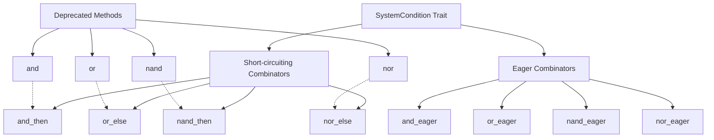

+++
title = "#22690 fix: improve semantic clarity for run condition combinators"
date = "2026-02-17T00:00:00"
draft = false
template = "pull_request_page.html"
in_search_index = true

[taxonomies]
list_display = ["show"]

[extra]
current_language = "en"
available_languages = {"en" = { name = "English", url = "/pull_request/bevy/2026-02/pr-22690-en-20260217" }, "zh-cn" = { name = "中文", url = "/pull_request/bevy/2026-02/pr-22690-zh-cn-20260217" }}
labels = ["A-ECS", "C-Usability", "M-Migration-Guide", "X-Blessed"]
+++

# fix: improve semantic clarity for run condition combinators

## Basic Information
- **Title**: fix: improve semantic clarity for run condition combinators
- **PR Link**: https://github.com/bevyengine/bevy/pull/22690
- **Author**: joseph-gio
- **Status**: MERGED
- **Labels**: A-ECS, C-Usability, S-Ready-For-Final-Review, M-Migration-Guide, X-Blessed
- **Created**: 2026-01-25T02:10:39Z
- **Merged**: 2026-02-17T00:40:13Z
- **Merged By**: alice-i-cecile

## Description Translation

# Objective

We include several run condition combinators, such as `and`, `or`, etc., which short-circuit depending on the output of the first condition in the combinator.

This is incredibly error-prone due to the subtle way that short-circuiting interacts with change detection -- rather than reacting to changes frame-by-frame, the second condition in short-circuiting combinator will react to _the last time that the first condition did not short circuit_. This can easily lead to confusing bugs if the user does not expect this, and I suspect that most users will not expect this.
For this reason, when combining multiple run conditions added via `.run_if()`, all run conditions are intentionally eagerly evaluated.

## Solution

Add new run condition combinators `and_then`, `and_eager`, `or_else`, `or_eager`, etc., for clarity, and deprecate the previous methods, pointing users to the new ones.

After the previous combinators have been removed for a few release cycles, we should consider renaming combinators such as `and_eager` to simply `and`.

# Migration Guide

Bevy supports run condition combinators (`and`, `or`, `nan`, `nor`), which have historically short-circuited. While familiar, short-circuiting interacts with Bevy's change detection in a subtle way: when the left-hand condition short-circuits, the right-hand condition is not evaluated and therefore does not observe changes on that frame. Instead, it reacts based on the last frame it ran, which can lead to confusing and non-local bugs.

By contrast, Bevy's scheduler combines multiple .run_if(...) conditions using eager evaluation, which avoids this known pitfall.

To make intent explicit and reduce footguns, short-circuiting combinators have been renamed and eagerly-evaluated variants have been added.

## Examples

Most users should use eager evaluation, which ensures all conditions participate in change detection every frame:

```rust
// Before (deprecated)
cond_a.and(cond_b)
cond_a.or(cond_b)
cond_a.nand(cond_b)
cond_a.nor(cond_b)

// After (recommended default)
cond_a.and_eager(cond_b)
cond_a.or_eager(cond_b)
cond_a.nand_eager(cond_b)
cond_a.nor_eager(cond_b)
```

If you *intentionally rely on short-circuiting* for correctness, use the explicit short-circuiting variants:

```rust
// Explicit short-circuiting
cond_a.and_then(cond_b)
cond_a.or_else(cond_b)
cond_a.nand_then(cond_b)
cond_a.nor_else(cond_b)
```

`xor` and `xnor` are unchanged, as they cannot short-circuit by nature.

## Future naming note

The `_eager` suffix exists to ease migration without changing the behavior of existing code that relied on short-circuiting. After the deprecated combinators have been removed for a few release cycles, we expect to revisit naming and likely remove the _eager suffix, keeping `and_then` / `or_else` as the explicit short-circuiting forms.

## The Story of This Pull Request

This PR addresses a subtle but significant issue in Bevy's run condition combinators. The problem stems from the interaction between short-circuit evaluation and Bevy's change detection system. When developers use combinators like `.and()` or `.or()`, they might expect both conditions to be evaluated every frame, but in reality, these combinators use short-circuit logic similar to Rust's `&&` and `||` operators.

The core issue is that when the first condition in a short-circuiting combinator returns a value that causes the second condition to be skipped (like `false` in an `and` chain or `true` in an `or` chain), the second condition doesn't get to observe world changes on that frame. Instead, it only sees changes from the last time it was actually executed. This can lead to non-obvious bugs where systems don't run when expected, or conditions appear to lag behind the actual world state.

The developer recognized this as a fundamental design problem that needed addressing. The solution wasn't to fix a bug in the implementation, but rather to change the API to make the evaluation semantics explicit. This approach follows the principle that APIs should guide users toward correct usage and make potential pitfalls visible.

The implementation approach was pragmatic: instead of changing the behavior of existing methods (which would break existing code), the PR introduces new method names with clearer semantics. The short-circuiting variants get names like `and_then` and `or_else` that hint at their conditional evaluation nature, while new eager variants get names like `and_eager` and `or_eager` that explicitly state they evaluate both conditions. The old methods are deprecated with clear migration guidance.

This change required updating the type definitions and implementing the new eager combinators. Each combinator now has two variants: one that short-circuits (using `&&` and `||` logic) and one that doesn't (using `&` and `|` bitwise operators for eager evaluation). The naming convention helps developers understand what they're getting: `_then` and `_else` suffixes for short-circuiting, and `_eager` for non-short-circuiting.

From a technical perspective, the implementation adds new marker types like `AndEagerMarker` and `OrEagerMarker` that implement the `Combine` trait to perform eager evaluation. The key difference is in the `combine` method implementation - while short-circuiting variants use `&&` and `||`, eager variants use `&` and `|` which always evaluate both operands.

The changes also required updating documentation extensively to explain the rationale and provide clear examples. The documentation now explicitly warns about the change detection implications of short-circuiting and recommends eager evaluation as the default choice.

This PR has significant impact on code clarity and correctness. It transforms what was a hidden footgun into an explicit design choice that developers must consciously make. The migration guide provides a clear path forward, and the deprecation strategy gives existing code time to adapt. The long-term plan to eventually rename `and_eager` to simply `and` after a few release cycles shows good API evolution planning - it moves toward making the safer, more intuitive behavior the default.

## Visual Representation



## Key Files Changed

### `crates/bevy_ecs/src/schedule/condition.rs` (+469/-102)
This is the main file where the run condition combinators are defined. The changes include:
1. Renaming existing combinators to have `_then` and `_else` suffixes for short-circuiting variants
2. Adding new `_eager` variants that evaluate both conditions
3. Deprecating the old `and`, `or`, `nand`, `nor` methods
4. Updating documentation with clear warnings about change detection implications

Key code changes:

```rust
// Before:
fn and<M, C: SystemCondition<M, In>>(self, and: C) -> And<Self::System, C::System> {
    let a = IntoSystem::into_system(self);
    let b = IntoSystem::into_system(and);
    let name = format!("{} && {}", a.name(), b.name());
    CombinatorSystem::new(a, b, DebugName::owned(name))
}

// After (multiple methods):
fn and_then<M, C: SystemCondition<M, In>>(self, then_run: C) -> AndThen<Self::System, C::System> {
    let a = IntoSystem::into_system(self);
    let b = IntoSystem::into_system(then_run);
    let name = format!("{} && {}", a.name(), b.name());
    CombinatorSystem::new(a, b, DebugName::owned(name))
}

fn and_eager<M, C: SystemCondition<M, In>>(self, other: C) -> AndEager<Self::System, C::System> {
    let a = IntoSystem::into_system(self);
    let b = IntoSystem::into_system(other);
    let name = format!("{} & {}", a.name(), b.name());
    CombinatorSystem::new(a, b, DebugName::owned(name))
}

#[deprecated(since = "0.19.0", note = "use `.and_then(...)` instead, or `.and_eager(...)` to evaluate the conditions eagerly")]
fn and<M, C: SystemCondition<M, In>>(self, then_run: C) -> AndThen<Self::System, C::System> {
    let a = IntoSystem::into_system(self);
    let b = IntoSystem::into_system(then_run);
    let name = format!("{} && {}", a.name(), b.name());
    CombinatorSystem::new(a, b, DebugName::owned(name))
}
```

The type definitions were also updated:

```rust
// Before:
pub type And<A, B> = CombinatorSystem<AndMarker, A, B>;

// After:
pub type AndThen<A, B> = CombinatorSystem<AndThenMarker, A, B>;
pub type AndEager<A, B> = CombinatorSystem<AndEagerMarker, A, B>;
```

### `examples/ecs/run_conditions.rs` (+4/-4)
Updated examples to use the new method names, demonstrating the migration from old short-circuiting combinators to the new explicit ones:

```rust
// Before:
.run_if(resource_exists::<Unused>.or(
    has_user_input,
))

// After:
.run_if(resource_exists::<Unused>.or_else(
    has_user_input,
))
```

### `examples/math/render_primitives.rs` (+3/-2)
Updated to use `or_eager` instead of `or` for combining state change conditions:

```rust
// Before:
update_primitive_meshes
    .run_if(state_changed::<PrimitiveSelected>.or(state_changed::<CameraActive>)),

// After:
update_primitive_meshes.run_if(
    state_changed::<PrimitiveSelected>.or_eager(state_changed::<CameraActive>),
),
```

### `crates/bevy_ecs/src/system/combinator.rs` (+2/-2)
Updated a test to use the new `OrElseMarker` instead of `OrMarker`:

```rust
// Before:
let system = CombinatorSystem::<OrMarker, _, _>::new(

// After:
let system = CombinatorSystem::<OrElseMarker, _, _>::new(
```

### `crates/bevy_ecs/src/system/mod.rs` (+1/-1)
Updated a test to use `or_eager` instead of `or`:

```rust
// Before:
.distributive_run_if(resource_exists::<A>.or(resource_exists::<B>)),

// After:
.distributive_run_if(resource_exists::<A>.or_eager(resource_exists::<B>)),
```

## Further Reading

1. **Bevy's Change Detection System**: Understanding how Bevy tracks changes to components and resources is crucial for understanding why short-circuiting combinators cause issues. The official Bevy documentation on change detection provides detailed information.

2. **Short-circuit Evaluation in Programming Languages**: The behavior of `&&` and `||` operators in languages like Rust, C, and JavaScript follows short-circuit evaluation. Understanding this pattern helps recognize why the original combinators behaved as they did.

3. **API Design Principles**: This PR demonstrates good API design practices, particularly the principle of making implicit behavior explicit and providing migration paths for breaking changes.

4. **Rust's Operator Overloading**: The use of `&` and `|` for eager boolean evaluation (as opposed to `&&` and `||` for short-circuiting) follows Rust's convention where bitwise operators evaluate both sides.

5. **Bevy's System Combinators Documentation**: For more details on how to combine systems and conditions in Bevy, refer to the official documentation on system combinators and run conditions.