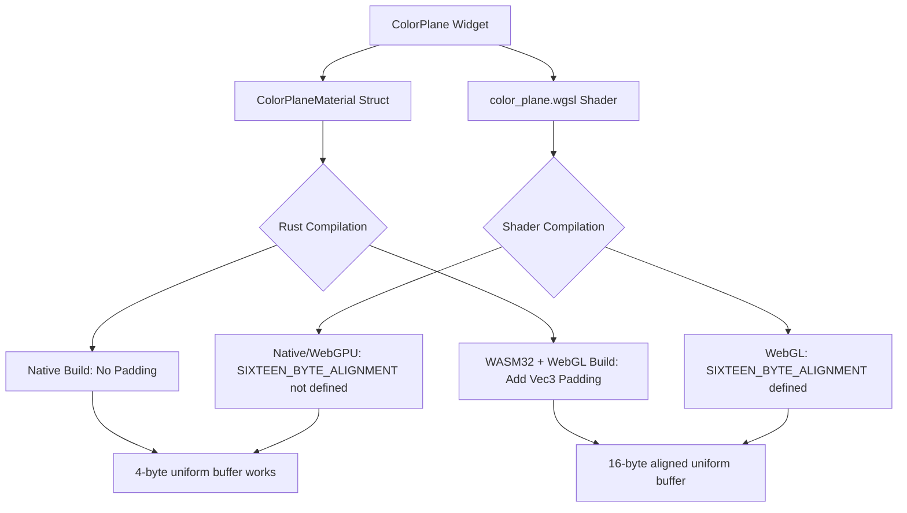

+++
title = "#22724 Add padding for color_plane widget for wasm/webgl compat"
date = "2026-02-06T00:00:00"
draft = false
template = "pull_request_page.html"
in_search_index = true

[taxonomies]
list_display = ["show"]

[extra]
current_language = "en"
available_languages = {"en" = { name = "English", url = "/pull_request/bevy/2026-02/pr-22724-en-20260206" }, "zh-cn" = { name = "中文", url = "/pull_request/bevy/2026-02/pr-22724-zh-cn-20260206" }}
labels = ["C-Bug", "A-Rendering", "A-UI", "D-Straightforward"]
+++

# Add padding for color_plane widget for wasm/webgl compat

## Basic Information
- **Title**: Add padding for color_plane widget for wasm/webgl compat
- **PR Link**: https://github.com/bevyengine/bevy/pull/22724
- **Author**: mitchty
- **Status**: MERGED
- **Labels**: C-Bug, A-Rendering, A-UI, S-Ready-For-Final-Review, D-Straightforward
- **Created**: 2026-01-27T14:51:05Z
- **Merged**: 2026-02-06T20:08:32Z
- **Merged By**: alice-i-cecile

## Description Translation

# Objective

The new bevy feathers color plane widget throws out wgpu alignment issues for the f32 in use. To enable wasm builds to use this widget add padding similar to the existing shaders/materials.

Note this is my first contribution, I yolo'd names and whatnot so if the names I chose suck I can change them I'm not wedded to the names.

## Solution

Add a Vec3 padding to the uniform and material struct to pad to 16 bytes on wasm builds.

## Testing

Yep built before/after in linux (wayland though I could test X if pressed), macos, and windows. Those all continued to work as expected as they did before. And tested in wasm on safari/firefox/chrome (mostly latest versions I think of those) where all 3 couldn't render the shader widget with this fix in place as a cargo patch its all good and works the same as the native builds.

- Are there any parts that need more testing?

Maybe? I'm not sure I know enough to speak with any authority to that. I literally never program for the web this is all a fun side project in wasm for me and I honestly don't know if I did this jazz right or not. Real web programmers should yea/nay these bits I'm just a tourist.

- How can other people (reviewers) test your changes? Is there anything specific they need to know?

Just test/build on wasm with the color widget in place. All I did was use cargo patch to point to the fixed version like so:

Same patch against 0.18.1 release branch:
```
bevy = { git = "https://github.com/mitchty/bevy", branch = "colorplane-wasm" }
```

This branch:
```
bevy = { git = "https://github.com/mitchty/bevy", branch = "colorplane-wasm-fix" }
```

- If relevant, what platforms did you test these changes on, and are there any important ones you can't test?

I tried testing on all the systems I setup cross compilation for which is most of em methinks/mehopes.

## The Story of This Pull Request

The developer was working with Bevy's new color plane widget in the feathers UI system and encountered a WebGL compatibility issue when targeting WebAssembly (wasm) platforms. The widget worked correctly on native platforms like Linux, macOS, and Windows, but failed to render on WebGL builds in browsers like Safari, Firefox, and Chrome.

The root cause was a buffer alignment issue specific to WebGL's stricter uniform buffer requirements. In WebGL 2.0 (used by wgpu's WebGL backend), uniform buffer objects require 16-byte alignment for structures. The original implementation used a single `f32` (4 bytes) for the `fixed_channel` uniform, which didn't meet this alignment requirement, causing the shader to fail validation on WebGL targets.

This type of alignment issue is common when porting graphics code to WebGL, as native GPU APIs often have more flexible alignment rules. The WebGL specification enforces stricter alignment to ensure portability across different GPU drivers and hardware configurations.

The solution follows established patterns already present in Bevy's codebase for handling WebGL alignment constraints. The developer added conditional padding to both the shader code and the Rust material struct definition, ensuring 16-byte alignment only when targeting WebGL on wasm platforms.

In the shader (`color_plane.wgsl`), the change involved wrapping the `fixed_channel` uniform in a struct and conditionally adding a `vec3<f32>` padding field when the `SIXTEEN_BYTE_ALIGNMENT` preprocessor define is active. This padding adds 12 bytes to the struct, bringing the total size to 16 bytes (4 bytes for the `f32` plus 12 bytes for the `vec3<f32>`).

```wgsl
struct ColorPlaneUniform {
  fixed_channel : f32,
#ifdef SIXTEEN_BYTE_ALIGNMENT
  _webgl2_padding_12b : vec3<f32>,
#endif
}
```

The corresponding Rust code in `color_plane.rs` needed to mirror this structure. The developer added a conditional field to the `ColorPlaneMaterial` struct using Rust's `cfg` attributes:

```rust
#[cfg(all(feature = "webgl", target_arch = "wasm32", not(feature = "webgpu")))]
#[uniform(0)]
_webgl2_padding_12b: Vec3,
```

This field is only included when building for wasm32 with the `webgl` feature enabled and the `webgpu` feature disabled. The padding is initialized to `Default::default()` (which for `Vec3` is `Vec3::ZERO`) when creating the material.

The developer also needed to update the feature propagation in the Cargo.toml files. They added `webgl` and `webgpu` features to `bevy_feathers/Cargo.toml` and connected the `bevy_feathers` crate to the existing `webgl` and `webgpu` features in `bevy_internal/Cargo.toml`. This ensures that when users enable the `webgl` or `webgpu` features at the top level, they properly propagate to the feathers crate.

The implementation maintains compatibility with all existing platforms - native builds remain unchanged, and WebGPU builds (which don't have the same alignment constraints) also remain unaffected. The padding only applies to WebGL builds targeting wasm32.

This approach demonstrates good platform-specific optimization while maintaining clean separation of concerns. The WebGL-specific code is clearly marked and isolated, making it easy for developers to understand why the padding exists and when it applies.

## Visual Representation



## Key Files Changed

### `crates/bevy_feathers/src/assets/shaders/color_plane.wgsl` (+13/-6)
This shader file was modified to wrap the uniform in a struct and conditionally add padding for WebGL builds.

**Key changes:**
```wgsl
// Before:
@group(1) @binding(0) var<uniform> fixed_channel: f32;

// After:
struct ColorPlaneUniform {
  fixed_channel : f32,
#ifdef SIXTEEN_BYTE_ALIGNMENT
  _webgl2_padding_12b : vec3<f32>,
#endif
}

@group(1) @binding(0) var<uniform> uniform_data : ColorPlaneUniform;
```

The shader also updated all references from `fixed_channel` to `uniform_data.fixed_channel` to match the new struct access pattern.

### `crates/bevy_feathers/src/controls/color_plane.rs` (+6/-0)
The Rust material struct was updated to include conditional padding for WebGL builds on wasm32.

**Key changes:**
```rust
// Added to ColorPlaneMaterial struct:
#[cfg(all(feature = "webgl", target_arch = "wasm32", not(feature = "webgpu")))]
#[uniform(0)]
_webgl2_padding_12b: Vec3,

// Added to material creation:
#[cfg(all(feature = "webgl", target_arch = "wasm32", not(feature = "webgpu")))]
_webgl2_padding_12b: Default::default(),
```

### `crates/bevy_feathers/Cargo.toml` (+2/-0)
Added feature definitions for `webgl` and `webgpu` to the feathers crate.

```toml
[features]
# ... existing features
webgl = []
webgpu = []
```

### `crates/bevy_internal/Cargo.toml` (+2/-0)
Connected the bevy_feathers crate to the existing webgl and webgpu feature sets.

```toml
webgl = [
  # ... existing dependencies
  "bevy_feathers?/webgl",
]

webgpu = [
  # ... existing dependencies
  "bevy_feathers?/webgpu",
]
```

## Further Reading

1. WebGL 2.0 Uniform Buffer Object specification: https://www.khronos.org/registry/webgl/specs/latest/2.0/#5.23
2. WGSL memory layout rules: https://www.w3.org/TR/WGSL/#memory-layout
3. Bevy's WebGL compatibility guidelines: https://bevyengine.org/learn/quick-start/platform-specifics/web/
4. WGPU WebGL backend documentation: https://wgpu.rs/#supported-backends