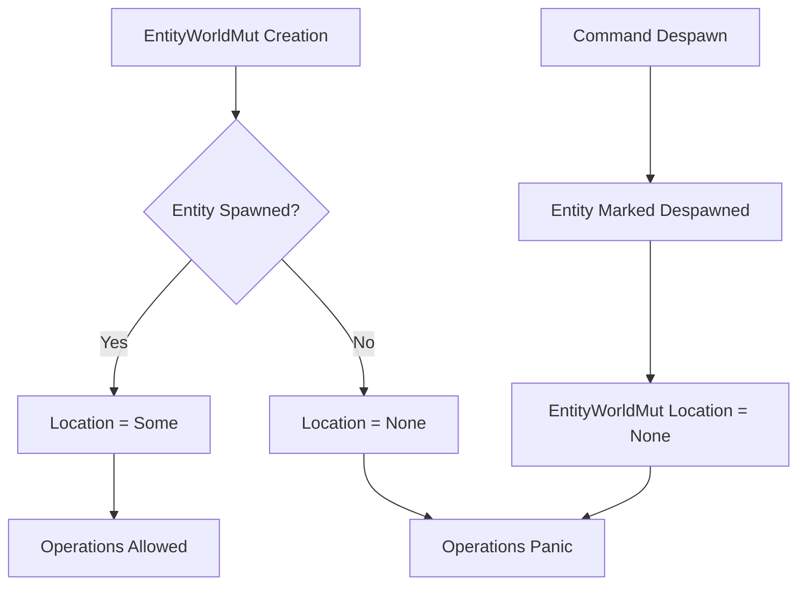

+++
title = "#22725 Don't consider despawns as invalidating `EntityWorldMut`"
date = "2026-02-03T00:00:00"
draft = false
template = "pull_request_page.html"
in_search_index = true

[taxonomies]
list_display = ["show"]

[extra]
current_language = "en"
available_languages = {"en" = { name = "English", url = "/pull_request/bevy/2026-02/pr-22725-en-20260203" }, "zh-cn" = { name = "中文", url = "/pull_request/bevy/2026-02/pr-22725-zh-cn-20260203" }}
labels = ["C-Bug", "A-ECS", "C-Usability", "P-Regression", "X-Contentious"]
+++

# Title: Don't consider despawns as invalidating `EntityWorldMut`

## Basic Information
- **Title**: Don't consider despawns as invalidating `EntityWorldMut`
- **PR Link**: https://github.com/bevyengine/bevy/pull/22725
- **Author**: ElliottjPierce
- **Status**: MERGED
- **Labels**: C-Bug, A-ECS, C-Usability, S-Ready-For-Final-Review, P-Regression, X-Contentious
- **Created**: 2026-01-27T19:57:50Z
- **Merged**: 2026-02-02T23:35:46Z
- **Merged By**: alice-i-cecile

## Description Translation
# Objective

#19451 changed how entities handle spawning and despawning. 
One of those changes introduced the idea that despawning an entity from commands while holding an `EntityWorldMut` of that entity made that `EntityWorldMut` invalid and panicked when that happened.

Fixes #19828.

## Solution

Handle these despawns in the same way as despawning without freeing.
This means an `EntityWorldMut` can no longer assume its `EntityId` is valid; 
it can not assume that its generation is up to date.
AFAIK, this restriction doesn't introduce any new or exciting ways for this to fail.
It just delays the panics for some cases.
For example, despawning from commands and then attempting an insert will panic later (at the insert) instead of earlier (at the despawn).

## Testing

- CI

## The Story of This Pull Request

This PR addresses a regression introduced in PR #19451 that affected how `EntityWorldMut` handles entity despawning. The core problem was that when an entity was despawned via commands while an `EntityWorldMut` reference to that entity was still alive, the system would immediately panic, considering the `EntityWorldMut` invalid. This caused issues particularly in observer systems and component hooks where entities might be despawned as part of their own initialization logic.

The issue was reported in #19828, where developers encountered panics when despawning entities within `on_add` hooks. These hooks receive an `EntityWorldMut`, and if they despawn the entity via commands, the previous implementation would immediately panic, making certain patterns impossible to implement.

The solution approach was to change the despawn handling to match the behavior of "despawning without freeing." Instead of immediately invalidating `EntityWorldMut` when a despawn command is queued, the system now allows the `EntityWorldMut` to continue existing but marks it as despawned. The entity's location information becomes `None`, and subsequent operations on the despawned entity will panic when attempted, rather than at the moment of despawn.

This change required updating several key components. In `world/entity_access/world_mut.rs`, the `EntityWorldMut::new` method's safety requirements were relaxed to allow creation with `None` location for despawned entities. The `update_location` method was updated to use `get_spawned()` instead of `get()`, which returns `None` for despawned entities rather than panicking. Documentation was also added to clarify that `EntityWorldMut` may point to despawned entities and that developers should check `is_despawned()` before trusting the entity state.

In `world/mod.rs`, the `spawn_non_existent` method was updated to handle the case where commands might have despawned the entity during its own spawning process. Instead of assuming the entity must still exist after flushing commands, it now uses `get_spawned()` which gracefully handles despawned entities.

Several dynamic bundle implementations in `spawn.rs` and `observe.rs` were updated to add early returns when encountering despawned entities. This prevents attempting to perform operations on entities that were despawned by hooks or observers during the spawning process. These checks are particularly important in observer systems where entity despawning might be triggered by component additions.

The technical insight here is that this change shifts the panic from the despawn operation to the subsequent invalid operation. While this doesn't eliminate the panic entirely, it provides more flexibility in patterns where entities might be despawned as part of their initialization. Developers can now check `is_despawned()` and handle the case appropriately, whereas before the panic was immediate and unavoidable.

This change maintains the safety guarantees of the ECS system while improving usability. The trade-off is that developers now need to be more aware that `EntityWorldMut` might point to despawned entities, particularly when working with observers and hooks that might despawn entities. The added documentation helps guide developers toward proper usage patterns.

The impact of this change is that certain patterns that were previously impossible due to immediate panics now become possible. For example, components can have `on_add` hooks that conditionally despawn entities based on game logic. However, developers must now be cautious about using `EntityWorldMut` after operations that might trigger despawning, and should check `is_despawned()` when uncertain about the entity's state.

## Visual Representation



## Key Files Changed

1. **`crates/bevy_ecs/src/world/entity_access/world_mut.rs`** (+24/-7)
   - Updated `EntityWorldMut::new` to accept `None` location for despawned entities
   - Changed `update_location` to use `get_spawned()` instead of `get()`
   - Added documentation about despawned entity handling

```rust
// File: crates/bevy_ecs/src/world/entity_access/world_mut.rs
// Before:
pub(crate) unsafe fn new(
    world: &'w mut World,
    entity: Entity,
    location: Option<EntityLocation>,
) -> Self {
    debug_assert!(world.entities().contains(entity));
    debug_assert_eq!(world.entities().get(entity).unwrap(), location);

    EntityWorldMut {
        world,
        entity,
        location,
    }
}

// After:
pub(crate) unsafe fn new(
    world: &'w mut World,
    entity: Entity,
    location: Option<EntityLocation>,
) -> Self {
    debug_assert_eq!(world.entities().get_spawned(entity).ok(), location);

    EntityWorldMut {
        world,
        entity,
        location,
    }
}
```

2. **`crates/bevy_ecs/src/world/entity_access/mod.rs`** (+28/-0)
   - Added tests for the new despawn behavior
   - Test `command_despawns_dont_invalidate_entity_world_muts` verifies the fix
   - Test `using_despawned_entity_world_mut_panics` ensures safety

```rust
// File: crates/bevy_ecs/src/world/entity_access/mod.rs
// Added test:
#[test]
fn command_despawns_dont_invalidate_entity_world_muts() {
    let mut world = World::new();

    let mut entity = world.spawn(TestComponent(1));
    entity.insert(DespawnOnAdd);
    assert!(entity.is_despawned());
}
```

3. **`crates/bevy_ecs/src/spawn.rs`** (+11/-3)
   - Added early returns in `SpawnRelatedBundle` and `SpawnOneRelated` when entity is despawned
   - Prevents attempting to spawn related entities for despawned parents

```rust
// File: crates/bevy_ecs/src/spawn.rs
// Added check in SpawnRelatedBundle::get_components:
if entity.is_despawned() {
    return;
}
```

4. **`crates/bevy_ecs/src/world/mod.rs`** (+3/-5)
   - Updated `spawn_non_existent` to handle despawned entities after command flush
   - Uses `get_spawned()` instead of panicking `get()`

```rust
// File: crates/bevy_ecs/src/world/mod.rs
// Before:
entity_location = self
    .entities()
    .get(entity)
    .expect("For this to fail, a queued command would need to despawn the entity.");

// After:
entity_location = self.entities().get_spawned(entity).ok();
```

5. **`crates/bevy_ui_widgets/src/observe.rs`** (+4/-0)
   - Added despawn check in observer bundle to avoid using despawned entities

## Further Reading

- [Bevy ECS Entity Reference Documentation](https://docs.rs/bevy_ecs/latest/bevy_ecs/world/struct.EntityRef.html)
- [Observer Patterns in Bevy ECS](https://github.com/bevyengine/bevy/blob/main/examples/ecs/observer.rs)
- [Entity Commands and Deferred World Operations](https://docs.rs/bevy_ecs/latest/bevy_ecs/system/struct.Commands.html)
- [Original Issue #19828](https://github.com/bevyengine/bevy/issues/19828)

# Full Code Diff
<details>
<summary>Click to expand full code diff</summary>

```diff
diff --git a/crates/bevy_ecs/src/bundle/mod.rs b/crates/bevy_ecs/src/bundle/mod.rs
index f7cd9996b2853..a18cad21f052f 100644
--- a/crates/bevy_ecs/src/bundle/mod.rs
+++ b/crates/bevy_ecs/src/bundle/mod.rs
@@ -287,6 +287,8 @@ pub trait DynamicBundle: Sized {
     ///  - If any part of `ptr` is to be accessed in this function, it must *not* be dropped at any point in
     ///    `get_components`. Calling [`bevy_ptr::deconstruct_moving_ptr`] in `get_components` automatically
     ///    ensures this is the case.
+    ///  - Note that `entity` may already have been despawned by hooks or observers at this point,
+    ///    so check [`EntityWorldMut::is_spawned`] before trusting it.
     ///
     /// [`World`]: crate::world::World
     // This function explicitly uses `MovingPtr` to avoid potentially large stack copies of the bundle
diff --git a/crates/bevy_ecs/src/spawn.rs b/crates/bevy_ecs/src/spawn.rs
index 7f14c08e11a0c..56a53f3550aeb 100644
--- a/crates/bevy_ecs/src/spawn.rs
+++ b/crates/bevy_ecs/src/spawn.rs
@@ -336,12 +336,16 @@ impl<R: Relationship, L: SpawnableList<R>> DynamicBundle for SpawnRelatedBundle<
         // SAFETY: The value was not moved out in `get_components`, only borrowed, and thus should still
         // be valid and initialized.
         let effect = unsafe { ptr.assume_init() };
+        bevy_ptr::deconstruct_moving_ptr!({
+            let Self { list, marker: _ } = effect;
+        });
         let id = entity.id();
 
+        if entity.is_despawned() {
+            return;
+        }
+
         entity.world_scope(|world: &mut World| {
-            bevy_ptr::deconstruct_moving_ptr!({
-                let Self { list, marker: _ } = effect;
-            });
             L::spawn(list, world, id);
         });
     }
@@ -381,6 +385,10 @@ impl<R: Relationship, B: Bundle> DynamicBundle for SpawnOneRelated<R, B> {
         // SAFETY: The value was not moved out in `get_components`, only borrowed, and thus should still
         // be valid and initialized.
         let effect = unsafe { ptr.assume_init() };
+        if entity.is_despawned() {
+            return;
+        }
+
         let effect = effect.read();
         entity.with_related::<R>(effect.bundle);
     }
diff --git a/crates/bevy_ecs/src/world/entity_access/mod.rs b/crates/bevy_ecs/src/world/entity_access/mod.rs
index cc1bd85449761..53bd06feb7e53 100644
--- a/crates/bevy_ecs/src/world/entity_access/mod.rs
+++ b/crates/bevy_ecs/src/world/entity_access/mod.rs
@@ -44,6 +44,14 @@ mod tests {
     #[derive(Component)]
     struct Marker;
 
+    #[derive(Component)]
+    #[component(on_add = despawn_on_add)]
+    struct DespawnOnAdd;
+
+    fn despawn_on_add(mut world: DeferredWorld, HookContext { entity, .. }: HookContext) {
+        world.commands().entity(entity).despawn();
+    }
+
     #[test]
     fn entity_ref_get_by_id() {
         let mut world = World::new();
@@ -1404,6 +1412,26 @@ mod tests {
         assert_eq!(world.entity(entity_b).get::<D>(), Some(&D));
     }
 
+    #[test]
+    fn command_despawns_dont_invalidate_entity_world_muts() {
+        let mut world = World::new();
+
+        let mut entity = world.spawn(TestComponent(1));
+        entity.insert(DespawnOnAdd);
+        assert!(entity.is_despawned());
+    }
+
+    #[test]
+    #[should_panic]
+    fn using_despawned_entity_world_mut_panics() {
+        let mut world = World::new();
+
+        let mut entity = world.spawn(TestComponent(1));
+        entity.insert(DespawnOnAdd);
+        assert!(entity.is_despawned());
+        entity.insert(TestComponent2(2));
+    }
+
     #[test]
     fn update_despawned_by_after_observers() {
         let mut world = World::new();
diff --git a/crates/bevy_ecs/src/world/entity_access/world_mut.rs b/crates/bevy_ecs/src/world/entity_access/world_mut.rs
index a676a9f52b62d..822e0c06a5450 100644
--- a/crates/bevy_ecs/src/world/entity_access/world_mut.rs
+++ b/crates/bevy_ecs/src/world/entity_access/world_mut.rs
@@ -39,6 +39,17 @@ use core::{any::TypeId, marker::PhantomData, mem::MaybeUninit};
 /// See also [`EntityMut`], which allows disjoint mutable access to multiple
 /// entities at once.  Unlike `EntityMut`, this type allows adding and
 /// removing components, and despawning the entity.
+///
+/// # Invariants and Risk
+///
+/// An [`EntityWorldMut`] may point to a despawned entity.
+/// You can check this via [`is_despawned`](Self::is_despawned).
+/// Using an [`EntityWorldMut`] of a despawned entity may panic in some contexts, so read method documentation carefully.
+///
+/// Unless you have strong reason to assume these invariants, you should generally avoid keeping an [`EntityWorldMut`] to an entity that is potentially not spawned.
+/// For example, when inserting a component, that component insert may trigger an observer that despawns the entity.
+/// So, when you don't have full knowledge of what commands may interact with this entity,
+/// do not further use this value without first checking [`is_despawned`](Self::is_despawned).
 pub struct EntityWorldMut<'w> {
     world: &'w mut World,
     entity: Entity,
@@ -109,18 +120,17 @@ impl<'w> EntityWorldMut<'w> {
 
     /// # Safety
     ///
-    ///  - `entity` must be valid for `world`: the generation should match that of the entity at the same index.
-    ///  - `location` must be sourced from `world`'s `Entities` and must exactly match the location for `entity`
+    ///  The `location` must be sourced from `world`'s `Entities` and must exactly match the location for `entity`.
+    ///  If the `entity` is not spawned for any reason (See [`EntityNotSpawnedError`](crate::entity::EntityNotSpawnedError)), the location should be `None`.
     ///
-    ///  The above is trivially satisfied if `location` was sourced from `world.entities().get(entity)`.
+    ///  The above is trivially satisfied if `location` was sourced from `world.entities().get_spawned(entity).ok()`.
     #[inline]
     pub(crate) unsafe fn new(
         world: &'w mut World,
         entity: Entity,
         location: Option<EntityLocation>,
     ) -> Self {
-        debug_assert!(world.entities().contains(entity));
-        debug_assert_eq!(world.entities().get(entity).unwrap(), location);
+        debug_assert_eq!(world.entities().get_spawned(entity).ok(), location);
 
         EntityWorldMut {
             world,
@@ -1540,6 +1550,11 @@ impl<'w> EntityWorldMut<'w> {
     /// This returns the new [`Entity`], which you must manage.
     /// Note that this still increases the generation to differentiate different spawns of the same row.
     ///
+    /// Additionally, keep in mind the limitations documented in the type-level docs.
+    /// Unless you have full knowledge of this [`EntityWorldMut`]'s lifetime,
+    /// you may not assume that nothing else has taken responsibility of this [`Entity`].
+    /// If you are not careful, this could cause a double free.
+    ///
     /// This may be later [`spawn_at`](World::spawn_at).
     /// See [`World::despawn_no_free`] for details and usage examples.
     #[track_caller]
@@ -1813,9 +1828,11 @@ impl<'w> EntityWorldMut<'w> {
     ///
     /// This is *only* required when using the unsafe function [`EntityWorldMut::world_mut`],
     /// which enables the location to change.
+    ///
+    /// Note that if the entity is not spawned for any reason,
+    /// this will have a location of `None`, leading some methods to panic.
     pub fn update_location(&mut self) {
-        self.location = self.world.entities().get(self.entity)
-            .expect("Attempted to update the location of a despawned entity, which is impossible. This was the result of performing an operation on this EntityWorldMut that queued a despawn command");
+        self.location = self.world.entities().get_spawned(self.entity).ok();
     }
 
     /// Returns if the entity has been despawned.
diff --git a/crates/bevy_ecs/src/world/mod.rs b/crates/bevy_ecs/src/world/mod.rs
index 5c37688d23637..f57e43ed73180 100644
--- a/crates/bevy_ecs/src/world/mod.rs
+++ b/crates/bevy_ecs/src/world/mod.rs
@@ -1102,13 +1102,11 @@ impl World {
         // SAFETY: command_queue is not referenced anywhere else
         if !unsafe { self.command_queue.is_empty() } {
             self.flush();
-            entity_location = self
-                .entities()
-                .get(entity)
-                .expect("For this to fail, a queued command would need to despawn the entity.");
+            entity_location = self.entities().get_spawned(entity).ok();
         }
 
-        // SAFETY: entity and location are valid, as they were just created above
+        // SAFETY: The entity and location started as valid.
+        // If they were changed by commands, the location was updated to match.
         let mut entity = unsafe { EntityWorldMut::new(self, entity, entity_location) };
         // SAFETY:
         // - This is called exactly once after `get_components` has been called in `spawn_non_existent`.
diff --git a/crates/bevy_ui_widgets/src/observe.rs b/crates/bevy_ui_widgets/src/observe.rs
index 9443cb5898711..944d0c198dd21 100644
--- a/crates/bevy_ui_widgets/src/observe.rs
+++ b/crates/bevy_ui_widgets/src/observe.rs
@@ -64,6 +64,10 @@ impl<E: EntityEvent, B: Bundle, M, I: IntoObserverSystem<E, B, M>> DynamicBundle
         // SAFETY: The pointer was not dropped in `get_components`, so the allocation is still
         // initialized.
         let add_observer = unsafe { ptr.assume_init() };
+        if entity.is_despawned() {
+            return;
+        }
+
         let add_observer = add_observer.read();
         entity.observe(add_observer.observer);
     }
```
</details>