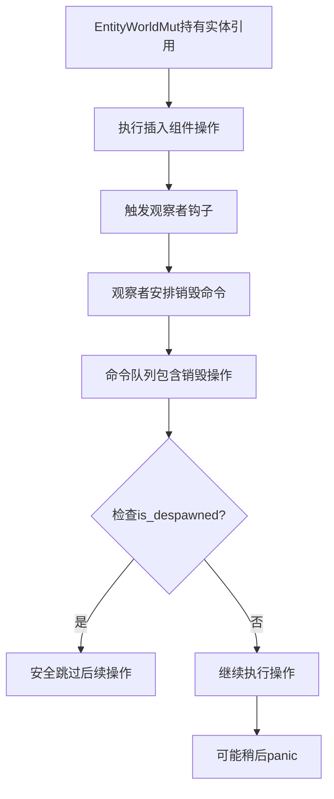

+++
title = "#22725 Don't consider despawns as invalidating `EntityWorldMut`"
date = "2026-02-03T00:00:00"
draft = false
template = "pull_request_page.html"
in_search_index = false

[extra]
current_language = "zh-cn"
available_languages = {"en" = { name = "English", url = "/pull_request/bevy/2026-02/pr-22725-en-20260203" }, "zh-cn" = { name = "中文", url = "/pull_request/bevy/2026-02/pr-22725-zh-cn-20260203" }}
labels = ["C-Bug", "A-ECS", "C-Usability", "P-Regression", "X-Contentious"]
+++

# Title
## Basic Information
- **Title**: Don't consider despawns as invalidating `EntityWorldMut`
- **PR Link**: https://github.com/bevyengine/bevy/pull/22725
- **Author**: ElliottjPierce
- **Status**: MERGED
- **Labels**: C-Bug, A-ECS, C-Usability, S-Ready-For-Final-Review, P-Regression, X-Contentious
- **Created**: 2026-01-27T19:57:50Z
- **Merged**: 2026-02-02T23:35:46Z
- **Merged By**: alice-i-cecile

## Description Translation
### 目标
#19451 修改了实体处理生成和销毁的方式。其中一个改动引入了这样的概念：当持有实体的 `EntityWorldMut` 时，通过命令销毁该实体将使该 `EntityWorldMut` 失效，并在发生时触发 panic。

修复 #19828。

### 解决方案
以与不释放的销毁相同方式处理这些销毁。
这意味着 `EntityWorldMut` 不能再假设其 `EntityId` 有效；不能假设其生成（generation）是最新的。
据我所知，此限制不会引入任何新的或令人兴奋的失败方式。
它只是延迟了某些情况下的 panic。
例如，通过命令销毁实体然后尝试插入组件将在稍后（在插入时）而不是更早（在销毁时）触发 panic。

### 测试
- CI

## The Story of This Pull Request
这个PR解决了一个在Bevy的ECS系统中出现的微妙但重要的竞态条件问题。核心问题是关于 `EntityWorldMut` 的生命周期管理以及如何处理通过命令队列（command queue）延迟执行的实体销毁操作。

当开发者使用 `EntityWorldMut` 操作实体时，可能会触发观察者（observer）或钩子（hook），这些观察者可能在相同的执行上下文中安排销毁实体的命令。在PR #19451之前的实现中，如果这种情况发生，系统会立即panic，认为 `EntityWorldMut` 已被无效化。但这种行为过于严格，导致了一些合法的使用场景变得不可能。

这个PR的核心思想是：与其在实体被命令销毁时立即使 `EntityWorldMut` 失效，不如允许它继续存在，但将其标记为"已销毁"状态。这延迟了panic的发生，让开发者有机会检查实体状态并避免在已销毁的实体上进行操作。这种方法的优势在于提供了更大的灵活性，同时保持了类型系统的安全性。

实现这一改变需要调整多个地方的代码，主要围绕如何获取和验证实体位置信息。关键的修改是将硬性验证改为更宽松的检查，允许 `EntityWorldMut` 在实体被销毁后依然持有 `None` 的位置信息。

在技术实现层面，这个PR引入了几个重要的变化。首先，`EntityWorldMut::new` 的安全要求被放宽了——现在它只要求位置信息（如果存在）与实体的当前位置匹配，但不要求实体一定处于已生成状态。其次，增加了 `is_despawned()` 方法来让开发者检查实体状态。最后，多个相关组件（如 `SpawnRelatedBundle`）被更新以在操作前检查实体是否已被销毁。

这种修改确实带来了一些风险——开发者现在必须更谨慎地检查实体状态。但这也更准确地反映了ECS系统的实际行为：命令是延迟执行的，因此在当前帧中，一个实体可能在逻辑上已被标记为销毁，但在物理上依然存在直到命令被刷新执行。

## Visual Representation


## Key Files Changed
### 1. `crates/bevy_ecs/src/world/entity_access/world_mut.rs`
这个文件包含了 `EntityWorldMut` 的核心实现。主要修改包括放宽了构造器的安全要求，并更新了位置更新逻辑以处理已销毁的实体。

```rust
// Before:
debug_assert!(world.entities().contains(entity));
debug_assert_eq!(world.entities().get(entity).unwrap(), location);

// After:
debug_assert_eq!(world.entities().get_spawned(entity).ok(), location);
```

```rust
// Before:
pub fn update_location(&mut self) {
    self.location = self.world.entities().get(self.entity)
        .expect("Attempted to update the location of a despawned entity...");
}

// After:
pub fn update_location(&mut self) {
    self.location = self.world.entities().get_spawned(self.entity).ok();
}
```

### 2. `crates/bevy_ecs/src/world/mod.rs`
修改了 `spawn_non_existent` 方法，使其在刷新命令队列后能正确处理可能已被销毁的实体。

```rust
// Before:
entity_location = self
    .entities()
    .get(entity)
    .expect("For this to fail, a queued command would need to despawn the entity.");

// After:
entity_location = self.entities().get_spawned(entity).ok();
```

### 3. `crates/bevy_ecs/src/spawn.rs`
更新了 `SpawnRelatedBundle` 和 `SpawnOneRelated` 的实现，在尝试生成相关实体前检查原始实体是否已被销毁。

```rust
// 在SpawnRelatedBundle::get_components中添加:
if entity.is_despawned() {
    return;
}

// 在SpawnOneRelated::get_components中添加:
if entity.is_despawned() {
    return;
}
```

### 4. `crates/bevy_ecs/src/bundle/mod.rs`
在 `DynamicBundle::get_components` 的文档中添加了警告，提醒开发者实体可能已被钩子或观察者销毁。

```rust
///  - Note that `entity` may already have been despawned by hooks or observers at this point,
///    so check [`EntityWorldMut::is_spawned`] before trusting it.
```

### 5. `crates/bevy_ecs/src/world/entity_access/mod.rs`
添加了测试用例来验证新的行为，包括验证命令销毁不会立即使 `EntityWorldMut` 失效，以及在已销毁的实体上操作会panic。

### 6. `crates/bevy_ui_widgets/src/observe.rs`
更新了 `AddObserver` 的实现，在添加观察者前检查实体是否已被销毁。

```rust
if entity.is_despawned() {
    return;
}
```

## Further Reading
1. [Bevy ECS 官方文档](https://docs.rs/bevy_ecs/latest/bevy_ecs/) - 了解Bevy ECS系统的基本概念
2. [EntityWorldMut API 文档](https://docs.rs/bevy_ecs/latest/bevy_ecs/world/struct.EntityWorldMut.html) - 查看更新后的API文档
3. [Commands and Command Queues in Bevy](https://bevy-cheatbook.github.io/programming/commands.html) - 理解Bevy中的命令系统
4. [Observer Pattern in ECS](https://github.com/bevyengine/bevy/blob/main/examples/ecs/observer.rs) - 观察者模式的示例代码