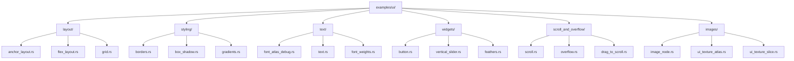

+++
title = "#22727 Sort the UI examples into sub-dirs"
date = "2026-02-01T00:00:00"
draft = false
template = "pull_request_page.html"
in_search_index = true

[taxonomies]
list_display = ["show"]

[extra]
current_language = "en"
available_languages = {"en" = { name = "English", url = "/pull_request/bevy/2026-02/pr-22727-en-20260201" }, "zh-cn" = { name = "中文", url = "/pull_request/bevy/2026-02/pr-22727-zh-cn-20260201" }}
labels = ["C-Examples", "A-UI", "D-Straightforward", "S-Waiting-on-Author"]
+++

# Title

## Basic Information
- **Title**: Sort the UI examples into sub-dirs
- **PR Link**: https://github.com/bevyengine/bevy/pull/22727
- **Author**: WaterWhisperer
- **Status**: MERGED
- **Labels**: C-Examples, A-UI, D-Straightforward, S-Waiting-on-Author
- **Created**: 2026-01-28T07:00:09Z
- **Merged**: 2026-02-01T18:39:13Z
- **Merged By**: alice-i-cecile

## Description Translation

# Objective

- Fixes #22644

## Solution

- Create new subdirectories for categorization, and update the paths in `Cargo.toml` and `README`.

## Testing

- `cargo check --example *`

## The Story of This Pull Request

This pull request addresses a straightforward organizational problem in the Bevy UI examples directory. The issue was that all UI examples were located in a flat directory structure under `examples/ui/`, making it difficult for developers to find specific types of examples or understand the scope of UI functionality available.

The problem wasn't about code functionality or performance - the examples worked correctly. Instead, it was a maintainability and developer experience issue. With 40+ UI examples mixed together in one directory, developers looking for layout examples had to sift through text examples, widget examples, and styling examples. This violated the principle of organizing code by feature or responsibility, making the codebase harder to navigate.

The solution implemented is a standard file organization pattern: grouping related files into subdirectories based on their functional category. The developer created six logical subdirectories:
- `layout/` for layout and positioning examples
- `styling/` for visual appearance examples
- `text/` for text and font examples  
- `widgets/` for interactive component examples
- `scroll_and_overflow/` for scrolling behavior examples
- `images/` for image-related UI examples

This categorization follows natural groupings based on the Bevy UI system's architecture. For example, all layout examples (`anchor_layout`, `flex_layout`, `grid`, etc.) now live together, making it obvious where to look for layout-related code.

The implementation required updating two main files: `Cargo.toml` and `examples/README.md`. Each UI example entry in `Cargo.toml` needed its path updated to reflect the new directory structure. Similarly, every link in the README needed updating to point to the new locations.

Here's a representative example of the changes in `Cargo.toml`:

```toml
# Before:
[[example]]
name = "anchor_layout"
path = "examples/ui/anchor_layout.rs"

# After:
[[example]]
name = "anchor_layout"
path = "examples/ui/layout/anchor_layout.rs"
```

The file moves themselves were simple `git mv` operations that preserved file history, which is important for tracking when changes were made to individual examples. All example files maintained their exact content - only their locations changed.

The testing approach was minimal but sufficient: running `cargo check --example *` verified that all examples still compiled correctly with their new paths. This was the appropriate level of testing for a refactoring that doesn't change behavior, only organization.

This change improves the project in several ways. First, it makes the examples more discoverable for new developers learning Bevy UI. Second, it sets a better precedent for future example organization. Third, it makes maintenance easier by grouping related code together. The trade-off is slightly longer import paths, but this is negligible compared to the organizational benefits.

The implementation demonstrates good software engineering practices: solving a real maintainability problem, using logical categorization, updating all dependent references, and verifying the changes don't break functionality. It's a clean, focused refactoring that improves the codebase without introducing new complexity.

## Visual Representation



## Key Files Changed

### `Cargo.toml` (+42/-42)
This file contains the metadata for all examples in the Bevy project. Each `[[example]]` section defines how to build and run an example. The changes updated the `path` attribute for all UI examples to reflect their new locations in subdirectories.

```toml
# Example of changes for layout examples:
# Before:
[[example]]
name = "flex_layout"
path = "examples/ui/flex_layout.rs"

# After:
[[example]]
name = "flex_layout"
path = "examples/ui/layout/flex_layout.rs"
```

### `examples/README.md` (+42/-42)
This file documents all available examples with descriptions and links. Every UI example link needed updating to point to the new subdirectory paths.

```markdown
# Example of changes in the README:
# Before:
[Anchor Layout](../examples/ui/anchor_layout.rs) | Shows an 'anchor layout' style of ui layout

# After:
[Anchor Layout](../examples/ui/layout/anchor_layout.rs) | Shows an 'anchor layout' style of ui layout
```

### Example file moves
All UI example files were moved to appropriate subdirectories. The content of these files remained unchanged. Here are representative moves:

```bash
# File moves for layout examples:
examples/ui/anchor_layout.rs → examples/ui/layout/anchor_layout.rs
examples/ui/flex_layout.rs → examples/ui/layout/flex_layout.rs
examples/ui/grid.rs → examples/ui/layout/grid.rs

# File moves for styling examples:
examples/ui/borders.rs → examples/ui/styling/borders.rs
examples/ui/box_shadow.rs → examples/ui/styling/box_shadow.rs
examples/ui/gradients.rs → examples/ui/styling/gradients.rs

# File moves for text examples:
examples/ui/font_atlas_debug.rs → examples/ui/text/font_atlas_debug.rs
examples/ui/text.rs → examples/ui/text/text.rs
examples/ui/font_weights.rs → examples/ui/text/font_weights.rs

# File moves for widget examples:
examples/ui/button.rs → examples/ui/widgets/button.rs
examples/ui/vertical_slider.rs → examples/ui/widgets/vertical_slider.rs
examples/ui/feathers.rs → examples/ui/widgets/feathers.rs

# File moves for scroll examples:
examples/ui/scroll.rs → examples/ui/scroll_and_overflow/scroll.rs
examples/ui/overflow.rs → examples/ui/scroll_and_overflow/overflow.rs
examples/ui/drag_to_scroll.rs → examples/ui/scroll_and_overflow/drag_to_scroll.rs

# File moves for image examples:
examples/ui/image_node.rs → examples/ui/images/image_node.rs
examples/ui/ui_texture_atlas.rs → examples/ui/images/ui_texture_atlas.rs
examples/ui/ui_texture_slice.rs → examples/ui/images/ui_texture_slice.rs
```

## Further Reading

1. [Bevy UI Documentation](https://bevyengine.org/learn/quick-start/ui/) - Official Bevy UI guide
2. [Rust Code Organization Best Practices](https://doc.rust-lang.org/book/ch07-00-managing-growing-projects-with-packages-crates-and-modules.html) - Rust book chapter on project organization
3. [Git File Moving Best Practices](https://git-scm.com/docs/git-mv) - Using `git mv` to preserve file history
4. [Cargo Workspace Documentation](https://doc.rust-lang.org/cargo/reference/workspaces.html) - How Cargo manages projects and examples
5. [Issue #22644](https://github.com/bevyengine/bevy/issues/22644) - The original issue requesting this organization