+++
title = "#22727 Sort the UI examples into sub-dirs"
date = "2026-02-01T00:00:00"
draft = false
template = "pull_request_page.html"
in_search_index = false

[extra]
current_language = "zh-cn"
available_languages = {"en" = { name = "English", url = "/pull_request/bevy/2026-02/pr-22727-en-20260201" }, "zh-cn" = { name = "中文", url = "/pull_request/bevy/2026-02/pr-22727-zh-cn-20260201" }}
labels = ["C-Examples", "A-UI", "D-Straightforward", "S-Waiting-on-Author"]
+++

# Sort the UI examples into sub-dirs

## Basic Information
- **Title**: Sort the UI examples into sub-dirs
- **PR Link**: https://github.com/bevyengine/bevy/pull/22727
- **Author**: WaterWhisperer
- **Status**: MERGED
- **Labels**: C-Examples, A-UI, D-Straightforward, S-Waiting-on-Author
- **Created**: 2026-01-28T07:00:09Z
- **Merged**: 2026-02-01T18:39:13Z
- **Merged By**: alice-i-cecile

## Description Translation

### 目标 (Objective)
- 修复 #22644

### 解决方案 (Solution)
- 为分类创建新的子目录，并更新 `Cargo.toml` 和 `README` 中的路径。

### 测试 (Testing)
- `cargo check --example *`

## The Story of This Pull Request

这个PR的故事始于一个看似简单但普遍存在的问题：项目中的示例（examples）文件随着时间推移变得越来越多，如果都堆积在根目录下，就会变得难以管理和导航。具体到Bevy引擎的UI模块，其示例文件数量已经增长到了相当多的程度，全部放在 `examples/ui/` 目录下显得杂乱无章。

问题 #22644 明确指出了这一点：UI示例需要一个更好的组织结构。对于像Bevy这样一个开源游戏引擎来说，示例代码是新手入门和开发者参考的重要资源。一个清晰、逻辑分明的目录结构能极大地提升开发者体验，让用户更快地找到他们想看的特定功能的例子，比如布局、文本渲染或小部件（widgets）。

因此，开发者 `WaterWhisperer` 提出了一个直接的解决方案：创建一系列按功能划分的子目录，并将现有的示例文件归类移动进去。这是一个典型的代码库重构（refactoring）任务，核心在于组织结构而非修改功能逻辑。这种重构的关键在于保持所有功能不变，同时更新所有引用这些文件的路径，确保项目构建和文档链接的正确性。

具体实现涉及两个层面的同步更改：
1.  **文件系统的物理移动**：在 `examples/ui/` 下创建了六个新的子目录：`layout/`, `styling/`, `widgets/`, `text/`, `images/`, `scroll_and_overflow/`。然后，将43个UI示例文件根据其演示的主题移动到对应的子目录中。例如，演示按钮的 `button.rs` 被移到了 `widgets/` 目录下，而演示文本的 `text.rs` 被移到了 `text/` 目录下。
2.  **配置和文档的路径更新**：这是确保重构不破坏现有工作流程的关键一步。需要更新两个核心文件：
    *   **`Cargo.toml`**：这个文件定义了项目的结构和所有示例的入口。每个 `[[example]]` 块都包含一个 `path` 字段，指向具体的示例文件。PR修改了所有UI示例块的 `path` 值，使其指向新的子目录路径。
    *   **`examples/README.md`**：这个文件是示例的索引文档，包含了每个示例的说明和超链接。PR更新了所有UI示例对应的链接路径，使其与新的文件位置匹配。

从技术角度看，这次修改的挑战性不高，但需要非常细致，不能遗漏任何一处路径引用。开发者采用的验证方法也很直接有效：运行 `cargo check --example *`。这个命令会尝试编译项目中的所有示例。如果任何路径更新有误，编译就会失败，从而快速暴露问题。这是一个低成本、高覆盖率的测试策略，非常适合此类重构。

这个PR带来的影响是积极的。它显著提升了代码库的可维护性（maintainability）和可发现性（discoverability）。对于Bevy的新贡献者来说，现在他们可以更容易地理解UI系统的功能组成。对于维护者而言，未来添加新的UI示例时，也有了明确的地方可以存放。这是一个典型的“磨刀不误砍柴工”的投入，通过改善基础设施来长期提升开发效率。

## Visual Representation

下面的图表展示了此PR创建的UI示例目录新结构及其包含的示例类别。

```mermaid
graph TD
    A[examples/ui/] --> B[layout/]
    A --> C[styling/]
    A --> D[widgets/]
    A --> E[text/]
    A --> F[images/]
    A --> G[scroll_and_overflow/]

    B --> B1[anchor_layout.rs]
    B --> B2[flex_layout.rs]
    B --> B3[grid.rs]
    B --> B4[size_constraints.rs]
    B --> B5[z_index.rs]

    C --> C1[borders.rs]
    C --> C2[box_shadow.rs]
    C --> C3[gradients.rs]
    C --> C4[transparency_ui.rs]

    D --> D1[button.rs]
    D --> D2[vertical_slider.rs]
    D --> D3[standard_widgets.rs]
    D --> D4[tab_navigation.rs]

    E --> E1[text.rs]
    E --> E2[font_weights.rs]
    E --> E3[font_atlas_debug.rs]
    E --> E4[system_fonts.rs]

    F --> F1[image_node.rs]
    F --> F2[ui_texture_atlas.rs]
    F --> F3[ui_texture_slice.rs]

    G --> G1[scroll.rs]
    G --> G2[overflow.rs]
    G --> G3[drag_to_scroll.rs]
```



## Key Files Changed

1.  **`Cargo.toml` (+42/-42)**
    *   **描述**：这是此PR中修改最核心的文件。它包含了Bevy项目中所有示例的构建配置。此次修改更新了每一个UI示例条目（`[[example]]`）的`path`属性，将其从旧的扁平路径指向新的分类子目录路径。
    *   **代码示例**：
        ```toml
        # 修改前：
        [[example]]
        name = "anchor_layout"
        path = "examples/ui/anchor_layout.rs"

        [[example]]
        name = "button"
        path = "examples/ui/button.rs"

        [[example]]
        name = "text"
        path = "examples/ui/text.rs"

        # 修改后：
        [[example]]
        name = "anchor_layout"
        path = "examples/ui/layout/anchor_layout.rs" # 移动到 layout/ 子目录

        [[example]]
        name = "button"
        path = "examples/ui/widgets/button.rs" # 移动到 widgets/ 子目录

        [[example]]
        name = "text"
        path = "examples/ui/text/text.rs" # 移动到 text/ 子目录，并且文件本身也更名为 text.rs
        ```
    *   **与PR目的的关系**：更新此文件确保了使用`cargo run --example <name>`命令时，Cargo能够正确找到并构建移动后的示例文件，这是维持开发者工作流不受影响的必要条件。

2.  **`examples/README.md` (+42/-42)**
    *   **描述**：这是示例库的索引文档。它列出了所有可用的示例及其描述和链接。PR同步更新了文档中所有指向UI示例的Markdown链接路径，使其与新的文件位置一致。
    *   **代码示例**：
        ```markdown
        <!-- 修改前： -->
        - [Anchor Layout](../examples/ui/anchor_layout.rs) | Shows an 'anchor layout' style of ui layout
        - [Button](../examples/ui/button.rs) | Illustrates creating and updating a button
        - [Text](../examples/ui/text.rs) | Illustrates creating and updating text

        <!-- 修改后： -->
        - [Anchor Layout](../examples/ui/layout/anchor_layout.rs) | Shows an 'anchor layout' style of ui layout
        - [Button](../examples/ui/widgets/button.rs) | Illustrates creating and updating a button
        - [Text](../examples/ui/text/text.rs) | Illustrates creating and updating text
        ```
    *   **与PR目的的关系**：更新文档链接保证了从README导航到具体示例文件的功能正常。这是维护良好开发者体验和文档有效性的关键一环。

3.  **`examples/ui/` 下的43个文件移动**
    *   **描述**：这是PR的物理操作部分。通过Git的`rename`操作，将文件从一个位置移动到另一个位置，并在此过程中创建了必要的子目录结构。代码差异显示`similarity index 100%`，表明文件内容完全没有改变，只是路径变了。
    *   **代码示例（来自git diff）**：
        ```
        rename from examples/ui/image_node.rs
        rename to examples/ui/images/image_node.rs

        rename from examples/ui/anchor_layout.rs
        rename to examples/ui/layout/anchor_layout.rs

        rename from examples/ui/button.rs
        rename to examples/ui/widgets/button.rs
        ```
    *   **与PR目的的关系**：这是实现分类组织的直接手段。创建`layout/`, `styling/`, `widgets/`, `text/`, `images/`, `scroll_and_overflow/`这些逻辑分类目录，并将相关示例归入其中，直接解决了原始问题（#22644）中提到的组织结构混乱的问题。

## Further Reading

1.  **Bevy 官方示例仓库**：浏览 [Bevy Examples](https://github.com/bevyengine/bevy/tree/main/examples) 可以直接看到此次重构后的新目录结构，是学习Bevy UI系统各个功能的绝佳起点。
2.  **Martin Fowler 的《重构：改善既有代码的设计》**：这本书是软件重构领域的经典。虽然这个PR不涉及代码逻辑重构，但其中关于“搬移函数(Move Method)”和“组织数据(Organizing Data)”的思想与此PR改善代码组织结构的目的是相通的。
3.  **Cargo 文档 - The Manifest Format**: 了解 `Cargo.toml` 文件中 `[[example]]` 章节的详细配置，可以参考 [Cargo官方文档](https://doc.rust-lang.org/cargo/reference/cargo-targets.html#examples)。
4.  **保持构建和文档的同步**：对于大型项目，重构时如何系统地更新所有引用点是一个常见挑战。可以研究“重构工具(Refactoring Tools)”或“大型代码库的重构策略”相关主题。