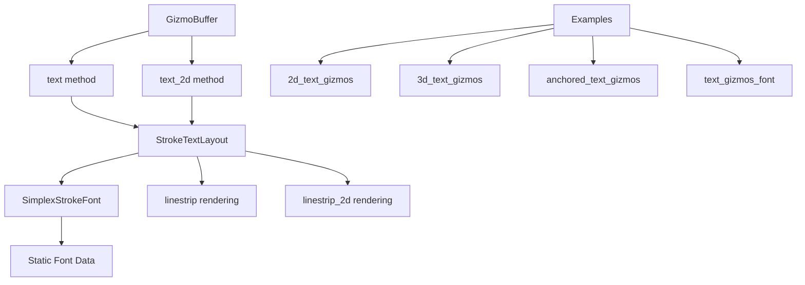

+++
title = "#22732 Stroke font text gizmos"
date = "2026-02-07T00:00:00"
draft = false
template = "pull_request_page.html"
in_search_index = true

[taxonomies]
list_display = ["show"]

[extra]
current_language = "en"
available_languages = {"en" = { name = "English", url = "/pull_request/bevy/2026-02/pr-22732-en-20260207" }, "zh-cn" = { name = "中文", url = "/pull_request/bevy/2026-02/pr-22732-zh-cn-20260207" }}
labels = ["C-Feature", "A-Rendering", "A-Gizmos", "A-Text", "M-Release-Note", "D-Modest"]
+++

# Title: Stroke font text gizmos

## Basic Information
- **Title**: Stroke font text gizmos
- **PR Link**: https://github.com/bevyengine/bevy/pull/22732
- **Author**: ickshonpe
- **Status**: MERGED
- **Labels**: C-Feature, A-Rendering, S-Ready-For-Final-Review, A-Gizmos, A-Text, M-Release-Note, D-Modest
- **Created**: 2026-01-29T00:44:15Z
- **Merged**: 2026-02-07T20:18:35Z
- **Merged By**: alice-i-cecile

## Description Translation
### Objective
Lightweight immediate mode stroke fonts text gizmo implementation.

Fixes #16490

### Solution
New `bevy_gizmos` module `text` containing functions `text` and `text_2d` implemented for `GizmoBuffer`. 

The `text` function has parameters:
- `isometry: Into<Isometry3d>`: defines the translation and rotation of the text.
- `text: &str`: the text to be drawn.
- `size: f32`: the height of the glyphs.
- `anchor: Vec2`: anchor point relative to the center of the text.
- `color: Into<Color>`: the color of the text.

`text_2d` is the same, except the isometry is `Into<Isometry2d>`.

The glyph set is limited to ASCII characters from 33 to 126. 

The text rendering uses the Simplex Hershey font:
https://en.wikipedia.org/wiki/Hershey_fonts
https://paulbourke.net/dataformats/hershey/

The static font data is in the bevy_gizmos::text_font module.
Hershey fonts are public domain and don't require any attribution.

The text geometry isn't retained but since it's so simple, it's still much faster than the retained Cosmic Text version I wrote initially. That might not be the case if it's used to display whole pages of text, but this isn't intended for that.

Glyphs are drawn using linestrips.

### Limitations
* I think this would be better with a monospaced font but it's using a proportional font atm. 
* Only supports left-to-right, left justified text.
* Line height is fixed.
* Can't set the color of individual glyphs.
* Can't change the font.

### Testing
Example displaying text gizmos rotating in 3d
```
cargo run --example 3d_text_gizmos
```

Example displaying all the glyphs from the text gizmos font:
```
cargo run --example text_gizmos_font
```

Larger example with lots of text and an FPS counter:
```
cargo run --example 2d_text_gizmos
```

Example demonstrating anchors:
```
cargo run --example anchored_text_gizmos
```

### Showcase


## The Story of This Pull Request

### The Problem and Context
Bevy's gizmo system provides immediate-mode drawing primitives for debug visualization, but it lacked text rendering capabilities. Issue #16490 specifically requested text support for gizmos, citing use cases like labeling objects, displaying debug information, and creating instructional overlays. The challenge was implementing text rendering that aligned with Bevy's immediate-mode architecture: lightweight, non-retained geometry that could be drawn each frame without persistent state.

### The Solution Approach
The developer chose a stroke font approach using the Simplex Hershey font, which offered several advantages for this use case. Hershey fonts are public domain vector fonts where each glyph is defined by line segments, making them ideal for immediate-mode rendering. The Simplex variant was selected for its balanced design and comprehensive ASCII character set. 

The implementation follows a minimalist philosophy: text geometry is generated and discarded each frame, avoiding retention costs. This contrasts with more complex text rendering systems that cache glyph geometry or use signed distance fields. The trade-off was acceptable because text gizmos are primarily for debugging and UI-like overlays where volume is low.

### The Implementation
The core implementation consists of two new modules in the `bevy_gizmos` crate. The `simplex_stroke_font` module contains static font data, including glyph point positions, stroke sequences, and metadata like advance widths. The `stroke_text` module provides the rendering logic, with a `StrokeFont` struct that manages layout and a `StrokeTextLayout` that iterates through text, computing positions for each stroke.

The public API adds two methods to `GizmoBuffer`: `text` for 3D text and `text_2d` for 2D text. Both accept similar parameters: an isometry (position + rotation), text string, font size, anchor point, and color. The anchor system is particularly useful, allowing text to be positioned relative to its bounding box center, edges, or corners.

```rust
// File: crates/bevy_gizmos/src/stroke_text.rs
impl<Config, Clear> GizmoBuffer<Config, Clear>
where
    Config: GizmoConfigGroup,
    Clear: 'static + Send + Sync,
{
    pub fn text(
        &mut self,
        isometry: impl Into<Isometry3d>,
        text: &str,
        font_size: f32,
        anchor: Vec2,
        color: impl Into<Color>,
    ) {
        let isometry: Isometry3d = isometry.into();
        let color = color.into();
        let layout = SIMPLEX_STROKE_FONT.layout(text, font_size);
        let layout_anchor = layout.measure() * (vec2(-0.5, 0.5) - anchor);
        for points in layout.render() {
            self.linestrip(
                points.map(|point| isometry * (layout_anchor + point).extend(0.)),
                color,
            );
        }
    }
}
```

Font data is stored compactly. Each glyph is defined by a list of 2D integer coordinates (scaled to font units) and a list of stroke ranges indicating which points form each polyline. The `SIMPLEX_GLYPHS` array pairs each character with its advance width and stroke range.

```rust
// File: crates/bevy_gizmos/src/simplex_stroke_font.rs
pub(crate) const SIMPLEX_POSITIONS: [[i8; 2]; 1100] = [
    [5, 21],
    [5, 7],
    // ... many more points
];

pub(crate) const SIMPLEX_GLYPHS: [(i8, Range<usize>); 95] = [
    (16, 0..0),      // space
    (10, 0..2),      // '!'
    (16, 2..4),      // '"'
    // ... other glyphs
];
```

The layout algorithm iterates through characters, accumulating advance widths for line measurement and positioning strokes. For rendering, it yields iterators over the stroke points, transformed to the correct scale and position.

### Technical Insights
The implementation demonstrates several interesting techniques. First, it uses integer coordinates stored as `i8` to minimize memory footprint while maintaining sufficient precision for the font's design scale (cap height of 21 units). Second, the stroke representation avoids duplicating points for disconnected strokes within a glyph by using range indices into the positions array.

Performance considerations are addressed through the immediate-mode approach and simple algorithms. The font data is entirely static and stored in read-only memory, accessed via references. The layout and rendering code uses iterator chains to avoid allocation where possible.

Architecturally, this follows Bevy's pattern of extending existing systems (`GizmoBuffer`) rather than creating parallel systems. The text rendering leverages existing linestrip drawing capabilities, ensuring consistency with other gizmo types.

### The Impact
This PR adds a practical text rendering capability to Bevy's gizmo system. Developers can now add debug labels, coordinate displays, instruction text, and other annotations directly in their applications. The examples demonstrate both 2D and 3D use cases, from simple rotating text to complex scenes with multiple labels and performance monitoring.

The implementation is intentionally limited in scope: ASCII-only, fixed font, no color per glyph. These limitations keep the code simple and focused on the primary use case of debug visualization. Future extensions could address these if needed, but the current implementation solves the core problem effectively.

From an engineering perspective, this PR shows how to integrate specialized rendering capabilities into a game engine's existing immediate-mode drawing system. The separation of font data from rendering logic, the use of public domain resources to avoid licensing issues, and the careful API design all contribute to a solid implementation.

## Visual Representation



## Key Files Changed

### `crates/bevy_gizmos/src/simplex_stroke_font.rs` (+1414/-0)
This file contains the static Simplex Hershey font data. The font is represented as arrays of point coordinates, stroke ranges, and glyph metadata.

**Key code:**
```rust
pub(crate) const SIMPLEX_POSITIONS: [[i8; 2]; 1100] = [
    [5, 21],
    [5, 7],
    // ... continues for 1100 entries
];

pub(crate) const SIMPLEX_STROKES: [Range<usize>; 188] = [
    0..2,
    2..7,
    // ... continues for 188 entries
];

pub(crate) const SIMPLEX_GLYPHS: [(i8, Range<usize>); 95] = [
    (16, 0..0),      // space (advance 16, no strokes)
    (10, 0..2),      // '!' (advance 10, strokes 0..2)
    // ... continues for 95 ASCII characters
];
```

### `crates/bevy_gizmos/src/stroke_text.rs` (+247/-0)
This file implements the text layout and rendering logic. It defines the `StrokeFont` and `StrokeTextLayout` structs and adds text methods to `GizmoBuffer`.

**Key code:**
```rust
pub struct StrokeFont<'a> {
    pub line_height: f32,
    pub height: f32,
    pub cap_height: f32,
    pub advance: i8,
    pub positions: &'a [[i8; 2]],
    pub strokes: &'a [Range<usize>],
    pub glyphs: &'a [(i8, Range<usize>); 95],
}

impl<Config, Clear> GizmoBuffer<Config, Clear>
where
    Config: GizmoConfigGroup,
    Clear: 'static + Send + Sync,
{
    pub fn text(
        &mut self,
        isometry: impl Into<Isometry3d>,
        text: &str,
        font_size: f32,
        anchor: Vec2,
        color: impl Into<Color>,
    ) {
        let isometry: Isometry3d = isometry.into();
        let color = color.into();
        let layout = SIMPLEX_STROKE_FONT.layout(text, font_size);
        let layout_anchor = layout.measure() * (vec2(-0.5, 0.5) - anchor);
        for points in layout.render() {
            self.linestrip(
                points.map(|point| isometry * (layout_anchor + point).extend(0.)),
                color,
            );
        }
    }
}
```

### `examples/gizmos/2d_text_gizmos.rs` (+104/-0)
This example demonstrates 2D text gizmos with multiple labels, FPS counter, and glyph display.

**Key code:**
```rust
fn draw_labels(mut text_gizmos: Gizmos, diagnostic: Res<DiagnosticsStore>) {
    let colors = [RED, GREEN, BLUE, YELLOW];
    for i in 0..TEXT_COUNT {
        let row = i / 5;
        let col = i % 5;
        let color = colors[i % 4];
        text_gizmos.text_2d(
            Isometry2d {
                translation: Vec2::new(
                    START_X + col as f32 * X_STEP,
                    START_Y - row as f32 * Y_STEP,
                ),
                rotation: Rot2::degrees(2.),
            },
            &format!("label {i}"),
            25.,
            Vec2::ZERO,
            color,
        );
    }
}
```

### `examples/gizmos/3d_text_gizmos.rs` (+51/-0)
This example shows 3D text gizmos with rotating text in 3D space.

**Key code:**
```rust
fn hello_world(mut text_gizmos: Gizmos, time: Res<Time>) {
    let t = 0.2 * time.elapsed_secs();

    text_gizmos.text(
        Isometry3d::new(Vec3::new(0.0, 1.5, 0.0), Quat::from_rotation_y(-t)),
        "Hello",
        1.,
        Vec2::ZERO,
        RED,
    );
}
```

### `Cargo.toml` (+48/-0)
Added new example entries to the Cargo manifest.

**Key code:**
```toml
[[example]]
name = "2d_text_gizmos"
path = "examples/gizmos/2d_text_gizmos.rs"

[[example]]
name = "anchored_text_gizmos"
path = "examples/gizmos/anchored_text_gizmos.rs"

[[example]]
name = "3d_text_gizmos"
path = "examples/gizmos/3d_text_gizmos.rs"

[[example]]
name = "text_gizmos_font"
path = "examples/gizmos/text_gizmos_font.rs"
```

## Further Reading
- [Hershey Fonts Wikipedia Page](https://en.wikipedia.org/wiki/Hershey_fonts) - Background on the font format used
- [Paul Bourke's Hershey Font Page](https://paulbourke.net/dataformats/hershey/) - Technical details and other Hershey fonts
- [Bevy Gizmos Documentation](https://docs.rs/bevy_gizmos/latest/bevy_gizmos/) - Official Bevy gizmo API docs
- [Immediate Mode GUI Systems](https://github.com/ocornut/imgui) - Comparison with other immediate-mode rendering approaches
- [Vector Font Rendering Techniques](https://developer.nvidia.com/gpugems/gpugems3/part-iv-image-effects/chapter-25-rendering-vector-art-gpu) - GPU techniques for rendering vector fonts

# Full Code Diff
*(Provided in the original request, not reproduced here for brevity)*