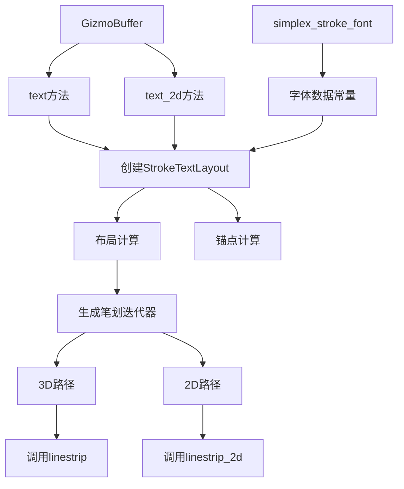

+++
title = "#22732 Stroke font text gizmos"
date = "2026-02-07T00:00:00"
draft = false
template = "pull_request_page.html"
in_search_index = false

[extra]
current_language = "zh-cn"
available_languages = {"en" = { name = "English", url = "/pull_request/bevy/2026-02/pr-22732-en-20260207" }, "zh-cn" = { name = "中文", url = "/pull_request/bevy/2026-02/pr-22732-zh-cn-20260207" }}
labels = ["C-Feature", "A-Rendering", "A-Gizmos", "A-Text", "M-Release-Note", "D-Modest"]
+++

# Title
Stroke font text gizmos

## Basic Information
- **Title**: Stroke font text gizmos  
- **PR Link**: https://github.com/bevyengine/bevy/pull/22732
- **Author**: ickshonpe
- **Status**: MERGED
- **Labels**: C-Feature, A-Rendering, S-Ready-For-Final-Review, A-Gizmos, A-Text, M-Release-Note, D-Modest
- **Created**: 2026-01-29T00:44:15Z
- **Merged**: 2026-02-07T20:18:35Z
- **Merged By**: alice-i-cecile

## Description Translation

### 目标

轻量级立即模式（immediate-mode）描边字体文本gizmo实现。

修复 #16490

### 解决方案

在 `bevy_gizmos` 模块中添加新的 `text` 模块，包含为 `GizmoBuffer` 实现的 `text` 和 `text_2d` 函数。

`text` 函数的参数：
- `isometry: Into<Isometry3d>`：定义文本的平移和旋转
- `text: &str`：要绘制的文本
- `size: f32`：字形的高度
- `anchor: Vec2`：相对于文本中心的锚点
- `color: Into<Color>`：文本的颜色

`text_2d` 相同，但等距变换为 `Into<Isometry2d>`。

字形集仅限于ASCII字符33到126。

文本渲染使用Simplex Hershey字体：
https://en.wikipedia.org/wiki/Hershey_fonts
https://paulbourke.net/dataformats/hershey/

静态字体数据位于bevy_gizmos::text_font模块中。
Hershey字体是公共领域的，不需要署名。

文本几何不会被保留，但由于它非常简单，所以仍然比我最初编写的保留式Cosmic Text版本快得多。如果用它来显示整页文本可能不是这样，但这不是它的用途。

字形使用折线（linestrips）绘制。

### 限制

* 我认为使用等宽字体可能更好，但目前使用的是比例字体。

* 仅支持从左到右、左对齐的文本。

* 行高固定。

* 不能设置单个字形的颜色。

* 不能更改字体。

### 测试

展示3D旋转文本gizmos的示例：
```
cargo run --example 3d_text_gizmos
```

展示文本gizmos字体中所有字形的示例：
```
cargo run --example text_gizmos_font
```

包含大量文本和FPS计数器的大型示例：
```
cargo run --example 2d_text_gizmos
```

演示锚点的示例：
```
cargo run --example anchored_text_gizmos
```

### 展示


## The Story of This Pull Request

### 问题与背景

Bevy引擎的gizmos系统提供了一套即时模式（immediate-mode）的调试绘制工具，允许开发者可视化坐标轴、线框、网格等几何元素。然而，长期以来缺少一个关键功能：文本标注。开发者无法直接在3D场景或2D界面中添加文字标签，这限制了调试和可视化能力。问题#16490明确记录了这个需求：需要一个简单的方法在gizmos中绘制文本。

之前的解决方案可能涉及复杂的字体渲染系统或保留模式（retained-mode）的文本渲染，但这些方法会增加依赖或引入不必要的复杂性。gizmos的核心设计原则是轻量级和即时性——几何数据应该在每一帧生成后立即丢弃，而不是长期保留。

### 解决方案选择

开发者选择使用Hershey字体中的Simplex字体，这是一个经典的描边字体（stroke font）系统。描边字体的特点是通过线段定义字形轮廓，而不是填充区域。这种表示方式有几个关键优势：

1. **与gizmos系统兼容**：gizmos已经支持绘制线段（linestrip），描边字体可以自然地映射到现有API
2. **公共领域**：Hershey字体是公共领域的，没有版权问题
3. **轻量级**：字形数据可以硬编码为常量数组，无需外部依赖
4. **简单性**：避免了复杂的字体解析、字形缓存和纹理管理

开发者提到最初尝试了基于Cosmic Text的保留式实现，但发现对于gizmos的典型用例——少量、短暂的文本标注——即时模式的描边字体性能更好，因为避免了保留几何数据的开销。

### 实现细节

实现分为三个主要部分：字体数据定义、文本布局计算和gizmos API集成。

**字体数据存储**：在`simplex_stroke_font.rs`中，开发者硬编码了Simplex Hershey字体的所有数据：
- `SIMPLEX_POSITIONS`：1100个坐标点，每个点是(i8, i8)表示的(x,y)偏移量
- `SIMPLEX_STROKES`：188个范围，定义每个笔划在坐标数组中的索引
- `SIMPLEX_GLYPHS`：95个条目，对应可打印ASCII字符，每个包含前进宽度和笔划范围

这种表示方式很高效：每个字形由多个笔划组成，每个笔划是一个坐标点序列。坐标使用相对值存储，在渲染时根据字体大小缩放。

**文本布局系统**：`stroke_text.rs`定义了`StrokeFont`结构体作为字体抽象，以及`StrokeTextLayout`处理多行文本布局。布局计算包括：
1. 字符宽度累加：遍历文本，累加每个字符的前进宽度
2. 换行处理：遇到换行符时重置X坐标并增加Y坐标
3. 锚点计算：根据指定的锚点参数（如居中、左上、右下）调整整个文本块的位置

`StrokeTextLayout::render()`方法返回一个迭代器，它按顺序生成每个笔划的坐标点序列。这是惰性计算的，不会预先分配所有顶点。

**gizmos API扩展**：在`GizmoBuffer`上添加了两个新方法：
- `text()`：用于3D文本，接受`Isometry3d`定义位置和旋转
- `text_2d()`：用于2D文本，接受`Isometry2d`

两个方法的核心逻辑相同：创建文本布局，计算锚点偏移，然后对每个笔划调用相应的`linestrip`或`linestrip_2d`方法。这确保了文本渲染完全集成到现有的gizmos系统中，受益于其深度测试、抗锯齿等特性。

### 技术见解

**坐标系统设计**：字体数据使用整数坐标存储，渲染时通过缩放因子转换为实际尺寸。这允许在不同字体大小下重用同一份数据。字体的"大写字母高度"（cap height）为21个单位，用于基准缩放。

**内存与性能权衡**：虽然字体数据较大（约1.4KB的坐标数组），但这些都是编译时常量，存储在二进制只读段中。与动态生成字形或加载字体文件相比，这种方法没有运行时分配开销。

**API设计选择**：使用`Isometry`而不是简单的`Vec3`位置，因为文本经常需要旋转（如跟随相机或面向观察者）。锚点系统提供了灵活的定位方式，开发者可以通过指定(-0.5, 0.5)将文本锚定在左上角，或(0.5, -0.5)锚定在右下角。

**局限性背后的考量**：文档中提到的限制——仅支持ASCII、左对齐、固定行高等——反映了这个功能的定位：简单、专门的工具，而不是全功能的文本渲染系统。这些限制在大多数调试场景中可以接受，同时保持了实现的简洁性。

### 影响

这个PR为Bevy添加了一个长期需要的功能，填补了可视化工具链中的一个重要空白。实现方式体现了几个值得借鉴的工程原则：

1. **最小化依赖**：不引入外部字体库，完全自包含
2. **复用现有基础设施**：利用gizmos的线段绘制能力，而不是创建新的渲染路径
3. **渐进式设计**：从最小可行功能开始，明确记录限制，为未来扩展留下空间

对于Bevy开发者来说，现在可以在调试可视化中直接添加文本标签，这对于显示变量值、标注对象、创建指示器等场景非常有用。性能影响微乎其微，因为只有实际绘制的文本才会产生绘制调用。

## Visual Representation



## Key Files Changed

### 1. `crates/bevy_gizmos/src/simplex_stroke_font.rs` (+1414/-0)
这是新增的文件，包含Simplex Hershey字体的硬编码数据。文件定义了字形的坐标点、笔划范围和前进宽度。

**关键代码片段**：
```rust
pub(crate) const SIMPLEX_POSITIONS: [[i8; 2]; 1100] = [
    [5, 21],
    [5, 7],
    // ... 更多坐标
];

pub(crate) const SIMPLEX_GLYPHS: [(i8, Range<usize>); 95] = [
    (16, 0..0),    // 空格
    (10, 0..2),    // '!'
    (16, 2..4),    // '"'
    // ... 更多字形定义
];
```

这个文件为整个文本渲染系统提供原始数据。每个字形由多个笔划组成，每个笔划是坐标点序列。`SIMPLEX_GLYPHS`数组中的第一个值是前进宽度（advance），告诉渲染器在绘制完当前字符后应该移动多少距离。

### 2. `crates/bevy_gizmos/src/stroke_text.rs` (+247/-0)
这是文本渲染的核心实现，定义了`StrokeFont`和`StrokeTextLayout`结构体，并为`GizmoBuffer`实现了`text`和`text_2d`方法。

**关键代码片段**：
```rust
impl<'a> StrokeTextLayout<'a> {
    pub fn render(&'a self) -> impl Iterator<Item = impl Iterator<Item = Vec2>> + 'a {
        let mut chars = self.text.chars();
        // ... 迭代字符，生成笔划坐标
    }
}

impl<Config, Clear> GizmoBuffer<Config, Clear> {
    pub fn text(
        &mut self,
        isometry: impl Into<Isometry3d>,
        text: &str,
        font_size: f32,
        anchor: Vec2,
        color: impl Into<Color>,
    ) {
        let layout = SIMPLEX_STROKE_FONT.layout(text, font_size);
        let layout_anchor = layout.measure() * (vec2(-0.5, 0.5) - anchor);
        for points in layout.render() {
            self.linestrip(
                points.map(|point| isometry * (layout_anchor + point).extend(0.)),
                color,
            );
        }
    }
}
```

`render()`方法实现了惰性迭代器，按需生成笔划坐标，避免了预先分配所有顶点。`text()`方法展示了完整的渲染流程：布局、锚点计算、坐标变换，最后调用现有的`linestrip`方法。

### 3. `examples/gizmos/2d_text_gizmos.rs` (+104/-0)
新增的示例文件，展示如何在2D场景中使用文本gizmos，包括大量文本标签和FPS计数器。

**关键代码片段**：
```rust
fn draw_labels(mut text_gizmos: Gizmos, diagnostic: Res<DiagnosticsStore>) {
    // 绘制多个标签
    for i in 0..TEXT_COUNT {
        text_gizmos.text_2d(
            Isometry2d::new(position, Rot2::degrees(2.)),
            &format!("label {i}"),
            25.,
            Vec2::ZERO,
            color,
        );
    }
    
    // FPS计数器
    if let Some(fps) = diagnostic.get(&FrameTimeDiagnosticsPlugin::FPS)
        && let Some(fps_smoothed) = fps.smoothed()
    {
        text_gizmos.text_2d(
            Isometry2d::from_translation(Vec2::new(600., START_Y + 150.)),
            &format!("fps: {:.1}", fps_smoothed),
            25.,
            Vec2::ZERO,
            Color::WHITE,
        );
    }
}
```

这个示例演示了API的实际用法，包括格式化文本、使用诊断数据，以及展示性能影响。

### 4. `examples/gizmos/3d_text_gizmos.rs` (+51/-0)
展示3D文本gizmos的示例，包含旋转的文本。

**关键代码片段**：
```rust
fn hello_world(mut text_gizmos: Gizmos, time: Res<Time>) {
    let t = 0.2 * time.elapsed_secs();

    text_gizmos.text(
        Isometry3d::new(Vec3::new(0.0, 1.5, 0.0), Quat::from_rotation_y(-t)),
        "Hello",
        1.,
        Vec2::ZERO,
        RED,
    );
    // ... 更多文本
}
```

这个示例清楚地展示了3D文本的关键特性：可以在3D空间中定位和旋转。

### 5. `Cargo.toml` (+48/-0)
在Cargo.toml中添加了4个新的示例配置，使这些示例可以通过`cargo run --example`命令运行。

**关键代码片段**：
```toml
[[example]]
name = "2d_text_gizmos"
path = "examples/gizmos/2d_text_gizmos.rs"
# Causes an ICE on docs.rs
doc-scrape-examples = false

[package.metadata.example.2d_text_gizmos]
name = "Text Gizmos 2d"
description = "A scene showcasing 2d text gizmos"
category = "Gizmos"
wasm = true
```

配置包括示例名称、路径、描述和分类，确保它们正确集成到构建系统和文档中。

## Further Reading

对于想了解更多相关概念的读者，可以参考以下资源：

1. **Hershey字体系统**：
   - [Paul Bourke的Hershey字体页面](https://paulbourke.net/dataformats/hershey/) - 原始数据格式和背景
   - [Wikipedia: Hershey fonts](https://en.wikipedia.org/wiki/Hershey_fonts) - 历史和技术概述

2. **即时模式渲染**：
   - [Immediate Mode GUI](https://github.com/ocornut/imgui) - Dear ImGui是即时模式UI的经典实现
   - [Bevy Gizmos文档](https://docs.rs/bevy_gizmos) - 了解gizmos系统的其他功能

3. **字体渲染技术**：
   - [Signed Distance Fields字体渲染](https://steamcdn-a.akamaihd.net/apps/valve/2007/SIGGRAPH2007_AlphaTestedMagnification.pdf) - Valve的SDF技术论文
   - [FreeType库](https://freetype.org/) - 开源字体渲染引擎

4. **Bevy相关资源**：
   - [Bevy Cookbook](https://bevy-cheatbook.github.io/) - Bevy的实用指南
   - [Bevy Discord社区](https://discord.com/invite/bevy) - 实时讨论和问题解答