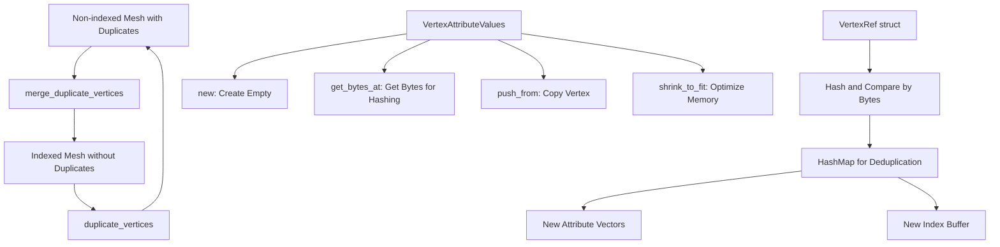

+++
title = "#22734 Mesh::deduplicate_vertices"
date = "2026-02-04T00:00:00"
draft = false
template = "pull_request_page.html"
in_search_index = true

[taxonomies]
list_display = ["show"]

[extra]
current_language = "en"
available_languages = {"en" = { name = "English", url = "/pull_request/bevy/2026-02/pr-22734-en-20260204" }, "zh-cn" = { name = "中文", url = "/pull_request/bevy/2026-02/pr-22734-zh-cn-20260204" }}
labels = ["C-Feature", "A-Rendering", "A-Math", "D-Modest"]
+++

# Title
Mesh::deduplicate_vertices

## Basic Information
- **Title**: Mesh::deduplicate_vertices
- **PR Link**: https://github.com/bevyengine/bevy/pull/22734
- **Author**: Smerom
- **Status**: MERGED
- **Labels**: C-Feature, A-Rendering, S-Ready-For-Final-Review, A-Math, D-Modest
- **Created**: 2026-01-29T07:23:22Z
- **Merged**: 2026-02-04T19:21:03Z
- **Merged By**: alice-i-cecile

## Description Translation
Adopted from #16016: resolved merge conflicts and updated api to match what's available for the inverse `Mesh::duplicate_vertices` method.

# Objective

Current Mesh is not easy to create programmatically: a developer has either:
    - generate duplicate vertices
    - or do non-trivial logic of dealing with indices

## Solution

Currently there's Mesh::duplicate_vertices operation which flattens vertices by removing indices.

This PR proposes inverse operation: Mesh::deduplicate_vertices: if index is not set, deduplicate vertex data and create an index.

So for quick experiments, when startup time may be not as important as amount of data, mesh can be generated without dealing with indices, and then Mesh::deduplicate_vertices will generate an index.

## Testing

Unit test added.

## The Story of This Pull Request

### The Problem and Context

When creating meshes programmatically in Bevy, developers face a choice between two suboptimal approaches. The first approach is to generate duplicate vertices - meaning each triangle gets its own set of three vertices even when vertices are shared between triangles. This approach is simple to implement but wastes memory and processing power since identical vertex data gets stored and processed multiple times.

The second approach requires implementing index-based mesh generation, where vertices are stored once and triangles reference them via indices. While more memory-efficient, this requires developers to write non-trivial deduplication logic or carefully construct their meshes to avoid duplicates from the start. This adds complexity to mesh generation code, especially for quick prototypes or experimental features where development speed is more important than optimization.

Bevy already had a `Mesh::duplicate_vertices` method that did the opposite transformation: it took an indexed mesh and flattened it by removing the index buffer and duplicating vertex data for each triangle. However, there was no corresponding method to go from a non-indexed mesh with potential duplicates back to an indexed, deduplicated mesh.

### The Solution Approach

The developer adopted and updated an existing PR (#16016) that had become stale due to merge conflicts and API changes. The solution adds two new methods to the `Mesh` struct: `merge_duplicate_vertices()` for in-place mutation and `with_merge_duplicate_vertices()` for a consuming version that returns a new mesh.

The core insight is that this operation should only work on meshes without existing indices. If a mesh already has indices set, the operation returns an error, though the documentation suggests calling `duplicate_vertices()` first and then `merge_duplicate_vertices()` as a workaround for indexed meshes that might still have duplicate vertices.

The implementation uses a hash map to detect duplicate vertices efficiently. Each vertex is represented by all its attribute data (position, UVs, normals, etc.), and vertices are considered equal only if all their attributes match byte-for-byte. This ensures correctness even when vertices share position but differ in other attributes like UV coordinates.

### The Implementation

The main implementation lives in the `merge_duplicate_vertices()` method in `mesh.rs`. Here's how it works:

First, the method checks if indices are already set, returning an error if they are:

```rust
match self.try_indices() {
    Ok(_) => return Err(MeshMergeDuplicateVerticesError::IndicesAlreadySet),
    Err(err) => match err {
        MeshAccessError::ExtractedToRenderWorld => return Err(err.into()),
        MeshAccessError::NotFound => (),
    },
}
```

The method creates a `VertexRef` struct that acts as a lightweight reference to a vertex in the original mesh:

```rust
struct VertexRef<'a> {
    mesh_attributes: &'a BTreeMap<MeshVertexAttributeId, MeshAttributeData>,
    i: usize,
}
```

This struct implements `Hash` and `Eq` by comparing the byte representation of all vertex attributes:

```rust
impl<'a> Hash for VertexRef<'a> {
    fn hash<H: Hasher>(&self, state: &mut H) {
        for values in self.mesh_attributes.values() {
            values.values.get_bytes_at(self.i).hash(state);
        }
    }
}
```

The deduplication process then iterates through all vertices, using a hash map to track unique vertices:

```rust
let mut vertex_to_new_index: HashMap<VertexRef, u32> = HashMap::new();
let mut indices = Vec::with_capacity(self.count_vertices());

for i in 0..self.count_vertices() {
    let vertex_ref = VertexRef {
        mesh_attributes: old_attributes,
        i,
    };
    let j = match vertex_to_new_index.entry(vertex_ref) {
        hash_map::Entry::Occupied(e) => *e.get(),
        hash_map::Entry::Vacant(e) => {
            e.insert(len);
            vertex_ref.push_to(&mut new_attributes);
            len
        }
    };
    indices.push(j);
}
```

The `VertexAttributeValues` enum in `vertex.rs` gets several new helper methods to support this operation:

1. `new()` - Creates an empty vertex attribute container of a specific format
2. `get_bytes_at()` - Gets the byte representation of a vertex at a specific index
3. `push_from()` - Copies a vertex from one attribute container to another
4. `shrink_to_fit()` - Reduces memory usage after building the new attribute vectors

The `push_from()` method is particularly interesting because it uses exhaustive pattern matching to ensure type safety:

```rust
pub(crate) fn push_from(&mut self, source: &VertexAttributeValues, i: usize) {
    match (self, source) {
        (VertexAttributeValues::Float32(this), VertexAttributeValues::Float32(source)) => {
            this.push(source[i]);
        }
        (VertexAttributeValues::Float32(_), _) => panic!("Mismatched vertex attribute values"),
        // ... many more variants for each attribute type
    }
}
```

### Technical Insights

The implementation makes careful use of Rust's type system to ensure correctness. The exhaustive pattern matching in `push_from()` guarantees at compile time that we handle all possible vertex attribute type combinations, and the runtime panic for mismatched types provides a clear error message if there's a programming error.

The `VertexRef` struct is a clever optimization that avoids copying vertex data during the deduplication process. Instead of creating new vertex data structures for comparison, it references the original data and compares bytes directly. This is important for performance since vertex data can be large.

The error handling follows Bevy's established patterns, with a dedicated error enum `MeshMergeDuplicateVerticesError` that properly converts from `MeshAccessError` using the `From` trait.

### The Impact

This PR adds a valuable utility function to Bevy's mesh API. Developers can now:
1. Generate meshes simply without worrying about indices during initial development
2. Optimize those meshes later with a single method call
3. Round-trip between indexed and non-indexed representations when needed

The unit test demonstrates the functionality with a practical example: a quad made of two triangles where some vertices are duplicates. The test verifies that:
- Deduplication reduces 6 vertices to 5 unique vertices
- The index buffer is correctly generated with 6 indices
- Calling `duplicate_vertices()` after deduplication restores the original vertex count
- The original and restored vertex data match exactly

This functionality is particularly useful for:
- Procedural mesh generation where deduplication logic would be complex
- Importing mesh data from formats that don't use indices
- Optimizing meshes generated by external tools or algorithms
- Educational examples where simplicity is more important than performance

## Visual Representation



## Key Files Changed

### `crates/bevy_mesh/src/mesh.rs` (+187/-2)

This file contains the main implementation of the `merge_duplicate_vertices` method and related functionality.

**Key changes:**
1. Added `merge_duplicate_vertices()` and `with_merge_duplicate_vertices()` methods to the `Mesh` struct
2. Added `MeshMergeDuplicateVerticesError` enum for error handling
3. Added comprehensive unit test for the new functionality

**Code snippet showing the core algorithm:**
```rust
pub fn merge_duplicate_vertices(&mut self) -> Result<(), MeshMergeDuplicateVerticesError> {
    // ... error checking
    
    let mut vertex_to_new_index: HashMap<VertexRef, u32> = HashMap::new();
    let mut indices = Vec::with_capacity(self.count_vertices());
    
    for i in 0..self.count_vertices() {
        let vertex_ref = VertexRef {
            mesh_attributes: old_attributes,
            i,
        };
        let j = match vertex_to_new_index.entry(vertex_ref) {
            hash_map::Entry::Occupied(e) => *e.get(),
            hash_map::Entry::Vacant(e) => {
                e.insert(len);
                vertex_ref.push_to(&mut new_attributes);
                len
            }
        };
        indices.push(j);
    }
    
    // ... update mesh with new attributes and indices
}
```

### `crates/bevy_mesh/src/vertex.rs` (+265/-1)

This file extends the `VertexAttributeValues` enum with helper methods needed for vertex deduplication.

**Key changes:**
1. Added `new()` method to create empty vertex attribute containers
2. Added `get_bytes_at()` method for byte-level comparison of vertices
3. Added `push_from()` method to copy vertices between containers
4. Added `shrink_to_fit()` method to optimize memory usage

**Code snippet showing the byte extraction method:**
```rust
pub(crate) fn get_bytes_at(&self, i: usize) -> &[u8] {
    match self {
        VertexAttributeValues::Float32(values) => bytes_of(&values[i]),
        VertexAttributeValues::Sint32(values) => bytes_of(&values[i]),
        VertexAttributeValues::Uint32(values) => bytes_of(&values[i]),
        // ... many more variants for each attribute type
    }
}
```

## Further Reading

1. **Bevy Mesh Documentation**: [https://docs.rs/bevy_mesh/latest/bevy_mesh/](https://docs.rs/bevy_mesh/latest/bevy_mesh/)
2. **Original PR #16016**: The original implementation that this PR was adapted from
3. **Vertex Buffers and Index Buffers in Computer Graphics**: Understanding the difference between indexed and non-indexed geometry representations
4. **Rust HashMap and Hashing**: How Rust's hash maps work and best practices for implementing custom Hash traits
5. **Mesh Optimization Techniques**: Common algorithms for mesh optimization including vertex deduplication, triangle stripping, and LOD generation