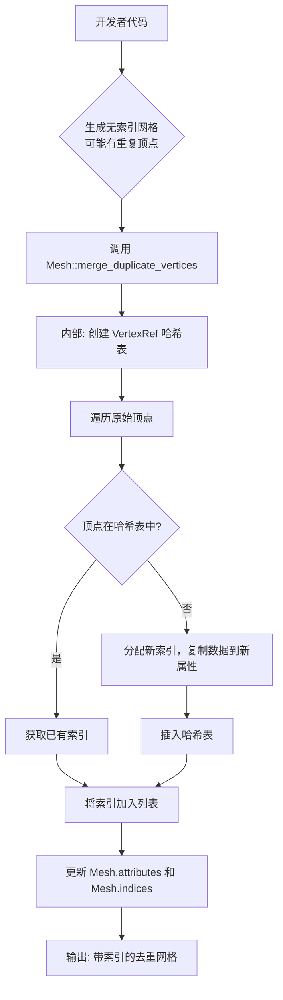

+++
title = "#22734 Mesh::deduplicate_vertices"
date = "2026-02-04T00:00:00"
draft = false
template = "pull_request_page.html"
in_search_index = false

[extra]
current_language = "zh-cn"
available_languages = {"en" = { name = "English", url = "/pull_request/bevy/2026-02/pr-22734-en-20260204" }, "zh-cn" = { name = "中文", url = "/pull_request/bevy/2026-02/pr-22734-zh-cn-20260204" }}
+++

# Mesh::deduplicate_vertices (网格顶点去重)

## 基本信息
- **标题**: Mesh::deduplicate_vertices
- **PR 链接**: https://github.com/bevyengine/bevy/pull/22734
- **作者**: Smerom
- **状态**: 已合并 (MERGED)
- **标签**: C-Feature, A-Rendering, S-Ready-For-Final-Review, A-Math, D-Modest
- **创建时间**: 2026-01-29T07:23:22Z
- **合并时间**: 2026-02-04T19:21:03Z
- **合并者**: alice-i-cecile

## 描述翻译

来自 #16016: 解决了合并冲突并根据逆向操作 `Mesh::duplicate_vertices` 方法的可用 API 进行了更新。

# 目标 (Objective)

当前的程序化网格 (Mesh) 创建并不简单：开发者要么需要：
    - 生成重复的顶点
    - 或者处理索引的非平凡逻辑

## 解决方案 (Solution)

目前存在一个 `Mesh::duplicate_vertices` 操作，它通过移除索引来扁平化顶点。

此 PR 提出了一个逆操作：`Mesh::deduplicate_vertices`：如果未设置索引，则对顶点数据进行去重并创建索引。

因此，对于快速实验，在启动时间可能不如数据量重要的情况下，可以先生成不处理索引的网格，然后调用 `Mesh::deduplicate_vertices` 来生成索引。

## 测试 (Testing)

已添加单元测试。

## 本 PR 的故事

这个 PR 是关于填补 Bevy 网格 (Mesh) 处理 API 中一个缺失但实用的功能。Bevy 引擎的 `Mesh` 结构体是渲染几何体的核心表示。一个网格包含顶点数据（位置、法线、UV 等）和可选的索引 (Indices)。索引允许通过引用顶点列表中的位置来定义三角形（或线、点），从而实现顶点复用，这对于共享顶点的几何体（如立方体）可以节省大量内存。

### 问题与背景

在进行程序化网格生成时，开发者面临一个直接的困境。为了简单起见，你可以逐个指定三角形的顶点，但这会导致顶点数据大量重复。例如，一个简单的四边形由两个三角形组成，在顶点数据中，两个三角形共享的两个顶点会被存储两次。这不仅浪费内存，还会增加后续 GPU 处理和变换的计算量。另一种方法是手动管理索引，这需要额外的簿记工作：你需要跟踪每个唯一点的位置，并构建一个索引列表来引用它们。对于复杂的几何体或快速原型开发，这增加了不必要的复杂性。

现有的 `Mesh::duplicate_vertices` 方法解决了相反的问题：它接受一个带有索引的网格，并通过重复顶点数据来“展开”它，生成一个没有索引的网格。这很有用，但缺少一个对应的逆操作来“压缩”重复的顶点。

因此，开发者没有一个简单的、内置的方法来将一个由重复顶点组成的无索引网格，优化成一个具有索引的去重网格。这正是本 PR 旨在解决的问题。

### 解决方案与实现

解决方案是直接在 `Mesh` 结构体上实现两个新方法：`merge_duplicate_vertices`（就地修改）和 `with_merge_duplicate_vertices`（消费自身并返回新网格）。其核心思想是扫描所有顶点属性，识别完全相同的顶点，为每个唯一的顶点创建一份副本，并构建一个映射回这些唯一顶点的索引列表。

实现的关键在于如何高效地比较和查找重复的顶点。一个天真的 O(n²) 比较对于大量顶点来说是不可行的。因此，作者采用了基于哈希表 (HashMap) 的方法，这通常能将复杂度降至接近 O(n)。

具体实现步骤如下：

1.  **前置检查**：首先，方法会检查网格是否已经被提取到渲染世界 (`RenderWorld`)，或者是否已经设置了索引。如果已经设置了索引，方法会立即返回一个错误 (`MeshMergeDuplicateVerticesError::IndicesAlreadySet`)。这确保了操作语义的清晰性：该方法专门用于处理无索引的网格。开发者如果需要处理已有索引的网格，可以按照文档建议，先调用 `duplicate_vertices`，再调用此方法。

2.  **顶点引用与哈希**：实现的核心是一个内部的 `VertexRef` 结构体。这个结构体不存储实际的顶点数据，而是持有一个对原始网格属性映射 (`mesh_attributes`) 的引用和一个顶点索引 (`i`)。然后，为 `VertexRef` 实现了 `PartialEq`、`Eq` 和 `Hash`。
    *   `eq` 方法通过比较两个顶点在所有属性中第 `i` 个位置的原始字节 (`get_bytes_at`) 来判断它们是否相等。
    *   `hash` 方法也基于这些字节进行计算。
    这种方式使得我们可以将 `VertexRef` 用作哈希表的键，即使网格有多种不同格式的属性（如 `Float32x3`, `Uint8x4` 等），也能正确地进行去重。

3.  **构建新数据和索引**：
    *   创建一个空的 `HashMap<VertexRef, u32>` 来映射唯一的顶点到它们新的索引。
    *   为新属性数据预先分配空的存储容器。
    *   遍历原始网格中的每一个顶点 (0..`count_vertices()`)。对于每个顶点，创建一个 `VertexRef`。
    *   在哈希表中查找这个 `VertexRef`。
        *   如果找到，则获取之前分配的唯一索引。
        *   如果没找到，则分配一个新的唯一索引（当前哈希表的长度），将 `VertexRef` 和该索引插入哈希表，并调用 `vertex_ref.push_to(...)` 将这个唯一顶点的所有属性数据复制到新的属性存储中。
    *   无论哪种情况，都将获取到的（新的或已有的）索引推入 `indices` 列表。

4.  **内存优化与更新**：遍历完成后，对新属性数据的每个向量调用 `shrink_to_fit`，以释放可能多余的内存。最后，用新的、去重后的属性数据和生成的 `Indices::U32` 索引替换掉网格中原有的数据。

### 技术洞察

*   **API 对称性**：这个 PR 精心设计了 API 以保持一致性。`merge_duplicate_vertices` 是 `duplicate_vertices` 的逻辑逆操作。此外，还提供了 `with_merge_duplicate_vertices` 这个消费性变体，遵循了 Rust 中常见的模式，为调用者提供了灵活性。
*   **错误处理**：定义了专门的错误枚举 `MeshMergeDuplicateVerticesError`，清晰地分离了“索引已存在”和更通用的网格访问错误 (`MeshAccessError`)。
*   **底层支持**：主要的算法逻辑在 `mesh.rs` 中，但它依赖于 `vertex.rs` 中新增的几个 `VertexAttributeValues` 的辅助方法：
    *   `new`: 根据 `VertexFormat` 创建一个新的空容器。
    *   `get_bytes_at`: 获取指定索引处顶点数据的字节切片，用于快速比较和哈希。
    *   `push_from`: 将一个顶点从源容器复制到目标容器。
    *   `shrink_to_fit`: 调用底层向量的 `shrink_to_fit`。
    这些方法被标记为 `pub(crate)`，意味着它们是内部实现细节，但为网格的其它操作提供了必要的基础设施。
*   **性能考量**：使用哈希表进行重复检测是高效的选择。需要注意，`VertexRef` 的哈希和比较会遍历所有顶点属性，对于属性非常多的网格可能会有开销，但这是实现正确去重所必需的。

### 影响与总结

这个 PR 为 Bevy 的网格处理工具箱增加了一个实用工具。它的主要影响是：
1.  **简化程序化内容生成**：开发者现在可以更自然地生成网格——先以最简单的方式（可能产生重复）定义几何体，然后在最后一步调用去重优化。这降低了原型设计和实验的认知负担。
2.  **提高资源效率**：生成的网格数据更小，占用的内存更少，并且在传输到 GPU 和进行顶点着色器处理时可能更高效。
3.  **完善 API**：它填补了 `duplicate_vertices` 留下的空白，使得网格在“索引表示”和“扁平表示”之间的转换变得完整和双向。

从工程角度看，这是一个设计良好的功能添加：它解决了明确的需求，实现高效且健壮（包含错误检查和单元测试），并很好地集成到现有的 API 和架构中。

## 可视化关系



## 关键文件更改

### 1. `crates/bevy_mesh/src/mesh.rs`
这是实现的核心，添加了顶点去重的主要逻辑和公开 API。

**关键修改：**
- **新增 `merge_duplicate_vertices` 和 `with_merge_duplicate_vertices` 方法**：提供了去重功能的主要入口。
- **新增 `MeshMergeDuplicateVerticesError` 枚举**：定义了操作可能发生的错误。
- **新增单元测试 `merge_duplicate_vertices`**：验证了去重功能以及与 `duplicate_vertices` 结合使用的正确性。

**核心代码片段：**
```rust
// 内部用于哈希和比较的 VertexRef 结构体
#[derive(Copy, Clone)]
struct VertexRef<'a> {
    mesh_attributes: &'a BTreeMap<MeshVertexAttributeId, MeshAttributeData>,
    i: usize,
}
impl<'a> PartialEq for VertexRef<'a> {
    fn eq(&self, other: &Self) -> bool {
        assert!(ptr::eq(self.mesh_attributes, other.mesh_attributes));
        for values in self.mesh_attributes.values() {
            if values.values.get_bytes_at(self.i) != values.values.get_bytes_at(other.i) {
                return false;
            }
        }
        true
    }
}
impl<'a> Hash for VertexRef<'a> {
    fn hash<H: Hasher>(&self, state: &mut H) {
        for values in self.mesh_attributes.values() {
            values.values.get_bytes_at(self.i).hash(state);
        }
    }
}

// 去重算法的主循环
let mut vertex_to_new_index: HashMap<VertexRef, u32> = HashMap::new();
let mut indices = Vec::with_capacity(self.count_vertices());
for i in 0..self.count_vertices() {
    // ... 获取 len ...
    let vertex_ref = VertexRef { mesh_attributes: old_attributes, i, };
    let j = match vertex_to_new_index.entry(vertex_ref) {
        hash_map::Entry::Occupied(e) => *e.get(),
        hash_map::Entry::Vacant(e) => {
            e.insert(len);
            vertex_ref.push_to(&mut new_attributes); // 复制唯一顶点数据
            len
        }
    };
    indices.push(j);
}
```

### 2. `crates/bevy_mesh/src/vertex.rs`
此文件扩展了 `VertexAttributeValues` 枚举的功能，为去重算法提供了必要的底层操作。

**关键修改：**
- **新增 `new` 方法**：根据 `VertexFormat` 创建正确类型的空 `VertexAttributeValues`。
- **新增 `get_bytes_at` 方法**：返回特定索引处顶点数据的字节切片，用于哈希和相等性比较。
- **新增 `push_from` 方法**：将数据从一个 `VertexAttributeValues` 的特定索引复制到另一个同类型的 `VertexAttributeValues` 中。
- **新增 `shrink_to_fit` 方法**：调用内部向量的 `shrink_to_fit` 以优化内存。

**核心代码片段：**
```rust
// get_bytes_at 方法示例（Float32x3 分支）
pub(crate) fn get_bytes_at(&self, i: usize) -> &[u8] {
    match self {
        // ... 其他分支 ...
        VertexAttributeValues::Float32x3(values) => bytes_of(&values[i]),
        // ... 其他分支 ...
    }
}

// push_from 方法示例（Float32x3 分支）
pub(crate) fn push_from(&mut self, source: &VertexAttributeValues, i: usize) {
    match (self, source) {
        (VertexAttributeValues::Float32x3(this), VertexAttributeValues::Float32x3(source)) => {
            this.push(source[i]);
        }
        (VertexAttributeValues::Float32x3(_), _) => panic!("Mismatched vertex attribute values"),
        // ... 其他分支 ...
    }
}
```

## 进一步阅读

1.  **Bevy 官方文档 - Mesh**: https://docs.rs/bevy_mesh/latest/bevy_mesh/struct.Mesh.html (了解 Mesh 结构的完整 API)
2.  **原始的 `duplicate_vertices` 方法**: 查看其实现和文档，理解这对互逆操作是如何设计的。
3.  **Rust `HashMap` 文档**: https://doc.rust-lang.org/std/collections/struct.HashMap.html (理解用于去重检测的核心数据结构)
4.  **计算机图形学中的索引网格 (Indexed Meshes)**: 了解顶点和索引在渲染管线中的基本作用，以及去重对性能的影响。