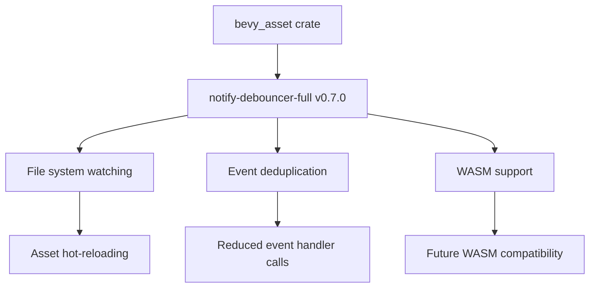

+++
title = "#22742 Update notify-debouncer-full requirement from 0.6.0 to 0.7.0"
date = "2026-02-18T00:00:00"
draft = false
template = "pull_request_page.html"
in_search_index = true

[taxonomies]
list_display = ["show"]

[extra]
current_language = "en"
available_languages = {"en" = { name = "English", url = "/pull_request/bevy/2026-02/pr-22742-en-20260218" }, "zh-cn" = { name = "中文", url = "/pull_request/bevy/2026-02/pr-22742-zh-cn-20260218" }}
labels = ["C-Dependencies"]
+++

# Title
Update notify-debouncer-full requirement from 0.6.0 to 0.7.0

## Basic Information
- **Title**: Update notify-debouncer-full requirement from 0.6.0 to 0.7.0
- **PR Link**: https://github.com/bevyengine/bevy/pull/22742
- **Author**: app/dependabot
- **Status**: MERGED
- **Labels**: C-Dependencies
- **Created**: 2026-01-30T07:01:50Z
- **Merged**: 2026-02-18T13:15:22Z
- **Merged By**: mockersf

## Description Translation
Updates the requirements on [notify-debouncer-full](https://github.com/notify-rs/notify) to permit the latest version.
<details>
<summary>Release notes</summary>
<p><em>Sourced from <a href="https://github.com/notify-rs/notify/releases">notify-debouncer-full's releases</a>.</em></p>
<blockquote>
<h2>notify-debouncer-full: v0.7.0</h2>
<blockquote>
<p>[!IMPORTANT]
The MSRV policy has been changed since this release.
Check out README for details.</p>
</blockquote>
<ul>
<li>FEATURE: support wasm build <a href="https://redirect.github.com/notify-rs/notify/issues/673">#673</a></li>
<li>FIX: events within the timeout were not deduplicated, causing <code>event_handler</code> to be called multiple times for events that should have been merged <a href="https://redirect.github.com/notify-rs/notify/issues/711">#711</a></li>
</ul>
<p><a href="https://redirect.github.com/notify-rs/notify/issues/673">#673</a>: <a href="https://redirect.github.com/notify-rs/notify/pull/673">notify-rs/notify#673</a>
<a href="https://redirect.github.com/notify-rs/notify/issues/711">#711</a>: <a href="https://redirect.github.com/notify-rs/notify/pull/711">notify-rs/notify#711</a></p>
</blockquote>
</details>
<details>
<summary>Commits</summary>
<ul>
<li><a href="https://github.com/notify-rs/notify/commit/e4a0ea8be037ddf5c4d901f2bd84bcad12f74fd2"><code>e4a0ea8</code></a> debouncer-full: prepare v0.7.0 release (<a href="https://redirect.github.com/notify-rs/notify/issues/762">#762</a>)</li>
<li><a href="https://github.com/notify-rs/notify/commit/1f47465f940374e0a1dae2292a10e3f2c6cb2141"><code>1f47465</code></a> chore(deps): update rust crate windows-sys to 0.61.0 (<a href="https://redirect.github.com/notify-rs/notify/issues/760">#760</a>)</li>
<li><a href="https://github.com/notify-rs/notify/commit/e268a171a9a842bd1f43054dba41a07ab3a65d7e"><code>e268a17</code></a> chore(deps): update rust crate flume to 0.12.0 (<a href="https://redirect.github.com/notify-rs/notify/issues/755">#755</a>)</li>
<li><a href="https://github.com/notify-rs/notify/commit/aa8b8c483a72ce74872043288827d351a2032d0b"><code>aa8b8c4</code></a> chore(deps): update rust crate mio to v1.1.1 (<a href="https://redirect.github.com/notify-rs/notify/issues/753">#753</a>)</li>
<li><a href="https://github.com/notify-rs/notify/commit/e817c99feea81e26a6fc09367fa5d5684bab5760"><code>e817c99</code></a> chore(deps): update rust crate insta to v1.46.1 (<a href="https://redirect.github.com/notify-rs/notify/issues/756">#756</a>)</li>
<li><a href="https://github.com/notify-rs/notify/commit/172217f525c5ab956f0a58ec9589abd8ca2c7cda"><code>172217f</code></a> chore(deps): update rust crate deser-hjson to v2.2.5 (<a href="https://redirect.github.com/notify-rs/notify/issues/750">#750</a>)</li>
<li><a href="https://github.com/notify-rs/notify/commit/42e87aec8bd43ee82c16caf6e5d40c19c405751f"><code>42e87ae</code></a> chore(deps): update rust crate serde_json to v1.0.149 (<a href="https://redirect.github.com/notify-rs/notify/issues/754">#754</a>)</li>
<li><a href="https://github.com/notify-rs/notify/commit/a3a7304baaef0f185c4d8517d5a0d01c387fb5f0"><code>a3a7304</code></a> chore(deps): update rust crate tempfile to v3.24.0 (<a href="https://redirect.github.com/notify-rs/notify/issues/759">#759</a>)</li>
<li><a href="https://github.com/notify-rs/notify/commit/cb3043e919ef4a3672ce4c071eece9ef9d9c4766"><code>cb3043e</code></a> chore(deps): update rust crate rand to 0.9.0 (<a href="https://redirect.github.com/notify-rs/notify/issues/758">#758</a>)</li>
<li><a href="https://github.com/notify-rs/notify/commit/bb30ddf3150ba2231e4663d3cd0b000da1435018"><code>bb30ddf</code></a> chore(deps): update rust crate nix to 0.30.0 (<a href="https://redirect.github.com/notify-rs/notify/issues/757">#757</a>)</li>
<li>Additional commits viewable in <a href="https://github.com/notify-rs/notify/compare/debouncer-full-0.6.0...debouncer-full-0.7.0">compare view</a></li>
</ul>
</details>
<br />


Dependabot will resolve any conflicts with this PR as long as you don't alter it yourself. You can also trigger a rebase manually by commenting `@dependabot rebase`.

[//]: # (dependabot-automerge-start)
[//]: # (dependabot-automerge-end)

---

<details>
<summary>Dependabot commands and options</summary>
<br />

You can trigger Dependabot actions by commenting on this PR:
- `@dependabot rebase` will rebase this PR
- `@dependabot recreate` will recreate this PR, overwriting any edits that have been made to it
- `@dependabot merge` will merge this PR after your CI passes on it
- `@dependabot squash and merge` will squash and merge this PR after your CI passes on it
- `@dependabot cancel merge` will cancel a previously requested merge and block automerging
- `@dependabot reopen` will reopen this PR if it is closed
- `@dependabot close` will close this PR and stop Dependabot recreating it. You can achieve the same result by closing it manually
- `@dependabot show <dependency name> ignore conditions` will show all of the ignore conditions of the specified dependency
- `@dependabot ignore this major version` will close this PR and stop Dependabot creating any more for this major version (unless you reopen the PR or upgrade to it yourself)
- `@dependabot ignore this minor version` will close this PR and stop Dependabot creating any more for this minor version (unless you reopen the PR or upgrade to it yourself)
- `@dependabot ignore this dependency` will close this PR and stop Dependabot creating any more for this dependency (unless you reopen the PR or upgrade to it yourself)


</details>

## The Story of This Pull Request

This PR represents a routine dependency maintenance update in the Bevy game engine. Dependabot, GitHub's automated dependency update bot, detected that the `notify-debouncer-full` crate had released version 0.7.0 and created this PR to update Bevy's dependency specification accordingly.

The `notify-debouncer-full` crate is used by Bevy's asset system for file watching functionality, specifically for hot-reloading assets during development. When a developer modifies an asset file (like a texture or sound file) while the game is running, the file watcher detects the change and triggers a reload of that asset. This feature is conditional and only available on non-WASM32 targets, as indicated by the `[target.'cfg(not(target_arch = "wasm32"))'.dependencies]` section in the Cargo.toml file.

The update from version 0.6.0 to 0.7.0 includes two significant changes that affect Bevy's asset hot-reloading capabilities. First, the new version adds WebAssembly (wasm) build support, which means the notify library can now potentially work in wasm environments, though Bevy currently only uses it on non-wasm targets. Second, and more importantly for Bevy's use case, version 0.7.0 fixes a bug where events within the timeout period weren't properly deduplicated, causing the `event_handler` callback to be called multiple times for events that should have been merged. This fix addresses potential inefficiencies in Bevy's asset hot-reloading where a single file change might trigger multiple reload events instead of being properly batched.

The change itself is minimal - a single line modification in the Cargo.toml file that updates the version constraint. However, the implications are important for Bevy's development experience. The event deduplication fix means that when developers make rapid changes to asset files (such as saving multiple times in quick succession), the asset system will respond more predictably and efficiently, reducing unnecessary processing overhead and potential race conditions in the hot-reloading pipeline.

It's worth noting that the release notes mention a change in MSRV (Minimum Supported Rust Version) policy, which could potentially affect users who are constrained to specific Rust versions. However, since this is a minor version update (0.6.0 to 0.7.0) within a pre-1.0 crate, and the dependency is marked as optional (`optional = true`), the impact on Bevy users is minimal. The update went through the standard review and testing process, was merged after about two weeks, and became part of Bevy's dependency graph.

## Visual Representation



## Key Files Changed

List the most significant files changed in this PR:
- `crates/bevy_asset/Cargo.toml` (+1/-1)

For each important file, include:
1. A brief description of what changed and why
2. Code snippets showing the key modifications (both before and after if applicable). DO NOT translate any comments/code in Code snippets.
3. How these changes relate to the overall purpose of the PR

**File:** `crates/bevy_asset/Cargo.toml`

1. **What changed and why:** The version constraint for the `notify-debouncer-full` dependency was updated from 0.6.0 to 0.7.0 to take advantage of bug fixes and new features in the latest release, specifically improved event deduplication and WASM support.

2. **Code snippets:**

```toml
# Before:
notify-debouncer-full = { version = "0.6.0", default-features = false, optional = true }

# After:
notify-debouncer-full = { version = "0.7.0", default-features = false, optional = true }
```

3. **Relation to overall purpose:** This single-line change is the entire purpose of the PR - updating the dependency version to incorporate the improvements and fixes from the notify-debouncer-full 0.7.0 release.

## Further Reading

1. **notify-rs GitHub repository**: https://github.com/notify-rs/notify - The source repository for the notify library, including documentation and issue tracking.

2. **File watching in Rust**: Understanding how file system watching works at the OS level can help understand the importance of proper event debouncing and deduplication.

3. **Dependabot documentation**: https://docs.github.com/en/code-security/dependabot - For understanding how automated dependency updates work in GitHub projects.

4. **Bevy's asset system documentation**: https://bevyengine.org/learn/book/next/assets/ - To understand how file watching integrates with Bevy's asset hot-reloading feature.

5. **Semantic Versioning**: https://semver.org/ - Understanding version constraints (0.x.y versions have different stability guarantees than 1.x.y versions).