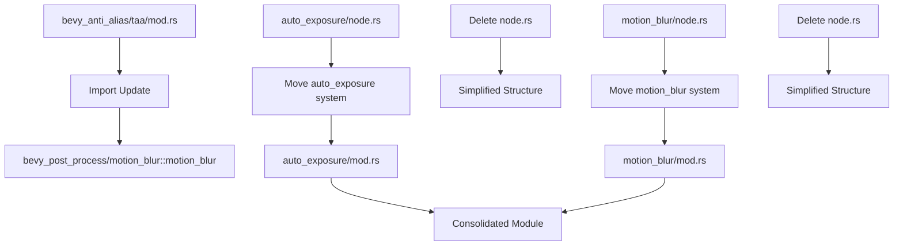

+++
title = "#22746 Consolidate `node.rs` logic into `mod.rs`"
date = "2026-02-03T00:00:00"
draft = false
template = "pull_request_page.html"
in_search_index = true

[taxonomies]
list_display = ["show"]

[extra]
current_language = "en"
available_languages = {"en" = { name = "English", url = "/pull_request/bevy/2026-02/pr-22746-en-20260203" }, "zh-cn" = { name = "中文", url = "/pull_request/bevy/2026-02/pr-22746-zh-cn-20260203" }}
labels = ["A-Rendering", "C-Code-Quality"]
+++

# Title

## Basic Information
- **Title**: Consolidate `node.rs` logic into `mod.rs`
- **PR Link**: https://github.com/bevyengine/bevy/pull/22746
- **Author**: Breakdown-Dog
- **Status**: MERGED
- **Labels**: A-Rendering, C-Code-Quality, S-Ready-For-Final-Review
- **Created**: 2026-01-30T17:34:00Z
- **Merged**: 2026-02-02T23:50:41Z
- **Merged By**: alice-i-cecile

## Description Translation
# Objective

- Since `RenderGraph` and `ViewNode` have been removed in favor of systems, the dedicated `node.rs` file is no longer needed.

## Solution

- This PR moves the relevant functions into `mod.rs` and deletes `node.rs` to simplify the module structure.

## Testing

- Examples work properly.
- CI

---

## The Story of This Pull Request

This PR represents a straightforward but important code organization change in the Bevy engine. The context is that Bevy's rendering architecture has been transitioning from a graph-based approach using `RenderGraph` and `ViewNode` to a more conventional ECS system-based approach. This architectural shift left behind some organizational artifacts - specifically, modules that were structured around the old graph paradigm.

The problem was simple: with the removal of `RenderGraph` and `ViewNode`, the dedicated `node.rs` files in several post-processing modules no longer served a meaningful organizational purpose. These files contained rendering systems that were previously implemented as graph nodes but had been converted to regular ECS systems. Keeping them in separate files created unnecessary module complexity without providing architectural benefits.

The solution approach was direct: move the system functions from the `node.rs` files into their parent `mod.rs` files and delete the now-empty `node.rs` files. This consolidation reduces file count, simplifies import paths, and makes the codebase more navigable. The engineering decision here was straightforward - when architectural patterns change, the code organization should evolve to reflect the new patterns rather than preserving legacy structures.

The implementation involved three main changes. First, the import in the TAA (Temporal Anti-Aliasing) module was updated to reflect the new location of the motion blur system. Second, both auto-exposure and motion blur modules had their system functions moved from `node.rs` to `mod.rs`. Third, the now-empty `node.rs` files were deleted entirely.

Let's examine the auto-exposure module as a representative example. Before this change, the module structure had a separate `node.rs` file containing the `auto_exposure` system function. After the change, this function was moved directly into `mod.rs`:

```rust
// File: crates/bevy_post_process/src/auto_exposure/mod.rs
// Before (in node.rs):
pub(crate) fn auto_exposure(
    view: ViewQuery<...>,
    pipeline_cache: Res<PipelineCache>,
    // ... other parameters
) {
    // Implementation
}

// After (in mod.rs):
fn auto_exposure(
    view: ViewQuery<...>,
    pipeline_cache: Res<PipelineCache>,
    // ... other parameters
) {
    // Same implementation moved here
}
```

The implementation itself remained identical - only its location changed. The same pattern applied to the motion blur module, where the `motion_blur` system function was relocated from `node.rs` to `mod.rs`.

One important technical detail is that this change also required updating import statements in other modules that depended on these systems. For example, the TAA module needed to update its import from `bevy_post_process::motion_blur::node::motion_blur` to `bevy_post_process::motion_blur::motion_blur`.

The impact of this change is primarily organizational. It reduces file count by two, simplifies the module hierarchy, and makes the codebase more consistent with Bevy's current architectural patterns. There are no functional changes, performance impacts, or API modifications - this is purely a code quality improvement.

From an engineering perspective, this PR demonstrates an important principle: when architectural patterns evolve, the code organization should evolve with them. Keeping legacy organizational structures around after their conceptual foundation has been removed creates cognitive overhead for developers and makes the codebase harder to understand and navigate.

## Visual Representation



## Key Files Changed

### `crates/bevy_post_process/src/auto_exposure/mod.rs` (+102/-5)
This file gained the `auto_exposure` system function that was previously in `node.rs`. The function handles auto-exposure computation using compute shaders, analyzing luminance histograms and calculating appropriate exposure values.

```rust
// The auto_exposure system moved from node.rs to here
fn auto_exposure(
    view: ViewQuery<(
        &ViewUniformOffset,
        &ViewTarget,
        &ViewAutoExposurePipeline,
        &ExtractedView,
    )>,
    pipeline_cache: Res<PipelineCache>,
    // ... other parameters remain unchanged
) {
    // Implementation unchanged
}
```

### `crates/bevy_post_process/src/auto_exposure/node.rs` (+0/-109)
This file was deleted entirely since its content was moved to `mod.rs`.

### `crates/bevy_post_process/src/motion_blur/mod.rs` (+101/-9)
This file gained the `motion_blur` system function that was previously in `node.rs`. The function implements motion blur post-processing using motion vectors and depth information from prepass textures.

```rust
// The motion_blur system moved from node.rs to here
pub fn motion_blur(
    view: ViewQuery<(
        &ViewTarget,
        &MotionBlurPipelineId,
        &ViewPrepassTextures,
        &MotionBlurUniform,
        &Msaa,
    )>,
    motion_blur_pipeline: Res<MotionBlurPipeline>,
    // ... other parameters remain unchanged
) {
    // Implementation unchanged
}
```

### `crates/bevy_post_process/src/motion_blur/node.rs` (+0/-101)
This file was deleted entirely since its content was moved to `mod.rs`.

### `crates/bevy_anti_alias/src/taa/mod.rs` (+1/-1)
This file required a simple import path update since it uses the motion blur system.

```rust
// Before:
use bevy_post_process::{bloom::bloom, motion_blur::node::motion_blur};

// After:
use bevy_post_process::{bloom::bloom, motion_blur::motion_blur};
```

## Further Reading

For developers interested in understanding the architectural context of this change:
- Bevy's Render Graph documentation (archived, for historical context)
- Bevy's ECS system scheduling documentation
- The original PRs that transitioned from RenderGraph to systems-based rendering
- Bevy's module organization best practices

This change is part of Bevy's ongoing evolution toward simpler, more consistent architectural patterns that leverage its ECS foundation more effectively.