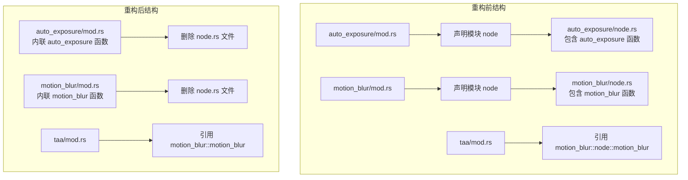

+++
title = "#22746 Consolidate `node.rs` logic into `mod.rs`"
date = "2026-02-03T00:00:00"
draft = false
template = "pull_request_page.html"
in_search_index = false

[extra]
current_language = "zh-cn"
available_languages = {"en" = { name = "English", url = "/pull_request/bevy/2026-02/pr-22746-en-20260203" }, "zh-cn" = { name = "中文", url = "/pull_request/bevy/2026-02/pr-22746-zh-cn-20260203" }}
labels = ["A-Rendering", "C-Code-Quality"]
+++

# Title: Consolidate `node.rs` logic into `mod.rs`

## Basic Information
- **Title**: Consolidate `node.rs` logic into `mod.rs`
- **PR Link**: https://github.com/bevyengine/bevy/pull/22746
- **Author**: Breakdown-Dog
- **Status**: MERGED
- **Labels**: A-Rendering, C-Code-Quality, S-Ready-For-Final-Review
- **Created**: 2026-01-30T17:34:00Z
- **Merged**: 2026-02-02T23:50:41Z
- **Merged By**: alice-i-cecile

## Description Translation
目标
- 由于 `RenderGraph` 和 `ViewNode` 已被系统（systems）取代，专用的 `node.rs` 文件不再需要。

解决方案
- 此 PR 将相关函数移动到 `mod.rs` 中并删除 `node.rs`，以简化模块结构。

测试
- 示例运行正常。
- CI

---

## The Story of This Pull Request

这个 PR 主要是一次代码结构上的清理，其根源在于 Bevy 渲染架构的一次重大演变。在过去，Bevy 使用 `RenderGraph` 和 `ViewNode` 来组织和执行渲染任务。在这种架构下，每个后处理效果（如自动曝光、运动模糊）通常会有一个独立的 `node.rs` 文件，其中定义了该效果在渲染图中的节点逻辑。

随着 Bevy 的发展，其渲染架构转向了更直接、基于系统（systems）的执行模型。`RenderGraph` 和 `ViewNode` 被移除，取而代之的是使用标准的 ECS 系统来调度和执行渲染任务。这意味着像 `auto_exposure` 和 `motion_blur` 这类后处理效果的执行逻辑，已经从其专用的节点（node）文件移出，并作为系统（system）集成到了模块的主文件（`mod.rs`）中。

然而，在架构转换后，一些模块中空置的 `node.rs` 文件被遗留了下来。这些文件已经没有任何功能代码，它们的存在不再有任何架构上的意义，反而增加了模块结构的复杂度，并可能给新开发者带来困惑——他们会疑惑这个文件是干什么用的。

**问题的核心**是遗留的技术债务：过时的文件结构与当前架构不匹配。`node.rs` 文件是旧架构的产物，在新架构下已是冗余。

因此，**解决方案**非常直接：删除这些冗余的 `node.rs` 文件，并将其中唯一的函数定义（这些函数早已是执行这些后处理效果的系统）移动到其所属模块的 `mod.rs` 主文件中。这本质上是一次“内联”操作，将实现逻辑合并到更合理的位置。

**具体实施**涉及两个主要模块：`auto_exposure` 和 `motion_blur`。以 `auto_exposure` 为例，其 `node.rs` 文件包含了一个 `auto_exposure` 函数。这个函数现在被原封不动地移动到 `auto_exposure/mod.rs` 文件中。移动后，`mod.rs` 需要引入函数所依赖的一些类型，例如 `RenderContext`、`ViewQuery` 等。这是通过在 `mod.rs` 文件的顶部添加相应的 `use` 语句实现的。

同时，由于模块结构发生了变化，其他模块中对这些函数的引用也需要更新。例如，在 `bevy_anti_alias` crate 的 TAA（时域抗锯齿）模块中，它需要调用 `motion_blur` 系统。此前，它通过 `bevy_post_process::motion_blur::node::motion_blur` 路径来引用。在 `node.rs` 文件被删除、函数被移到 `mod.rs` 后，引用路径自然就变成了 `bevy_post_process::motion_blur::motion_blur`。PR 中对此进行了相应的更新。

```rust
// crates/bevy_anti_alias/src/taa/mod.rs 中的修改
- use bevy_post_process::{bloom::bloom, motion_blur::node::motion_blur};
+ use bevy_post_process::{bloom::bloom, motion_blur::motion_blur};
```

这次重构**带来的影响**是积极的。它简化了代码库：减少了两个文件，使模块的入口点（`mod.rs`）更加完整和自包含。代码导航也变得更简单——要了解一个后处理效果如何工作，现在只需要看 `mod.rs` 文件，而不必在 `mod.rs` 和 `node.rs` 之间跳转。这符合“扁平化优于嵌套”的代码组织原则，提升了代码的可读性和可维护性。对于项目的新贡献者来说，更清晰的结构降低了理解成本。

从更宏观的视角看，这个 PR 标志着 Bevy 渲染架构从旧 `RenderGraph` 模型向新系统模型的过渡彻底完成，清除了旧范式在代码结构上的最后痕迹。它是一个典型的“代码质量”（C-Code-Quality）改进：没有添加新功能，也没有改变运行时行为，但通过消除冗余和优化组织，使代码库变得更健康、更易于长期维护。这种清理工作对于大型开源项目的可持续发展至关重要。

## Visual Representation



## Key Files Changed

- `crates/bevy_post_process/src/auto_exposure/mod.rs` (+102/-5)
- `crates/bevy_post_process/src/auto_exposure/node.rs` (+0/-109)
- `crates/bevy_post_process/src/motion_blur/mod.rs` (+101/-9)
- `crates/bevy_post_process/src/motion_blur/node.rs` (+0/-101)
- `crates/bevy_anti_alias/src/taa/mod.rs` (+1/-1)

### 1. `crates/bevy_post_process/src/auto_exposure/mod.rs`
**变化描述**：这是自动曝光模块的主文件。主要修改是将原本在 `node.rs` 中的 `auto_exposure` 系统函数移动到此文件中，并删除了对 `node` 子模块的声明。同时，需要添加该函数所依赖的一系列类型导入。

**关键代码修改**：
```rust
// 在文件顶部，添加了函数所需的导入
use bevy_render::{
    diagnostic::RecordDiagnostics,
    globals::GlobalsBuffer,
    render_asset::{RenderAssetPlugin, RenderAssets},
    render_resource::{
        BindGroupEntries, Buffer, BufferBinding, BufferDescriptor, BufferUsages,
        ComputePassDescriptor, PipelineCache, ShaderType, SpecializedComputePipelines,
    },
    renderer::{RenderContext, RenderDevice, ViewQuery},
    texture::{FallbackImage, GpuImage},
    view::{ExtractedView, ViewTarget, ViewUniform, ViewUniformOffset, ViewUniforms},
};

// 删除了对 `node` 子模块的声明
- mod node;

// 在配置系统时，直接引用本地的 `auto_exposure` 函数，而非 `node::auto_exposure`
            .add_systems(
                Core3d,
-               node::auto_exposure
+               auto_exposure
                    .before(tonemapping)
                    .in_set(Core3dSystems::PostProcess),
            );

// 文件末尾新增了从 `node.rs` 移动过来的完整 `auto_exposure` 函数定义
+fn auto_exposure(...) { ... }
```

### 2. `crates/bevy_post_process/src/auto_exposure/node.rs`
**变化描述**：此文件被整个删除。其内容（`auto_exposure` 函数）已合并到上级 `mod.rs` 中。

### 3. `crates/bevy_post_process/src/motion_blur/mod.rs`
**变化描述**：这是运动模糊模块的主文件。修改与 `auto_exposure/mod.rs` 类似：内联了 `motion_blur` 函数，更新了系统注册路径，并添加了必要的导入。

**关键代码修改**：
```rust
// 在顶部导入了本模块的 pipeline 类型，因为函数需要它们
+use crate::{
+    bloom::bloom,
+    motion_blur::pipeline::{MotionBlurPipeline, MotionBlurPipelineId},
+};

// 添加了函数所需的渲染相关导入
+use bevy_render::{
+    diagnostic::RecordDiagnostics,
+    extract_component::{
+        ComponentUniforms, ExtractComponent, ExtractComponentPlugin, UniformComponentPlugin,
+    },
+    globals::GlobalsBuffer,
+    render_resource::{
+        BindGroupEntries, Operations, PipelineCache, RenderPassColorAttachment,
+        RenderPassDescriptor, ShaderType, SpecializedRenderPipelines,
+    },
+    renderer::{RenderContext, ViewQuery},
+    view::{Msaa, ViewTarget},
+    Render, RenderApp, RenderStartup, RenderSystems,
+};

// 删除了对 `node` 子模块的声明
- pub mod node;

// 在配置系统时，直接引用本地的 `motion_blur` 函数
        render_app.add_systems(
            Core3d,
-           node::motion_blur
+           motion_blur
                .before(bloom)
                .in_set(Core3dSystems::PostProcess),
        );

// 文件末尾新增了从 `node.rs` 移动过来的完整 `motion_blur` 函数定义
+pub fn motion_blur(...) { ... }
```

### 4. `crates/bevy_post_process/src/motion_blur/node.rs`
**变化描述**：此文件被整个删除。其内容（`motion_blur` 函数）已合并到上级 `mod.rs` 中。

### 5. `crates/bevy_anti_alias/src/taa/mod.rs`
**变化描述**：这是时域抗锯齿（TAA）模块。由于它依赖 `motion_blur` 系统，需要更新 import 路径以反映 `motion_blur` 函数位置的变化。

**关键代码修改**：
```rust
// 更新 import 路径，从 `node::motion_blur` 改为直接来自 `motion_blur` 模块
- use bevy_post_process::{bloom::bloom, motion_blur::node::motion_blur};
+ use bevy_post_process::{bloom::bloom, motion_blur::motion_blur};
```

## Further Reading

1.  **Bevy 渲染架构迁移指南**：了解从 `RenderGraph` 迁移到基于系统的渲染的详细背景和动机。这有助于理解为何 `node.rs` 文件变得多余。
    - 相关 PR 或 RFC 讨论 (在 Bevy 仓库中搜索 "RenderGraph removal" 或 "ECS-driven rendering")

2.  **Bevy 系统（Systems）与调度（Schedule）**：深入理解 Bevy ECS 中系统如何工作、如何排序，这是新渲染架构的核心。
    - [Bevy 官方文档：Systems](https://docs.rs/bevy/latest/bevy/ecs/system/index.html)

3.  **Rust 模块系统**：清晰理解 `mod.rs` 作为模块根文件的作用，以及 `use` 语句如何解析路径。
    - [Rust 官方书籍：模块章节](https://doc.rust-lang.org/book/ch07-02-defining-modules-to-control-scope-and-privacy.html)

4.  **代码重构模式**：学习诸如“内联函数”、“移除死代码”、“扁平化结构”等重构手法的适用场景和益处。
    - 马丁·福勒的《重构：改善既有代码的设计》