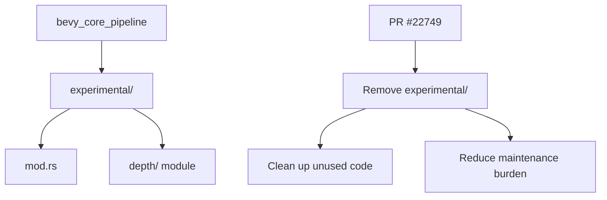

+++
title = "#22749 Remove unused 'experimental' folder in bevy_core_pipeline"
date = "2026-02-03T00:00:00"
draft = false
template = "pull_request_page.html"
in_search_index = true

[taxonomies]
list_display = ["show"]

[extra]
current_language = "en"
available_languages = {"en" = { name = "English", url = "/pull_request/bevy/2026-02/pr-22749-en-20260203" }, "zh-cn" = { name = "中文", url = "/pull_request/bevy/2026-02/pr-22749-zh-cn-20260203" }}
labels = ["D-Trivial", "A-Rendering", "C-Code-Quality"]
+++

# Remove unused 'experimental' folder in bevy_core_pipeline

## Basic Information
- **Title**: Remove unused 'experimental' folder in bevy_core_pipeline
- **PR Link**: https://github.com/bevyengine/bevy/pull/22749
- **Author**: Breakdown-Dog
- **Status**: MERGED
- **Labels**: D-Trivial, A-Rendering, C-Code-Quality, S-Ready-For-Final-Review, X-Uncontroversial
- **Created**: 2026-01-31T02:16:40Z
- **Merged**: 2026-02-02T23:54:29Z
- **Merged By**: alice-i-cecile

## Description Translation
The original description is already in English:

# Objective

- The 'experimental' module is currently not used.
- A similar experimental module exists under the `mip_generation` folder, which is fully implemented and actively used.

## Solution

- Simply remove the top-level `experimental` folder.

## Testing

- CI

---

## The Story of This Pull Request

While working with the Bevy engine's rendering pipeline codebase, a developer identified a piece of dead code that could be safely removed. The `bevy_core_pipeline` crate contained an `experimental` folder that was no longer being used by the engine, representing unnecessary maintenance overhead and potential confusion for other developers exploring the codebase.

The issue was straightforward: an entire directory structure had been left in place but was no longer serving any functional purpose. The `experimental` folder at the top level of `bevy_core_pipeline/src/` contained a `depth` module, but examination of the codebase revealed that this module wasn't being imported or used anywhere in the project. This is a classic case of code that was likely added during development for testing or experimentation purposes but was never fully integrated into the main codebase.

The developer, Breakdown-Dog, recognized that having unused code in a prominent location like the core pipeline could lead to several issues. First, it creates unnecessary complexity for developers trying to understand the codebase structure. Second, it adds maintenance burden - even though the code isn't being used, it still needs to be considered during refactoring or when making changes to the build system. Third, it could mislead new contributors into thinking this experimental code is actually part of the engine's functionality.

The solution was simple and direct: delete the unused folder entirely. This approach follows standard software engineering practices for code hygiene. When code is no longer used, removing it reduces complexity and eliminates potential confusion. The developer noted that there was already a properly implemented and actively used experimental module for mipmap generation located elsewhere (`mip_generation`), so the pattern of having experimental features was still preserved in the codebase, just in a different location where it was actually being utilized.

The changes were minimal - deleting a single file and its associated directory structure. The file being removed was `experimental/mod.rs`, which served as the entry point for the experimental module and contained documentation comments explaining the purpose of experimental features. The commit didn't need to update any imports or references elsewhere in the codebase because the module wasn't being used, confirming that the removal was safe.

This type of cleanup is important for maintaining a healthy codebase. Unused code can accumulate over time, especially in large projects with multiple contributors. Regular pruning of dead code helps keep the project maintainable and reduces the cognitive load on developers. The change was straightforward enough that testing was limited to the existing CI pipeline, which would catch any build issues or broken dependencies that might have been missed.

From an engineering perspective, this PR demonstrates good codebase stewardship. It shows attention to detail and a willingness to perform routine maintenance tasks that improve overall code quality. The minimal nature of the change made it uncontroversial and easy to review, leading to a quick merge process.

## Visual Representation



## Key Files Changed

**File: `crates/bevy_core_pipeline/src/experimental/mod.rs` (deleted)**

This was the entry point for the unused experimental module. The file contained module documentation and exported the `depth` submodule.

**Before deletion:**
```rust
//! Experimental rendering features.
//!
//! Experimental features are features with known problems, missing features,
//! compatibility issues, low performance, and/or future breaking changes, but
//! are included nonetheless for testing purposes.

pub mod depth;
```

**After deletion:** The entire file and directory structure were removed.

The changes in this PR are straightforward:
1. The `experimental/mod.rs` file was deleted
2. This automatically removes the entire `experimental` directory since no other files existed in it
3. No other files needed modification since nothing was importing from this module

## Further Reading

For developers interested in codebase maintenance and cleanup practices:

1. **Codebase Hygiene**: Learn about the importance of removing dead code and how it affects maintainability
2. **Rust Module System**: Understanding how Rust modules work and how unused modules can be safely removed
3. **Bevy Architecture**: Explore how Bevy organizes its rendering pipeline and experimental features
4. **Git Best Practices**: How to safely remove files and directories from version control without breaking dependencies

For specific Bevy documentation:
- Bevy's official documentation on rendering pipelines
- The `mip_generation` module mentioned in the PR as an example of a properly implemented experimental feature
- Bevy's contribution guidelines for code cleanup and maintenance tasks