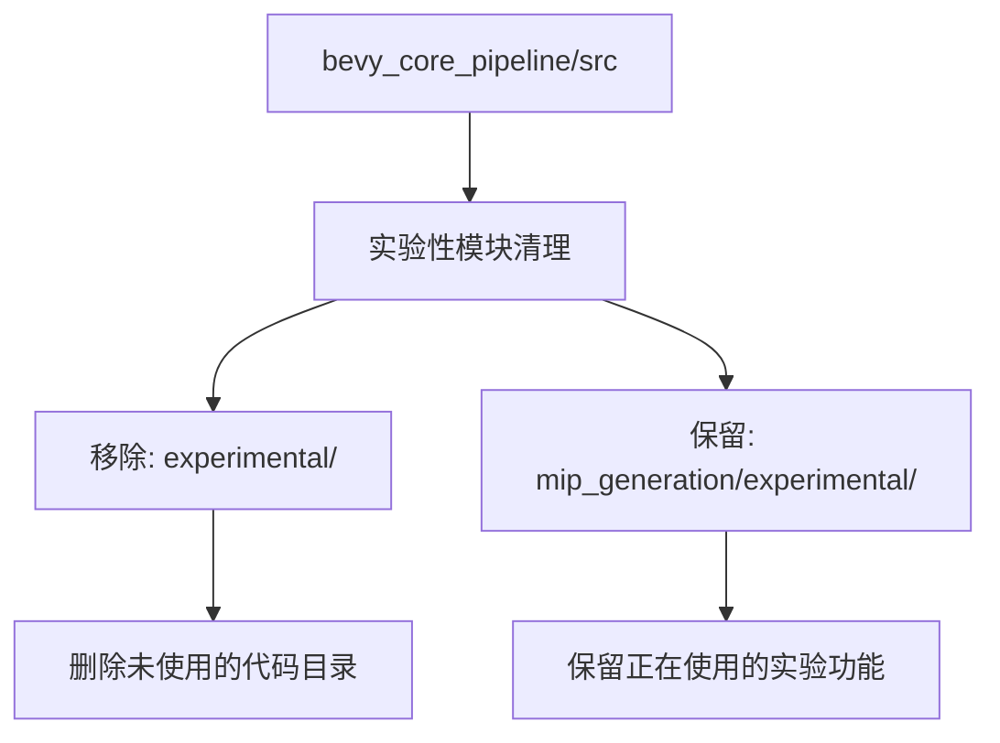

+++
title = "#22749 Remove unused 'experimental' folder in bevy_core_pipeline"
date = "2026-02-03T00:00:00"
draft = false
template = "pull_request_page.html"
in_search_index = false

[extra]
current_language = "zh-cn"
available_languages = {"en" = { name = "English", url = "/pull_request/bevy/2026-02/pr-22749-en-20260203" }, "zh-cn" = { name = "中文", url = "/pull_request/bevy/2026-02/pr-22749-zh-cn-20260203" }}
labels = ["D-Trivial", "A-Rendering", "C-Code-Quality"]
+++

# Remove unused 'experimental' folder in bevy_core_pipeline

## Basic Information
- **Title**: Remove unused 'experimental' folder in bevy_core_pipeline
- **PR Link**: https://github.com/bevyengine/bevy/pull/22749
- **Author**: Breakdown-Dog
- **Status**: MERGED
- **Labels**: D-Trivial, A-Rendering, C-Code-Quality, S-Ready-For-Final-Review, X-Uncontroversial
- **Created**: 2026-01-31T02:16:40Z
- **Merged**: 2026-02-02T23:54:29Z
- **Merged By**: alice-i-cecile

## 描述翻译

### 目标

- 当前 'experimental' 模块未被使用。
- 在 `mip_generation` 文件夹下存在一个类似的实验性模块，该模块已完全实现并正在积极使用中。

### 解决方案

- 直接移除顶层的 `experimental` 文件夹。

### 测试

- CI

---

## 本次 Pull Request 的技术分析

这是一个典型的代码清理和精简任务。Bevy 引擎的 `bevy_core_pipeline` 模块中有一个名为 `experimental` 的顶级文件夹，根据代码分析，这个文件夹当前没有任何实际用途。

问题的发现源于对代码结构的例行审查。开发团队注意到在 `bevy_core_pipeline` 目录中，`experimental` 文件夹与 `mip_generation/experimental` 文件夹并存。后一个文件夹（位于 `mip_generation` 目录下）是实际有代码实现并被使用的实验性模块。相比之下，顶层的 `experimental` 文件夹内部仅包含一个空的 `depth` 模块占位符，没有任何实际实现，也没有被项目中的任何其他模块引用。

从技术角度来看，这个空文件夹的存在虽然没有直接影响构建或运行，但它带来了几个潜在问题。首先，它会在代码库中产生冗余的目录结构，增加了新开发者理解项目架构的复杂性。其次，它可能误导开发者认为这里存在可用的实验性功能。最后，它会占用 CI 构建系统的索引和扫描资源，尽管影响很小。

解决方案非常直接：删除整个 `experimental` 文件夹及其内容。这是一个安全操作，因为：
1. 没有其他代码引用这个模块
2. 文件夹内的 `depth` 模块仅作为占位符存在，没有实际实现
3. 系统中有其他真正的实验性模块在 `mip_generation/experimental` 中，功能上不会产生冲突

在删除之前，开发团队确认了该项目模块的引用关系。通过搜索整个代码库，验证了没有 `mod experimental` 或 `use crate::experimental` 这样的导入语句。这种验证步骤对于确保删除操作的安全性至关重要，可以避免意外破坏构建过程。

从工程实践角度看，这类清理工作有几个好处。它减少了代码库的认知负荷（cognitive load），使新开发者更容易理解项目结构。同时，它遵循了"最小意外原则"（Principle of Least Surprise），确保目录结构准确地反映项目的实际架构。这种清理工作还能略微改善构建性能，因为减少了文件系统扫描的开销。

这个变更展示了良好的代码维护习惯。对于大型项目如 Bevy，定期的代码清理工作至关重要，可以防止"代码腐烂"（code rot）和技术债务积累。虽然这个特定变更很小，但它体现了团队对代码质量的持续关注。

## 可视化关系图



## 关键文件变更

### `crates/bevy_core_pipeline/src/experimental/mod.rs` (+0/-7)

这个文件完全从代码库中删除。它仅包含模块文档注释和一个空的 `depth` 模块声明，没有实际用途。

**删除前的代码内容：**
```rust
//! Experimental rendering features.
//!
//! Experimental features are features with known problems, missing features,
//! compatibility issues, low performance, and/or future breaking changes, but
//! are included nonetheless for testing purposes.

pub mod depth;
```

**删除操作说明：**
整个文件被删除，包括其7行内容（3行文档注释，1个空行，1个模块声明，以及文件结束符）。这个删除操作是安全的，因为：
1. 该模块没有被项目的任何其他部分导入
2. 内部的 `depth` 模块也没有实际实现文件存在
3. 项目中真正的实验性功能位于其他目录

这个变更直接实现了PR的目标：清理未使用的代码结构，减少项目中的冗余元素。

## 进一步阅读建议

1. **Bevy 引擎架构文档** - 了解 Bevy 的核心渲染管道如何组织：[Bevy Rendering Book](https://bevyengine.org/learn/book/rendering/)

2. **Rust 模块系统** - 理解 Rust 的模块声明和引用机制，有助于分析这类清理工作的安全性：[The Rust Programming Language - Modules](https://doc.rust-lang.org/book/ch07-02-defining-modules-to-control-scope-and-privacy.html)

3. **代码重构技术** - 学习安全删除未使用代码的方法和工具：[Refactoring Guru - Safe Delete](https://refactoring.guru/catalog/safe-delete)

4. **Bevy 贡献指南** - 了解 Bevy 项目的代码质量标准和要求：[Bevy Contributing Guide](https://github.com/bevyengine/bevy/blob/main/CONTRIBUTING.md)

5. **技术债务管理** - 关于定期清理未使用代码的重要性：[Managing Technical Debt](https://martinfowler.com/bliki/TechnicalDebt.html)