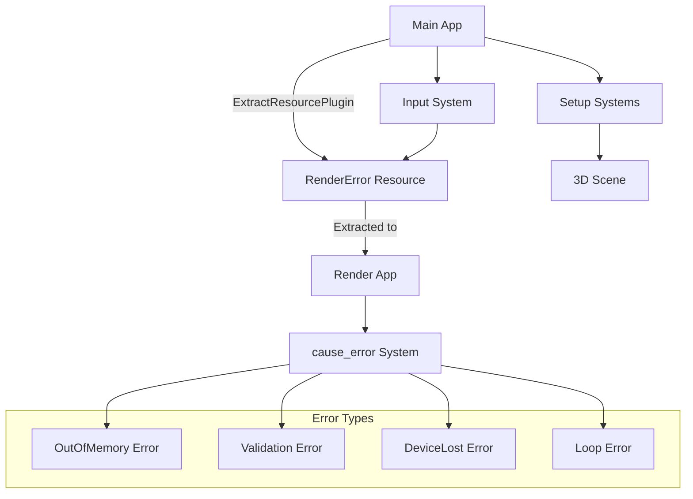

+++
title = "#22757 Add example for triggering and recovering from rendering errors"
date = "2026-02-03T00:00:00"
draft = false
template = "pull_request_page.html"
in_search_index = true

[taxonomies]
list_display = ["show"]

[extra]
current_language = "en"
available_languages = {"en" = { name = "English", url = "/pull_request/bevy/2026-02/pr-22757-en-20260203" }, "zh-cn" = { name = "中文", url = "/pull_request/bevy/2026-02/pr-22757-zh-cn-20260203" }}
labels = ["A-Rendering", "C-Examples", "D-Modest"]
+++

# Title: Add example for triggering and recovering from rendering errors

## Basic Information
- **Title**: Add example for triggering and recovering from rendering errors
- **PR Link**: https://github.com/bevyengine/bevy/pull/22757
- **Author**: atlv24
- **Status**: MERGED
- **Labels**: A-Rendering, C-Examples, S-Ready-For-Final-Review, D-Modest
- **Created**: 2026-01-31T21:36:19Z
- **Merged**: 2026-02-02T23:54:29Z
- **Merged By**: alice-i-cecile

## Description Translation
**Objective**

- Test suite/demonstration for render recovery

**Solution**

- Add an example that has ways to trigger various rendering errors

**Testing**

- run it

Note: im opening this separately so that behavior on bevy main can be compared to upcoming render recovery pr. It doesn't have to merge first though.

## The Story of This Pull Request

This pull request adds a new example to the Bevy game engine that serves as both a test suite and demonstration for rendering error recovery. The author created this example as a standalone tool to compare the behavior of the current main branch with an upcoming render recovery PR. This approach allows for isolated testing of rendering error scenarios without needing the recovery features to be merged first.

The core problem addressed is the lack of a systematic way to test how Bevy handles rendering errors. Rendering errors can occur for various reasons: GPU out-of-memory conditions, validation errors from incorrect API usage, device lost events, or shader execution issues. Without a controlled way to trigger these errors, testing recovery mechanisms becomes difficult and inconsistent.

The solution approach is straightforward: create a self-contained example that provides keyboard-triggered mechanisms to intentionally cause different types of rendering errors. This example serves multiple purposes: it demonstrates the types of errors that can occur in real applications, provides a testbed for recovery features, and documents how developers might handle similar situations in their own code.

The implementation is clean and focused. The example creates a simple 3D scene with a circular base, a cube, and a moving camera. A help text overlay explains the keyboard controls for triggering different error types. The `RenderError` resource, implemented as an enum, tracks which error to trigger based on user input. This resource is extracted to the render world using Bevy's `ExtractResourcePlugin`, allowing the render system to access it.

The `cause_error` system runs in the `Render` schedule and contains the actual error-triggering logic. Each error type uses different WGPU API calls to generate specific failure conditions:

- **OutOfMemory**: Creates 64 large 8192x8192 RGBA16Float textures in a loop
- **Validation**: Attempts to create a buffer with an impossibly large size (1 << 63 bytes)
- **DeviceLost (destroy)**: Calls `destroy()` on the WGPU device
- **DeviceLost (loop)**: Creates a compute shader with an infinite loop and dispatches it

The code demonstrates proper use of Bevy's render abstractions like `RenderDevice`, `RenderQueue`, and the render app architecture. The error-triggering logic is isolated to the render world, which makes sense since these operations directly interact with the graphics API.

From an engineering perspective, this example is well-structured. It separates concerns clearly: the main app handles input and scene setup, while the render app handles the error generation. The use of Bevy's `ExtractResourcePlugin` shows how to pass data from the main world to the render world, a pattern that's essential for many rendering operations.

The impact of this PR is primarily educational and diagnostic. It provides a valuable tool for developers to understand rendering error scenarios and test recovery mechanisms. The example also serves as documentation for the types of errors that can occur when working with GPU APIs directly through Bevy's render abstraction layer.

One technical insight worth noting is how the example triggers device lost errors in two different ways: by explicitly destroying the device and by submitting a compute shader that will never complete. This demonstrates that device loss can occur from both explicit actions and problematic shader execution.

## Visual Representation



## Key Files Changed

**1. `examples/app/render_recovery.rs` (+182/-0)**
This is the main example file that demonstrates rendering error triggering and recovery. It sets up a 3D scene, handles user input, and contains systems for causing different types of rendering errors.

Key code snippets:
```rust
// The RenderError enum defines the different error types that can be triggered
#[derive(Resource, ExtractResource, Clone, Default)]
enum RenderError {
    #[default]
    None,
    OutOfMemory,
    Validation,
    DeviceLost,
    Loop,
}

// Input system that maps keyboard keys to error types
fn input(input: Res<ButtonInput<Key>>, mut error: ResMut<RenderError>) {
    *error = RenderError::None;
    if input.just_pressed(Key::Character("o".into())) {
        *error = RenderError::OutOfMemory;
    }
    // ... similar for other keys
}

// Render system that actually causes the errors based on the RenderError resource
fn cause_error(error: If<Res<RenderError>>, device: Res<RenderDevice>, queue: Res<RenderQueue>) {
    match **error {
        RenderError::None => {}
        RenderError::OutOfMemory => {
            // Create many large textures to exhaust GPU memory
            let mut textures = Vec::new();
            for _ in 0..64 {
                textures.push(device.create_texture(&TextureDescriptor {
                    label: None,
                    size: Extent3d {
                        width: 8192,
                        height: 8192,
                        depth_or_array_layers: 1,
                    },
                    // ... more texture configuration
                }));
            }
        }
        // ... other error cases
    }
}
```

**2. `Cargo.toml` (+11/-0)**
Adds the new example to the Bevy workspace configuration, making it available through `cargo run --example render_recovery`.

```toml
[[example]]
name = "render_recovery"
path = "examples/app/render_recovery.rs"
doc-scrape-examples = true

[package.metadata.example.render_recovery]
name = "Render Recovery"
description = "Demonstrates how bevy can recover from rendering failures."
category = "Application"
wasm = false
```

**3. `examples/README.md` (+1/-0)**
Adds documentation for the new example in the examples list.

```markdown
[Render Recovery](../examples/app/render_recovery.rs) | Demonstrates how bevy can recover from rendering failures.
```

## Further Reading

1. **Bevy Rendering Documentation**: The official Bevy book's rendering section covers the basics of Bevy's render architecture
2. **WGPU Error Handling**: Understanding WGPU's error model is essential for working with rendering errors in Bevy
3. **GPU Memory Management**: Resources on GPU memory allocation and out-of-memory conditions
4. **Compute Shaders**: Documentation on compute shader execution and potential pitfalls like infinite loops
5. **Bevy's Render World Architecture**: Understanding how Bevy separates main and render worlds is crucial for implementing similar examples