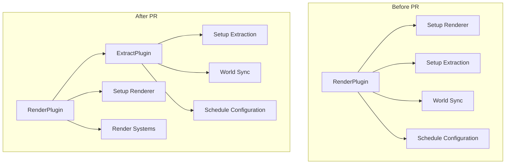

+++
title = "#22758 Move render app init and extraction to separate plugin"
date = "2026-02-06T00:00:00"
draft = false
template = "pull_request_page.html"
in_search_index = true

[taxonomies]
list_display = ["show"]

[extra]
current_language = "en"
available_languages = {"en" = { name = "English", url = "/pull_request/bevy/2026-02/pr-22758-en-20260206" }, "zh-cn" = { name = "中文", url = "/pull_request/bevy/2026-02/pr-22758-zh-cn-20260206" }}
labels = ["A-Rendering", "C-Code-Quality", "M-Migration-Guide"]
+++

# Title
Move render app init and extraction to separate plugin

## Basic Information
- **Title**: Move render app init and extraction to separate plugin
- **PR Link**: https://github.com/bevyengine/bevy/pull/22758
- **Author**: kristoff3r
- **Status**: MERGED
- **Labels**: A-Rendering, C-Code-Quality, S-Ready-For-Final-Review, M-Migration-Guide
- **Created**: 2026-01-31T21:53:42Z
- **Merged**: 2026-02-06T19:50:36Z
- **Merged By**: alice-i-cecile

## Description Translation

# Objective

Currently in `bevy_render` the renderer initialization (e.g. creating a surface, registering rendering systems) is very intertwined with setting up the extraction logic itself (e.g. how is data moved between the worlds, how are they kept in sync). This makes it harder to understand both things, and also makes it very hard to test the extraction logic, as you don't want to start the renderer in unit test.

In the future this functionality might even be useful for the ECS outside `bevy_render`, e.g. for custom renderers that want to use a render world, or for multi world setups.

## Solution

This PR splits out creation of the render subapp plus the extraction logic itself into `ExtractPlugin`, and uses the new found flexibility to finally add a test for it.

This is the first part in a series of PRs I plan to do to:
* Separate the extraction logic so it's possible to test (this one)
* Fix the bug that's currently commented out in the test
* Rework the Extract trait to bypass the orphan rules, so we can use it everywhere (speculative but I have an idea)

## Testing

Added a test to show that extraction is working.

I also ran a bunch of examples requiring rendering and they still work.

## The Story of This Pull Request

This PR addresses a long-standing architectural issue in Bevy's render system where renderer initialization and data extraction were tightly coupled. The core problem was that setting up the render subapp (creating surfaces, registering rendering systems) was deeply intertwined with the extraction logic that moves data between the main world and render world.

The author identified two main problems with this architecture. First, it made the code harder to understand because responsibilities weren't clearly separated. Second, and more importantly, it made testing extraction logic nearly impossible because you couldn't test extraction without starting the full renderer with all its GPU dependencies - something you definitely don't want in unit tests.

Looking at the code before the change, the `RenderPlugin::build` method in `lib.rs` was doing everything: creating the render subapp, setting up extraction schedules, configuring world synchronization, and registering all the extraction systems. This monolithic approach meant that if you wanted to understand just the extraction part, you had to sift through all the renderer setup code.

The solution was to extract the extraction logic (pun intended) into a separate `ExtractPlugin`. This plugin now handles:
1. Creating the render subapp structure
2. Setting up the `ExtractSchedule` and `Render` schedule
3. Configuring world synchronization systems
4. Managing the data flow between main world and render world

The implementation carefully preserves all the existing functionality while making it modular. The `ExtractPlugin` struct has a `pre_extract` callback that allows custom logic to run before extraction, which is used by the renderer to update its state. The key insight here is that the extraction process itself doesn't need to know about rendering specifics - it just needs to move data between worlds according to extraction rules.

One of the clever implementation details is how the plugin manages the world swapping. During extraction, the main world needs to be available in the render world as a resource, but you can't have both worlds accessing each other directly. The solution uses a "scratch world" pattern:

```rust
let scratch_world = main_world.remove_resource::<ScratchMainWorld>().unwrap();
let inserted_world = core::mem::replace(main_world, scratch_world.0);
render_world.insert_resource(MainWorld(inserted_world));
```

This swaps the main world into the render world as a resource, runs the extraction schedule, then swaps it back. The scratch world prevents allocating a new world every frame.

The separation also enabled adding the first comprehensive test for extraction logic. The test in `extract_plugin.rs` creates a simple app with extraction components, runs the extraction process, and verifies that components are correctly moved to the render world. Notably, the test comments reveal there's still a bug to fix in a future PR:

```rust
// TODO: this is a bug
// assert!(entity.4.is_some());
```

This demonstrates the value of the separation - without being able to test extraction independently, such bugs would be much harder to identify and fix.

From an architectural perspective, this change makes the render system more modular and follows the single responsibility principle. The `RenderPlugin` can now focus on rendering concerns while the `ExtractPlugin` handles data movement. This separation also opens up possibilities for custom renderers or multi-world setups that might want to reuse the extraction logic without the full Bevy renderer.

The PR includes some minor but important improvements beyond the main refactoring. In `sub_app.rs`, a warning was added when re-inserting a schedule to help developers avoid accidentally overwriting schedule configurations. The Cargo.toml change enables better debugging utilities when the debug feature is active.

Overall, this PR significantly improves code organization, enables testing of a critical system, and lays groundwork for future improvements to Bevy's render architecture.

## Visual Representation



## Key Files Changed

### `crates/bevy_render/src/extract_plugin.rs` (+253/-0)
This is a new file that contains all the extraction logic moved from `lib.rs`. It defines the `ExtractPlugin` struct and implements the extraction systems.

Key code:
```rust
/// Plugin that sets up the [`RenderApp`] and handles extracting data from the
/// main world to the render world.
pub struct ExtractPlugin {
    /// Function that gets run at the beginning of each extraction.
    ///
    /// Gets the main world and render world as arguments (in that order).
    pub pre_extract: fn(&mut World, &mut World),
}

impl Plugin for ExtractPlugin {
    fn build(&self, app: &mut App) {
        app.add_plugins(SyncWorldPlugin);
        app.init_resource::<ScratchMainWorld>();
        
        let mut render_app = SubApp::new();
        // ... setup schedules and systems
        render_app.set_extract(move |main_world, render_world| {
            pre_extract(main_world, render_world);
            entity_sync_system(main_world, render_world);
            extract(main_world, render_world);
        });
        app.insert_sub_app(RenderApp, render_app);
    }
}
```

### `crates/bevy_render/src/lib.rs` (+68/-150)
The main render plugin file was significantly refactored. Most extraction logic was moved to `extract_plugin.rs`, leaving `RenderPlugin` to focus on rendering concerns.

Key changes:
```rust
// Before: All extraction logic inline in RenderPlugin::build
// After: Delegate to ExtractPlugin
if insert_future_resources(&self.render_creation, app.world_mut()) {
    // We only create the render world and set up extraction if we
    // have a rendering backend available.
    app.add_plugins(ExtractPlugin {
        pre_extract: error_handler::update_state,
    });
};
```

### `crates/bevy_app/src/sub_app.rs` (+11/-2)
Added a warning when re-inserting a schedule to help with debugging.

Key code:
```rust
pub fn add_schedule(&mut self, schedule: Schedule) -> &mut Self {
    let mut schedules = self.world.resource_mut::<Schedules>();
    let _old_schedule = schedules.insert(schedule);

    #[cfg(feature = "trace")]
    if let Some(schedule) = _old_schedule {
        warn!(
            "Schedule {:?} was re-inserted, all previous configuration has been removed",
            schedule.label()
        );
    }

    self
}
```

### `crates/bevy_render/Cargo.toml` (+1/-1)
Added the `bevy_utils/debug` feature to the debug feature set for better debugging capabilities.

## Further Reading

- [Bevy's ECS System](https://bevyengine.org/learn/book/getting-started/ecs/) - Understanding Bevy's Entity Component System
- [Plugin Architecture in Bevy](https://bevyengine.org/learn/book/getting-started/plugins/) - How plugins work in Bevy
- [Extract and Render World Pattern](https://github.com/bevyengine/bevy/discussions/22758) - Discussion about this PR's approach
- [Schedule Systems in Bevy](https://bevyengine.org/learn/book/advanced-topics/schedules/) - Understanding how schedules and systems work