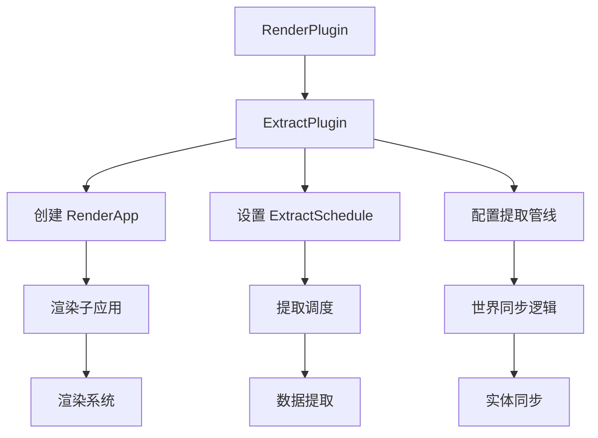

+++
title = "#22758 Move render app init and extraction to separate plugin"
date = "2026-02-06T00:00:00"
draft = false
template = "pull_request_page.html"
in_search_index = false

[extra]
current_language = "zh-cn"
available_languages = {"en" = { name = "English", url = "/pull_request/bevy/2026-02/pr-22758-en-20260206" }, "zh-cn" = { name = "中文", url = "/pull_request/bevy/2026-02/pr-22758-zh-cn-20260206" }}
+++

# 标题

## 基本信息
- **标题**: Move render app init and extraction to separate plugin
- **PR链接**: https://github.com/bevyengine/bevy/pull/22758
- **作者**: kristoff3r
- **状态**: 已合并
- **标签**: A-Rendering, C-Code-Quality, S-Ready-For-Final-Review, M-Migration-Guide
- **创建时间**: 2026-01-31T21:53:42Z
- **合并时间**: 2026-02-06T19:50:36Z
- **合并者**: alice-i-cecile

## 描述翻译

### 目标

目前，在 `bevy_render` 中，渲染器初始化（例如创建表面，注册渲染系统）与设置提取逻辑本身（例如数据如何在世界之间移动，如何保持同步）非常紧密地交织在一起。这使得理解这两件事都变得更加困难，并且也使测试提取逻辑变得非常困难，因为你不想在单元测试中启动渲染器。

未来，此功能甚至可能对 `bevy_render` 之外的 ECS 有用，例如，对于想要使用渲染世界的自定义渲染器，或者对于多世界设置。

### 解决方案

此 PR 将渲染子应用的创建以及提取逻辑本身拆分到 `ExtractPlugin` 中，并利用新获得的灵活性最终为其添加测试。

这是我计划进行的一系列 PR 中的第一个：
* 分离提取逻辑以便可以进行测试（当前 PR）
* 修复当前在测试中注释掉的错误
* 重新设计 Extract trait 以绕过孤儿规则，以便我们可以随处使用它（推测性想法，但我有一个想法）

### 测试

添加了测试以显示提取功能正常工作。

我还运行了一组需要渲染的示例，它们仍然正常工作。

## 此 Pull Request 的故事

在 Bevy 渲染系统中，提取（extraction）是一个关键架构模式，它负责从主应用世界（main world）中将需要渲染的数据复制到渲染世界（render world）。这个模式支持渲染与游戏逻辑的并行执行，是 Bevy 实现高效渲染管线的基石。然而，在 PR #22758 之前，这个重要的提取逻辑与渲染应用的初始化代码深度耦合，存在几个显著问题。

**问题与背景**

查看原始的 `bevy_render/src/lib.rs` 文件，我发现渲染初始化和提取逻辑都位于同一个大型的 `initialize_render_app` 函数中。这种结构带来了几个实际的技术挑战：

1. **代码可读性差**：大约 150 行的初始化逻辑与提取机制交织在一起，开发者很难理解每个部分的职责。
2. **测试困难**：由于初始化代码包含了创建渲染表面等硬件相关操作，无法在单元测试环境中运行。这意味着提取逻辑这个重要的数据转换机制无法进行自动化测试。
3. **复用性有限**：提取逻辑被紧密绑定到 Bevy 的标准渲染器中，使得自定义渲染器或需要类似数据提取模式的其他系统无法重用这一基础设施。

正如作者在 PR 描述中指出的，未来其他系统可能也需要类似的功能，例如自定义渲染器或多世界架构，但当前的紧耦合设计阻碍了这种可能性。

**解决方案方法**

开发者采用了经典的软件工程原则——关注点分离（Separation of Concerns）。核心思路是将提取逻辑提取到一个独立的插件中，这个插件专注于管理渲染世界与主世界之间的数据同步。

技术实现上，这个方案包含几个关键决策：

1. **创建专门的 ExtractPlugin**：将提取相关的所有功能（包括渲染子应用的创建、提取调度的设置）封装到一个独立的插件结构中。
2. **暴露扩展点**：通过 `pre_extract` 回调函数，允许其他系统在提取过程中插入自定义逻辑。
3. **保持 API 兼容性**：对外部暴露的接口（如 `ExtractSchedule` 和 `MainWorld` 资源）保持不变，确保现有代码无需修改。
4. **启用测试**：通过分离逻辑，现在可以在不启动完整渲染器的情况下测试提取功能。

**实现细节**

新的 `ExtractPlugin` 结构体定义如下：

```rust
pub struct ExtractPlugin {
    /// 每次提取开始时运行的函数
    pub pre_extract: fn(&mut World, &mut World),
}
```

这个设计简洁而有效。`pre_extract` 函数指针提供了必要的扩展性，而默认实现为空函数，保持了向后兼容性。

在 `build` 方法中，插件执行了之前分散在多个地方的初始化工作：

```rust
impl Plugin for ExtractPlugin {
    fn build(&self, app: &mut App) {
        app.add_plugins(SyncWorldPlugin);
        app.init_resource::<ScratchMainWorld>();
        
        let mut render_app = SubApp::new();
        
        let mut extract_schedule = Schedule::new(ExtractSchedule);
        extract_schedule.set_build_settings(ScheduleBuildSettings {
            auto_insert_apply_deferred: false,
            ..default()
        });
        extract_schedule.set_apply_final_deferred(false);
        
        render_app.add_schedule(Render::base_schedule());
        render_app.add_schedule(extract_schedule);
        render_app.add_systems(
            Render,
            (
                apply_extract_commands.in_set(RenderSystems::ExtractCommands),
                despawn_temporary_render_entities.in_set(RenderSystems::PostCleanup),
            ),
        );
        
        // ... 其余初始化代码
    }
}
```

值得注意的是提取调度（`ExtractSchedule`）的设置：通过 `auto_insert_apply_deferred: false` 和 `set_apply_final_deferred(false)`，提取过程中的命令（commands）不会立即执行，而是延迟到渲染调度中。这种设计允许提取和主应用逻辑并行执行，提高了管线的并行性。

`extract` 函数展示了巧妙的世界交换模式：

```rust
pub fn extract(main_world: &mut World, render_world: &mut World) {
    let scratch_world = main_world.remove_resource::<ScratchMainWorld>().unwrap();
    let inserted_world = core::mem::replace(main_world, scratch_world.0);
    render_world.insert_resource(MainWorld(inserted_world));
    render_world.run_schedule(ExtractSchedule);
    
    let inserted_world = render_world.remove_resource::<MainWorld>().unwrap();
    let scratch_world = core::mem::replace(main_world, inserted_world.0);
    main_world.insert_resource(ScratchMainWorld(scratch_world));
}
```

这里使用了 `ScratchMainWorld` 作为临时交换的缓冲区，避免了每次提取时重新分配世界的开销。这种内存管理模式既高效又安全。

**测试能力的突破**

分离后的提取逻辑现在可以进行单元测试。PR 中包含的测试代码验证了多个关键场景：

```rust
#[test]
fn extraction_works() {
    let mut app = App::new();
    app.add_plugins(ExtractPlugin::default());
    app.add_plugins(ExtractComponentPlugin::<RenderComponent>::default());
    
    // 测试数据创建、提取和清理的全过程
    app.add_systems(Startup, |mut commands: Commands| {
        commands.spawn((RenderComponent, RenderComponentSeparate));
    });
    
    app.update();
    
    // 验证组件已正确提取
    {
        let render_app = app.get_sub_app_mut(RenderApp).unwrap();
        render_app.world_mut().run_system_cached(...).unwrap();
    }
    
    // 测试移除组件后的清理
    app.world_mut().run_system_cached(...).unwrap();
    app.update();
    
    // 验证提取的组件已被移除
    {
        let render_app = app.get_sub_app_mut(RenderApp).unwrap();
        render_app.world_mut().run_system_cached(...).unwrap();
    }
}
```

测试中特别有趣的是注释掉的部分 `// TODO: this is a bug`，这表明作者不仅实现了分离，还发现了现有代码中的潜在问题，为后续修复奠定了基础。

**技术影响**

这个重构带来了几个重要的改进：

1. **模块化增强**：提取逻辑现在是一个独立的、可组合的单元，符合 Bevy 的插件架构哲学。
2. **测试可行性**：提取逻辑现在可以独立于渲染硬件进行测试，提高了代码的可靠性和可维护性。
3. **代码清晰度**：`RenderPlugin` 的职责更加聚焦于渲染管线的核心逻辑，而 `ExtractPlugin` 专注于数据同步。
4. **未来扩展性**：为自定义渲染器和多世界架构提供了基础设施支持。

重要的是，这个重构保持了完全的向后兼容性。现有的渲染代码无需任何修改即可继续工作，体现了优秀的 API 设计原则。

**工程实践的启示**

这个 PR 展示了一个经典的重构模式：识别紧密耦合的职责，通过引入抽象边界将它们分离。特别是：

- 使用 Rust 的所有权系统和资源管理来实现高效的世界交换
- 保持公共 API 不变，最小化破坏性变更
- 在重构的同时添加测试，确保功能正确性
- 为未来的功能扩展预留了接口（`pre_extract` 回调）

这种模式在大型代码库的重构中特别有价值，它允许逐步改进架构而不影响现有用户。

## 视觉表示



## 关键文件变更

### `crates/bevy_render/src/extract_plugin.rs` (+253/-0)
**新创建的文件**，包含了所有提取相关的逻辑，包括：
1. `ExtractPlugin` 结构体定义和实现
2. `ExtractSchedule` 调度标签
3. `MainWorld` 和 `ScratchMainWorld` 资源
4. 提取执行函数 `extract`
5. 完整的单元测试套件

关键代码片段：
```rust
pub struct ExtractPlugin {
    pub pre_extract: fn(&mut World, &mut World),
}

impl Plugin for ExtractPlugin {
    fn build(&self, app: &mut App) {
        // 初始化逻辑...
    }
}
```

### `crates/bevy_render/src/lib.rs` (+68/-150)
**大幅重构的文件**，移除了提取逻辑到新插件：
1. 删除了内联的 `initialize_render_app` 函数
2. 改为使用 `ExtractPlugin`
3. 重新组织了渲染系统的注册
4. 保持了公共 API 的兼容性

重构前后对比：
```rust
// 重构前：
unsafe fn initialize_render_app(app: &mut App) {
    // 150 行的混合初始化逻辑
}

// 重构后：
if insert_future_resources(&self.render_creation, app.world_mut()) {
    app.add_plugins(ExtractPlugin {
        pre_extract: error_handler::update_state,
    });
}
```

### `crates/bevy_app/src/sub_app.rs` (+11/-2)
**次要修改**，添加了调度重新插入的警告日志：
1. 在 `add_schedule` 方法中添加了跟踪日志
2. 当调度被重复插入时发出警告，帮助调试

```rust
pub fn add_schedule(&mut self, schedule: Schedule) -> &mut Self {
    let mut schedules = self.world.resource_mut::<Schedules>();
    let _old_schedule = schedules.insert(schedule);
    
    #[cfg(feature = "trace")]
    if let Some(schedule) = _old_schedule {
        warn!(
            "Schedule {:?} was re-inserted, all previous configuration has been removed",
            schedule.label()
        );
    }
    
    self
}
```

### `crates/bevy_render/Cargo.toml` (+1/-1)
**依赖更新**，确保调试特性正确传递：
```toml
# 修改前：
debug = ["type_label_buffers"]

# 修改后：
debug = ["type_label_buffers", "bevy_utils/debug"]
```

## 进一步阅读

1. **Bevy 插件系统**: https://bevyengine.org/learn/book/plugins/
2. **ECS 架构模式**: https://en.wikipedia.org/wiki/Entity_component_system
3. **Rust 所有权和借用**: https://doc.rust-lang.org/book/ch04-00-understanding-ownership.html
4. **软件重构原则**: Martin Fowler 的《重构：改善既有代码的设计》
5. **调度系统设计**: Bevy 官方文档中的调度器部分