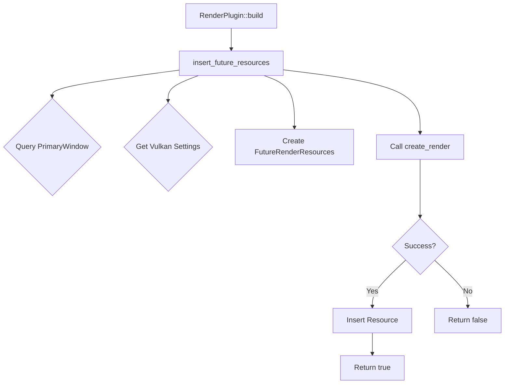

+++
title = "#22759 Minor Render init refactor"
date = "2026-02-01T00:00:00"
draft = false
template = "pull_request_page.html"
in_search_index = true

[taxonomies]
list_display = ["show"]

[extra]
current_language = "en"
available_languages = {"en" = { name = "English", url = "/pull_request/bevy/2026-02/pr-22759-en-20260201" }, "zh-cn" = { name = "中文", url = "/pull_request/bevy/2026-02/pr-22759-zh-cn-20260201" }}
labels = ["D-Trivial", "A-Rendering", "C-Code-Quality"]
+++

# Title

## Basic Information
- **Title**: Minor Render init refactor
- **PR Link**: https://github.com/bevyengine/bevy/pull/22759
- **Author**: atlv24
- **Status**: MERGED
- **Labels**: D-Trivial, A-Rendering, C-Code-Quality, S-Ready-For-Final-Review
- **Created**: 2026-01-31T22:59:22Z
- **Merged**: 2026-01-31T23:54:38Z
- **Merged By**: alice-i-cecile

## Description Translation
**Objective**
- I'm going to need to reuse this bit of code for render recovery, so let's make it reusable

**Solution**
- Pull out function

**Testing**
- 3d_scene runs fine

## The Story of This Pull Request

This PR represents a straightforward code refactoring that demonstrates a fundamental software engineering practice: extracting reusable logic. The author, atlv24, identified a specific piece of initialization code that would be needed for future work on render recovery and took the opportunity to refactor it before reuse.

The core issue was that the render initialization logic was embedded directly within the `RenderPlugin::build` method. While functional, this inline implementation wasn't reusable. The developer needed this same initialization sequence for render recovery functionality they were planning to implement. Instead of copying and pasting the code (which would lead to duplication and maintenance problems), they extracted it into a separate function.

Looking at the original code in `RenderPlugin::build`, we can see several operations happening in sequence:
1. Querying for the primary window to get its raw handle
2. Conditionally retrieving Vulkan initialization settings (if the `raw_vulkan_init` feature is enabled)
3. Creating `FutureRenderResources` and attempting to initialize the renderer
4. If successful, inserting the resources into the world and initializing the render app

The refactored approach creates a new function `insert_future_resources` that encapsulates this logic. The function signature shows careful consideration of dependencies: it takes a `&RenderCreation` reference and a mutable `World` reference, which are exactly the dependencies needed for this operation. By returning a boolean indicating success, it maintains the same control flow as the original code.

One important detail is the handling of the conditional Vulkan feature. The developer preserved the `#[cfg(feature = "raw_vulkan_init")]` attribute correctly in the extracted function, ensuring conditional compilation works as expected. The function also properly clones the `FutureRenderResources` before passing it to `create_render`, maintaining the same resource management pattern.

This refactoring follows the Single Responsibility Principle - the `RenderPlugin::build` method now focuses on orchestrating plugin setup, while the extracted function handles the specific task of initializing and inserting render resources. The separation makes the code more readable and testable.

From a technical perspective, the function extraction is done correctly without changing the behavior. The developer:
- Maintains all the same queries and resource accesses
- Preserves the conditional compilation for Vulkan initialization
- Keeps the same success/failure logic
- Properly handles the resource insertion only on success

The impact of this change is minimal in the immediate sense (just code reorganization), but it sets up the codebase for the upcoming render recovery work. This is a good example of proactive refactoring: preparing code for reuse before you actually need to reuse it, which often leads to cleaner designs than trying to extract functionality under time pressure.

## Visual Representation



## Key Files Changed

### `crates/bevy_render/src/lib.rs` (+31/-23)

This file contains the `RenderPlugin` implementation and the new extracted function. The changes remove the inline initialization logic from the plugin's build method and move it to a standalone function.

**Before (lines 278-298):**
```rust
let primary_window = app
    .world_mut()
    .query_filtered::<&RawHandleWrapperHolder, With<PrimaryWindow>>()
    .single(app.world())
    .ok()
    .cloned();

#[cfg(feature = "raw_vulkan_init")]
let raw_vulkan_init_settings = app
    .world_mut()
    .get_resource::<renderer::raw_vulkan_init::RawVulkanInitSettings>()
    .cloned()
    .unwrap_or_default();

let future_resources = FutureRenderResources::default();
if self.render_creation.create_render(
    future_resources.clone(),
    primary_window,
    #[cfg(feature = "raw_vulkan_init")]
    raw_vulkan_init_settings,
) {
    // Note that `future_resources` is not necessarily populated here yet.
    app.insert_resource(future_resources);
    // SAFETY: Plugins should be set up on the main thread.
    unsafe { initialize_render_app(app) };
};
```

**After (simplified plugin code and new function):**
```rust
if insert_future_resources(&self.render_creation, app.world_mut()) {
    // SAFETY: Plugins should be set up on the main thread.
    unsafe { initialize_render_app(app) };
};

// New function
fn insert_future_resources(render_creation: &RenderCreation, main_world: &mut World) -> bool {
    let primary_window = main_world
        .query_filtered::<&RawHandleWrapperHolder, With<PrimaryWindow>>()
        .single(main_world)
        .ok()
        .cloned();

    #[cfg(feature = "raw_vulkan_init")]
    let raw_vulkan_init_settings = main_world
        .get_resource::<renderer::raw_vulkan_init::RawVulkanInitSettings>()
        .cloned()
        .unwrap_or_default();

    let future_resources = FutureRenderResources::default();
    let success = render_creation.create_render(
        future_resources.clone(),
        primary_window,
        #[cfg(feature = "raw_vulkan_init")]
        raw_vulkan_init_settings,
    );
    if success {
        // Note that `future_resources` is not necessarily populated here yet.
        main_world.insert_resource(future_resources);
    }
    success
}
```

The key changes are:
1. The initialization logic is extracted to `insert_future_resources`
2. The function returns a boolean indicating success, which the plugin method uses to determine whether to proceed with `initialize_render_app`
3. The function signature clearly shows its dependencies: `RenderCreation` for configuration and `World` for accessing and modifying game state

## Further Reading

- [Refactoring: Improving the Design of Existing Code by Martin Fowler](https://martinfowler.com/books/refactoring.html) - The classic reference on systematic code improvement
- [Single Responsibility Principle in SOLID](https://en.wikipedia.org/wiki/Single-responsibility_principle) - Understanding why separating concerns improves maintainability
- [Rust API Guidelines: Function definitions](https://rust-lang.github.io/api-guidelines/checklist.html) - Best practices for designing Rust functions
- [Bevy Engine: Plugins](https://bevy-cheatbook.github.io/programming/plugins.html) - Understanding Bevy's plugin architecture
- [Conditional compilation in Rust](https://doc.rust-lang.org/reference/conditional-compilation.html) - How `#[cfg]` attributes work for feature-gated code

# Full Code Diff
```
diff --git a/crates/bevy_render/src/lib.rs b/crates/bevy_render/src/lib.rs
index 674f60f6b4617..3316f7606bb43 100644
--- a/crates/bevy_render/src/lib.rs
+++ b/crates/bevy_render/src/lib.rs
@@ -278,29 +278,7 @@ impl Plugin for RenderPlugin {
         load_shader_library!(app, "color_operations.wgsl");
         load_shader_library!(app, "bindless.wgsl");
 
-        let primary_window = app
-            .world_mut()
-            .query_filtered::<&RawHandleWrapperHolder, With<PrimaryWindow>>()
-            .single(app.world())
-            .ok()
-            .cloned();
-
-        #[cfg(feature = "raw_vulkan_init")]
-        let raw_vulkan_init_settings = app
-            .world_mut()
-            .get_resource::<renderer::raw_vulkan_init::RawVulkanInitSettings>()
-            .cloned()
-            .unwrap_or_default();
-
-        let future_resources = FutureRenderResources::default();
-        if self.render_creation.create_render(
-            future_resources.clone(),
-            primary_window,
-            #[cfg(feature = "raw_vulkan_init")]
-            raw_vulkan_init_settings,
-        ) {
-            // Note that `future_resources` is not necessarily populated here yet.
-            app.insert_resource(future_resources);
+        if insert_future_resources(&self.render_creation, app.world_mut()) {
             // SAFETY: Plugins should be set up on the main thread.
             unsafe { initialize_render_app(app) };
         };
@@ -369,6 +347,36 @@ impl Plugin for RenderPlugin {
     }
 }
 
+/// Inserts a [`FutureRenderResources`] created from this [`RenderCreation`].
+///
+/// Returns true if creation was successful, false otherwise.
+fn insert_future_resources(render_creation: &RenderCreation, main_world: &mut World) -> bool {
+    let primary_window = main_world
+        .query_filtered::<&RawHandleWrapperHolder, With<PrimaryWindow>>()
+        .single(main_world)
+        .ok()
+        .cloned();
+
+    #[cfg(feature = "raw_vulkan_init")]
+    let raw_vulkan_init_settings = main_world
+        .get_resource::<renderer::raw_vulkan_init::RawVulkanInitSettings>()
+        .cloned()
+        .unwrap_or_default();
+
+    let future_resources = FutureRenderResources::default();
+    let success = render_creation.create_render(
+        future_resources.clone(),
+        primary_window,
+        #[cfg(feature = "raw_vulkan_init")]
+        raw_vulkan_init_settings,
+    );
+    if success {
+        // Note that `future_resources` is not necessarily populated here yet.
+        main_world.insert_resource(future_resources);
+    }
+    success
+}
+
 /// A "scratch" world used to avoid allocating new worlds every frame when
 /// swapping out the [`MainWorld`] for [`ExtractSchedule`].
 #[derive(Resource, Default)]
```