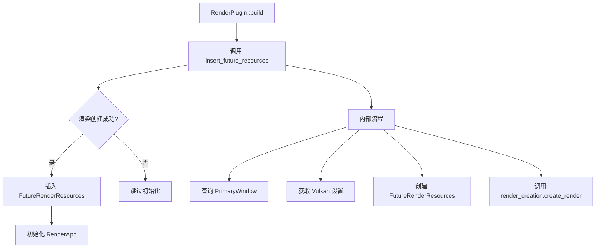

+++
title = "#22759 Minor Render init refactor"
date = "2026-02-01T00:00:00"
draft = false
template = "pull_request_page.html"
in_search_index = false

[extra]
current_language = "zh-cn"
available_languages = {"en" = { name = "English", url = "/pull_request/bevy/2026-02/pr-22759-en-20260201" }, "zh-cn" = { name = "中文", url = "/pull_request/bevy/2026-02/pr-22759-zh-cn-20260201" }}
labels = ["D-Trivial", "A-Rendering", "C-Code-Quality"]
+++

# Title
Minor Render init refactor

## Basic Information
- **Title**: Minor Render init refactor
- **PR Link**: https://github.com/bevyengine/bevy/pull/22759
- **Author**: atlv24
- **Status**: MERGED
- **Labels**: D-Trivial, A-Rendering, C-Code-Quality, S-Ready-For-Final-Review
- **Created**: 2026-01-31T22:59:22Z
- **Merged**: 2026-01-31T23:54:38Z
- **Merged By**: alice-i-cecile

## Description Translation
**目标**
- 我需要复用这段代码来进行渲染恢复，所以让它变得可复用

**解决方案**
- 提取成函数

**测试**
- 3d_scene 运行正常

## The Story of This Pull Request

这个PR源于一个简单的需求：开发者需要为后续的渲染恢复（render recovery）功能复用渲染初始化的代码。目前，渲染初始化逻辑直接嵌入在`RenderPlugin::build`方法中，使得代码难以在其他地方复用。这种代码结构的问题在于，当需要实现渲染恢复功能时，开发者不得不重复编写相同的初始化逻辑，或者通过复杂的方式来调用现有的代码。

开发者面临的具体技术约束是：渲染初始化逻辑需要访问`World`来获取主窗口句柄，并且条件性地处理`raw_vulkan_init`特性。同时，这个逻辑需要返回一个布尔值来指示渲染是否成功创建，并根据结果决定是否初始化渲染应用。

解决方案采取了最直接的重构方式：将渲染初始化的核心逻辑提取到一个独立的函数中。这个新的`insert_future_resources`函数接收`&RenderCreation`和`&mut World`作为参数，封装了获取主窗口、处理Vulkan初始化设置、创建渲染资源等一系列操作。函数返回一个布尔值表示渲染创建是否成功，并在成功时将`FutureRenderResources`插入到`World`中。

从实现细节来看，这个重构有几个技术考量值得注意。首先，函数参数的设计保持了最小接口原则，只传递必要的`RenderCreation`引用和`World`的可变引用。其次，函数内部保持了原有的错误处理模式，通过`ok().cloned()`安全地处理主窗口可能不存在的情况。条件编译特性`#[cfg(feature = "raw_vulkan_init")]`也被正确地保留在函数内部，确保了在不同构建配置下的正确行为。

函数提取后，`RenderPlugin::build`方法中的代码得到了显著简化：
```rust
if insert_future_resources(&self.render_creation, app.world_mut()) {
    // SAFETY: Plugins should be set up on the main thread.
    unsafe { initialize_render_app(app) };
};
```
这种重构模式是典型的"提取方法"重构，将一段功能完整的代码封装成独立的函数单元，提高了代码的可读性和可维护性。

从架构角度看，这个变化为未来的渲染恢复功能奠定了基础。现在，渲染恢复逻辑可以直接调用`insert_future_resources`函数来重新初始化渲染系统，而不需要复制粘贴大段代码或通过复杂的间接调用。函数返回布尔值的设计也提供了清晰的成功/失败状态，调用方可以根据这个状态决定后续操作。

这个重构体现了良好的代码质量实践：单一职责原则（每个函数只做一件事）、关注点分离（初始化逻辑与插件构建逻辑分离）、以及代码复用性。虽然这个PR本身只做了简单的代码重构，但它为更复杂的渲染恢复功能铺平了道路，展示了如何在大型渲染系统中进行渐进式的架构改进。

## Visual Representation



## Key Files Changed

### `crates/bevy_render/src/lib.rs` (+31/-23)

这个文件是主要的渲染系统入口点，包含了`RenderPlugin`的定义。修改将渲染初始化的逻辑从`Plugin::build`方法中提取出来，创建了一个新的辅助函数。

**主要变化：**

1. **提取了`insert_future_resources`函数**：
   - 将原本在`RenderPlugin::build`方法中的21行初始化逻辑提取到独立的函数中
   - 函数接收`&RenderCreation`和`&mut World`参数，返回布尔值表示渲染创建是否成功
   - 保持了原有的条件编译逻辑和错误处理模式

2. **简化了`RenderPlugin::build`方法**：
   - 原本复杂的初始化逻辑现在简化为一个函数调用
   - 保持了原有的控制流：只有在渲染创建成功时才初始化RenderApp

**代码对比：**

```rust
// 重构前（在 RenderPlugin::build 方法中）：
let primary_window = app
    .world_mut()
    .query_filtered::<&RawHandleWrapperHolder, With<PrimaryWindow>>()
    .single(app.world())
    .ok()
    .cloned();

#[cfg(feature = "raw_vulkan_init")]
let raw_vulkan_init_settings = app
    .world_mut()
    .get_resource::<renderer::raw_vulkan_init::RawVulkanInitSettings>()
    .cloned()
    .unwrap_or_default();

let future_resources = FutureRenderResources::default();
if self.render_creation.create_render(
    future_resources.clone(),
    primary_window,
    #[cfg(feature = "raw_vulkan_init")]
    raw_vulkan_init_settings,
) {
    // Note that `future_resources` is not necessarily populated here yet.
    app.insert_resource(future_resources);
    // SAFETY: Plugins should be set up on the main thread.
    unsafe { initialize_render_app(app) };
};

// 重构后（在 RenderPlugin::build 方法中）：
if insert_future_resources(&self.render_creation, app.world_mut()) {
    // SAFETY: Plugins should be set up on the main thread.
    unsafe { initialize_render_app(app) };
};

// 新增的 insert_future_resources 函数：
fn insert_future_resources(render_creation: &RenderCreation, main_world: &mut World) -> bool {
    let primary_window = main_world
        .query_filtered::<&RawHandleWrapperHolder, With<PrimaryWindow>>()
        .single(main_world)
        .ok()
        .cloned();

    #[cfg(feature = "raw_vulkan_init")]
    let raw_vulkan_init_settings = main_world
        .get_resource::<renderer::raw_vulkan_init::RawVulkanInitSettings>()
        .cloned()
        .unwrap_or_default();

    let future_resources = FutureRenderResources::default();
    let success = render_creation.create_render(
        future_resources.clone(),
        primary_window,
        #[cfg(feature = "raw_vulkan_init")]
        raw_vulkan_init_settings,
    );
    if success {
        // Note that `future_resources` is not necessarily populated here yet.
        main_world.insert_resource(future_resources);
    }
    success
}
```

## Further Reading

1. **Bevy渲染系统架构**：了解Bevy的渲染系统如何组织，包括RenderGraph、RenderResources和RenderPlugin的设计
   - [Bevy Render Architecture](https://bevyengine.org/learn/book/getting-started/rendering/)

2. **Rust代码重构模式**：学习常见的重构技巧，包括提取方法、简化条件表达式等
   - [Refactoring Rust](https://github.com/jonhoo/rust-refactoring)

3. **ECS系统中的插件模式**：了解Bevy如何使用插件系统来组织功能模块
   - [Bevy Plugin System](https://bevyengine.org/learn/book/getting-started/plugins/)

4. **条件编译在游戏引擎中的应用**：学习如何使用`#[cfg]`属性来管理不同平台和特性的代码
   - [Rust Conditional Compilation](https://doc.rust-lang.org/reference/conditional-compilation.html)

# Full Code Diff
```
diff --git a/crates/bevy_render/src/lib.rs b/crates/bevy_render/src/lib.rs
index 674f60f6b4617..3316f7606bb43 100644
--- a/crates/bevy_render/src/lib.rs
+++ b/crates/bevy_render/src/lib.rs
@@ -278,29 +278,7 @@ impl Plugin for RenderPlugin {
         load_shader_library!(app, "color_operations.wgsl");
         load_shader_library!(app, "bindless.wgsl");
 
-        let primary_window = app
-            .world_mut()
-            .query_filtered::<&RawHandleWrapperHolder, With<PrimaryWindow>>()
-            .single(app.world())
-            .ok()
-            .cloned();
-
-        #[cfg(feature = "raw_vulkan_init")]
-        let raw_vulkan_init_settings = app
-            .world_mut()
-            .get_resource::<renderer::raw_vulkan_init::RawVulkanInitSettings>()
-            .cloned()
-            .unwrap_or_default();
-
-        let future_resources = FutureRenderResources::default();
-        if self.render_creation.create_render(
-            future_resources.clone(),
-            primary_window,
-            #[cfg(feature = "raw_vulkan_init")]
-            raw_vulkan_init_settings,
-        ) {
-            // Note that `future_resources` is not necessarily populated here yet.
-            app.insert_resource(future_resources);
+        if insert_future_resources(&self.render_creation, app.world_mut()) {
             // SAFETY: Plugins should be set up on the main thread.
             unsafe { initialize_render_app(app) };
         };
@@ -369,6 +347,36 @@ impl Plugin for RenderPlugin {
     }
 }
 
+/// Inserts a [`FutureRenderResources`] created from this [`RenderCreation`].
+///
+/// Returns true if creation was successful, false otherwise.
+fn insert_future_resources(render_creation: &RenderCreation, main_world: &mut World) -> bool {
+    let primary_window = main_world
+        .query_filtered::<&RawHandleWrapperHolder, With<PrimaryWindow>>()
+        .single(main_world)
+        .ok()
+        .cloned();
+
+    #[cfg(feature = "raw_vulkan_init")]
+    let raw_vulkan_init_settings = main_world
+        .get_resource::<renderer::raw_vulkan_init::RawVulkanInitSettings>()
+        .cloned()
+        .unwrap_or_default();
+
+    let future_resources = FutureRenderResources::default();
+    let success = render_creation.create_render(
+        future_resources.clone(),
+        primary_window,
+        #[cfg(feature = "raw_vulkan_init")]
+        raw_vulkan_init_settings,
+    );
+    if success {
+        // Note that `future_resources` is not necessarily populated here yet.
+        main_world.insert_resource(future_resources);
+    }
+    success
+}
+
 /// A "scratch" world used to avoid allocating new worlds every frame when
 /// swapping out the [`MainWorld`] for [`ExtractSchedule`].
 #[derive(Resource, Default)]
```