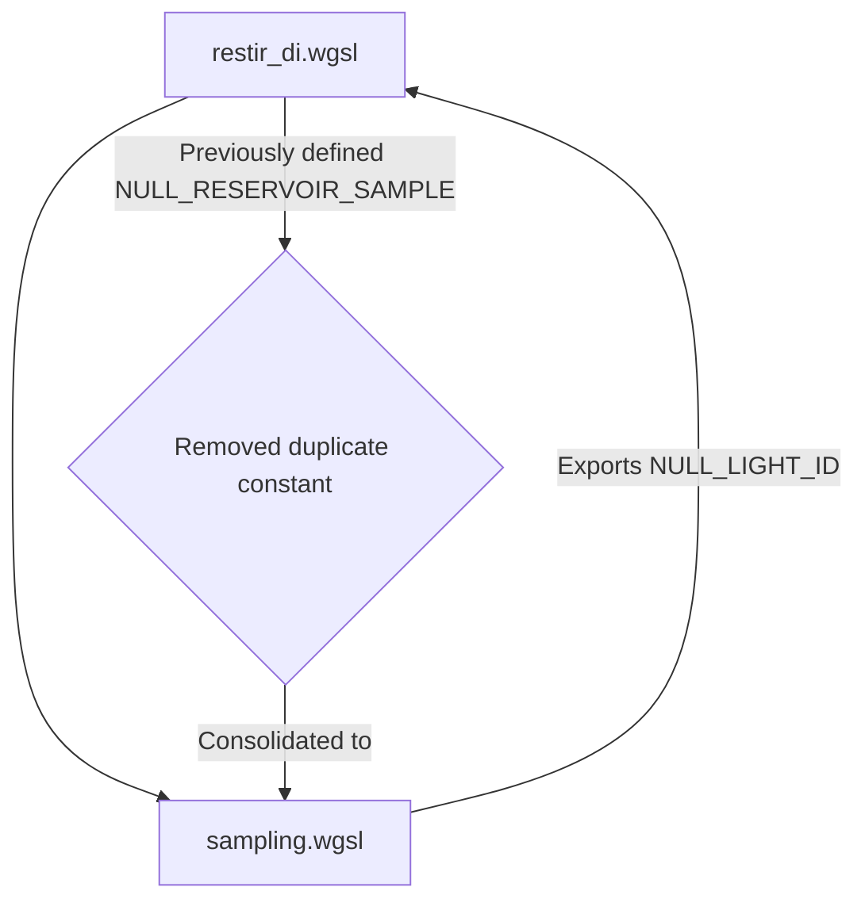

+++
title = "#22760 Solari: Tiny refactor"
date = "2026-02-01T00:00:00"
draft = false
template = "pull_request_page.html"
in_search_index = true

[taxonomies]
list_display = ["show"]

[extra]
current_language = "en"
available_languages = {"en" = { name = "English", url = "/pull_request/bevy/2026-02/pr-22760-en-20260201" }, "zh-cn" = { name = "中文", url = "/pull_request/bevy/2026-02/pr-22760-zh-cn-20260201" }}
labels = ["D-Trivial", "A-Rendering", "C-Code-Quality"]
+++

# Title

## Basic Information
- **Title**: Solari: Tiny refactor
- **PR Link**: https://github.com/bevyengine/bevy/pull/22760
- **Author**: JMS55
- **Status**: MERGED
- **Labels**: D-Trivial, A-Rendering, C-Code-Quality, S-Ready-For-Final-Review
- **Created**: 2026-02-01T01:10:54Z
- **Merged**: 2026-02-01T18:15:00Z
- **Merged By**: alice-i-cecile

## Description Translation
Tiny refactor to prep for some future work.

## The Story of This Pull Request

This pull request represents a straightforward code refactoring in Bevy's Solari real-time global illumination system. The changes focus on consolidating a constant value used to represent null or invalid light identifiers, improving code consistency and maintainability in preparation for future development work.

The core issue was that the constant `NULL_RESERVOIR_SAMPLE` was defined in `restir_di.wgsl` but represented the same semantic concept as what should logically be a `NULL_LIGHT_ID`. This created an unnecessary duplication and potential inconsistency - two different names for the same magic number (0xFFFFFFFFu) spread across different files.

The developer approached this by centralizing the constant definition in the more semantically appropriate location. They moved the constant definition from the ReSTIR DI implementation file to the shared `sampling.wgsl` module, renaming it to `NULL_LIGHT_ID` to better reflect its purpose. This change follows the principle of placing shared constants in common modules where they can be imported and used consistently across the codebase.

The implementation is minimal but effective. In `sampling.wgsl`, a new constant is defined:
```wgsl
const NULL_LIGHT_ID = 0xFFFFFFFFu;
```

Then in `restir_di.wgsl`, the import is updated to include this constant, and all references to the old `NULL_RESERVOIR_SAMPLE` are replaced with `NULL_LIGHT_ID`. The old constant definition in `restir_di.wgsl` is removed entirely.

This refactoring has several technical benefits. First, it eliminates code duplication, reducing the maintenance burden and potential for inconsistencies. Second, it improves semantic clarity - `NULL_LIGHT_ID` more accurately describes what the value represents (an invalid light identifier) rather than the more specific `NULL_RESERVOIR_SAMPLE`. Third, by placing the constant in the `sampling` module, it becomes available to any other code that might need to represent an invalid light ID, not just the ReSTIR DI implementation.

The impact is primarily on code quality rather than runtime performance or functionality. No behavior changes occur - the same value (0xFFFFFFFFu) is still used to represent invalid light samples. However, this small change makes the codebase more maintainable and sets a better foundation for future work that might need to work with light identifiers across different parts of the rendering pipeline.

## Visual Representation



## Key Files Changed

### `crates/bevy_solari/src/realtime/restir_di.wgsl`
This file contains the ReSTIR (Reservoir-based Spatio-Temporal Importance Resampling) direct illumination implementation. The changes removed a locally-defined constant and replaced it with an imported constant from the shared sampling module.

**Key modifications:**
```wgsl
// Before (line 22):
const NULL_RESERVOIR_SAMPLE = 0xFFFFFFFFu;

// Before (line 232):
LightSample(NULL_RESERVOIR_SAMPLE, 0u),

// Before (line 240):
return reservoir.sample.light_id != NULL_RESERVOIR_SAMPLE;

// After (import updated at line 11):
#import bevy_solari::sampling::{LightSample, NULL_LIGHT_ID, calculate_resolved_light_contribution, resolve_and_calculate_light_contribution, resolve_light_sample, trace_light_visibility, balance_heuristic}

// After (line 232):
LightSample(NULL_LIGHT_ID, 0u),

// After (line 240):
return reservoir.sample.light_id != NULL_LIGHT_ID;
```

### `crates/bevy_solari/src/scene/sampling.wgsl`
This file contains shared sampling utilities used across the Solari system. The change adds a new constant definition that represents an invalid light identifier.

**Key modifications:**
```wgsl
// Added at line 72 (after existing code):
const NULL_LIGHT_ID = 0xFFFFFFFFu;
```

The relationship between these changes is straightforward: a constant that was previously defined and used only in `restir_di.wgsl` has been moved to a more appropriate shared location (`sampling.wgsl`) and renamed to better reflect its semantic meaning. All usage sites have been updated to reference the new centralized constant.

## Further Reading

- [ReSTIR (Reservoir-based Spatio-Temporal Importance Resampling)](https://research.nvidia.com/publication/2020-07_restir-path-traced) - The original research paper on the ReSTIR algorithm
- [WGSL (WebGPU Shading Language) Specification](https://www.w3.org/TR/WGSL/) - Official specification for the shading language used in these files
- [Bevy Engine Documentation](https://bevyengine.org/learn/) - General documentation for the Bevy game engine
- [Code Refactoring Best Practices](https://refactoring.com/) - Martin Fowler's guide to improving code structure without changing behavior

## Full Code Diff
```
diff --git a/crates/bevy_solari/src/realtime/restir_di.wgsl b/crates/bevy_solari/src/realtime/restir_di.wgsl
index 5133d6113cc3b..9d087d017cdd2 100644
--- a/crates/bevy_solari/src/realtime/restir_di.wgsl
+++ b/crates/bevy_solari/src/realtime/restir_di.wgsl
@@ -11,7 +11,7 @@ enable wgpu_ray_query;
 #import bevy_solari::brdf::{evaluate_brdf, evaluate_diffuse_brdf}
 #import bevy_solari::gbuffer_utils::{gpixel_resolve, pixel_dissimilar, permute_pixel}
 #import bevy_solari::presample_light_tiles::unpack_resolved_light_sample
-#import bevy_solari::sampling::{LightSample, calculate_resolved_light_contribution, resolve_and_calculate_light_contribution, resolve_light_sample, trace_light_visibility, balance_heuristic}
+#import bevy_solari::sampling::{LightSample, NULL_LIGHT_ID, calculate_resolved_light_contribution, resolve_and_calculate_light_contribution, resolve_light_sample, trace_light_visibility, balance_heuristic}
 #import bevy_solari::scene_bindings::{light_sources, previous_frame_light_id_translations, LIGHT_NOT_PRESENT_THIS_FRAME}
 #import bevy_solari::specular_gi::SPECULAR_GI_FOR_DI_ROUGHNESS_THRESHOLD
 #import bevy_solari::realtime_bindings::{view_output, light_tile_samples, light_tile_resolved_samples, di_reservoirs_a, di_reservoirs_b, gbuffer, depth_buffer, motion_vectors, previous_gbuffer, previous_depth_buffer, view, previous_view, constants, ResolvedLightSamplePacked}
@@ -20,8 +20,6 @@ const INITIAL_SAMPLES = 8u;
 const SPATIAL_REUSE_RADIUS_PIXELS = 30.0;
 const CONFIDENCE_WEIGHT_CAP = 20.0;
 
-const NULL_RESERVOIR_SAMPLE = 0xFFFFFFFFu;
-
 @compute @workgroup_size(8, 8, 1)
 fn initial_and_temporal(@builtin(workgroup_id) workgroup_id: vec3<u32>, @builtin(global_invocation_id) global_id: vec3<u32>) {
     if any(global_id.xy >= vec2u(view.main_pass_viewport.zw)) { return; }
@@ -226,14 +224,14 @@ struct Reservoir {
 
 fn empty_reservoir() -> Reservoir {
     return Reservoir(
-        LightSample(NULL_RESERVOIR_SAMPLE, 0u),
+        LightSample(NULL_LIGHT_ID, 0u),
         0.0,
         0.0,
     );
 }
 
 fn reservoir_valid(reservoir: Reservoir) -> bool {
-    return reservoir.sample.light_id != NULL_RESERVOIR_SAMPLE;
+    return reservoir.sample.light_id != NULL_LIGHT_ID;
 }
 
 fn pack_reservoir(reservoir: Reservoir) -> vec4<u32> {
diff --git a/crates/bevy_solari/src/scene/sampling.wgsl b/crates/bevy_solari/src/scene/sampling.wgsl
index 4a86e2311cc1d..21a7d352d8aa1 100644
--- a/crates/bevy_solari/src/scene/sampling.wgsl
+++ b/crates/bevy_solari/src/scene/sampling.wgsl
@@ -70,6 +70,8 @@ fn ggx_vndf_pdf(wi_tangent: vec3<f32>, wo_tangent: vec3<f32>, roughness: f32) >
     return ndf * (t - i.z) / (2.0 * len2);
 }
 
+const NULL_LIGHT_ID = 0xFFFFFFFFu;
+
 struct LightSample {
     light_id: u32,
     seed: u32,
```