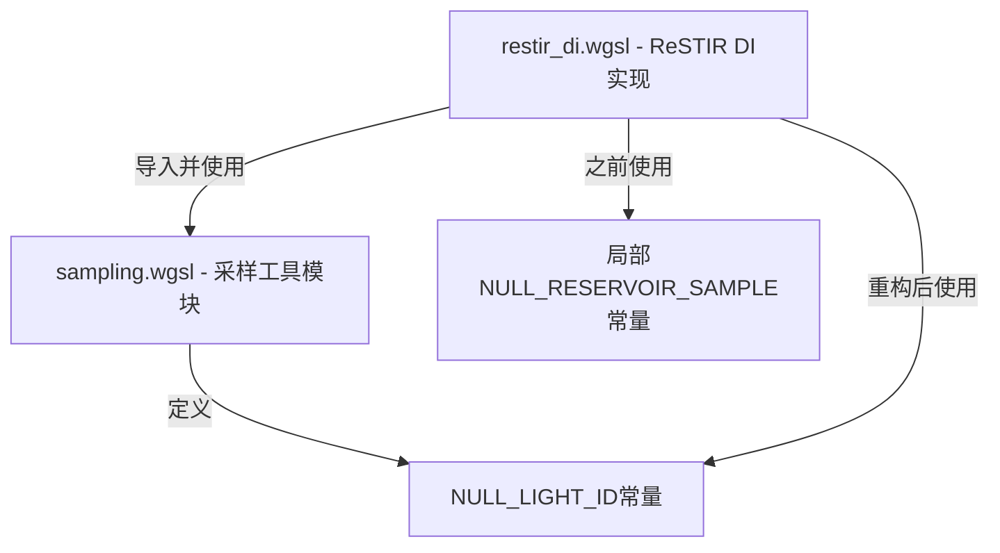

+++
title = "#22760 Solari: Tiny refactor"
date = "2026-02-01T00:00:00"
draft = false
template = "pull_request_page.html"
in_search_index = false

[extra]
current_language = "zh-cn"
available_languages = {"en" = { name = "English", url = "/pull_request/bevy/2026-02/pr-22760-en-20260201" }, "zh-cn" = { name = "中文", url = "/pull_request/bevy/2026-02/pr-22760-zh-cn-20260201" }}
+++

# Solari: Tiny refactor

## 基本信息
- **标题**: Solari: Tiny refactor
- **PR链接**: https://github.com/bevyengine/bevy/pull/22760
- **作者**: JMS55
- **状态**: 已合并
- **标签**: D-Trivial, A-Rendering, C-Code-Quality, S-Ready-For-Final-Review
- **创建时间**: 2026-02-01T01:10:54Z
- **合并时间**: 2026-02-01T18:15:00Z
- **合并者**: alice-i-cecile

## 描述翻译
为未来的一些工作做的小型重构。

## 本次PR的技术故事

这是一个典型的小型代码质量改进PR，主要目的是为未来的功能开发做准备。开发者识别出了一个可以统一管理的常量定义，通过将其从局部作用域提升到模块级的共享作用域，提高了代码的可维护性和一致性。

在ReSTIR DI（Reservoir-based Spatio-Temporal Importance Resampling for Direct Illumination）算法的实现中，需要处理无效或空的光源采样。在修改前的代码中，`crates/bevy_solari/src/realtime/restir_di.wgsl`文件定义了一个局部常量`NULL_RESERVOIR_SAMPLE`（值为`0xFFFFFFFFu`）来表示一个无效的储层样本（reservoir sample）。这个常量被用于初始化空的Reservoir数据结构，并在检查Reservoir是否有效时作为判断依据。

开发者意识到，这个表示"无效光源ID"的概念在整个Solari渲染系统中应该是统一的，而不仅仅局限在ReSTIR DI模块中。因此，他们决定将这个常量的定义移到更合适的位置——`crates/bevy_solari/src/scene/sampling.wgsl`文件，并将其重命名为更具一般性的`NULL_LIGHT_ID`。

这个改动虽然很小，但体现了良好的软件工程实践。首先，它遵循了DRY（Don't Repeat Yourself）原则，避免了相同值的重复定义。其次，它提高了代码的可读性和可维护性——现在所有需要表示无效光源ID的模块都可以引用同一个定义，如果未来需要改变这个值（虽然不太可能，因为`0xFFFFFFFF`是常见的无效ID表示），只需修改一处即可。

从实现细节来看，这次重构涉及两个文件：
1. 在`sampling.wgsl`中添加了`NULL_LIGHT_ID`常量定义
2. 在`restir_di.wgsl`中移除局部定义，更新导入语句以包含新的常量，并将所有使用`NULL_RESERVOIR_SAMPLE`的地方替换为`NULL_LIGHT_ID`

这种重构不会改变渲染器的运行时行为，因为常量的值保持不变。但它为未来的开发铺平了道路——当其他模块也需要表示无效光源时，可以直接引用这个已定义的常量，而不需要重新定义或硬编码。

从架构设计的角度看，这个改动将"无效光源ID"这个概念从ReSTIR DI算法的实现细节提升为Solari渲染系统的一个共享概念。这反映了良好的关注点分离——`sampling.wgsl`文件包含了与采样相关的通用定义和工具函数，而`restir_di.wgsl`则专注于具体的ReSTIR DI算法实现。

## 可视化表示



## 主要文件变更

### 1. `crates/bevy_solari/src/scene/sampling.wgsl` (+2/-0)
**变更描述**: 添加了一个表示无效光源ID的共享常量定义。

**关键代码片段**:
```wgsl
// 文件: crates/bevy_solari/src/scene/sampling.wgsl
// 变更位置: 在文件末尾添加
const NULL_LIGHT_ID = 0xFFFFFFFFu;
```

**与PR目的的关系**: 这是重构的核心部分，创建了一个在整个Solari渲染系统中可共享的无效光源ID常量。

### 2. `crates/bevy_solari/src/realtime/restir_di.wgsl` (+3/-5)
**变更描述**: 移除局部常量定义，改用共享常量，并更新相关代码。

**关键代码片段**:
```wgsl
// 文件: crates/bevy_solari/src/realtime/restir_di.wgsl
// 导入语句变更前:
#import bevy_solari::sampling::{LightSample, calculate_resolved_light_contribution, resolve_and_calculate_light_contribution, resolve_light_sample, trace_light_visibility, balance_heuristic}

// 导入语句变更后:
#import bevy_solari::sampling::{LightSample, NULL_LIGHT_ID, calculate_resolved_light_contribution, resolve_and_calculate_light_contribution, resolve_light_sample, trace_light_visibility, balance_heuristic}

// 常量定义移除前:
const NULL_RESERVOIR_SAMPLE = 0xFFFFFFFFu;

// 常量使用变更前:
const NULL_RESERVOIR_SAMPLE = 0xFFFFFFFFu;
// ...
fn empty_reservoir() -> Reservoir {
    return Reservoir(
        LightSample(NULL_RESERVOIR_SAMPLE, 0u),
        0.0,
        0.0,
    );
}
fn reservoir_valid(reservoir: Reservoir) -> bool {
    return reservoir.sample.light_id != NULL_RESERVOIR_SAMPLE;
}

// 常量使用变更后:
// 注意: NULL_RESERVOIR_SAMPLE常量定义已完全移除
fn empty_reservoir() -> Reservoir {
    return Reservoir(
        LightSample(NULL_LIGHT_ID, 0u),
        0.0,
        0.0,
    );
}
fn reservoir_valid(reservoir: Reservoir) -> bool {
    return reservoir.sample.light_id != NULL_LIGHT_ID;
}
```

**与PR目的的关系**: 这是重构的实施部分，将ReSTIR DI算法中对无效光源ID的引用从局部常量切换到共享常量，提高了代码的一致性和可维护性。

## 进一步阅读

1. **WGSL语言规范**: 了解WebGPU Shading Language的常量定义和作用域规则
   - https://www.w3.org/TR/WGSL/

2. **ReSTIR算法原论文**: 理解Reservoir-based Spatio-Temporal Importance Resampling算法的基本原理
   - Bitterli, B., Wyman, C., Pharr, M., Shirley, P., Lefohn, A., & Jarosz, W. (2020). Spatiotemporal reservoir resampling for real-time ray tracing with dynamic direct lighting. ACM Transactions on Graphics (TOG), 39(4), 148-1.

3. **Bevy引擎的Solari渲染系统**: 了解Bevy中实时全局光照系统的整体架构
   - https://github.com/bevyengine/bevy/tree/main/crates/bevy_solari

4. **代码重构最佳实践**: 学习何时以及如何进行代码重构
   - Fowler, M. (2018). Refactoring: improving the design of existing code. Addison-Wesley Professional.

## 完整代码差异
```diff
diff --git a/crates/bevy_solari/src/realtime/restir_di.wgsl b/crates/bevy_solari/src/realtime/restir_di.wgsl
index 5133d6113cc3b..9d087d017cdd2 100644
--- a/crates/bevy_solari/src/realtime/restir_di.wgsl
+++ b/crates/bevy_solari/src/realtime/restir_di.wgsl
@@ -11,7 +11,7 @@ enable wgpu_ray_query;
 #import bevy_solari::brdf::{evaluate_brdf, evaluate_diffuse_brdf}
 #import bevy_solari::gbuffer_utils::{gpixel_resolve, pixel_dissimilar, permute_pixel}
 #import bevy_solari::presample_light_tiles::unpack_resolved_light_sample
-#import bevy_solari::sampling::{LightSample, calculate_resolved_light_contribution, resolve_and_calculate_light_contribution, resolve_light_sample, trace_light_visibility, balance_heuristic}
+#import bevy_solari::sampling::{LightSample, NULL_LIGHT_ID, calculate_resolved_light_contribution, resolve_and_calculate_light_contribution, resolve_light_sample, trace_light_visibility, balance_heuristic}
 #import bevy_solari::scene_bindings::{light_sources, previous_frame_light_id_translations, LIGHT_NOT_PRESENT_THIS_FRAME}
 #import bevy_solari::specular_gi::SPECULAR_GI_FOR_DI_ROUGHNESS_THRESHOLD
 #import bevy_solari::realtime_bindings::{view_output, light_tile_samples, light_tile_resolved_samples, di_reservoirs_a, di_reservoirs_b, gbuffer, depth_buffer, motion_vectors, previous_gbuffer, previous_depth_buffer, view, previous_view, constants, ResolvedLightSamplePacked}
@@ -20,8 +20,6 @@ const INITIAL_SAMPLES = 8u;
 const SPATIAL_REUSE_RADIUS_PIXELS = 30.0;
 const CONFIDENCE_WEIGHT_CAP = 20.0;
 
-const NULL_RESERVOIR_SAMPLE = 0xFFFFFFFFu;
-
 @compute @workgroup_size(8, 8, 1)
 fn initial_and_temporal(@builtin(workgroup_id) workgroup_id: vec3<u32>, @builtin(global_invocation_id) global_id: vec3<u32>) {
     if any(global_id.xy >= vec2u(view.main_pass_viewport.zw)) { return; }
@@ -226,14 +224,14 @@ struct Reservoir {
 
 fn empty_reservoir() -> Reservoir {
     return Reservoir(
-        LightSample(NULL_RESERVOIR_SAMPLE, 0u),
+        LightSample(NULL_LIGHT_ID, 0u),
         0.0,
         0.0,
     );
 }
 
 fn reservoir_valid(reservoir: Reservoir) -> bool {
-    return reservoir.sample.light_id != NULL_RESERVOIR_SAMPLE;
+    return reservoir.sample.light_id != NULL_LIGHT_ID;
 }
 
 fn pack_reservoir(reservoir: Reservoir) -> vec4<u32> {
diff --git a/crates/bevy_solari/src/scene/sampling.wgsl b/crates/bevy_solari/src/scene/sampling.wgsl
index 4a86e2311cc1d..21a7d352d8aa1 100644
--- a/crates/bevy_solari/src/scene/sampling.wgsl
+++ b/crates/bevy_solari/src/scene/sampling.wgsl
@@ -70,6 +70,8 @@ fn ggx_vndf_pdf(wi_tangent: vec3<f32>, wo_tangent: vec3<f32>, roughness: f32) ->
     return ndf * (t - i.z) / (2.0 * len2);
 }
 
+const NULL_LIGHT_ID = 0xFFFFFFFFu;
+
 struct LightSample {
     light_id: u32,
     seed: u32,
```