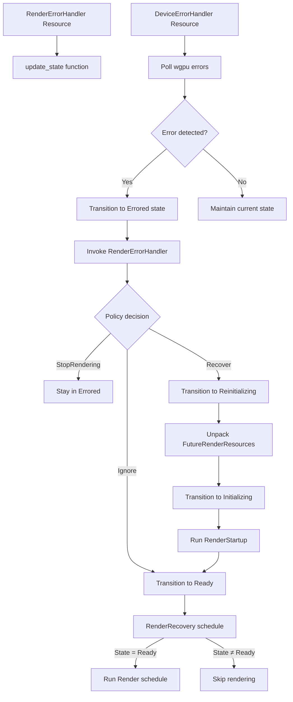

+++
title = "#22761 Render Recovery"
date = "2026-02-05T00:00:00"
draft = false
template = "pull_request_page.html"
in_search_index = true

[taxonomies]
list_display = ["show"]

[extra]
current_language = "en"
available_languages = {"en" = { name = "English", url = "/pull_request/bevy/2026-02/pr-22761-en-20260205" }, "zh-cn" = { name = "中文", url = "/pull_request/bevy/2026-02/pr-22761-zh-cn-20260205" }}
labels = ["C-Feature", "A-Rendering", "P-Crash", "D-Modest"]
+++

# Render Recovery

## Basic Information

- **Title**: Render Recovery
- **PR Link**: https://github.com/bevyengine/bevy/pull/22761
- **Author**: atlv24
- **Status**: MERGED
- **Labels**: C-Feature, A-Rendering, P-Crash, S-Ready-For-Final-Review, D-Modest
- **Created**: 2026-02-01T01:12:13Z
- **Merged**: 2026-02-05T17:38:24Z
- **Merged By**: alice-i-cecile

## Description

# Objective

- Recover from rendering errors.
- Another step towards render recovery after #22714 #22759 and #16481 

## Solution

- Use `wgpu::Device::set_device_lost_callback` and `wgpu::Device::on_uncaptured_error` to listen for errors.
- Add a state machine for the renderer
- Update it on error
- Add a `RenderErrorHandler` to let users specify behavior on error by returning a specific `RenderErrorPolicy`
- This lets us for example ignore validation errors, delete responsible entities, or reload the renderer if the device was lost.

## Testing

- #22757 with any of
```rs
    .insert_resource(bevy_render::error_handler::RenderErrorHandler(|_, _, _| {
        bevy_render::error_handler::RenderErrorPolicy::StopRendering
    }))
```
```rs
    .insert_resource(bevy_render::error_handler::RenderErrorHandler(|_, _, _| {
        bevy_render::error_handler::RenderErrorPolicy::Recover(default())
    }))
```

Note: no release note yet, as recovery does not exactly work well: this PR gets us to the point of being able to care about it, but we currently instantly crash on recover due to gpu resources not existing anymore. We need to build more resilience before publicizing imo.

## The Story of This Pull Request

This PR addresses a fundamental limitation in Bevy's rendering system: the inability to recover from GPU errors. Previously, any wgpu error - whether a validation error, device lost, or out-of-memory condition - would cause the application to panic and crash. This was particularly problematic for applications that need to run continuously, as GPU errors can occur due to driver issues, hardware failures, or even intentional stress testing.

The solution implements a state machine approach to renderer lifecycle management, coupled with error handling infrastructure that allows applications to define custom recovery policies. The core insight is that different types of errors require different responses: validation errors might be safely ignored in some cases, device lost errors require complete reinitialization, while out-of-memory conditions might need resource cleanup.

The implementation centers around three main components: a `DeviceErrorHandler` that captures wgpu errors through callbacks, a `RenderState` enum that tracks the renderer's lifecycle state, and a `RenderErrorHandler` resource that lets users define custom error response policies. These components work together in the `update_state` function, which runs during the extract phase between the main world and render world.

The state machine has four states:
- `Initializing`: The renderer is starting up and needs to run `RenderStartup`
- `Ready`: The renderer is functioning normally
- `Errored`: An error has occurred and needs handling
- `Reinitializing`: The renderer is being recreated after an error

When an error occurs, the `DeviceErrorHandler` captures it and stores it in thread-safe containers. During the next frame's extract phase, `update_state` polls for errors and transitions to the `Errored` state if one exists. At this point, the user's `RenderErrorHandler` is invoked with access to both worlds, allowing it to decide on a response policy: ignore the error and continue, stop rendering but keep the app alive, or attempt recovery with new render settings.

Recovery involves recreating the render context by unpacking `FutureRenderResources` that were queued during error handling. This reinitializes the render device, queue, and adapter, then transitions back to `Initializing` state to run `RenderStartup` again.

A significant architectural change was moving the render schedule execution into a new `RenderRecovery` schedule that conditionally runs the `Render` schedule only when the renderer is in `Ready` state. This prevents rendering attempts during error states or reinitialization. The time synchronization between worlds was also moved to this schedule to ensure it runs regardless of rendering state.

The implementation acknowledges current limitations - particularly that GPU resources aren't properly recreated during recovery, causing crashes. However, this establishes the necessary infrastructure for future improvements to make recovery fully functional.

## Visual Representation



## Key Files Changed

### `crates/bevy_render/src/error_handler.rs` (+214/-0)
This new file contains the core error handling infrastructure:
- `RenderErrorPolicy`: Enum defining available response policies (Ignore, StopRendering, Recover)
- `RenderErrorHandler`: Resource holding a user-defined function that decides how to respond to errors
- `RenderError`: Structured error information including type, description, and source
- `RenderState`: State machine enum tracking renderer lifecycle
- `DeviceErrorHandler`: Resource that sets up wgpu error callbacks and polls for captured errors
- `update_state`: Main function that drives the state machine and invokes error handlers

Key implementation details:
```rust
// Error handler signature providing access to both worlds
pub struct RenderErrorHandler(
    pub for<'a> fn(&'a RenderError, &'a mut World, &'a mut World) -> RenderErrorPolicy,
);

// State machine tracking renderer lifecycle
pub(crate) enum RenderState {
    Initializing,
    Ready,
    Errored(RenderError),
    Reinitializing,
}

// Setting up wgpu error callbacks
device.set_device_lost_callback(move |reason, str| {
    bevy_log::error!("Caught DeviceLost error: {reason:?} {str}");
    assert!(device_lost.lock().unwrap().replace((reason, str)).is_none());
});
```

### `crates/bevy_render/src/lib.rs` (+41/-15)
This file integrates the error handling system into Bevy's main rendering infrastructure:
- Adds the new `error_handler` module
- Initializes `RenderErrorHandler` as a default resource
- Creates `RenderRecovery` schedule that conditionally runs the `Render` schedule
- Moves time synchronization from render system to recovery schedule
- Replaces the old startup flag mechanism with `error_handler::update_state`

Key changes:
```rust
// Before: Direct render schedule execution
render_app.update_schedule = Some(Render.intern());

// After: Recovery schedule that conditionally renders
render_app.update_schedule = Some(RenderRecovery.intern());
render_app.add_schedule(Schedule::new(RenderRecovery))
.add_systems(RenderRecovery, move |world: &mut World| {
    if matches!(world.resource::<RenderState>(), RenderState::Ready) {
        world.run_schedule(Render);
    }
    // Time synchronization moved here
});

// Extract phase now updates state
render_app.set_extract(|main_world, render_world| {
    error_handler::update_state(main_world, render_world);
    // ... rest of extraction
});
```

### `examples/app/render_recovery.rs` (+31/-1)
This example demonstrates the error handling system with interactive controls:
- Shows how to set different `RenderErrorHandler` policies
- Provides keyboard controls to trigger different types of wgpu errors
- Demonstrates error policy switching at runtime

Key additions:
```rust
// Setting different error handlers based on key presses
if input.just_pressed(Key::Character("1".into())) {
    *handler = RenderErrorHandler(|_, _, _| RenderErrorPolicy::Ignore);
}
if input.just_pressed(Key::Character("4".into())) {
    *handler = RenderErrorHandler(|_, _, _| RenderErrorPolicy::StopRendering);
}
if input.just_pressed(Key::Character("5".into())) {
    *handler = RenderErrorHandler(|_, _, _| RenderErrorPolicy::Recover(default()));
}

// Triggering a validation error
if let RenderError::Validation = *error {
    let buffer = device.create_buffer(&BufferDescriptor {
        size: 0,
        usage: BufferUsages::VERTEX,
        label: None,
        mapped_at_creation: false,
    });
    // Invalid usage will trigger validation error
    queue.write_buffer(&buffer, 0, &[0u8; 1]);
}
```

### `crates/bevy_render/src/renderer/mod.rs` (+0/-15)
Removes the time synchronization logic that was moved to the `RenderRecovery` schedule, cleaning up the render system to focus solely on rendering operations.

### `crates/bevy_render/src/settings.rs` (various changes)
- Changes `RenderCreation::Automatic` to hold `Box<WgpuSettings>` to avoid large enum variant warnings
- Adds `DeviceErrorHandler` initialization when creating render resources
- Updates the `From<WgpuSettings>` implementation accordingly

## Further Reading

1. **wgpu Error Handling**: [wgpu::Device documentation](https://docs.rs/wgpu/latest/wgpu/struct.Device.html#method.set_device_lost_callback) for callback mechanisms
2. **State Machine Patterns**: Common patterns for managing complex lifecycle states in game engines
3. **Graceful Degradation**: Techniques for maintaining application functionality when subsystems fail
4. **Previous PRs in the series**: #22714, #22759, #16481 for context on the broader render recovery effort
5. **Bevy ECS Resources**: Understanding how resources work across main and render worlds for error handler implementation