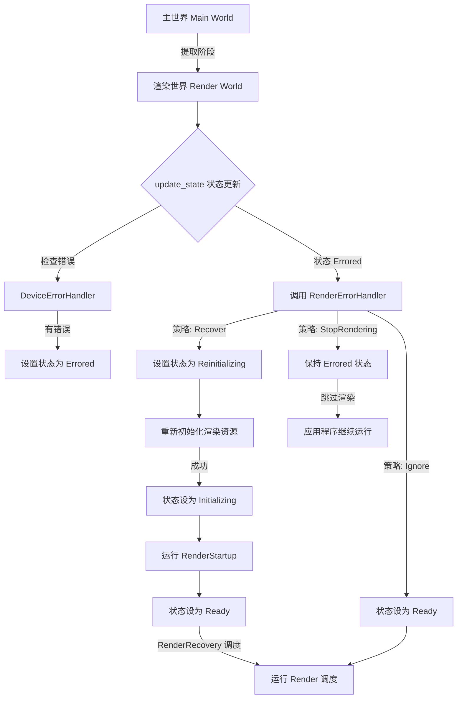

+++
title = "#22761 Render Recovery"
date = "2026-02-05T00:00:00"
draft = false
template = "pull_request_page.html"
in_search_index = false

[extra]
current_language = "zh-cn"
available_languages = {"en" = { name = "English", url = "/pull_request/bevy/2026-02/pr-22761-en-20260205" }, "zh-cn" = { name = "中文", url = "/pull_request/bevy/2026-02/pr-22761-zh-cn-20260205" }}
labels = ["C-Feature", "A-Rendering", "P-Crash", "D-Modest"]
+++

# Title: Render Recovery

## Basic Information
- **Title**: Render Recovery  
- **PR Link**: https://github.com/bevyengine/bevy/pull/22761  
- **Author**: atlv24  
- **Status**: MERGED  
- **Labels**: C-Feature, A-Rendering, P-Crash, S-Ready-For-Review, D-Modest  
- **Created**: 2026-02-01T01:12:13Z  
- **Merged**: 2026-02-05T17:38:24Z  
- **Merged By**: alice-i-cecile  

## 描述翻译

# 目标

- 从渲染错误中恢复。
- 继 #22714、#22759 和 #16481 之后，实现渲染恢复的另一步。

## 解决方案

- 使用 `wgpu::Device::set_device_lost_callback` 和 `wgpu::Device::on_uncaptured_error` 来监听错误。
- 为渲染器添加一个状态机。
- 在错误发生时更新状态机。
- 添加一个 `RenderErrorHandler`，让用户通过返回特定的 `RenderErrorPolicy` 来指定在错误发生时的行为。
- 这让我们可以忽略验证错误、删除相关实体，或者在设备丢失时重新加载渲染器。

## 测试

- 使用 #22757 以及以下任一代码片段进行测试：
```rs
    .insert_resource(bevy_render::error_handler::RenderErrorHandler(|_, _, _| {
        bevy_render::error_handler::RenderErrorPolicy::StopRendering
    }))
```
```rs
    .insert_resource(bevy_render::error_handler::RenderErrorHandler(|_, _, _| {
        bevy_render::error_handler::RenderErrorPolicy::Recover(default())
    }))
```

注意：目前还没有发布说明，因为恢复功能尚未完全可用：此PR让我们能够开始关注错误恢复，但目前尝试恢复时会立即崩溃，因为GPU资源已不存在。我们需要构建更强的恢复能力才能公开此功能。

## 本次Pull Request的故事

### 问题与背景
在游戏引擎渲染系统中，GPU错误是不可避免的。这些错误可能由多种原因引起：驱动问题、内存不足、无效的GPU指令，或者设备丢失（如用户拔掉外部GPU）。在Bevy的早期版本中，这些错误通常会导致整个应用程序崩溃，因为系统没有错误处理机制。

在之前的PR #22714、#22759 和 #16481中，团队已经开始为渲染系统添加错误处理的基础设施。本次PR的目标是进一步推进这项工作，实现一个能够从渲染错误中恢复的框架。核心需求是：在错误发生时，能够捕获错误，并允许开发者决定如何处理——是忽略错误继续渲染，停止渲染但保持应用程序运行，还是尝试重新初始化渲染器。

### 解决方案方法
开发者采用了状态机模式来管理渲染器的生命周期。他们创建了四个明确的渲染状态：
1. `Initializing` - 渲染器正在初始化
2. `Ready` - 渲染器就绪，可以正常渲染
3. `Errored` - 发生渲染错误
4. `Reinitializing` - 正在重新初始化以尝试恢复

为了捕获错误，他们利用了wgpu提供的两个回调机制：
- `set_device_lost_callback` - 处理设备丢失错误
- `on_uncaptured_error` - 处理未捕获的错误（验证错误、内部错误、内存不足等）

最关键的设计是引入了`RenderErrorHandler`资源，这是一个用户可配置的回调函数，它接收错误信息、主世界和渲染世界的引用，并返回一个`RenderErrorPolicy`。这个设计将错误处理策略的决定权交给了开发者，而不是硬编码在引擎中。

### 实现细节
新的`error_handler.rs`模块包含了整个错误处理系统的核心组件。`DeviceErrorHandler`结构体负责设置wgpu错误回调并将错误信息存储在互斥锁保护的Arc中。这种设计确保了线程安全，同时允许在后续帧中轮询这些错误。

`update_state`函数是状态机的核心逻辑。它在提取阶段（extract phase）被调用，检查是否有新的错误，更新渲染状态，并根据当前状态执行相应操作：

```rust
pub(crate) fn update_state(main_world: &mut World, render_world: &mut World) {
    if let Some(error) = render_world.resource::<DeviceErrorHandler>().poll() {
        render_world.insert_resource(RenderState::Errored(error));
    };
    
    // ... 状态处理逻辑
}
```

在`Reinitializing`状态下，系统会从`FutureRenderResources`中取出新的渲染资源，并使用这些资源重新初始化渲染世界。这包括重新创建RenderDevice、RenderQueue等关键组件。

### 系统集成
为了集成这个新的错误处理系统，开发者对渲染应用的调度系统进行了重构。他们创建了一个新的`RenderRecovery`调度，替代了原有的直接运行`Render`调度的方式：

```rust
render_app.update_schedule = Some(RenderRecovery.intern());
```

在`RenderRecovery`调度中，系统首先检查当前渲染状态。只有当状态为`Ready`时，才会运行`Render`调度。这样，在错误状态或重新初始化状态下，渲染逻辑会被跳过：

```rust
.add_systems(RenderRecovery, move |world: &mut World| {
    if matches!(world.resource::<RenderState>(), RenderState::Ready) {
        world.run_schedule(Render);
    }
    // ... 时间同步逻辑
})
```

这种设计确保了渲染错误不会导致整个应用程序崩溃，而是提供了可控的错误处理路径。

### 技术洞察
这个实现有几个值得注意的技术点：

1. **错误捕获的时序问题**：错误回调是异步的，可能在任何时候被调用。通过将错误存储在共享的互斥锁中，然后在每一帧的固定点（`update_state`中）轮询，系统避免了在回调中直接操作ECS世界可能引发的复杂性问题。

2. **状态管理的原子性**：渲染状态被设计为一个资源，在`update_state`函数中通过`remove_resource`和`insert_resource`进行操作。这种方式确保了状态转换的原子性，避免了在状态处理过程中状态被意外修改。

3. **资源生命周期管理**：在恢复过程中，旧的GPU资源需要被清理，新的资源需要被创建。`RenderResources`结构体封装了所有必要的渲染资源，`unpack_into`方法负责将这些资源插入到渲染世界中。

4. **向后兼容性**：默认的`RenderErrorHandler`实现了忽略错误的策略，这与之前的行为保持一致。这意味着现有应用程序在升级后不会立即出现行为变化，除非开发者显式配置错误处理策略。

### 影响与局限
这个PR为Bevy的渲染系统添加了基本的错误恢复能力，但仍然有一些限制：

1. **恢复不完全**：正如PR描述中提到的，虽然框架已经建立，但实际的恢复过程可能仍然会失败，因为GPU资源在设备丢失后可能无法简单重建。

2. **性能考虑**：错误回调使用了互斥锁，虽然错误发生的频率通常很低，但这仍然引入了额外的同步开销。

3. **用户教育**：开发者需要理解不同的错误类型和相应的处理策略。验证错误可能可以安全忽略，而设备丢失错误通常需要完整的恢复流程。

这个实现为未来的改进奠定了基础。团队可以在此基础上添加更精细的错误分类、更健壮的恢复策略，以及更好的错误报告机制。

## 可视化表示



## 关键文件变更

### 1. `crates/bevy_render/src/error_handler.rs` (+214/-0)
**描述**：新增的错误处理模块，包含状态机、错误处理器和设备错误处理器。

**关键代码片段**：
```rust
pub enum RenderErrorPolicy {
    /// 假装什么都没发生，继续渲染
    Ignore,
    /// 保持应用运行，但停止渲染
    StopRendering,
    /// 使用给定的 RenderCreation 尝试恢复渲染器
    Recover(RenderCreation),
}

#[derive(Resource, Debug)]
pub(crate) enum RenderState {
    Initializing,
    Ready,
    Errored(RenderError),
    Reinitializing,
}

pub(crate) struct DeviceErrorHandler {
    device_lost: Arc<Mutex<Option<(wgpu::DeviceLostReason, String)>>>,
    uncaptured: Arc<Mutex<Option<WgpuWrapper<wgpu::Error>>>>,
}
```

### 2. `crates/bevy_render/src/lib.rs` (+41/-15)
**描述**：集成了错误处理系统到主渲染模块中。

**关键代码片段**：
```rust
// 新增渲染恢复调度
#[derive(ScheduleLabel, Debug, Hash, PartialEq, Eq, Clone)]
struct RenderRecovery;

// 在初始化渲染应用时
render_app.update_schedule = Some(RenderRecovery.intern());

// 修改提取函数
render_app.set_extract(|main_world, render_world| {
    error_handler::update_state(main_world, render_world);
    // ... 原有的提取逻辑
});
```

### 3. `examples/app/render_recovery.rs` (+31/-1)
**描述**：扩展了示例，展示如何使用不同的错误处理策略。

**关键代码片段**：
```rust
fn input(
    input: Res<ButtonInput<Key>>,
    mut error: ResMut<RenderError>,
    mut handler: ResMut<RenderErrorHandler>,
) {
    // ... 原有的错误触发逻辑
    
    // 新增的错误处理策略选择
    if input.just_pressed(Key::Character("1".into())) {
        *handler = RenderErrorHandler(|_, _, _| RenderErrorPolicy::Ignore);
    }
    if input.just_pressed(Key::Character("4".into())) {
        *handler = RenderErrorHandler(|_, _, _| RenderErrorPolicy::StopRendering);
    }
    if input.just_pressed(Key::Character("5".into())) {
        *handler = RenderErrorHandler(|_, _, _| RenderErrorPolicy::Recover(default()));
    }
}
```

### 4. `crates/bevy_render/src/renderer/mod.rs` (+0/-15)
**描述**：移除了渲染系统中的时间同步逻辑，将其移至`RenderRecovery`调度中。

**变更前**：
```rust
// 在render_system函数中
let time_sender = world.resource::<TimeSender>();
if let Err(error) = time_sender.0.try_send(Instant::now()) {
    // 错误处理逻辑
}
```

**变更后**：此逻辑被移至`lib.rs`的`RenderRecovery`调度系统中。

### 5. `examples/2d/wireframe_2d.rs` (+4/-7)
**描述**：更新示例以使用新的`RenderCreation` API。

**变更前**：
```rust
render_creation: RenderCreation::Automatic(WgpuSettings {
    features: WgpuFeatures::POLYGON_MODE_LINE,
    ..default()
}),
```

**变更后**：
```rust
render_creation: WgpuSettings {
    features: WgpuFeatures::POLYGON_MODE_LINE,
    ..default()
}.into(),
```

## 进一步阅读

1. **wgpu错误处理文档**：
   - [wgpu::Device::set_device_lost_callback](https://docs.rs/wgpu/latest/wgpu/struct.Device.html#method.set_device_lost_callback)
   - [wgpu::Device::on_uncaptured_error](https://docs.rs/wgpu/latest/wgpu/struct.Device.html#method.on_uncaptured_error)

2. **状态机模式在游戏引擎中的应用**：
   - [Game Programming Patterns: State](https://gameprogrammingpatterns.com/state.html)

3. **Bevy调度系统**：
   - [Bevy Engine: Schedules](https://bevyengine.org/learn/book/next/programming/schedules/)

4. **错误恢复策略**：
   - [Error Handling in Graphics Programming](https://www.khronos.org/assets/uploads/developers/library/2016-vulkan-devday-uk/4-Error-handling.pdf)

5. **之前的渲染恢复相关PR**：
   - #22714: 渲染设备丢失处理的基础
   - #22759: 渲染资源管理改进
   - #16481: 初始的渲染错误处理探索