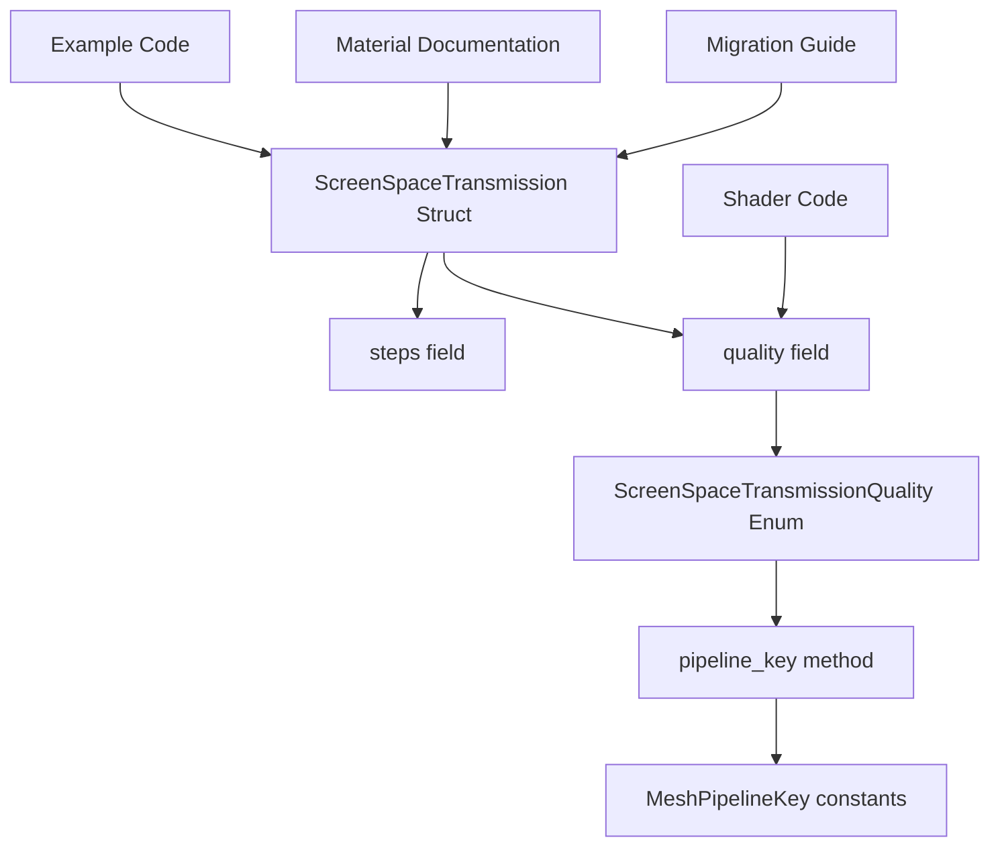

+++
title = "#22763 Transmission cleanup"
date = "2026-02-03T00:00:00"
draft = false
template = "pull_request_page.html"
in_search_index = true

[taxonomies]
list_display = ["show"]

[extra]
current_language = "en"
available_languages = {"en" = { name = "English", url = "/pull_request/bevy/2026-02/pr-22763-en-20260203" }, "zh-cn" = { name = "中文", url = "/pull_request/bevy/2026-02/pr-22763-zh-cn-20260203" }}
labels = ["A-Rendering", "C-Code-Quality"]
+++

# Title
Transmission cleanup

## Basic Information
- **Title**: Transmission cleanup
- **PR Link**: https://github.com/bevyengine/bevy/pull/22763
- **Author**: atlv24
- **Status**: MERGED
- **Labels**: A-Rendering, C-Code-Quality, S-Ready-For-Final-Review
- **Created**: 2026-02-01T06:37:09Z
- **Merged**: 2026-02-02T23:56:07Z
- **Merged By**: alice-i-cecile

## Description Translation

# Objective

- shorten some overly long names

## Solution

- rename

## Testing

- ran transmission example, it works

## The Story of This Pull Request

This PR addresses a common code quality issue in the Bevy game engine's transmission system: overly verbose field names that make the API unnecessarily cumbersome to use. The transmission system, which handles screen-space refraction effects for materials like glass, had field names that were both repetitive and long-winded.

The core problem was that the `ScreenSpaceTransmission` struct contained fields with names like `screen_space_specular_transmission_steps` and `screen_space_specular_transmission_quality`. These names repeated the struct name and added unnecessary verbosity. Every time a developer needed to reference these fields, they had to type or read this excessive repetition.

The solution is straightforward: rename these fields to more concise alternatives. The `screen_space_specular_transmission_steps` field becomes simply `steps`, and `screen_space_specular_transmission_quality` becomes `quality`. This change follows the principle that within the context of the `ScreenSpaceTransmission` struct, the more concise names are unambiguous and more readable.

However, this renaming required updates across multiple parts of the codebase. The most significant change was moving the `screen_space_specular_transmission_pipeline_key` function from a standalone helper in `material.rs` to a method on the `ScreenSpaceTransmissionQuality` enum itself. This is a cleaner design pattern - the enum should know how to convert itself to a pipeline key, rather than having an external function do it.

The implementation shows good attention to detail. The developer didn't just rename the fields but also updated all references, including:
- Documentation comments that referenced the old field names
- Example code that demonstrates the transmission system
- The migration guide to help users update their code
- Shader comments that explained what controlled certain parameters

The technical approach demonstrates understanding of Rust's type system and API design. By moving the pipeline key conversion to a method on the enum, the code becomes more object-oriented and easier to maintain. The `impl ScreenSpaceTransmissionQuality` block in `mod.rs` now contains the logic for converting quality levels to mesh pipeline keys, which is a logical place for this functionality.

One important consideration was maintaining backward compatibility through the migration guide. The PR updates the transmission migration guide to document that field names have been shortened, which helps users who are updating from older versions of Bevy.

The impact of these changes is primarily improved developer experience. Shorter field names mean less typing, cleaner code, and easier-to-read examples. While this doesn't change the functionality of the transmission system, it makes the API more ergonomic. The changes also improve consistency - now both fields in the struct have simple, single-word names that clearly convey their purpose within the context of the struct.

## Visual Representation



## Key Files Changed

1. **`crates/bevy_pbr/src/transmission/mod.rs` (+24/-5)**
   This is the main file where the renaming occurs. The struct fields are renamed and a new method is added to the quality enum.

```rust
// Before:
pub struct ScreenSpaceTransmission {
    pub screen_space_specular_transmission_steps: usize,
    pub screen_space_specular_transmission_quality: ScreenSpaceTransmissionQuality,
}

// After:
pub struct ScreenSpaceTransmission {
    pub steps: usize,
    pub quality: ScreenSpaceTransmissionQuality,
}

// New method added:
impl ScreenSpaceTransmissionQuality {
    pub const fn pipeline_key(self) -> MeshPipelineKey {
        match self {
            ScreenSpaceTransmissionQuality::Low => {
                MeshPipelineKey::SCREEN_SPACE_SPECULAR_TRANSMISSION_LOW
            }
            // ... other variants
        }
    }
}
```

2. **`examples/3d/transmission.rs` (+10/-18)**
   The example is updated to use the new field names, making the code more concise and readable.

```rust
// Before:
if input.just_pressed(KeyCode::KeyO)
    && transmission.screen_space_specular_transmission_steps > 0
{
    transmission.screen_space_specular_transmission_steps -= 1;
}

// After:
if input.just_pressed(KeyCode::KeyO) && transmission.steps > 0 {
    transmission.steps -= 1;
}
```

3. **`crates/bevy_pbr/src/material.rs` (+0/-19)**
   The standalone `screen_space_specular_transmission_pipeline_key` function is removed since its functionality is now part of the enum.

```rust
// Removed function:
pub const fn screen_space_specular_transmission_pipeline_key(
    screen_space_transmissive_blur_quality: ScreenSpaceTransmissionQuality,
) -> MeshPipelineKey {
    // ... implementation
}
```

4. **`crates/bevy_pbr/src/transmission/node.rs` (+4/-8)**
   Updated to use the new field names in the rendering logic.

```rust
// Before:
let screen_space_specular_transmission_steps =
    transmission_settings.screen_space_specular_transmission_steps;

// After:
let steps = transmission_settings.steps;
```

5. **`release-content/migration-guides/transmission.md` (+4/-2)**
   Updated to document the field name changes for users migrating from older versions.

```markdown
The field names have been shortened to `steps` and `quality`.

`screen_space_specular_transmission_pipeline_key` has become `ScreenSpaceTransmissionQuality::pipeline_key`.
```

## Further Reading

1. **Rust API Design Guidelines**: The Rust API Guidelines book has excellent advice on naming conventions and API design that informed these changes.
2. **Bevy's Transmission System**: The Bevy documentation on transmission and refraction effects provides context for what this system does.
3. **Code Quality Principles**: Resources on clean code and maintainable software design explain why concise, clear naming matters.
4. **Rust Enum Methods**: Rust documentation on implementing methods on enums shows the pattern used for the `pipeline_key` method.